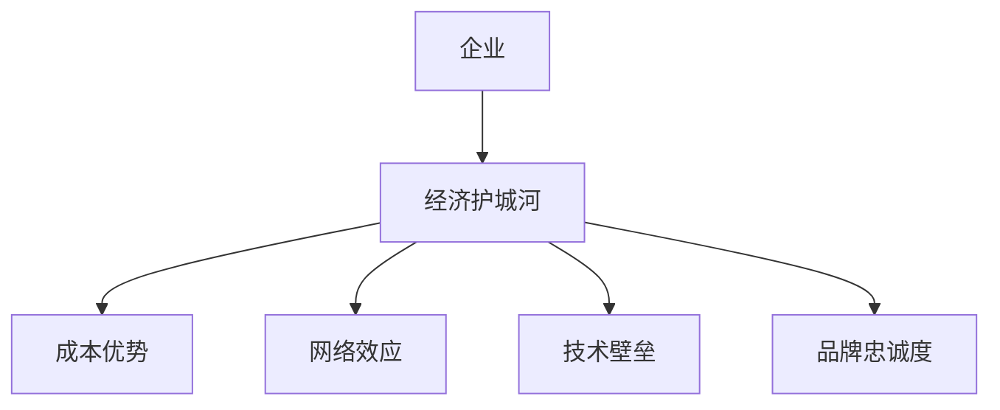
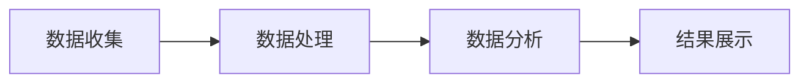

                 


# 沃伦·巴菲特的经济护城河深度分析

## 关键词：沃伦·巴菲特，经济护城河，投资策略，企业竞争优势，长期价值

## 摘要：经济护城河是沃伦·巴菲特投资策略中的核心概念，指企业通过竞争优势构建的长期价值保护机制。本文从定义、类型、评估模型、系统分析、案例实战等多个维度，深度剖析经济护城河的构建与应用，帮助读者理解如何识别和培养企业的竞争优势。

---

# 第一部分: 经济护城河的背景与核心概念

## 第1章: 经济护城河的定义与背景

### 1.1 经济护城河的定义

#### 1.1.1 什么是经济护城河
经济护城河是指企业通过独特的竞争优势（如成本优势、网络效应、技术壁垒或品牌忠诚度）构建的长期价值保护机制。它能够有效防止竞争对手的侵蚀，确保企业在市场中保持持续的盈利能力。

#### 1.1.2 经济护城河的核心要素
经济护城河的核心要素包括：
1. **成本优势**：企业以低于竞争对手的成本提供产品或服务。
2. **网络效应**：产品或服务的价值随着用户数量的增加而增加。
3. **技术壁垒**：企业拥有独特的技术或专利，使得竞争对手难以复制。
4. **品牌忠诚度**：强大的品牌影响力使得消费者更倾向于选择该品牌的产品或服务。

#### 1.1.3 经济护城河与企业长期价值的关系
经济护城河是企业长期价值的基石。它不仅能够抵御竞争压力，还能为企业带来超额利润，从而为股东创造更大的价值。

### 1.2 巴菲特投资策略中的经济护城河

#### 1.2.1 巴菲特的投资理念概述
巴菲特的投资理念强调长期价值和安全边际。他认为，投资的首要任务是找到那些具有持续竞争优势的企业。

#### 1.2.2 经济护城河在巴菲特投资中的重要性
巴菲特倾向于投资那些具有强大经济护城河的企业，因为这些企业能够长期保持竞争优势，从而为投资者带来稳定的回报。

#### 1.2.3 经济护城河与企业竞争优势的关系
经济护城河是企业竞争优势的核心。它不仅能够保护企业免受竞争冲击，还能为企业创造超额利润。

## 第2章: 经济护城河的核心概念与联系

### 2.1 经济护城河的类型

#### 2.1.1 成本优势
成本优势是指企业能够在低于竞争对手的成本下生产产品或提供服务。例如，制造业企业通过规模化生产降低成本，从而在价格竞争中占据优势。

#### 2.1.2 网络效应
网络效应是指产品或服务的价值随着用户数量的增加而增加。例如，社交平台的用户越多，其网络效应越强，用户粘性也越高。

#### 2.1.3 技术壁垒
技术壁垒是指企业通过拥有独特的技术或专利，使得竞争对手难以复制其产品或服务。例如，苹果的iPhone通过不断创新的技术保持竞争优势。

#### 2.1.4 品牌忠诚度
品牌忠诚度是指消费者对某个品牌产品的偏好程度。强大的品牌忠诚度能够为企业提供稳定的客户基础，从而在竞争中占据优势。

### 2.2 经济护城河的核心要素对比

#### 2.2.1 不同护城河类型的特征对比
| 护城河类型       | 特征描述                                   |
|------------------|------------------------------------------|
| 成本优势         | 低成本生产，价格竞争力强                 |
| 网络效应         | 用户数量越多，价值越高                   |
| 技术壁垒         | 独特技术或专利，难以复制                 |
| 品牌忠诚度       | 强大的品牌影响力，客户粘性高               |

#### 2.2.2 护城河强度与企业竞争力的关系
护城河强度与企业竞争力呈正相关。企业护城河越强，其市场地位越稳固，竞争力越强。

### 2.3 经济护城河的ER实体关系图



---

# 第三部分: 经济护城河的算法原理

## 第3章: 经济护城河评估模型

### 3.1 经济护城河评估模型

#### 3.1.1 模型概述
经济护城河评估模型通过量化企业的竞争优势，评估其护城河强度。模型基于多个指标，包括成本优势、网络效应、技术壁垒和品牌忠诚度。

#### 3.1.2 模型输入与输出
- **输入**：企业的竞争优势数据，如成本、用户数量、技术专利数量、品牌影响力等。
- **输出**：护城河强度评分，范围从1到10，1表示几乎没有护城河，10表示非常强大的护城河。

#### 3.1.3 模型的数学公式
$$ \text{护城河强度} = \sum_{i=1}^{n} w_i \times s_i $$
其中，$w_i$ 是第 $i$ 个因素的权重，$s_i$ 是第 $i$ 个因素的评分。

---

## 第4章: 经济护城河的系统分析

### 4.1 系统架构设计



---

## 第5章: 经济护城河的项目实战

### 5.1 环境安装与数据准备

#### 5.1.1 环境安装
安装Python和必要的库（如Pandas、Matplotlib）。

#### 5.1.2 数据准备
收集目标企业的竞争优势数据，如成本、用户数量、技术专利数量、品牌影响力等。

### 5.2 核心代码实现

```python
import pandas as pd
import matplotlib.pyplot as plt

# 数据输入
cost_advantage = 8
network_effect = 7
tech_patents = 6
brand_reputation = 9

# 权重分配
weights = {
    '成本优势': 0.3,
    '网络效应': 0.3,
    '技术壁垒': 0.2,
    '品牌忠诚度': 0.2
}

# 计算护城河强度
def calculate_h护城河强度(cost, network, tech, brand):
    return (cost * weights['成本优势'] +
            network * weights['网络效应'] +
            tech * weights['技术壁垒'] +
            brand * weights['品牌忠诚度'])

护城河强度 = calculate_h护城河强度(cost_advantage, network_effect, tech_patents, brand_reputation)
print(f"护城河强度: {护城河强度:.2f}")
```

### 5.3 分析与解读

#### 5.3.1 分析过程
通过数据分析，计算出企业的护城河强度，并与行业平均水平进行对比，评估其竞争优势。

#### 5.3.2 结果解读
护城河强度越高，企业竞争优势越强，投资价值越高。

### 5.4 案例分析

#### 5.4.1 选择目标企业
以可口可乐为例，分析其经济护城河。

#### 5.4.2 数据分析
收集可口可乐的成本、用户数量、技术专利数量和品牌影响力数据，进行护城河强度评估。

#### 5.4.3 结果解读
可口可乐的护城河强度较高，主要得益于其强大的品牌忠诚度和广泛的用户基础。

---

## 第6章: 最佳实践与注意事项

### 6.1 最佳实践 tips
- **动态评估**：定期评估企业的护城河强度，及时调整投资策略。
- **长期视角**：关注企业的长期竞争优势，而非短期表现。

### 6.2 小结
经济护城河是企业长期价值的核心驱动力。通过构建强大的经济护城河，企业能够在竞争中立于不败之地。

### 6.3 注意事项
- **行业差异**：不同行业的护城河类型和强度可能不同，需结合行业特点进行分析。
- **数据质量**：确保数据的准确性和完整性，以提高评估结果的可靠性。

---

## 作者：AI天才研究院/AI Genius Institute & 禅与计算机程序设计艺术 /Zen And The Art of Computer Programming

---

通过以上分析，我们可以深入理解沃伦·巴菲特的经济护城河理论，并将其应用于实际投资分析中，帮助投资者识别和培养具有强大竞争优势的企业。

