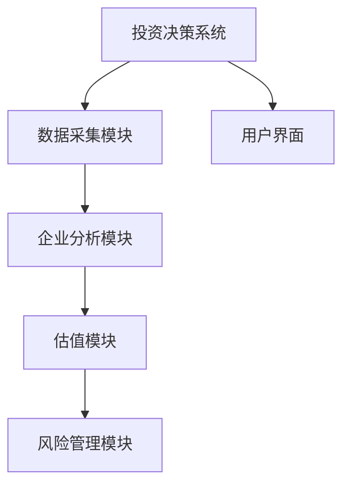

                 


# 沃伦·巴菲特的长期持股策略分析

> 关键词：长期持股，巴菲特，价值投资，安全边际，护城河企业

> 摘要：本文深入分析了沃伦·巴菲特的长期持股策略，探讨了其投资哲学、分析框架、数学模型以及系统架构，并通过实际案例展示了如何在现实中应用这些策略。文章详细讲解了企业内在价值的计算、安全边际的量化分析，以及系统架构的设计与实现，为投资者提供了实用的指导。

---

## 第1章: 长期持股策略的背景与意义

### 1.1 长期持股策略的定义与特点

#### 1.1.1 长期持股的定义
长期持股是一种投资策略，强调长期持有优质资产，避免频繁交易，以时间复利效应实现财富增长。

#### 1.1.2 长期持股的核心特点
- **时间复利效应**：通过长期持有，复利效应使收益最大化。
- **价值驱动**：关注企业的内在价值，而非短期市场波动。
- **风险管理**：通过分散投资和安全边际降低风险。

#### 1.1.3 长期持股在投资中的重要性
长期持股避免了短期波动的干扰，使投资者能够专注于企业长期价值的增长，减少交易成本和情绪影响。

### 1.2 沃伦·巴菲特的投资哲学

#### 1.2.1 巴菲特的价值投资理念
巴菲特强调购买优秀企业的一部分，而非关注市场价格波动。他寻找具有持续竞争优势和良好治理的企业。

#### 1.2.2 巴菲特的长期持股策略
巴菲特倾向于长期持有优质股票，避免频繁交易，以复利效应实现财富增长。

#### 1.2.3 巴菲特投资哲学的核心要素
- **安全边际**：买入价格低于内在价值，以降低风险。
- **护城河企业**：选择具有竞争优势和强大护城河的企业。
- **长期视角**：关注企业的长期增长潜力。

---

## 第2章: 长期持股策略的逻辑与分析框架

### 2.1 长期持股的逻辑基础

#### 2.1.1 复利效应的重要性
复利效应是长期持股的核心逻辑，通过时间的积累，收益呈指数级增长。

#### 2.1.2 企业价值的长期增长
优质企业的内在价值随时间增长，长期持有可分享企业成长的收益。

#### 2.1.3 市场波动与长期持有的关系
市场短期波动不影响优质企业的长期价值，长期持有可过滤短期噪声。

### 2.2 长期持股的分析框架

#### 2.2.1 企业基本面分析
- **盈利能力**：ROE、净利润增长率等指标。
- **财务健康**：资产负债表分析，现金流状况。
- **竞争优势**：护城河的宽度和深度。

#### 2.2.2 行业地位与竞争优势
- **行业地位**：市场领导者或潜在领导者。
- **竞争优势**：成本优势、品牌优势、技术壁垒。

#### 2.2.3 财务状况与估值分析
- **财务健康**：低负债率，稳定的现金流。
- **估值合理性**：市盈率、市净率等指标是否低于行业平均水平。

---

## 第3章: 巴菲特长期持股的核心理念

### 3.1 价值投资的核心要素

#### 3.1.1 企业内在价值的计算
$$
\text{内在价值} = \sum_{t=1}^{n} \frac{FCF_t}{(1+r)^t}
$$
其中，FCF为自由现金流，r为折现率，n为预测年限。

#### 3.1.2 安全边际的概念与应用
安全边际 = 内在价值 - 市场价格。买入时要求安全边际为正，以降低风险。

#### 3.1.3 投资标的的选择标准
- **护城河**：企业具备竞争优势，能够持续创造超额利润。
- **管理层**：诚实、有能力的管理层。
- **财务健康**：稳定的现金流，低负债率。

### 3.2 长期持股的风险管理

#### 3.2.1 风险控制的基本原则
- **分散投资**：避免过度集中，降低单一投资的风险。
- **安全边际**：买入价格低于内在价值，提供安全垫。

#### 3.2.2 仓位管理与分散投资
- **仓位分配**：根据资产配置，合理分配资金。
- **分散投资**：投资于不同行业、不同规模的企业。

#### 3.2.3 市场波动中的应对策略
- **坚持长期视角**：忽略短期波动，专注于长期价值。
- **定期复盘**：评估投资组合的表现，调整持仓。

---

## 第4章: 长期持股策略的数学模型与公式

### 4.1 企业内在价值的计算公式

#### 4.1.1 股权自由现金流模型
$$
\text{股权自由现金流} = \text{净利润} + \text{折旧} + \text{摊销} - \text{资本支出} - \text{再投资} 
$$

#### 4.1.2 折现率的计算与应用
折现率 = 无风险利率 + 风险溢价。通常使用 WACC（加权平均资本成本）作为折现率。

#### 4.1.3 企业价值评估的公式推导
$$
\text{企业价值} = \text{股权价值} + \text{债务价值}
$$

### 4.2 安全边际的量化分析

#### 4.2.1 安全边际的定义与计算
$$
\text{安全边际} = \text{内在价值} - \text{市场价格}
$$

#### 4.2.2 市场价格与内在价值的对比
通过表格对比不同企业的市场价格与内在价值，筛选具有正安全边际的投资标的。

#### 4.2.3 安全边际的动态调整
根据市场变化和企业基本面，定期评估并调整安全边际。

---

## 第5章: 长期持股策略的系统架构与实现

### 5.1 系统分析与架构设计

#### 5.1.1 投资决策系统的功能模块
- **数据采集模块**：获取企业财务数据、行业信息。
- **企业分析模块**：计算内在价值、评估竞争优势。
- **估值模块**：计算安全边际，确定买入价格。
- **风险管理模块**：评估投资组合风险，制定应对策略。

#### 5.1.2 数据采集与处理流程
- 数据来源：公司财报、行业报告、市场数据。
- 数据清洗：处理缺失值、异常值。
- 数据存储：使用数据库存储结构化数据。

#### 5.1.3 系统架构的模块划分
使用 Mermaid 图展示系统架构：


### 5.2 系统接口与交互设计

#### 5.2.1 数据输入接口的设计
- 数据格式：CSV 或 Excel 文件。
- 数据字段：收入、利润、现金流等。

#### 5.2.2 投资决策算法的实现
使用 Python 编写算法，计算内在价值和安全边际。

#### 5.2.3 系统输出与用户交互
- 输出结果：企业估值报告、投资建议。
- 用户交互：图形化界面，展示分析结果。

---

## 第6章: 长期持股策略的项目实战

### 6.1 项目环境与工具安装

#### 6.1.1 系统运行环境要求
- 操作系统：Windows、MacOS 或 Linux。
- 开发工具：Python、Jupyter Notebook。

#### 6.1.2 数据分析工具的安装与配置
- 安装 Python 和相关库（Pandas、NumPy、Matplotlib）。
- 配置数据源：获取企业财务数据。

#### 6.1.3 编程语言与库的安装
```bash
pip install pandas numpy matplotlib
```

### 6.2 核心算法实现与代码解读

#### 6.2.1 内在价值计算的 Python 代码
```python
import pandas as pd
import numpy as np

def calculate_intrinsic_value(fcf, discount_rate):
    # 假设永续增长率为 g，简化模型
    perpetuity = fcf[-1] * (1 + g) / (discount_rate - g)
    present_value = 0
    for i in range(len(fcf)):
        present_value += fcf[i] / (1 + discount_rate) ** i
    return present_value + perpetuity
```

#### 6.2.2 安全边际分析的代码实现
```python
def calculate_margin_of_safety(iv, market_price):
    return iv - market_price
```

#### 6.2.3 系统架构的代码框架
```python
class InvestmentSystem:
    def __init__(self):
        self.data = None
        self.results = None

    def load_data(self, file_path):
        # 加载数据
        pass

    def analyze_company(self):
        # 分析企业
        pass

    def calculate_valuation(self):
        # 计算估值
        pass

    def manage_risk(self):
        # 管理风险
        pass
```

### 6.3 实际案例分析

#### 6.3.1 案例选择
选择可口可乐和苹果作为案例，分析其内在价值和安全边际。

#### 6.3.2 数据分析与结果展示
使用图表展示企业的财务数据、估值结果和市场表现。

---

## 第7章: 长期持股策略的最佳实践与小结

### 7.1 最佳实践总结

#### 7.1.1 长期持股的核心要素
- **价值投资**：寻找具有护城河的企业。
- **安全边际**：买入价格低于内在价值。
- **风险管理**：分散投资，定期复盘。

#### 7.1.2 长期持股的注意事项
- 避免追涨杀跌，耐心持有优质资产。
- 定期评估投资组合，及时调整。

### 7.2 小结

沃伦·巴菲特的长期持股策略强调价值投资和安全边际，通过长期持有优质资产实现财富增长。投资者应结合市场环境和个人情况，灵活运用这些策略。

---

## 图表与代码示例

### 图表部分
使用 Mermaid 图展示系统架构和流程：


### 代码部分
```python
import pandas as pd
import numpy as np

def calculate_intrinsic_value(fcf, discount_rate):
    # 简化模型，假设永续增长率为 g
    g = 0.03
    perpetuity = fcf[-1] * (1 + g) / (discount_rate - g)
    present_value = 0
    for i in range(len(fcf)):
        present_value += fcf[i] / (1 + discount_rate) ** i
    return present_value + perpetuity
```

---

## 作者

作者：AI天才研究院/AI Genius Institute & 禅与计算机程序设计艺术/Zen And The Art of Computer Programming

