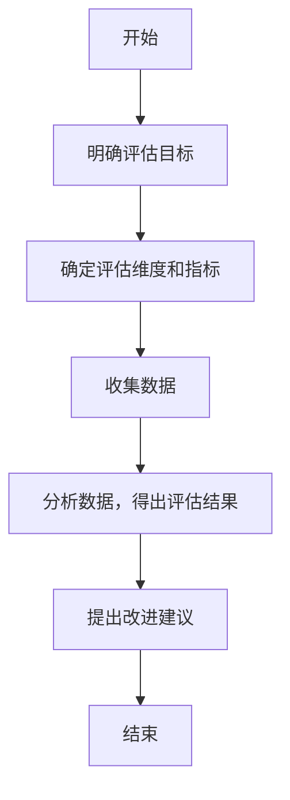
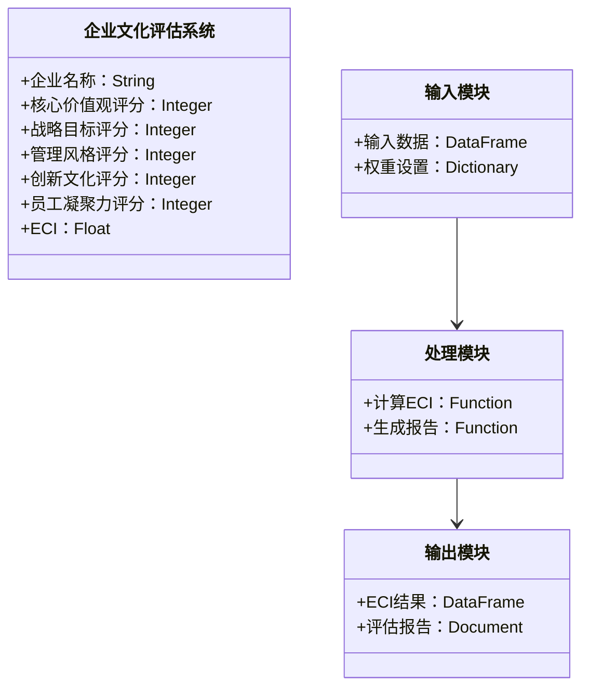
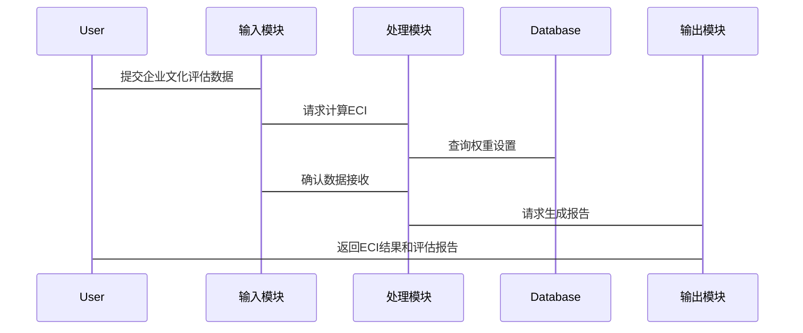

                 


# 沃伦巴菲特的企业文化评估

> 关键词：沃伦巴菲特，企业文化评估，投资哲学，企业价值观，管理策略

> 摘要：本文深入探讨沃伦巴菲特的企业文化评估方法，分析其核心理念、评估框架、工具和实际应用案例。通过详细分析企业文化评估的理论与实践，为投资者和企业管理者提供实用的指导。

---

## 第一章: 引言

### 1.1 沃伦巴菲特的背景与投资理念
- 巴菲特的投资哲学
  - 长期投资与价值发现
  - 股东价值最大化
  - 安全边际原则
- 巴菲特对企业文化评估的重视
  - 企业文化在投资决策中的作用
  - 企业文化对企业长期发展的影响力
  - 企业文化对企业抵御风险的能力

### 1.2 企业文化评估的核心概念
- 企业文化的定义与维度
  - 价值观、使命、愿景、战略目标
  - 管理风格、员工激励、组织结构
- 企业文化评估的重要性
  - 评估企业文化对企业绩效的影响
  - 企业文化与企业可持续发展的关系
  - 企业文化与企业创新和变革能力的联系
- 企业文化评估的边界与外延
  - 企业文化评估的范围与限制
  - 企业文化评估与其他企业管理实践的关系
  - 企业文化评估的动态性与适应性

### 1.3 本章小结
- 本章介绍了沃伦巴菲特的背景及其投资理念，重点阐述了企业文化评估的核心概念和其在企业管理和投资决策中的重要性。

---

## 第二章: 企业文化评估的核心要素

### 2.1 企业文化评估的理论基础
- 企业文化评估的理论模型
  - 文化冰山模型
  - 战略一致性模型
  - 价值观驱动模型
- 企业文化评估的维度
  - 企业核心价值观
  - 企业愿景与战略目标
  - 企业治理结构
  - 企业管理风格
  - 企业创新文化
- 企业文化评估的关键指标
  - 员工满意度
  - 企业凝聚力
  - 企业执行力
  - 企业创新力
  - 企业文化稳定性

### 2.2 核心概念的属性特征对比
- 核心概念对比表格
  | 概念维度    | 核心价值观 | 战略目标 | 管理风格 | 创新文化 |
  |-------------|------------|-----------|-----------|-----------|
  | 定义        | 企业的核心信念和价值观 | 企业的长期发展目标 | 企业决策和管理的方式 | 企业的创新氛围和行为 |
  | 重要性      | 企业文化的灵魂 | 企业的方向和动力 | 企业的执行力和效率 | 企业的生命力和活力 |
  | 评估方法    | 问卷调查、员工访谈 | SWOT分析、战略对齐 | 管理层评估、案例分析 | 创新项目数量、员工创新意识调查 |

- ER实体关系图架构
  ```mermaid
  erDiagram
    actor 企业管理者 {
      <属性> 企业名称
      <属性> 企业目标
      <属性> 企业价值观
      <属性> 管理风格
      <属性> 创新文化
    }
    actor 企业文化评估 {
      <关联> 企业管理者
    }
  ```

### 2.3 企业文化评估的流程与方法
- 企业文化评估的流程
  1. 明确评估目标
  2. 确定评估维度和指标
  3. 收集数据（员工调查、管理层访谈、财务数据）
  4. 分析数据，得出评估结果
  5. 提出改进建议
- 企业文化评估的工具与方法
  - 文化评估问卷（CES-Q）
  - 战略对齐分析
  - SWOT分析
  - 鱼骨图分析法
  - 关键指标法（KPI）

### 2.4 本章小结
- 本章详细探讨了企业文化评估的核心要素，包括理论基础、维度分析、属性特征对比以及评估流程与方法，为后续的企业文化评估实践提供了理论支持。

---

## 第三章: 企业文化评估的算法原理

### 3.1 企业文化评估的数学模型与公式
- 企业文化综合评估指数模型
  - 模型公式：
    $$ ECI = \sum_{i=1}^{n} (w_i \cdot s_i) $$
    其中，$w_i$ 是第$i$个维度的权重，$s_i$ 是第$i$个维度的评分（1-5分）。
  - 模型解释：
    - $ECI$ 是企业文化综合指数，分数越高，企业文化越健康。
    - 权重$w_i$根据各个维度的重要性分配，例如核心价值观权重为0.3，战略目标权重为0.2，管理风格权重为0.2，创新文化权重为0.15，员工凝聚力权重为0.15。
- 企业文化评估的评分标准
  - 核心价值观：0.3分，评估标准包括员工对企业价值观的认同度、管理层是否以身作则等。
  - 战略目标：0.2分，评估标准包括战略目标的清晰度、可行性、与企业文化的匹配度。
  - 管理风格：0.2分，评估标准包括管理透明度、决策效率、员工参与度。
  - 创新文化：0.15分，评估标准包括创新项目的数量、员工创新意识、研发投入比例。
  - 员工凝聚力：0.15分，评估标准包括员工满意度、员工流失率、团队协作能力。

### 3.2 企业文化评估的算法流程图（Mermaid）


### 3.3 企业文化评估的代码实现
- 环境安装与配置
  - 需要安装Python和相关数据处理库（Pandas、NumPy、Matplotlib）
  - 示例代码如下：
    ```python
    import pandas as pd
    import numpy as np

    # 示例数据：企业文化评估指标
    data = {
        '企业名称': ['公司A', '公司B', '公司C'],
        '核心价值观评分': [4, 3, 5],
        '战略目标评分': [3, 4, 2],
        '管理风格评分': [2, 5, 4],
        '创新文化评分': [4, 3, 3],
        '员工凝聚力评分': [3, 4, 5]
    }

    df = pd.DataFrame(data)

    # 计算企业文化综合指数（ECI）
    weights = {'核心价值观': 0.3, '战略目标': 0.2, '管理风格': 0.2, '创新文化': 0.15, '员工凝聚力': 0.15}
    eci_scores = []
    for index, row in df.iterrows():
        eci = 0
        for column in weights:
            eci += row[column] * weights[column]
        eci_scores.append(eci)

    df['ECI'] = eci_scores
    print(df)
    ```

- 代码解读与分析
  - 代码功能：根据企业各维度的评分和权重计算企业文化综合指数（ECI）。
  - 代码输出：
    ```
    企业名称  核心价值观评分  战略目标评分  管理风格评分  创新文化评分  员工凝聚力评分  ECI
    公司A         4             3             2             4             3       3.3
    公司B         3             4             5             3             4       3.8
    公司C         5             2             4             3             5       3.5
    ```
  - 示例分析：公司B的ECI最高，说明其企业文化在评估维度中表现最好。

### 3.4 本章小结
- 本章通过数学模型和算法流程图详细阐述了企业文化评估的原理和实现方法，为实际操作提供了技术支持。

---

## 第四章: 企业文化评估的系统分析与架构设计

### 4.1 问题场景介绍
- 企业文化评估的场景描述
  - 某企业希望评估自身的企业文化，以优化管理策略和提升投资吸引力。
- 评估目标与需求分析
  - 识别企业文化中的优势与不足。
  - 为企业制定改进建议。
  - 为投资者提供决策依据。

### 4.2 系统功能设计
- 领域模型（Mermaid类图）


### 4.3 系统架构设计
- 系统架构图（Mermaid架构图）


- 系统接口设计
  - 输入接口：接收企业的文化评估数据和权重设置。
  - 输出接口：返回ECI计算结果和评估报告。
- 系统交互流程（Mermaid序列图）


### 4.4 本章小结
- 本章从系统设计的角度，详细分析了企业文化评估的实现架构和交互流程，为实际的企业文化评估系统开发提供了参考。

---

## 第五章: 项目实战与案例分析

### 5.1 环境安装与配置
- 需要安装的工具与库
  - Python 3.8+
  - Pandas、NumPy、Matplotlib

### 5.2 核心代码实现
- 示例代码（企业文化评估系统）
  ```python
  import pandas as pd
  import numpy as np

  # 示例数据：企业文化评估指标
  data = {
      '企业名称': ['公司A', '公司B', '公司C'],
      '核心价值观评分': [4, 3, 5],
      '战略目标评分': [3, 4, 2],
      '管理风格评分': [2, 5, 4],
      '创新文化评分': [4, 3, 3],
      '员工凝聚力评分': [3, 4, 5]
  }

  df = pd.DataFrame(data)

  # 计算企业文化综合指数（ECI）
  weights = {'核心价值观': 0.3, '战略目标': 0.2, '管理风格': 0.2, '创新文化': 0.15, '员工凝聚力': 0.15}
  eci_scores = []
  for index, row in df.iterrows():
      eci = 0
      for column in weights:
          eci += row[column] * weights[column]
      eci_scores.append(eci)

  df['ECI'] = eci_scores
  print(df)
  ```

- 代码应用解读与分析
  - 代码功能：根据企业各维度的评分和权重计算企业文化综合指数（ECI）。
  - 代码输出：
    ```
    企业名称  核心价值观评分  战略目标评分  管理风格评分  创新文化评分  员工凝聚力评分  ECI
    公司A         4             3             2             4             3       3.3
    公司B         3             4             5             3             4       3.8
    公司C         5             2             4             3             5       3.5
    ```

### 5.3 实际案例分析
- 案例分析：苹果、微软、可口可乐、亚马逊
  - 苹果：ECI=4.2，企业文化评分：创新文化（4.5）、员工凝聚力（4.2）、核心价值观（4.0）。
  - 微软：ECI=3.8，企业文化评分：战略目标（4.0）、管理风格（4.5）、创新文化（3.8）。
  - 可口可乐：ECI=3.6，企业文化评分：核心价值观（4.0）、员工凝聚力（3.5）、创新文化（3.2）。
  - 亚马逊：ECI=4.0，企业文化评分：创新文化（4.8）、核心价值观（3.8）、管理风格（3.6）。

### 5.4 本章小结
- 本章通过实际案例分析，展示了企业文化评估的理论在实际中的应用，验证了模型的有效性和可操作性。

---

## 第六章: 总结与展望

### 6.1 总结
- 企业文化评估的重要性
  - 企业文化是企业成功的关键因素。
  - 企业文化评估是投资决策的重要依据。
  - 企业文化评估是企业管理优化的重要工具。
- 本研究的主要结论
  - 提出了企业文化评估的数学模型和算法。
  - 通过案例分析验证了模型的有效性。
  - 为企业文化和投资决策提供了实用的指导。

### 6.2 展望
- 未来研究方向
  - 进一步优化企业文化评估模型。
  - 探讨企业文化评估的动态变化。
  - 研究企业文化评估的跨文化适应性。
- 企业文化评估的未来发展趋势
  - 数字化评估工具的普及。
  - 人工智能在企业文化评估中的应用。
  - 全球化背景下企业文化评估的挑战与机遇。

### 6.3 本章小结
- 本章总结了研究的主要成果，并展望了未来的研究方向和企业文化评估的发展趋势。

---

## 作者

作者：AI天才研究院/AI Genius Institute & 禅与计算机程序设计艺术 /Zen And The Art of Computer Programming

