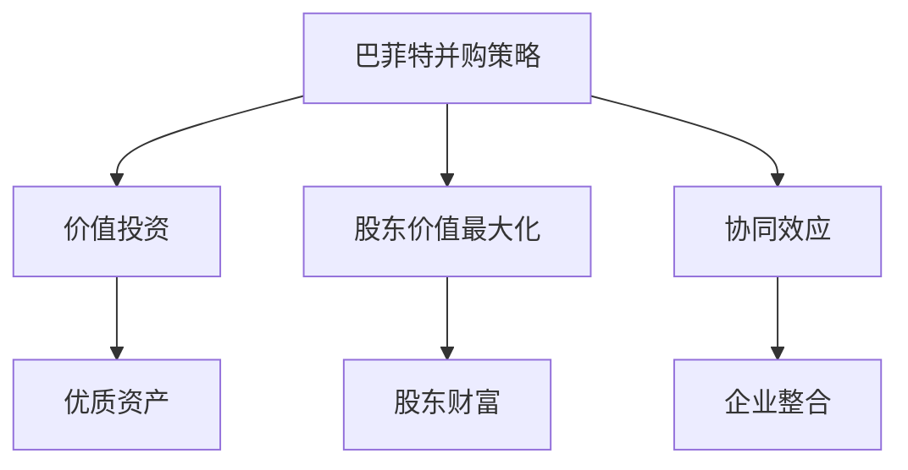
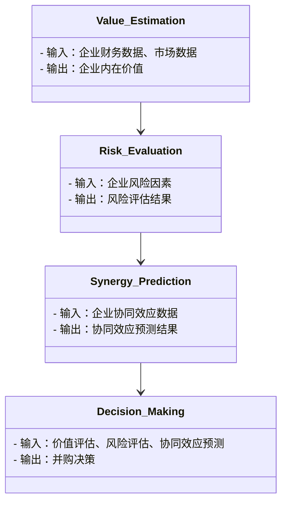

                 


# 沃伦巴菲特的并购策略分析

---

## 关键词：沃伦巴菲特，并购策略，价值投资，协同效应，股东价值最大化

---

## 摘要

本文深入分析了沃伦巴菲特的并购策略，探讨其核心理念、算法模型、系统架构及实际应用。文章从背景介绍、核心概念、算法原理、系统设计、项目实战等多个维度展开，结合具体案例和数学模型，全面解析巴菲特的并购策略及其成功背后的逻辑。通过本文的分析，读者将更好地理解巴菲特的并购策略，并能够将其应用于实际投资中。

---

# 第一部分：沃伦巴菲特并购策略的背景与概述

## 第1章：并购策略的背景介绍

### 1.1 沃伦巴菲特的基本情况

#### 1.1.1 巴菲特的生平简介

沃伦·巴菲特（Warren Buffett）于1930年8月30日出生于美国堪萨斯州的奥马哈市。他从小就展现出对数字和投资的浓厚兴趣。1950年代，他开始进行股票投资，并逐渐积累了丰富的投资经验。1956年，他创立了合伙公司，开始管理外部资金。1965年，他收购了国民保险，成为公司董事长，并逐步将公司更名为伯克希尔·哈撒韦（Berkshire Hathaway）。如今，伯克希尔·哈撒韦已成为全球最大的投资公司之一，巴菲特也被称为“股神”。

#### 1.1.2 巴菲特的投资哲学

巴菲特的投资哲学以价值投资为核心。他强调购买价格低于企业内在价值的股票，并长期持有。他认为市场短期波动无法预测，但企业长期的价值是可以通过基本面分析确定的。他的投资策略注重安全边际，即买入价格低于内在价值，以确保在市场波动中仍能获得收益。

#### 1.1.3 巴菲特并购策略的核心理念

巴菲特的并购策略强调收购具有强大护城河、稳定现金流和优秀管理团队的企业。他认为，并购不仅仅是资产的合并，更是文化和团队的整合。他倾向于收购那些能够在并购后保持独立运营，并且能够持续创造价值的企业。

### 1.2 并购策略的定义与特点

#### 1.2.1 并购的定义与分类

并购（Mergers and Acquisitions, M&A）是指一家企业与其他企业合并或收购其资产或股权的过程。并购可以分为横向并购（同一行业）、纵向并购（上下游产业）和混合并购（不同行业）。

#### 1.2.2 并购策略的核心特点

- **长期性**：巴菲特倾向于长期持有，并购后不干涉企业的日常运营。
- **稳定性**：他选择具有稳定现金流和良好管理的企业。
- **注重内在价值**：并购价格低于企业内在价值。

#### 1.2.3 巴菲特并购策略的独特性

巴菲特的并购策略独特之处在于他注重企业的内在价值，而非市场短期波动。他倾向于收购那些被市场低估的企业，并通过长期持有实现价值增长。

### 1.3 巴菲特并购策略的背景分析

#### 1.3.1 20世纪中后期美国经济的并购趋势

20世纪中后期，美国经济经历了多次并购潮，尤其是在1980年代，杠杆收购和 hostile takeovers（敌意收购）盛行。然而，巴菲特的并购策略与传统并购不同，他更注重企业的内在价值和长期发展。

#### 1.3.2 巴菲特并购策略的形成背景

巴菲特的并购策略形成于1960年代，当时正值美国经济的高速增长期。他通过研究企业的基本面，逐步形成了自己的价值投资理念。他倾向于在市场低迷时买入低估股票，并在市场高估时卖出。

#### 1.3.3 巴菲特并购策略的行业影响

巴菲特的并购策略对全球投资行业产生了深远影响。他的价值投资理念被广泛应用于并购决策中，强调企业内在价值和长期稳定收益。

---

## 第2章：巴菲特并购策略的核心概念与联系

### 2.1 核心概念原理

#### 2.1.1 价值投资的核心理念

价值投资强调购买价格低于企业内在价值的股票。巴菲特认为，市场短期波动不可预测，但企业长期价值可以通过基本面分析确定。

#### 2.1.2 股东价值最大化的目标

并购的最终目标是实现股东价值最大化。巴菲特通过并购优质企业，长期持有，实现股东财富的增长。

#### 2.1.3 并购中的协同效应

协同效应指并购后企业之间产生的超出单独价值的综合效益。巴菲特通过并购具有协同效应的企业，进一步提升整体价值。

### 2.2 核心概念属性对比表格

| 概念           | 描述                                                                 |
|----------------|----------------------------------------------------------------------|
| 价值投资       | 以低于内在价值的价格购买优质资产                                   |
| 股东价值最大化 | 并购后实现股东财富的最大化                                             |
| 协同效应       | 并购后企业之间产生超出单独价值的综合效益                             |

### 2.3 ER实体关系图



---

## 第3章：巴菲特并购策略的算法原理讲解

### 3.1 并购决策的算法模型

#### 3.1.1 价值评估模型

价值评估模型用于确定企业的内在价值。巴菲特常用的方法包括：

- **DCF模型**：通过现金流折现计算企业价值。
- **可比公司分析**：通过对比同类企业进行估值。

#### 3.1.2 风险评估模型

风险评估模型用于评估并购中的风险。包括市场风险、企业特有风险等。

#### 3.1.3 协同效应预测模型

协同效应预测模型用于预测并购后的协同效应。包括成本协同、收入协同等。

### 3.2 价值评估模型的数学公式

$$ V = \frac{E}{k} + \frac{P}{k} $$

其中：
- \( V \) 表示内在价值
- \( E \) 表示企业未来现金流的现值
- \( P \) 表示非经营性资产的价值
- \( k \) 表示折现率

### 3.3 协同效应预测模型的数学公式

$$ Sy = S1 + S2 - \text{重叠成本} $$

其中：
- \( Sy \) 表示协同效应
- \( S1 \) 表示企业A的协同价值
- \( S2 \) 表示企业B的协同价值

---

## 第4章：巴菲特并购策略的核心分析框架

### 4.1 价值评估模型的分析框架

价值评估模型包括以下几个步骤：

1. **确定企业类型**：选择具有强大护城河和稳定现金流的企业。
2. **分析财务状况**：评估企业的盈利能力、资产负债情况等。
3. **评估管理层素质**：选择具有良好管理团队的企业。
4. **计算内在价值**：使用DCF模型等方法计算企业价值。

### 4.2 风险评估模型的分析框架

风险评估模型包括以下几个步骤：

1. **分析市场风险**：评估宏观经济环境对企业的影响。
2. **分析企业特有风险**：评估企业自身的经营风险。
3. **评估并购风险**：综合考虑市场风险和企业风险。

### 4.3 协同效应预测模型的分析框架

协同效应预测模型包括以下几个步骤：

1. **确定协同效应类型**：如成本协同、收入协同等。
2. **评估协同效应潜力**：预测并购后可能实现的协同效应。
3. **量化协同效应价值**：将协同效应转化为具体价值。

---

## 第5章：巴菲特并购策略的系统架构设计

### 5.1 问题场景介绍

并购过程中可能面临的问题包括信息不对称、估值偏差、整合风险等。这些问题需要通过系统化的分析和设计来解决。

### 5.2 系统功能设计

使用Mermaid类图展示系统的主要功能模块：



### 5.3 系统架构设计

使用Mermaid架构图展示系统的整体架构：

```mermaid
container 投资者 {
    User_Interface
    Application_Server
    Database
}
container 并购分析系统 {
    Value_Estimation
    Risk_Evaluation
    Synergy_Prediction
    Decision_Making
}
investor --> Application_Server
Application_Server --> Database
```

### 5.4 系统接口设计

系统接口设计包括数据输入输出格式和接口调用方式：

- 数据输入：企业财务数据、市场数据、风险因素数据。
- 数据输出：企业内在价值、风险评估结果、协同效应预测结果。

### 5.5 系统交互序列图

使用Mermaid序列图展示用户与系统之间的交互流程：

```mermaid
sequenceDiagram
    用户 -> 系统：输入企业数据
    系统 -> 价值评估模块：计算内在价值
    价值评估模块 -> 系统：返回内在价值
    系统 -> 风险评估模块：评估风险
    风险评估模块 -> 系统：返回风险评估结果
    系统 -> 协同效应预测模块：预测协同效应
    协同效应预测模块 -> 系统：返回协同效应预测结果
    系统 -> 用户：输出并购决策
```

---

## 第6章：巴菲特并购策略的项目实战

### 6.1 环境安装

需要安装以下工具和库：

- Python 3.8+
- Jupyter Notebook
- NumPy
- Pandas
- Matplotlib

### 6.2 系统核心实现源代码

以下是价值评估模型的Python代码实现：

```python
import numpy as np
import pandas as pd
import matplotlib.pyplot as plt

def calculate_intrinsic_value(financial_data, discount_rate):
    # 计算未来现金流的现值
    cash_flows = financial_data['Cash Flow']
    present_value = np.npv(discount_rate, cash_flows)
    # 计算非经营性资产的价值
    non_operating_assets = financial_data['Non Operating Assets']
    total_value = present_value + non_operating_assets
    return total_value

# 示例数据
data = {
    'Cash Flow': [100, 200, 300, 400],
    'Non Operating Assets': 50
}
discount_rate = 0.10

intrinsic_value = calculate_intrinsic_value(data, discount_rate)
print("内在价值:", intrinsic_value)
```

### 6.3 代码应用解读与分析

上述代码通过DCF模型计算企业的内在价值。首先，计算未来现金流的现值，然后加上非经营性资产的价值，得到企业的内在价值。折扣率用于折现未来现金流，通常选取企业的资本成本或市场利率。

### 6.4 实际案例分析

以可口可乐公司为例，分析巴菲特并购策略的应用：

1. **价值评估**：计算可口可乐的内在价值，确认其低于当前市场价格。
2. **风险评估**：评估可口可乐的市场风险和企业特有风险。
3. **协同效应预测**：预测并购后的协同效应。

### 6.5 项目小结

通过实际案例分析，我们可以看到巴菲特并购策略在实际操作中的应用。价值评估模型、风险评估模型和协同效应预测模型共同支撑并购决策的制定。

---

## 第7章：巴菲特并购策略的最佳实践

### 7.1 最佳实践 tips

- **选择具有强大护城河的企业**：如可口可乐、苹果等。
- **长期持有，避免短期波动**：关注企业的长期价值，不因市场波动而改变策略。
- **注重管理层素质**：选择具有优秀管理能力的团队。
- **合理评估风险**：在并购前充分评估市场风险和企业风险。

### 7.2 小结

本文全面分析了巴菲特的并购策略，从背景介绍、核心概念、算法原理到系统设计和实际应用，为读者提供了全面的视角。

### 7.3 注意事项

- 并购决策需要综合考虑多种因素，避免片面性。
- 在实际操作中，需根据市场变化调整策略。
- 保持对企业的长期关注和跟踪。

### 7.4 拓展阅读

- 《巴菲特致股东的信》
- 《投资最重要的事情》
- 《证券分析》

---

## 第8章：总结与展望

### 8.1 全文总结

本文从多个角度分析了巴菲特的并购策略，揭示了其成功背后的核心思想和方法。通过系统的分析和实际案例，读者可以更好地理解巴菲特的并购策略，并将其应用于实际投资中。

### 8.2 对未来并购策略的展望

随着全球经济的变化和科技的发展，并购策略也将不断演变。未来，投资者需要更加注重企业创新能力和数字化转型，以应对新的挑战和机遇。

---

## 参考文献与致谢

### 参考文献

1. 巴菲特，沃伦. 《巴菲特致股东的信》
2. 格雷厄姆，本杰明. 《证券分析》
3. 德尔ois, Peter. 《投资最重要的事情》

### 致谢

感谢在撰写过程中提供帮助和支持的人或机构。特别感谢巴菲特的投资理念为本文提供了丰富的理论支持。

---

**作者：AI天才研究院/AI Genius Institute & 禅与计算机程序设计艺术/Zen And The Art of Computer Programming**

