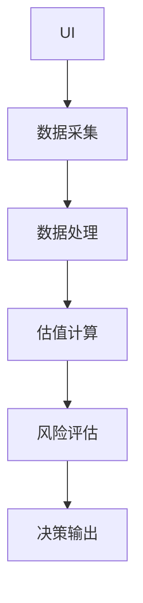

                 


# 《沃伦巴菲特的股东信解读》

## 关键词：巴菲特，股东信，价值投资，安全边际，长期投资

## 摘要：  
本文通过深入解读沃伦·巴菲特的股东信，揭示其投资哲学的核心思想、企业管理智慧和长期投资策略。结合技术视角，从背景分析、核心概念、算法原理、数学模型、系统设计和实战案例等多维度展开，为读者提供全面且专业的解读。

---

## 第一部分：沃伦巴菲特投资理念的背景与核心思想

### 第1章：巴菲特与股东信的背景

#### 1.1 巴菲特的生平与投资哲学  
沃伦·巴菲特是全球最著名的投资者之一，他的投资哲学以“价值投资”为核心，强调长期持有优质资产。  
- **背景介绍**：巴菲特出生于1930年，早年通过阅读投资经典书籍（如格雷厄姆的《证券分析》）奠定了价值投资的基础。  
- **核心概念**：价值投资的核心是寻找市场低估的优质企业，关注企业的内在价值而非市场波动。  

#### 1.2 股东信的历史与演变  
巴菲特自1951年开始撰写股东信，逐步形成独特的风格。  
- **历史背景**：早期股东信主要用于向合伙人解释投资决策，后期则面向更广泛的投资者群体。  
- **演变过程**：从简单的投资总结到深入的企业分析和市场洞察，股东信成为巴菲特思想的重要载体。  

#### 1.3 股东信的阅读方法与框架  
为了更好地理解股东信，读者需要掌握以下方法：  
- **框架分析**：股东信通常包括财务数据、投资策略、管理层评估和未来展望。  
- **语言风格**：巴菲特的信件以简洁、直观著称，常通过类比和故事阐述复杂概念。  

---

## 第二部分：巴菲特投资理念的核心要素

### 第2章：价值投资的定义与原则

#### 2.1 价值投资的起源与发展  
价值投资起源于20世纪，由本杰明·格雷厄姆提出，巴菲特对其进行了改良和推广。  
- **起源背景**：20世纪30年代的经济大萧条使格雷厄姆意识到市场恐慌往往导致优质资产价格被低估。  
- **发展过程**：巴菲特将价值投资应用于实践，并通过伯克希尔·哈撒韦的成功验证了其有效性。  

#### 2.2 巴菲特对价值投资的诠释  
- **核心原则**：寻找具有持续竞争优势的企业，关注其内在价值。  
- **内在价值公式**：  
  $$ 内在价值 = \frac{未来现金流的现值}{折现率} $$  

#### 2.3 价值投资与成长投资的对比  
| 特性 | 价值投资 | 成长投资 |
|------|-----------|----------|
| 核心理念 | 买入低于内在价值的资产 | 投资具有高增长潜力的企业 |
| 风险偏好 | 低风险 | 高风险 |
| 投资期限 | 长期 | 长期 |

---

### 第3章：安全边际的概念与应用

#### 3.1 安全边际的定义与计算  
安全边际是巴菲特投资策略中的重要概念，指股票价格与内在价值之间的差距。  
- **定义**：安全边际 = 内在价值 - 市场价格  
- **作用**：降低投资风险，确保在市场波动中仍能获得收益。  

#### 3.2 安全边际的应用  
- **案例分析**：假设某企业内在价值为100美元，市场价格为80美元，安全边际为20美元。  

---

### 第4章：市场先生与投资者心理

#### 4.1 市场先生的定义与角色  
市场先生是巴菲特用来解释市场波动的概念。  
- **定义**：市场先生代表市场情绪，每天提供买卖价格。  
- **角色**：投资者应与市场先生保持独立，避免被其情绪左右。  

#### 4.2 投资者心理与市场情绪的影响  
- **心理偏差**：从众心理、过度自信等影响投资决策。  
- **应对策略**：保持理性，长期持有优质资产。  

---

## 第三部分：巴菲特的管理智慧与企业分析

### 第5章：企业评估的核心指标

#### 5.1 财务指标的分析与解读  
- **关键指标**：ROE（净资产收益率）、ROA（资产回报率）、毛利率等。  
- **分析方法**：通过财务报表评估企业的盈利能力和成长性。  

#### 5.2 企业竞争优势的判断  
- **竞争优势来源**：成本优势、品牌影响力、技术壁垒等。  
- **案例分析**：以可口可乐为例，分析其竞争优势。  

---

### 第6章：股东权益与资本分配策略

#### 6.1 股东权益的保护与最大化  
- **核心原则**：通过优质资产配置和高效管理，最大化股东权益。  
- **资本分配**：优先考虑股东分红和企业扩张。  

#### 6.2 股东回报的长期与短期平衡  
- **短期回报**：通过股息分红实现。  
- **长期回报**：通过资本增值实现。  

---

## 第四部分：长期投资策略与风险管理

### 第7章：长期投资的哲学与实践

#### 7.1 长期投资的优势与挑战  
- **优势**：复利效应显著，风险分散。  
- **挑战**：需要长期耐心和市场波动的承受能力。  

#### 7.2 巴菲特的长期投资策略  
- **核心策略**：买入并持有优质资产，避免频繁交易。  

---

### 第8章：风险管理的框架与方法

#### 8.1 风险的定义与分类  
- **定义**：投资中可能面临的损失。  
- **分类**：市场风险、信用风险、流动性风险等。  

#### 8.2 巴菲特的风险管理策略  
- **分散投资**：通过多元化降低风险。  
- **安全边际**：确保投资的安全性。  

---

## 第五部分：技术视角下的巴菲特投资理念

### 第9章：基于巴菲特理念的算法设计

#### 9.1 算法设计背景  
- **问题场景**：如何利用巴菲特的投资理念构建量化投资模型。  

#### 9.2 算法实现  
```python
def calculate_intrinsic_value(cash_flow, discount_rate):
    return sum(cash_flow / (1 + discount_rate) ** i for i in range(len(cash_flow)))

def巴菲特投资算法():
    data = 获取股票数据()
    intrinsic_value = calculate_intrinsic_value(数据.现金流, 折现率)
    市场价格 = 数据.收盘价
    安全边际 = intrinsic_value - 市场价格
    如果安全边际 > 0:
        return "买入"
    否则:
        return "卖出"
```

#### 9.3 算法优缺点分析  
- **优点**：量化分析，降低主观性。  
- **缺点**：无法完全复制巴菲特的主观判断。  

---

## 第六部分：系统设计与实战分析

### 第10章：投资决策支持系统设计

#### 10.1 系统功能设计  
- **功能模块**：数据采集、估值计算、风险评估、决策输出。  

#### 10.2 系统架构设计  


---

## 结语

沃伦巴菲特的股东信不仅是投资指南，更是智慧的结晶。通过技术视角的分析，我们能够更深入地理解其投资理念，并将其应用于实际投资中。未来，结合AI和大数据的分析，巴菲特的投资哲学将焕发新的活力。

---

## 作者：AI天才研究院/AI Genius Institute & 禅与计算机程序设计艺术 /Zen And The Art of Computer Programming

