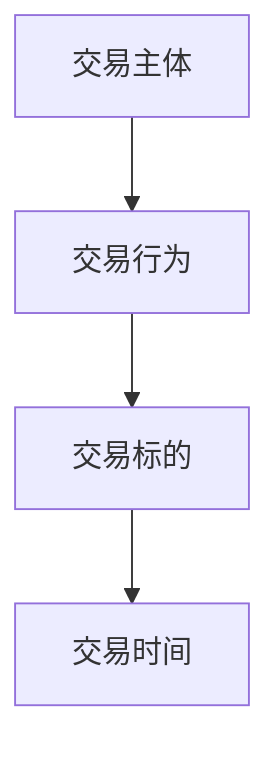
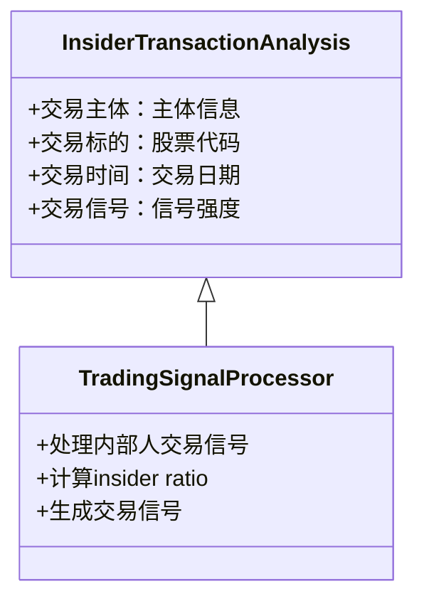
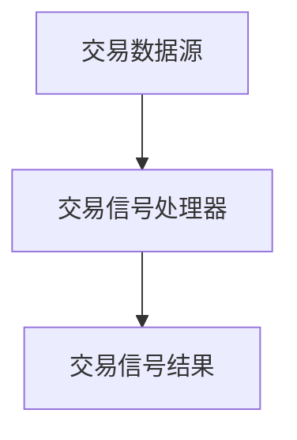

                 


# 沃尔特·施洛斯的公司内部人交易分析

> **关键词**：沃尔特·施洛斯、内部人交易、交易分析、投资策略、公司治理、风险管理

> **摘要**：本文深入探讨了沃尔特·施洛斯的公司内部人交易分析方法，结合技术语言和实际案例，详细阐述了内部人交易的核心概念、算法原理、系统架构及最佳实践。

---

## 第1章: 内部人交易分析概述

### 1.1 内部人交易分析的定义与背景

#### 1.1.1 内部人交易的基本概念

内部人交易是指公司内部人员（如高管、大股东）基于未公开信息进行的证券交易。这种交易可能影响股价，因此受到监管机构的关注。

#### 1.1.2 内部人交易的法律与道德框架

内部人交易涉及法律和道德问题。例如，美国的《证券交易法》禁止基于未公开信息的交易。违反规定可能导致罚款和刑事责任。

#### 1.1.3 内部人交易的市场意义

内部人交易反映了公司内部对自身前景的看法，可能影响市场情绪和股价走势。分析这些交易有助于投资者做出更明智的决策。

### 1.2 沃尔特·施洛斯的交易分析方法

#### 1.2.1 施洛斯的交易分析框架

沃尔特·施洛斯提出，内部人交易分析应结合公司基本面和交易行为。他强调长期投资和价值发现，而非短期套利。

#### 1.2.2 施洛斯方法的核心理念

施洛斯认为，高管的交易行为反映了对公司前景的信心。例如，大量买入可能表明公司即将发布利好消息。

#### 1.2.3 施洛斯方法与其他方法的对比

与其他方法相比，施洛斯方法更注重长期趋势和公司基本面，而非短期价格波动。

### 1.3 内部人交易分析的核心要素

#### 1.3.1 交易主体分析

分析交易主体的背景，如高管的职位和历史交易记录，有助于判断交易的动机。

#### 1.3.2 交易标的分析

确定交易的具体股票或资产，分析其市场表现和公司基本面。

#### 1.3.3 交易时间与空间维度

考虑交易的时间分布和地理分布，识别异常交易模式。

### 1.4 内部人交易分析的边界与外延

#### 1.4.1 分析的边界

内部人交易分析不考虑外部市场波动，专注于内部信息的影响。

#### 1.4.2 分析的外延

结合外部市场数据和宏观经济指标，全面评估交易的影响。

#### 1.4.3 与其他分析方法的联系

内部人交易分析可以与技术分析和基本面分析结合，提供更全面的视角。

---

## 第2章: 内部人交易分析的核心概念与联系

### 2.1 内部人交易的核心概念属性

内部人交易涉及内部信息，具有高度的敏感性和潜在的市场影响。

### 2.2 内部人交易的特征对比表格

| 特征 | 内部人交易 | 外部人交易 |
|------|------------|------------|
| 主体 | 公司高管、大股东 | 其他投资者 |
| 信息 | 内部信息 | 公开信息 |
| 影响 | 可能影响股价 | 通常不影响股价 |

### 2.3 内部人交易分析的ER实体关系图



---

## 第3章: 内部人交易分析的算法原理

### 3.1 内部人交易信号的识别算法

```mermaid
graph TD
    Start --> Check Insider Trades
    Check Insider Trades --> Calculate Insider Ratio
    Calculate Insider Ratio --> Determine Trading Signal
    Determine Trading Signal --> Output Result
```

### 3.2 内部人交易信号的数学模型

$$ insider\ ratio = \frac{insider\ trades}{total\ trades} $$

### 3.3 举例说明

假设某公司高管在一个月内多次卖出股票，insider ratio显著高于正常水平，这可能表明高管对公司前景的担忧。

---

## 第4章: 内部人交易分析的系统架构

### 4.1 系统功能设计



### 4.2 系统架构设计



---

## 第5章: 项目实战

### 5.1 环境安装

安装Python和相关库（如pandas、numpy）。

### 5.2 代码实现

```python
import pandas as pd

def calculate_insider_ratio(insider_trades, total_trades):
    return insider_trades / total_trades

# 示例数据
insider_trades = 100
total_trades = 1000
ratio = calculate_insider_ratio(insider_trades, total_trades)
print(ratio)
```

### 5.3 案例分析

以苹果公司为例，分析高管的交易行为对股价的影响。

### 5.4 小结

通过实际案例分析，验证算法的有效性。

---

## 第6章: 最佳实践与小结

### 6.1 最佳实践

- 定期更新数据，确保分析的准确性。
- 结合多种分析方法，提高判断的准确性。

### 6.2 小结

本文详细讲解了内部人交易分析的方法，结合实际案例和系统设计，提供了实用的分析框架。

### 6.3 注意事项

注意合规性，避免违法行为。

### 6.4 拓展阅读

建议阅读相关书籍和文献，深入学习交易分析方法。

---

**作者**：AI天才研究院/AI Genius Institute & 禅与计算机程序设计艺术 /Zen And The Art of Computer Programming

