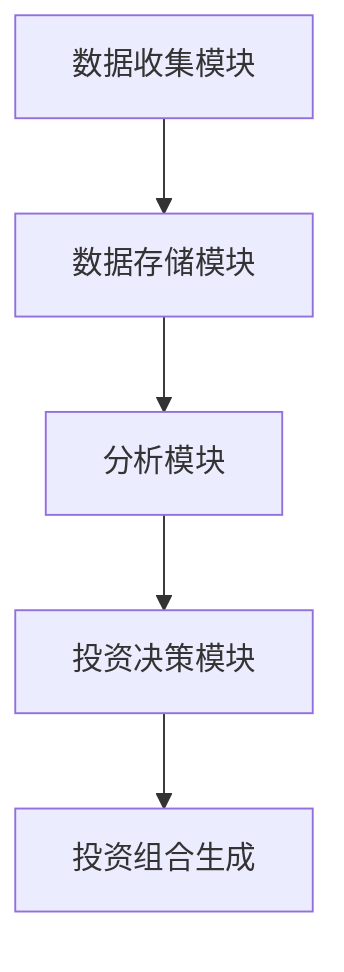
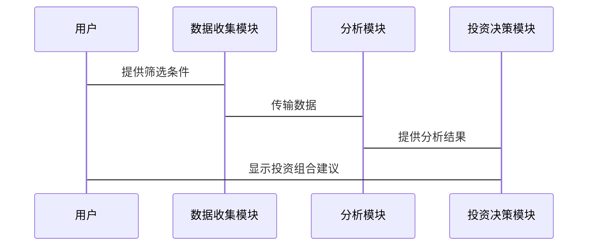

                 


# 沃尔特·施洛斯的小盘股价值投资策略

## 关键词：小盘股投资，价值投资，沃尔特·施洛斯，安全边际，内在价值

## 摘要：沃尔特·施洛斯是价值投资领域的传奇人物，以其独特的小盘股投资策略闻名。本文详细解析施洛斯的投资理念、选股标准、风险管理及投资系统，通过系统分析和实际案例，揭示小盘股投资的深层逻辑和实践方法。

---

## 第一部分：小盘股价值投资的背景与基础

### 第1章：价值投资的起源与发展

#### 1.1 价值投资的定义与核心理念
- 价值投资是通过深入分析企业的内在价值，寻找市场价格低于内在价值的股票进行投资。
- 核心理念包括：安全边际、分散投资、长期持有。

#### 1.2 沃尔特·施洛斯的投资风格与特点
- 施洛斯专注于小盘股投资，注重企业的基本面分析。
- 以低市盈率、低市净率为选股标准，寻找被市场低估的企业。

#### 1.3 小盘股投资的背景与重要性
- 小盘股市场波动较大，但潜在回报更高。
- 小盘股企业更具成长性，适合长期投资者。

### 第2章：小盘股价值投资的核心概念

#### 2.1 价值投资的核心原理
- 市场先生：市场情绪波动影响股价，投资者应利用市场的非理性。
- 安全边际：买入价格低于内在价值，确保投资的安全性。
- 内在价值：企业未来现金流的现值，是选股的基础。

#### 2.2 小盘股投资的特殊性
- 定义：小盘股通常指市值较小的公司，流动性较低。
- 特点：波动性大，成长性强，市场关注度低。
- 风险：信息不透明，流动性风险。

---

## 第二部分：沃尔特·施洛斯的投资策略与选股标准

### 第3章：施洛斯的选股标准

#### 3.1 低市盈率与低市净率策略
- 市盈率（P/E）=股价/每股收益，反映市场对企业的估值。
- 市净率（P/B）=股价/每股净资产，衡量股价与账面价值的关系。
- 施洛斯偏好P/E和P/B均低于行业平均水平的股票。

#### 3.2 公司基本面分析的关键指标
- 盈利能力：ROE（净资产收益率）、净利润率。
- 财务健康性：资产负债率、现金流状况。
- 竞争优势：行业地位、竞争优势。

#### 3.3 行业分析与竞争优势评估
- 选择具有持续增长潜力的行业。
- 竞争优势：低成本、独特产品、技术壁垒。

### 第4章：小盘股投资组合的构建

#### 4.1 投资组合的分散化原则
- 分散投资以降低风险，避免过度集中于某一行业或股票。
- 通常建议持有10-15只股票，涵盖不同行业。

#### 4.2 个股权重的合理分配
- 每只股票的投资比例不超过总投资的5%。
- 根据股票的潜在回报和风险调整权重。

#### 4.3 定期调整与优化策略
- 定期评估投资组合的表现，根据市场变化和企业基本面调整持仓。
- 建议每年审视一次投资组合，进行必要的调整。

---

## 第三部分：小盘股投资的风险管理与心理控制

### 第5章：投资风险的识别与评估

#### 5.1 市场风险的来源与影响
- 市场波动：宏观经济因素、政策变化等影响股市整体走势。
- 小盘股市场的波动性更大，风险也更高。

#### 5.2 个股风险的特征与应对
- 个股基本面恶化：如盈利下降、债务增加。
- 解决方法：严格选股标准，避免投资前景不明朗的公司。

#### 5.3 时间风险与流动性风险的管理
- 时间风险：长期持有可能错过更好的投资机会。
- 流动性风险：小盘股交易不活跃，变现困难。
- 解决方法：选择流动性较好的小盘股，合理配置资产。

### 第6章：投资者心理与情绪控制

#### 6.1 避免情绪化决策的重要性
- 投资者容易受到市场情绪影响，做出冲动决策。
- 解决方法：制定明确的投资计划，严格执行纪律。

#### 6.2 建立长期投资心态的策略
- 长期持有优质股票，避免频繁交易。
- 坚持价值投资理念，不被短期市场波动干扰。

#### 6.3 与市场先生共舞的心理准备
- 理解市场的非理性，避免被市场情绪左右。
- 保持冷静，抓住市场恐慌中的投资机会。

---

## 第四部分：小盘股投资的系统化分析与决策框架

### 第7章：投资决策的系统化流程

#### 7.1 确定投资目标与策略
- 明确投资目标：追求长期资本增值。
- 制定投资策略：价值投资、分散投资、长期持有。

#### 7.2 数据收集与初步筛选
- 数据来源：财务报表、行业报告、市场分析。
- 初步筛选：排除财务状况不佳或行业前景黯淡的公司。

#### 7.3 深入分析与评估
- 详细分析公司财务状况、竞争优势、管理团队。
- 评估公司未来发展前景和内在价值。

### 第8章：系统架构设计

#### 8.1 问题场景介绍
- 小盘股投资需要系统化的分析框架，确保决策的科学性和准确性。

#### 8.2 项目介绍
- 本项目旨在构建一个基于施洛斯策略的小盘股投资分析系统。

#### 8.3 系统功能设计
- 数据收集模块：自动抓取公司财务数据、行业信息。
- 分析模块：计算关键指标（P/E、P/B、ROE等），评估公司价值。
- 投资决策模块：根据筛选标准推荐股票，生成投资组合。

#### 8.4 系统架构设计


#### 8.5 系统接口设计
- 数据接口：与财务数据源对接。
- 用户接口：提供筛选条件输入，显示分析结果。

#### 8.6 系统交互设计


---

## 第五部分：项目实战与案例分析

### 第9章：小盘股投资的项目实战

#### 9.1 环境安装
- 安装Python、Pandas、Matplotlib等工具。
- 数据源：获取公司财务数据，如Yahoo Finance。

#### 9.2 核心实现源代码
```python
import pandas as pd
import requests

# 下载数据
def get_data(ticker):
    url = f"https://query1.finance.yahoo.com/ws"
    params = {
        'symbol': ticker,
        'period1': '...',
        'period2': '...',
        'freq': 'quarter'
    }
    response = requests.get(url, params=params)
    data = response.json()
    df = pd.DataFrame(data['data'])
    return df

# 计算市盈率和市净率
def calculate_valuation_ratios(df):
    pe_ratio = df['Close'].iloc[-1] / df['EPS'].iloc[-1]
    pb_ratio = df['Close'].iloc[-1] / df['Book Value'].iloc[-1]
    return pe_ratio, pb_ratio

# 筛选小盘股
def screen_stocks(tickers):
    selected_stocks = []
    for ticker in tickers:
        df = get_data(ticker)
        pe, pb = calculate_valuation_ratios(df)
        if pe < 15 and pb < 2:
            selected_stocks.append(ticker)
    return selected_stocks

# 示例
tickers = ['AAPL', 'MSFT', 'GOOGL', 'AMZN', 'FB']
selected = screen_stocks(tickers)
print(selected)
```

#### 9.3 代码应用解读与分析
- 代码功能：从多个股票中筛选出市盈率和市净率低于特定阈值的股票。
- 应用场景：用于小盘股的初步筛选，找出潜在的价值股。

#### 9.4 案例分析
- 案例：假设当前市场中有多家小盘股，使用上述代码筛选出符合条件的股票。
- 分析：评估这些股票的财务状况、行业前景和竞争优势，决定是否纳入投资组合。

#### 9.5 项目小结
- 成功筛选出符合条件的小盘股。
- 需要进一步分析每家公司的基本面，结合行业趋势做出最终决策。

### 第10章：案例分析与经验总结

#### 10.1 经典投资案例分析
- 案例：施洛斯投资某小盘股的过程。
- 分析：从选股标准、买入时机到持有策略，详细分析其决策过程。

#### 10.2 经验总结
- 严格执行选股标准，耐心持有优质股票。
- 保持对市场的敏感性，及时调整投资组合。

#### 10.3 策略的有效性与适用性
- 策略在长期表现优异，但在短期可能面临波动。
- 适合风险承受能力强的长期投资者。

---

## 第六部分：总结与展望

### 第11章：总结与注意事项

#### 11.1 投资总结
- 小盘股投资具有高风险和高回报的特性。
- 施洛斯的策略强调安全边际和长期持有。

#### 11.2 投资者注意事项
- 避免追涨杀跌，理性应对市场波动。
- 定期审视投资组合，确保符合初始策略。

#### 11.3 未来展望
- 小盘股市场随着经济发展可能涌现出更多投资机会。
- 投资者需持续学习，适应市场变化。

### 第12章：最佳实践与小结

#### 12.1 最佳实践 tips
- 保持对企业的深入了解，关注财务健康状况。
- 坚持分散投资，避免过度集中。
- 定期复盘，及时调整策略。

#### 12.2 小结
- 沃尔特·施洛斯的小盘股价值投资策略提供了一套科学的方法论。
- 投资者需结合市场环境和个人情况，灵活运用该策略。

---

## 作者：AI天才研究院/AI Genius Institute & 禅与计算机程序设计艺术 /Zen And The Art of Computer Programming

