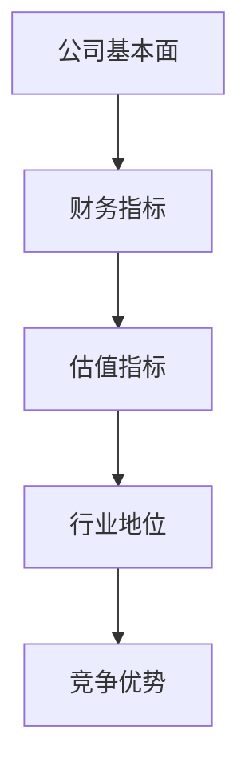
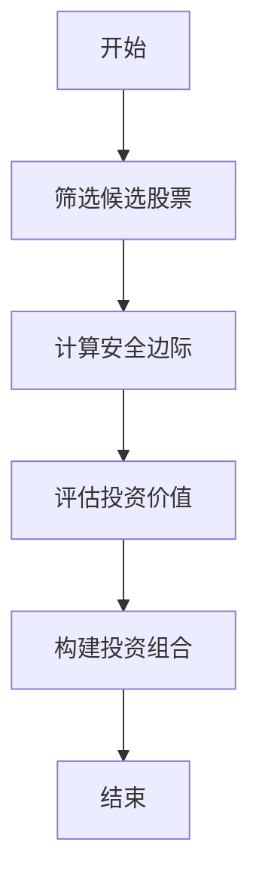
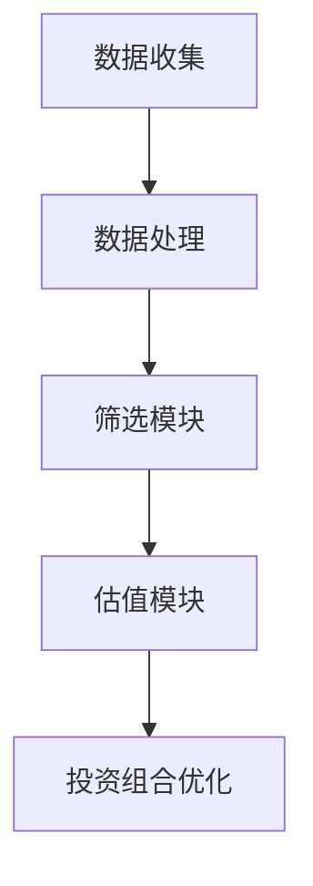

                 


# 沃尔特·施洛斯的小盘股研究方法论

> 关键词：小盘股投资，沃尔特·施洛斯，基本面分析，安全边际，投资策略，价值投资

> 摘要：本文详细探讨了沃尔特·施洛斯的小盘股研究方法论，分析了其核心概念、算法原理、系统架构和项目实战。通过背景介绍、核心概念对比、算法流程图、数学模型公式、系统架构图、代码实现和案例分析，深入解析了施洛斯方法的独特性和实用性。文章最后总结了最佳实践和注意事项，为读者提供了全面的小盘股研究方法论框架。

---

## 第一部分：小盘股投资的背景与定义

### 第1章：小盘股投资的背景

#### 1.1 小盘股投资的背景

- **1.1.1 什么是小盘股**
  - 小盘股通常指市值较小的公司股票，通常在10亿美元以下。
  - 小盘股市场具有高波动性、高成长性和高风险的特点。
  - 小盘股市场的参与者较少，信息不对称较为严重。

- **1.1.2 小盘股市场的特点**
  - 市值小：小盘股公司市值通常在10亿到20亿美元之间。
  - 流动性低：小盘股交易量通常较小，市场深度有限。
  - 风险高：小盘股公司更容易受到市场波动的影响。
  - 成长性高：小盘股公司通常具有较高的增长潜力。

- **1.1.3 小盘股投资的潜在机会**
  - 小盘股公司可能具有较高的成长性。
  - 小盘股市场的波动性为投资者提供了套利机会。
  - 小盘股公司可能被市场低估，具有较大的增值空间。

#### 1.2 沃尔特·施洛斯的背景介绍

- **1.2.1 施洛斯的生平简介**
  - 沃尔特·施洛斯是20世纪著名的投资家，专注于小盘股投资。
  - 施洛斯的投资理念以价值投资为核心，强调对公司基本面的深入分析。
  - 施洛斯的投资策略注重长期持有，追求安全边际。

- **1.2.2 施洛斯投资理念的核心思想**
  - 价值投资：寻找被市场低估的公司。
  - 安全边际：买入价格低于公司内在价值。
  - 长期持有：耐心持有优质股票，等待价值实现。

- **1.2.3 施洛斯与小盘股投资的渊源**
  - 施洛斯在职业生涯中专注于小盘股投资，取得了显著的成就。
  - 小盘股市场的特性使其成为施洛斯投资策略的理想选择。
  - 施洛斯的方法为小盘股投资提供了重要的理论和实践依据。

---

## 第二部分：小盘股研究的核心概念与联系

### 第2章：核心概念原理

#### 2.1 小盘股研究的基本原理

- **2.1.1 小盘股研究的基本原理**
  - 小盘股研究的核心是通过对公司基本面的分析，寻找具有潜在增长潜力的公司。
  - 小盘股研究注重对公司财务状况、行业地位和竞争优势的全面评估。
  - 小盘股研究需要结合市场环境和宏观经济因素进行综合判断。

- **2.1.2 施洛斯研究方法的核心要素**
  - 基本面分析：对公司财务状况、盈利能力、成长性等进行深入分析。
  - 安全边际：确保买入价格低于公司内在价值。
  - 组合管理：分散投资，降低风险。

- **2.1.3 小盘股研究的数学模型**
  - 小盘股研究需要借助数学模型进行定量分析，例如市盈率、市净率等指标的计算。

#### 2.2 小盘股研究的概念属性特征对比表格

- **表2-1: 小盘股与大盘股的对比特征**

| 特性       | 小盘股             | 大盘股             |
|------------|--------------------|--------------------|
| 市值范围     | <10亿美元          | >10亿美元          |
| 流动性       | 低                | 高                |
| 波动性       | 高                | 低                |
| 成长性       | 高                | 中低              |
| 信息不对称   | 高                | 低                |

#### 2.3 小盘股研究的ER实体关系图架构



---

## 第三部分：施洛斯小盘股研究方法的算法原理

### 第3章：算法原理概述

#### 3.1 基于基本面分析的筛选算法

- **3.1.1 基本面分析的核心指标**
  - 市盈率（P/E）：股价与每股收益的比率。
  - 市净率（P/B）：股价与每股净资产的比率。
  - 资产负债率：衡量公司的财务杠杆。
  - 净利润率：衡量公司的盈利能力。

- **3.1.2 安全边际计算方法**
  - 安全边际 = 股票内在价值 - 股票市场价格
  - 内在价值的计算需要基于对公司未来现金流的折现分析。

- **3.1.3 组合优化策略**
  - 根据风险承受能力和收益目标，优化投资组合。
  - 通过分散投资降低风险，同时追求最大化的收益。

#### 3.2 施洛斯小盘股研究方法的算法流程图



---

## 第四部分：小盘股研究的数学模型与公式

### 第4章：数学模型与公式

#### 4.1 基本面分析模型

- **4.1.1 市盈率计算公式**
  $$市盈率 = \frac{股价}{每股收益}$$

- **4.1.2 市净率计算公式**
  $$市净率 = \frac{股价}{每股净资产}$$

#### 4.2 安全边际计算公式

- **安全边际计算公式**
  $$安全边际 = 股票内在价值 - 股票市场价格$$

#### 4.3 投资组合优化模型

- **最大收益计算公式**
  $$最大收益 = \sum_{i=1}^{n} w_i \times r_i$$
  其中，$w_i$ 是投资比例，$r_i$ 是预期收益率。

- **风险最小化公式**
  $$风险 = \sum_{i=1}^{n} \sum_{j=1}^{n} w_i w_j \sigma_{ij}$$
  其中，$\sigma_{ij}$ 是资产$i$和$j$之间的协方差。

---

## 第五部分：小盘股研究的系统架构与实战

### 第5章：系统架构与实战

#### 5.1 系统架构设计

- **5.1.1 项目介绍**
  - 本项目旨在构建一个基于施洛斯方法的小盘股研究系统，实现从小盘股筛选、安全边际计算到投资组合优化的全流程自动化。

- **5.1.2 系统功能设计**
  - 数据收集模块：收集小盘股的基本面数据，包括财务指标、估值指标等。
  - 筛选模块：基于基本面分析和安全边际计算，筛选出符合条件的小盘股。
  - 估值模块：计算股票的内在价值，确定安全边际。
  - 投资组合优化模块：根据风险承受能力和收益目标，优化投资组合。

- **5.1.3 系统架构图**


#### 5.2 项目实战

- **5.2.1 环境安装**
  - 需要安装Python、Pandas、NumPy等工具。

- **5.2.2 核心实现代码**
  ```python
  import pandas as pd
  import numpy as np

  def calculate_pe_ratio(df):
      pe_ratio = df['股价'] / df['每股收益']
      return pe_ratio

  def calculate_pb_ratio(df):
      pb_ratio = df['股价'] / df['每股净资产']
      return pb_ratio

  def calculate_intrinsic_value(df, discount_rate):
      intrinsic_value = df['未来现金流'].sum() / (1 + discount_rate)
      return intrinsic_value

  def calculate_margin_of_safety(intrinsic_value, market_price):
      margin_of_safety = intrinsic_value - market_price
      return margin_of_safety
  ```

- **5.2.3 实际案例分析**
  - 以某小盘股公司为例，计算其市盈率、市净率、内在价值和安全边际。
  - 对比不同公司的安全边际，选择具有较高安全边际的公司进行投资。

- **5.2.4 分析结果与启示**
  - 小盘股投资需要结合定量分析和定性分析。
  - 安全边际是小盘股投资的重要指标。
  - 小盘股投资需要耐心和长期持有。

---

## 第六部分：总结与展望

### 第6章：总结与展望

#### 6.1 最佳实践 tips

- **选择优质的小盘股公司**
  - 选择具有较高成长性和竞争优势的公司。
  - 选择财务状况健康，负债率低的公司。

- **注重安全边际**
  - 在买入股票时，确保买入价格低于内在价值。
  - 安全边际越高，投资风险越小。

- **长期持有**
  - 小盘股投资需要耐心，等待价值实现。
  - 避免频繁交易，降低交易成本。

#### 6.2 小结

- 沃尔特·施洛斯的小盘股研究方法论为投资者提供了重要的理论和实践指导。
- 小盘股投资需要结合定量分析和定性分析，注重安全边际和长期持有。
- 通过系统化的研究和分析，可以提高小盘股投资的成功率。

#### 6.3 注意事项

- 小盘股市场波动性大，投资风险较高。
- 小盘股公司可能存在信息不对称，投资者需要进行深入研究。
- 小盘股投资需要耐心和长期持有，避免短期波动的影响。

#### 6.4 拓展阅读

- 《The Intelligent Investor》——本杰明·格雷厄姆
- 《小盘股投资指南》——彼得·林奇

---

## 作者信息

作者：AI天才研究院/AI Genius Institute & 禅与计算机程序设计艺术 /Zen And The Art of Computer Programming

---

通过本文的系统化分析和实战指导，读者可以深入了解沃尔特·施洛斯的小盘股研究方法论，并将其应用于实际投资中。希望本文能为小盘股投资者提供有价值的参考和启发。

