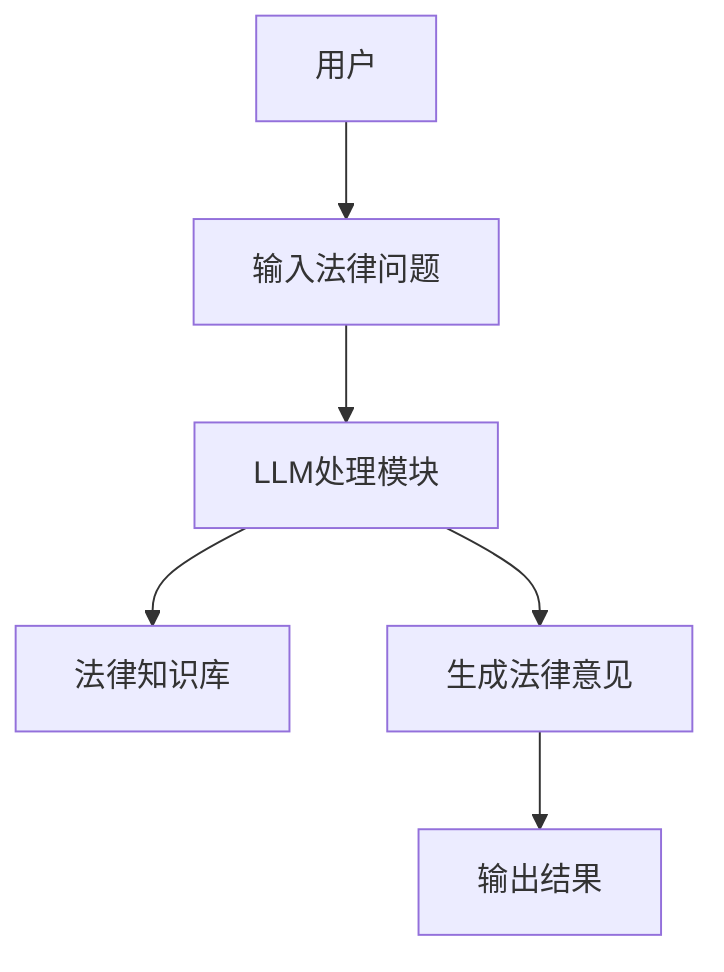
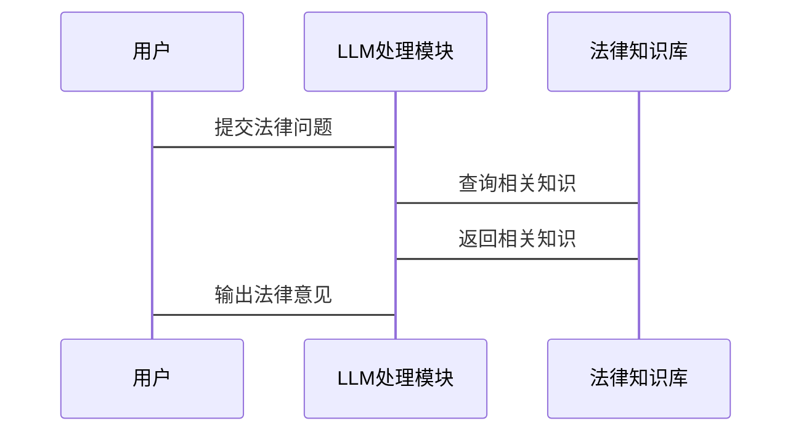
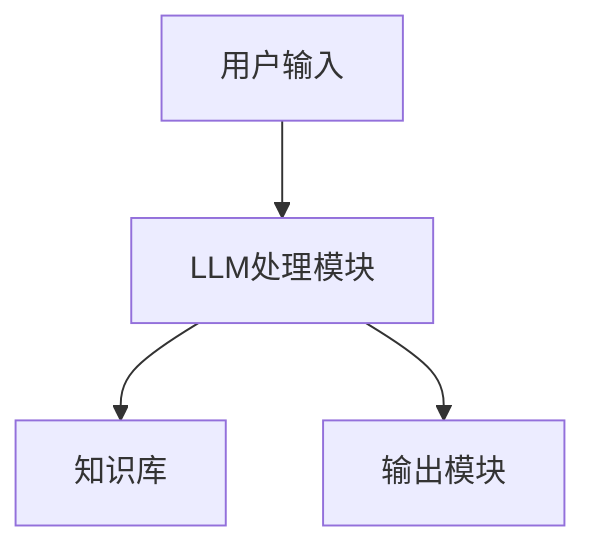
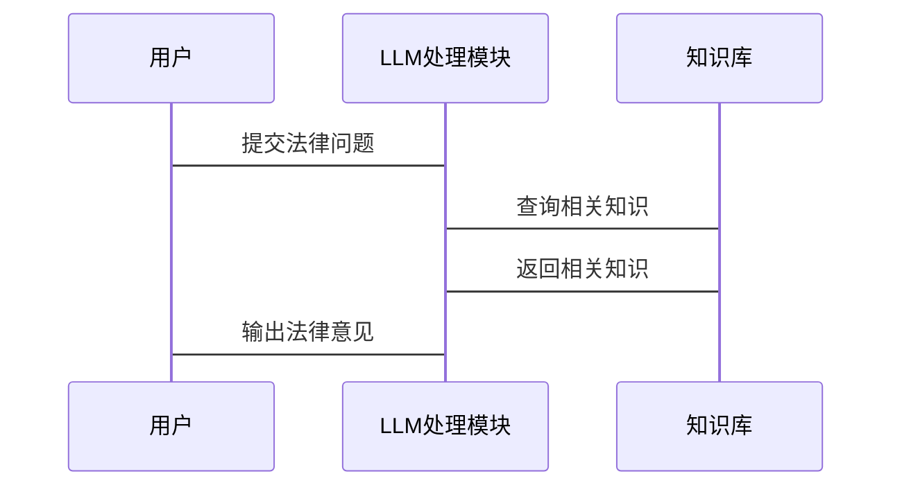

                 


# 第一部分: 法律顾问 AI Agent 背景与核心概念

## 第1章: 法律顾问 AI Agent 的背景与问题背景

### 1.1 法律咨询与合规检查的现状
#### 1.1.1 传统法律咨询与合规检查的痛点
传统法律咨询和合规检查过程中存在以下痛点：
- 人工成本高：法律咨询和合规检查需要大量的人力资源，尤其是在企业法务部门和律师事务所。
- 效率低下：法律咨询和合规检查通常需要逐条审查法律文本，耗时长且效率低。
- 信息不对称：非专业人士难以理解复杂的法律条款，导致信息不对称。
- 一致性问题：不同律师或法律团队在解读法律条款时可能存在一致性问题。

#### 1.1.2 AI 技术在法律领域的潜力
AI技术，特别是大语言模型（LLM），在法律领域具有巨大的潜力：
- 提高效率：AI可以快速分析大量的法律文本，提供初步的法律意见和合规检查结果。
- 降低成本：通过自动化处理法律咨询和合规检查，可以显著降低人力成本。
- 增强一致性：AI可以根据预设的规则和模型，提供一致的法律解读。
- 支持非专业人士：AI可以将复杂的法律条款转化为易于理解的语言，帮助非专业人士更好地理解法律问题。

#### 1.1.3 大语言模型（LLM）的出现与应用
大语言模型（LLM）的出现为法律咨询和合规检查带来了新的可能性：
- LLM可以通过自然语言处理技术，理解复杂的法律文本，并生成相关的法律意见。
- LLM可以用于法律文本的分类、信息提取、问答系统等任务。
- LLM可以通过不断的学习和优化，提升法律咨询和合规检查的准确性和效率。

## 第2章: 大语言模型（LLM）的核心概念与法律应用

### 2.1 大语言模型的定义与特点
#### 2.1.1 大语言模型的基本定义
大语言模型（LLM）是一种基于深度学习的自然语言处理模型，旨在理解和生成人类语言。LLM通常采用Transformer架构，通过大量的文本数据进行预训练，具备强大的上下文理解和生成能力。

#### 2.1.2 大语言模型的核心特点
- 大规模预训练：LLM通过在大量通用文本数据上进行预训练，掌握了广泛的语言知识。
- 自然语言理解：LLM能够理解复杂的语言结构和语义，能够回答开放式问题。
- 自动生成文本：LLM可以生成连贯且自然的文本，用于法律咨询、合同生成等任务。
- 可扩展性：LLM可以通过微调和后训练，适应特定领域的任务和需求。

#### 2.1.3 大语言模型与法律咨询的契合点
- 法律文本分析：LLM可以用于分析法律文本，提取关键信息。
- 合规检查：LLM可以帮助企业进行合规性检查，识别潜在的法律风险。
- 法律问答系统：LLM可以作为法律问答系统，为用户提供初步的法律咨询。
- 合同审查与优化：LLM可以辅助审查合同，识别潜在的法律风险，并提出优化建议。

### 2.2 大语言模型在法律咨询中的应用场景
#### 2.2.1 法律文本分析
法律文本分析是将复杂的法律文本进行结构化分析，提取关键信息。LLM可以通过自然语言处理技术，识别合同中的关键条款、法律责任、权利义务等信息。

#### 2.2.2 合规检查与风险评估
合规检查与风险评估是企业法务工作中的重要任务。LLM可以通过分析企业的业务流程和相关法律文本，识别潜在的法律风险，提供合规建议。

#### 2.2.3 法律问答系统
法律问答系统是通过LLM技术，为用户提供法律咨询服务。用户可以通过自然语言提问，LLM根据预设的法律知识库和上下文理解，提供准确的法律解答。

#### 2.2.4 合同审查与优化
合同审查与优化是法律咨询的重要任务。LLM可以通过分析合同文本，识别潜在的法律风险，并提出优化建议，帮助用户降低法律风险。

## 第3章: 法律顾问 AI Agent 的核心概念与系统架构

### 3.1 法律顾问 AI Agent 的定义与功能
#### 3.1.1 法律顾问 AI Agent 的定义
法律顾问 AI Agent 是一种基于大语言模型（LLM）的智能法律咨询系统，能够通过自然语言处理技术，为用户提供法律咨询、合同审查、合规检查等服务。

#### 3.1.2 法律顾问 AI Agent 的核心功能
- 法律咨询：通过自然语言交互，为用户提供法律问题解答。
- 合同审查：分析合同文本，识别潜在的法律风险。
- 合规检查：帮助企业进行合规性检查，识别法律风险。
- 法律文档生成：根据用户需求，生成法律文件，如合同、声明等。

#### 3.1.3 法律顾问 AI Agent 的系统架构
法律顾问 AI Agent 的系统架构包括以下几个部分：
- 用户界面：用户通过自然语言与AI Agent交互。
- 法律知识库：包含丰富的法律知识和案例。
- 大语言模型（LLM）：负责理解和生成法律文本。
- 后台管理系统：用于管理用户数据、知识库更新等。

### 3.2 法律顾问 AI Agent 的系统架构设计
#### 3.2.1 系统模块划分
- 用户模块：负责用户与系统的交互。
- 知识库模块：存储法律知识和案例。
- 处理模块：负责法律文本的分析和生成。
- 管理模块：负责系统的配置和维护。

#### 3.2.2 系统功能流程图


#### 3.2.3 系统交互设计


# 第二部分: 大语言模型（LLM）的算法原理与数学模型

## 第4章: 大语言模型（LLM）的算法原理

### 4.1 大语言模型的训练原理
#### 4.1.1 预训练目标函数
LLM的预训练目标函数通常采用交叉熵损失函数，用于衡量模型预测与实际标签的差异。

#### 4.1.2 损失函数的计算
损失函数的计算公式如下：
$$
\text{Loss} = -\sum_{i=1}^{n} \text{log}p(y_i|x_i)
$$
其中，\( y_i \) 是实际标签，\( x_i \) 是输入文本。

#### 4.1.3 梯度下降与参数更新
通过梯度下降算法，模型参数不断更新以最小化损失函数。常用的梯度下降算法包括随机梯度下降（SGD）和Adam优化器。

### 4.2 大语言模型的推理机制
#### 4.2.1 解码过程
解码过程是LLM生成文本的核心步骤，通常采用贪心搜索或随机采样方法。

#### 4.2.2 注意力机制
注意力机制用于计算输入文本中每个词对当前词的重要程度，公式如下：
$$
\text{Attention}(Q, K, V) = \text{softmax}\left(\frac{QK^T}{\sqrt{d_k}}\right)V
$$
其中，\( Q \) 是查询向量，\( K \) 是键向量，\( V \) 是值向量，\( d_k \) 是向量维度。

#### 4.2.3 概率生成模型
概率生成模型通过计算每个词的概率分布，生成最可能的后续词。

## 第5章: 大语言模型的数学模型与公式

### 5.1 概率生成模型的数学表达
概率生成模型的数学表达如下：
$$
p(y|x) = \prod_{i=1}^{n} p(y_i|y_{<i}, x)
$$
其中，\( y \) 是生成的文本，\( x \) 是输入文本。

### 5.2 注意力机制的数学公式
注意力机制的数学公式如下：
$$
\text{Attention}(Q, K, V) = \text{softmax}\left(\frac{QK^T}{\sqrt{d_k}}\right)V
$$

## 第6章: 大语言模型的法律文本处理算法

### 6.1 法律文本的分词与向量化
#### 6.1.1 分词算法
常用的分词算法包括基于词典的方法和基于统计的方法。

#### 6.1.2 词向量表示
词向量表示通常采用词嵌入技术，如Word2Vec和GloVe。

#### 6.1.3 文本嵌入
文本嵌入通过将词向量进行加权求和，生成文本的向量表示。

### 6.2 法律文本的语义理解算法
#### 6.2.1 语义表示模型
常用的语义表示模型包括BERT和GPT。

#### 6.2.2 上下文理解算法
上下文理解算法通过分析文本的上下文关系，生成更准确的语义表示。

# 第三部分: 系统架构与项目实战

## 第7章: 法律顾问 AI Agent 的系统架构设计

### 7.1 问题场景介绍
法律顾问 AI Agent 的问题场景是为用户提供高效的法律咨询和合规检查服务。

### 7.2 系统功能设计
#### 7.2.1 系统功能模块
- 用户输入模块：用户输入法律问题或合同文本。
- LLM处理模块：负责法律文本的分析和生成。
- 知识库模块：存储法律知识和案例。
- 输出模块：输出法律咨询结果。

#### 7.2.2 系统功能流程图


#### 7.2.3 系统交互设计


## 第8章: 项目实战

### 8.1 环境安装
需要安装Python、TensorFlow、Keras等工具。

### 8.2 系统核心实现源代码
```python
def legal_consultation(question, knowledge_base):
    # 输入法律问题
    # 知识库查询
    # 返回法律意见
    pass

def contract_review(contract_text, knowledge_base):
    # 合同文本审查
    # 知识库查询
    # 返回审查结果
    pass
```

### 8.3 代码应用解读与分析
解读代码的各个部分，分析其实现方式。

### 8.4 实际案例分析和详细讲解剖析
通过具体案例，详细讲解法律顾问 AI Agent 的应用。

### 8.5 项目小结
总结项目实施过程中的经验与教训。

## 第9章: 最佳实践 tips、小结、注意事项、拓展阅读

### 9.1 最佳实践 tips
- 定期更新知识库，保持模型的准确性。
- 采用多模态输入，提升用户体验。
- 设置合理的权限管理，保护用户隐私。

### 9.2 小结
法律顾问 AI Agent 是一种基于大语言模型的智能法律咨询系统，能够显著提升法律咨询和合规检查的效率和准确性。

### 9.3 注意事项
- 数据隐私保护：确保用户数据的安全性和隐私性。
- 模型局限性：认识到大语言模型的局限性，避免过度依赖AI。
- 法律法规遵循：确保系统的应用符合相关法律法规。

### 9.4 拓展阅读
推荐阅读《大语言模型与法律》、《人工智能在法律领域的应用》等书籍。

# 结语

法律顾问 AI Agent 的应用标志着法律咨询和合规检查进入了一个新的时代。通过大语言模型（LLM）的强大能力，法律顾问 AI Agent 能够显著提升法律咨询和合规检查的效率和准确性，为企业和用户提供高效、便捷的法律服务。

作者：AI天才研究院/AI Genius Institute & 禅与计算机程序设计艺术 /Zen And The Art of Computer Programming

