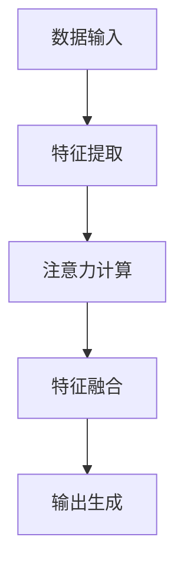

                 


# 注意力机制在AI Agent多模态融合中的应用

> 关键词：注意力机制，多模态融合，AI Agent，深度学习，自然语言处理，计算机视觉

> 摘要：本文深入探讨了注意力机制在AI Agent多模态融合中的应用，从基础概念到具体实现，详细分析了其在自然语言处理、计算机视觉等领域的应用案例。通过数学公式、Mermaid图表和代码示例，全面解析了注意力机制的原理及其在多模态数据处理中的优势。

---

## 第1章：注意力机制与多模态融合概述

### 1.1 注意力机制的背景与概念

#### 1.1.1 从传统机器学习到深度学习的演进

传统的机器学习方法，如支持向量机（SVM）和随机森林，依赖于特征工程和手工设计特征。然而，随着数据规模的增大和数据类型的多样化，这些方法逐渐显现出局限性。深度学习的兴起，尤其是神经网络的发展，为处理复杂数据提供了新的可能性。

#### 1.1.2 注意力机制的起源与发展

注意力机制最初在神经机器翻译中得到应用，由Transformer模型提出。其核心思想是让模型在处理序列数据时，关注输入中的重要部分，而非对所有位置同等对待。这种机制通过计算每个位置的注意力权重，实现了对关键信息的聚焦。

#### 1.1.3 多模态数据的基本概念

多模态数据指的是多种类型的数据，如文本、图像、语音、视频等。多模态融合的目标是将这些不同形式的数据结合起来，以获得更全面的信息理解。例如，在自动驾驶中，AI Agent需要同时处理来自摄像头、雷达和GPS的多源数据。

---

### 1.2 AI Agent的基本概念与应用

#### 1.2.1 AI Agent的定义与分类

AI Agent是一种智能实体，能够感知环境并采取行动以实现目标。根据智能水平，AI Agent可以分为反应式Agent和基于模型的Agent。反应式Agent基于当前感知做出决策，而基于模型的Agent则依赖于内部状态和环境模型。

#### 1.2.2 多模态数据在AI Agent中的重要性

在现实世界中，AI Agent需要处理多种类型的数据。例如，智能助手需要理解用户的语音指令并结合上下文（如时间、位置）提供服务。多模态数据的处理能力直接决定了AI Agent的智能水平和用户体验。

#### 1.2.3 当前AI Agent的应用场景与挑战

当前，AI Agent广泛应用于智能助手（如Siri、Alexa）、推荐系统、自动驾驶等领域。然而，多模态数据的处理仍面临诸多挑战，如数据异构性、计算复杂性和实时性要求等。

---

## 第2章：注意力机制的原理与数学模型

### 2.1 注意力机制的基本原理

#### 2.1.1 注意力机制的核心思想

注意力机制通过计算输入数据中每个位置的权重，确定哪些部分更重要。这种机制模拟了人类在处理信息时的注意力分配过程，使得模型能够聚焦于关键信息。

#### 2.1.2 注意力机制的计算流程

注意力机制的计算流程包括以下几个步骤：
1. 计算查询（query）、键（key）和值（value）。
2. 计算查询与键之间的相似性，得到注意力权重。
3. 根据权重对值进行加权求和，得到最终的注意力输出。

#### 2.1.3 注意力机制的变体与优化

注意力机制的变体包括自注意力（self-attention）、交叉注意力（cross-attention）等。自注意力用于处理同一模态的数据，而交叉注意力用于跨模态数据的交互。

---

### 2.2 多模态数据的注意力机制模型

#### 2.2.1 多模态数据的表示方法

多模态数据的表示方法包括嵌入（embedding）和特征提取。例如，文本可以通过词嵌入（如Word2Vec）表示，图像可以通过卷积神经网络（CNN）提取特征。

#### 2.2.2 跨模态注意力机制的实现

跨模态注意力机制允许模型在不同模态之间分配注意力权重。例如，在多模态机器翻译中，模型可以同时关注源语言的文本和图像信息。

#### 2.2.3 多模态融合的注意力模型设计

多模态融合的注意力模型设计需要考虑不同模态数据的异构性。例如，可以通过加权求和的方式，将不同模态的注意力输出融合起来。

---

## 第3章：多模态数据的预处理与融合

### 3.1 多模态数据的预处理方法

#### 3.1.1 数据清洗与标准化

数据清洗包括去除噪声、填充缺失值等。标准化则是将数据转换到统一的尺度，例如归一化。

#### 3.1.2 数据的特征提取与表示

特征提取是将原始数据转换为高维特征向量。例如，文本可以通过词袋模型或词嵌入（如Word2Vec）表示，图像可以通过CNN提取特征。

#### 3.1.3 跨模态数据对齐技术

跨模态数据对齐是指将不同模态的数据对齐到同一时间或空间尺度。例如，在视频描述生成任务中，需要将视频帧与文本描述对齐。

---

### 3.2 注意力机制在多模态融合中的应用

#### 3.2.1 基于注意力的多模态特征融合

通过注意力机制，模型可以对不同模态的特征进行加权求和，从而实现特征的融合。

#### 3.2.2 多模态数据的联合编码方法

联合编码方法将不同模态的特征编码到同一空间，例如通过多模态词嵌入（MMI）方法。

#### 3.2.3 跨模态注意力权重的计算与分析

跨模态注意力权重反映了不同模态之间的关联程度。通过分析这些权重，可以理解模型对不同模态的依赖程度。

---

## 第4章：AI Agent中的注意力机制应用

### 4.1 基于注意力机制的自然语言处理

#### 4.1.1 NLP任务中的注意力机制应用

在机器翻译中，自注意力机制帮助模型捕捉源语言句子中的长距离依赖关系。

#### 4.1.2 基于Transformer的AI Agent设计

Transformer模型通过自注意力机制和位置前馈网络，实现了高效的序列建模能力。

#### 4.1.3 注意力机制在对话系统中的应用

在对话系统中，注意力机制帮助模型关注用户输入中的重要部分，从而生成更相关的回复。

---

### 4.2 注意力机制在计算机视觉中的应用

#### 4.2.1 视觉注意力机制的实现

视觉注意力机制通过计算图像中每个像素的注意力权重，实现对关键区域的聚焦。

#### 4.2.2 跨模态图像描述生成

通过跨模态注意力机制，模型可以同时关注图像和文本信息，生成更准确的图像描述。

#### 4.2.3 实例分析与对比实验

通过实例分析和对比实验，可以验证注意力机制在计算机视觉任务中的有效性。

---

## 第5章：注意力机制在AI Agent多模态融合中的系统设计

### 5.1 系统架构设计

#### 5.1.1 系统功能模块划分

系统功能模块包括数据输入、注意力计算、特征融合和输出生成。

#### 5.1.2 系统架构的Mermaid图



#### 5.1.3 系统接口设计

系统接口包括数据输入接口、注意力计算接口和特征融合接口。

---

## 第6章：项目实战与代码实现

### 6.1 项目环境安装

需要安装的库包括TensorFlow、Keras、numpy和matplotlib。

### 6.2 核心代码实现

#### 6.2.1 注意力机制的实现

```python
def attention(query, key, value):
    # 计算相似性
    attention_scores = tf.matmul(query, key, transpose_b=True)
    attention_scores = attention_scores / tf.sqrt(tf.cast(query.shape[-1], tf.float32))
    # 计算权重
    attention_weights = tf.nn.softmax(attention_scores, axis=-1)
    # 加权求和
    output = tf.matmul(attention_weights, value)
    return output, attention_weights
```

#### 6.2.2 多模态数据的融合

```python
def multi_modal_fusion(text_embeddings, image_features):
    # 计算注意力权重
    attention_weights = tf.nn.softmax(tf.matmul(text_embeddings, image_features, transpose_b=True))
    # 加权求和
    fused_features = tf.matmul(attention_weights, image_features)
    return fused_features
```

---

## 第7章：总结与展望

### 7.1 总结

本文详细探讨了注意力机制在AI Agent多模态融合中的应用，从基本原理到具体实现，结合实际案例进行了深入分析。

### 7.2 未来展望

未来的研究可以进一步优化注意力机制，探索新的多模态融合方法，并扩展其在更多领域的应用。

---

## 作者：AI天才研究院/AI Genius Institute & 禅与计算机程序设计艺术 /Zen And The Art of Computer Programming

---

通过上述思考，我们可以系统地撰写一篇关于注意力机制在AI Agent多模态融合中的应用的技术博客文章。

