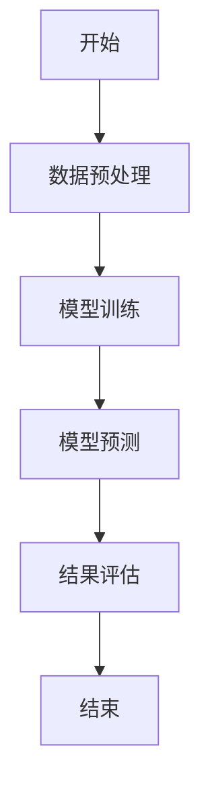
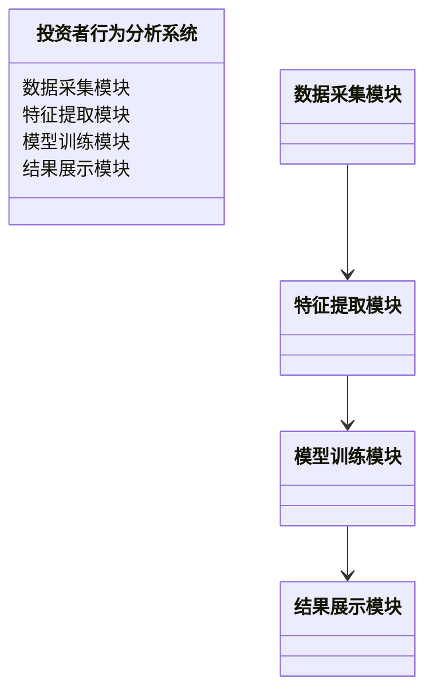
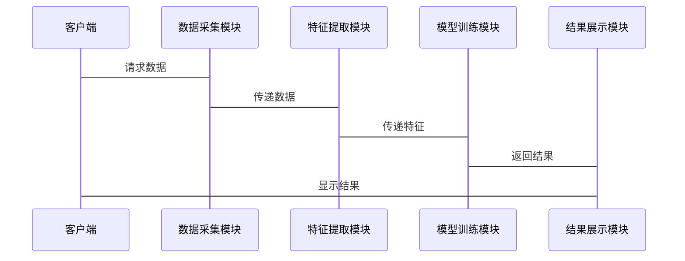

                 


# 深入分析投资者行为：模型构建与应用

---

## 关键词：
- 投资者行为分析
- 机器学习模型
- 数据预处理
- 系统架构设计
- 金融投资

---

## 摘要：
本文深入探讨投资者行为分析的核心概念、模型构建方法以及实际应用。通过分析投资者的决策过程、行为特征和影响因素，结合机器学习算法和系统架构设计，构建投资者行为分析模型，并通过实际案例展示模型的应用效果。本文旨在为投资者提供科学的决策支持，帮助其优化投资策略。

---

## 第一部分: 投资者行为分析的背景与重要性

### 第1章: 投资者行为分析的背景与重要性

#### 1.1 问题背景与问题描述
投资者行为分析是金融领域的重要研究方向，旨在揭示投资者在金融市场中的决策过程、行为特征及其对市场价格的影响。随着金融市场的复杂化和数据化，投资者行为分析在资产定价、风险管理、投资策略优化等方面发挥着越来越重要的作用。

#### 1.2 投资者行为分析的核心目标
投资者行为分析的核心目标包括：
- 描述投资者的决策过程和行为特征。
- 分析投资者行为对市场价格的影响。
- 提供基于行为特征的投资策略建议。

#### 1.3 问题的边界与外延
投资者行为分析的边界包括：
- 个体投资者与机构投资者的行为差异。
- 短期行为与长期行为的区分。
- 行为分析与资产定价的结合。

#### 1.4 本章小结
本章通过介绍投资者行为分析的背景、目标和边界，为后续章节的分析奠定了基础。

---

## 第二部分: 投资者行为分析的核心概念与联系

### 第2章: 投资者行为分析的核心概念

#### 2.1 投资者行为的核心概念
投资者行为的核心概念包括：
- **决策过程**：投资者如何收集信息、评估风险和收益，并做出投资决策。
- **行为特征**：投资者在不同市场条件下的行为模式，如风险偏好、羊群效应等。
- **影响因素**：包括市场环境、心理因素、信息来源等。

#### 2.2 投资者行为的影响因素对比分析
以下是投资者行为影响因素的对比分析：

| 影响因素 | 描述 | 类型 |
|----------|------|------|
| 市场环境 | 包括市场波动、经济周期等 | 外部因素 |
| 心理因素 | 包括风险偏好、情绪波动等 | 内部因素 |
| 信息来源 | 包括新闻、研究报告等 | 信息因素 |

#### 2.3 投资者行为的ER实体关系图
以下是投资者行为的ER实体关系图：

```mermaid
erd
    客户: <投资者>
        - 姓名 (string)
        - 年龄 (integer)
        - 风险偏好 (string)
    交易记录:
        - 交易日期 (date)
        - 买入金额 (float)
        - 卖出金额 (float)
    市场数据:
        - 股票代码 (string)
        - 收盘价 (float)
        - 成交量 (integer)
```

#### 2.4 本章小结
本章通过对比分析和ER实体关系图，明确了投资者行为的核心概念及其影响因素。

---

## 第三部分: 投资者行为分析的模型构建基础

### 第3章: 投资者行为分析的模型构建基础

#### 3.1 数据预处理与特征提取
数据预处理是投资者行为分析的关键步骤，包括：
- **数据清洗**：去除缺失值和异常值。
- **特征提取**：从交易记录、市场数据中提取有用的特征，如收益率、波动率等。

#### 3.2 模型选择与训练
模型选择是投资者行为分析的重要环节。以下是一些常见模型的优缺点对比：

| 模型类型 | 优点 | 缺点 |
|----------|------|------|
| 线性回归 | 简单易懂 | 无法捕捉非线性关系 |
| 支持向量机（SVM） | 高精度 | 计算复杂度高 |
| 随机森林 | 鲁棒性好 | 解释性差 |

#### 3.3 模型评估与优化
模型评估指标包括准确率、召回率和F1值。以下是一个随机森林模型的Python实现示例：

```python
from sklearn.ensemble import RandomForestClassifier
from sklearn.metrics import accuracy_score, recall_score, f1_score

# 训练模型
model = RandomForestClassifier()
model.fit(X_train, y_train)

# 模型预测
y_pred = model.predict(X_test)

# 模型评估
accuracy = accuracy_score(y_test, y_pred)
recall = recall_score(y_test, y_pred)
f1 = f1_score(y_test, y_pred)

print(f"Accuracy: {accuracy}")
print(f"Recall: {recall}")
print(f"F1: {f1}")
```

#### 3.4 本章小结
本章介绍了投资者行为分析中的数据预处理、模型选择和评估方法。

---

## 第四部分: 投资者行为分析的算法原理与数学模型

### 第4章: 投资者行为分析的算法原理

#### 4.1 常见算法的原理与流程
以下是一个线性回归模型的原理流程图：



#### 4.2 算法实现与数学模型
以下是线性回归模型的数学公式：

$$ y = \beta_0 + \beta_1x + \epsilon $$

其中：
- $y$ 是目标变量
- $x$ 是自变量
- $\beta_0$ 是截距
- $\beta_1$ 是回归系数
- $\epsilon$ 是误差项

#### 4.3 本章小结
本章通过流程图和数学公式，详细讲解了常见算法的原理和实现方法。

---

## 第五部分: 投资者行为分析的系统架构设计

### 第5章: 投资者行为分析的系统架构设计

#### 5.1 系统功能设计
以下是投资者行为分析系统的功能模块图：



#### 5.2 系统架构设计
以下是投资者行为分析系统的架构图：


#### 5.3 系统接口设计
以下是系统接口设计的序列图：



#### 5.4 本章小结
本章通过系统架构设计和接口设计，展示了投资者行为分析系统的实现过程。

---

## 第六部分: 投资者行为分析的项目实战

### 第6章: 投资者行为分析的项目实战

#### 6.1 环境安装与配置
以下是一个投资者行为分析项目的环境配置示例：

```bash
# 安装依赖
pip install numpy pandas scikit-learn
```

#### 6.2 系统核心实现
以下是系统核心功能的Python代码示例：

```python
import pandas as pd
from sklearn.model_selection import train_test_split
from sklearn.ensemble import RandomForestClassifier

# 数据加载
data = pd.read_csv('investor_behavior.csv')

# 数据划分
X = data.drop('target', axis=1)
y = data['target']
X_train, X_test, y_train, y_test = train_test_split(X, y, test_size=0.2)

# 模型训练
model = RandomForestClassifier()
model.fit(X_train, y_train)

# 模型预测
y_pred = model.predict(X_test)

# 结果展示
print(f"Accuracy: {accuracy_score(y_test, y_pred)}")
```

#### 6.3 案例分析与解读
以下是投资者行为分析的实际案例：

- 案例背景：某投资者在市场下跌时频繁交易，导致交易成本增加。
- 分析结果：投资者的行为特征是过度交易，风险偏好较高。
- 投资建议：建议投资者减少交易频率，降低交易成本。

#### 6.4 本章小结
本章通过项目实战，展示了投资者行为分析的环境配置、代码实现和案例分析。

---

## 第七部分: 投资者行为分析的最佳实践与注意事项

### 第7章: 投资者行为分析的最佳实践

#### 7.1 最佳实践 tips
- 数据质量是模型性能的关键。
- 模型的可解释性需要重点关注。
- 系统的实时性是投资者行为分析的重要特征。

#### 7.2 小结与回顾
投资者行为分析是一个复杂但有趣的领域，需要结合数据、算法和系统架构进行综合分析。

#### 7.3 注意事项
- 数据隐私保护
- 模型的鲁棒性
- 系统的可扩展性

#### 7.4 未来趋势
- AI与投资者行为分析的深度融合
- 实时交易行为的分析与预测
- 大数据分析技术的应用

#### 7.5 拓展阅读
- 《Python机器学习实战》
- 《金融数据分析与建模》

---

## 作者：AI天才研究院 & 禅与计算机程序设计艺术

---

通过以上分析，我们可以看到投资者行为分析是一个涉及数据、算法和系统的复杂过程。希望本文能为投资者提供科学的决策支持，帮助其优化投资策略。

