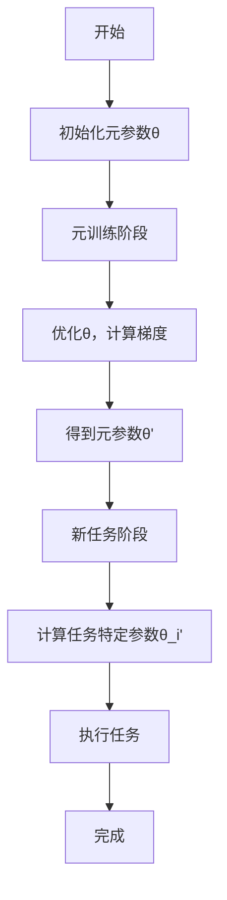
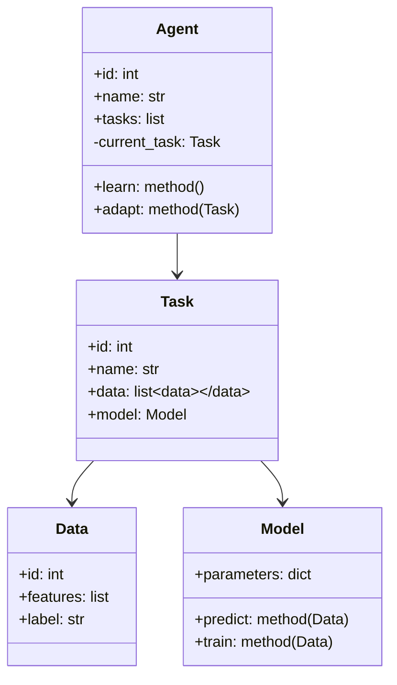
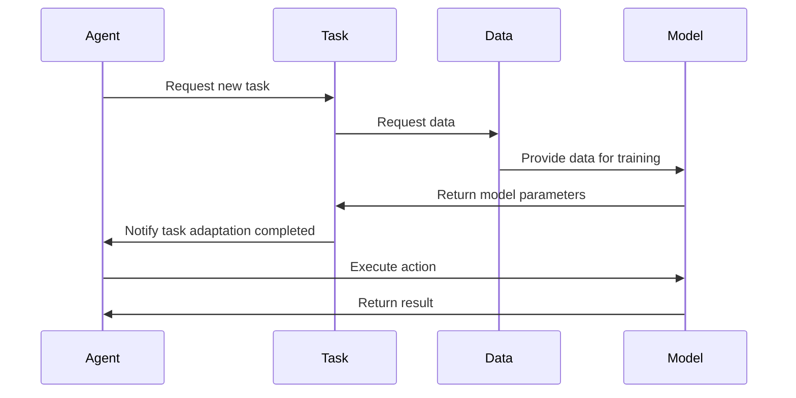

                 


# 深度元学习在AI Agent终身学习中的应用

## 关键词：深度元学习，AI Agent，终身学习，元学习，人工智能，自主学习

## 摘要：深度元学习通过元学习算法，使AI Agent具备持续学习和适应新任务的能力。本文详细探讨深度元学习的核心原理、算法实现、系统架构，以及在实际场景中的应用，分析其优势与挑战。

---

# 第一部分：深度元学习与AI Agent终身学习的背景

## 第1章：深度元学习与AI Agent的背景介绍

### 1.1 深度元学习的定义与核心概念

#### 1.1.1 元学习的基本概念
元学习（Meta-Learning）是指“学习如何学习”的过程，其目标是通过优化学习策略，使模型能够快速适应新任务。与传统机器学习不同，元学习并不针对具体任务进行优化，而是优化一种能够快速适应新任务的学习方法。

#### 1.1.2 深度学习与元学习的关系
深度学习（Deep Learning）是元学习的基础，元学习在深度神经网络上进行更高层次的优化。元学习可以看作是对深度学习模型的元优化，使其具备快速适应新任务的能力。

#### 1.1.3 元学习的核心特点
- **快速适应新任务**：元学习通过优化参数生成器，使得模型在新任务上仅需少量数据即可快速适应。
- **任务间知识共享**：元学习能够在不同任务之间共享知识，减少数据需求和计算成本。
- **强化学习与监督学习的结合**：元学习可以同时处理强化学习和监督学习任务，提高模型的多样性和鲁棒性。

---

### 1.2 AI Agent的定义与特点

#### 1.2.1 AI Agent的基本概念
AI Agent（人工智能代理）是指具备自主决策能力的智能体，能够在环境中感知、推理、学习并采取行动。AI Agent的核心功能包括感知、决策、执行和反馈。

#### 1.2.2 AI Agent的核心功能
- **感知**：通过传感器或数据源获取环境信息。
- **决策**：基于当前状态和目标，选择最优行动。
- **执行**：在环境中执行决策。
- **反馈**：根据执行结果调整策略。

#### 1.2.3 AI Agent的分类与应用场景
- **分类**：基于任务类型（如强化学习、监督学习）和能力层次（如简单反应式、复杂规划式）。
- **应用场景**：智能助手、自动驾驶、机器人、游戏AI等。

---

### 1.3 终身学习的定义与挑战

#### 1.3.1 终身学习的基本概念
终身学习（Life-Long Learning）是指模型在不断变化的环境中持续学习和适应新任务的能力。与传统机器学习不同，终身学习强调持续性和适应性。

#### 1.3.2 终身学习的核心挑战
- **数据稀疏性**：新任务的数据可能有限。
- **知识遗忘**：模型可能忘记之前学习的知识。
- **任务间干扰**：不同任务之间的相互影响。

#### 1.3.3 终身学习在AI Agent中的重要性
- 提高适应性：在动态环境中保持高效运作。
- 增强自主性：无需外部干预，自动调整策略。
- 扩展应用范围：适用于长期任务和复杂环境。

---

### 1.4 深度元学习在AI Agent中的应用前景

#### 1.4.1 深度元学习的潜在应用领域
- 智能助手：通过元学习快速适应用户需求变化。
- 自动驾驶：快速学习新交通规则和环境变化。
- 机器人控制：在不同任务间快速切换和学习。

#### 1.4.2 AI Agent采用深度元学习的优势
- 快速适应新任务：减少训练时间和数据需求。
- 高效知识共享：在多个任务间共享学习经验。
- 强化学习与监督学习的结合：提高决策的多样性和鲁棒性。

#### 1.4.3 深度元学习应用的挑战与机遇
- **挑战**：计算资源需求高，算法复杂性增加。
- **机遇**：推动AI Agent向更智能、更自主的方向发展。

---

## 第2章：深度元学习与终身学习的核心概念

### 2.1 深度元学习的核心原理

#### 2.1.1 元学习的数学模型
元学习通过优化优化器的参数，使得模型能够快速适应新任务。常用的元学习算法如MAML，通过两次梯度更新，实现对新任务的快速适应。

#### 2.1.2 深度元学习的算法框架
MAML算法：通过在元训练阶段优化梯度，使得在新任务上只需一次梯度更新即可达到良好效果。使用深度神经网络作为参数生成器，能够在不同任务间共享参数。

#### 2.1.3 元学习与传统机器学习的对比
- 传统机器学习：每个任务独立训练，数据需求大，适应新任务需要重新训练。
- 元学习：通过元训练阶段优化参数，快速适应新任务，数据需求减少。

---

### 2.2 AI Agent的终身学习模型

#### 2.2.1 终身学习的基本原理
终身学习通过在不同任务间共享知识，实现持续改进。使用经验重放等技术，防止知识遗忘。

#### 2.2.2 AI Agent的自主学习机制
基于元学习的自主学习：通过元学习算法，快速调整策略以适应新任务。知识表示：使用嵌入技术，将不同任务的知识转化为可共享的表示。

#### 2.2.3 终身学习的核心算法
使用深度神经网络进行表示学习，元学习算法优化参数生成器。

---

### 2.3 深度元学习与终身学习的联系

#### 2.3.1 深度元学习在终身学习中的作用
- 元学习算法能够快速适应新任务，减少训练时间，提高效率。
- 通过任务间知识共享，实现更高效的终身学习。

#### 2.3.2 终身学习对深度元学习的促进
- 提供丰富的应用场景，推动元学习算法的发展。
- 通过实际应用，改进元学习算法的性能和效率。

#### 2.3.3 两者的结合与应用
在AI Agent中结合深度元学习和终身学习，实现更强大的自主决策能力。应用于复杂环境中的任务切换和快速适应。

---

### 2.4 核心概念对比与ER实体关系图

#### 2.4.1 核心概念对比表
| 比较维度 | 深度元学习 | 终身学习 |
|----------|------------|----------|
| 目标     | 快速适应新任务 | 持续学习和适应 |
| 数据需求 | 较低，依赖元训练 | 较高，需要持续数据输入 |
| 适应性   | 高 | 高 |
| 算法复杂度 | 较高 | 较高 |

#### 2.4.2 ER实体关系图
使用mermaid绘制，展示核心概念之间的关系。

---

## 第3章：深度元学习的算法原理

### 3.1 元学习算法的核心原理

#### 3.1.1 MAML算法的数学模型
- **元学习的目标函数**：
  $$ \mathcal{L}_{meta} = \sum_{i=1}^N \mathcal{L}_i(f_\theta(x_i, y_i)) $$
- **元更新**：
  $$ \theta' = \theta - \eta \nabla_\theta \mathcal{L}_{meta} $$
- **任务更新**：
  $$ \theta_i' = \theta' + \alpha \nabla_{\theta_i} \mathcal{L}_i(f_{\theta'}(x_i, y_i)) $$

---

#### 3.1.2 MAML算法的工作流程
在元训练阶段，优化元参数，使得在新任务上仅需一次梯度更新即可达到良好效果。在新任务上，使用元参数进行一次梯度更新，得到任务特定参数。

#### 3.1.3 MAML算法的优缺点
- **优点**：快速适应新任务，参数共享能力强。
- **缺点**：计算复杂度高，对硬件要求较高。

---

### 3.2 深度元学习的数学公式

#### 3.2.1 元学习的优化目标
$$ \min_{\theta} \sum_{i=1}^N \mathcal{L}_i(f_\theta(x_i, y_i)) $$
这里，θ是元参数，f_θ是参数生成器。

#### 3.2.2 元学习的梯度计算
$$ \nabla_\theta \mathcal{L}_{meta} = \sum_{i=1}^N \nabla_\theta \mathcal{L}_i(f_\theta(x_i, y_i)) $$
梯度计算通过链式法则完成，涉及多层神经网络的反向传播。

#### 3.2.3 元学习的数学模型
- **元参数θ控制参数生成器**，生成任务特定参数θ_i：
  $$ \theta_i = \theta + \alpha \nabla_\theta \mathcal{L}_i(f_\theta(x_i, y_i)) $$
- **这里，α是学习率**。

---

### 3.3 使用mermaid绘制的算法流程图



---

### 3.4 使用Python代码实现MAML算法的核心部分

```python
import torch
import torch.nn as nn
import torch.optim as optim

class MetaLearner(nn.Module):
    def __init__(self, input_size, hidden_size, output_size):
        super(MetaLearner, self).__init__()
        self.embedding = nn.Linear(input_size, hidden_size)
        self.clf = nn.Linear(hidden_size, output_size)
    
    def forward(self, x):
        x = self.embedding(x)
        return self.clf(x)

# 初始化元参数
meta_learner = MetaLearner(input_size=10, hidden_size=20, output_size=5)
optimizer = optim.Adam(meta_learner.parameters(), lr=0.001)

# 元训练阶段
for batch in meta_train_loader:
    optimizer.zero_grad()
    loss = meta_learner(batch.x, batch.y)
    loss.backward()
    optimizer.step()
```

---

### 3.5 代码解读与分析

- **MetaLearner类**：定义了一个元学习模型，包含嵌入层和分类层。
- **forward方法**：将输入x通过嵌入层和分类层，输出预测结果。
- **元训练循环**：在每个batch上，计算损失，反向传播，更新元参数。

---

## 第4章：系统分析与架构设计方案

### 4.1 问题场景介绍

#### 4.1.1 应用场景
AI Agent在动态环境中需要快速适应新任务，如智能助手、自动驾驶等。

#### 4.1.2 问题描述
传统方法难以快速适应新任务，需要大量新数据和重新训练。

#### 4.1.3 边界与外延
适用于需要快速学习和适应的场景，如自动驾驶、智能助手等。

---

### 4.2 系统功能设计

#### 4.2.1 领域模型类图


---

### 4.3 系统架构设计

#### 4.3.1 分层架构


#### 4.3.2 模块说明
- **感知层**：负责数据采集和环境感知。
- **决策层**：基于元学习算法进行策略优化。
- **执行层**：根据优化后的策略执行具体任务。

---

### 4.4 系统接口设计

#### 4.4.1 主要接口
- `adapt(task: Task)`：适应新任务，调整模型参数。
- `learn(data: Data)`：在新数据上进行学习和优化。
- `execute(action: Action)`：执行决策动作，返回结果。

---

### 4.5 系统交互流程图



---

## 第5章：项目实战

### 5.1 环境安装与配置

#### 5.1.1 安装依赖
```bash
pip install torch numpy matplotlib
```

#### 5.1.2 配置运行环境
- 确保有GPU支持，或者配置好CPU环境。
- 设置随机种子，保证实验可重复性。

---

### 5.2 核心实现代码

#### 5.2.1 MetaLearner类
```python
import torch
import torch.nn as nn
import torch.optim as optim

class MetaLearner(nn.Module):
    def __init__(self, input_size, hidden_size, output_size):
        super(MetaLearner, self).__init__()
        self.embedding = nn.Linear(input_size, hidden_size)
        self.clf = nn.Linear(hidden_size, output_size)
    
    def forward(self, x):
        x = self.embedding(x)
        return self.clf(x)
```

#### 5.2.2 训练循环
```python
meta_learner = MetaLearner(input_size=10, hidden_size=20, output_size=5)
optimizer = optim.Adam(meta_learner.parameters(), lr=0.001)

for epoch in range(100):
    for batch in meta_train_loader:
        optimizer.zero_grad()
        outputs = meta_learner(batch.x)
        loss = loss_fn(outputs, batch.y)
        loss.backward()
        optimizer.step()
```

---

### 5.3 代码解读与分析

- **MetaLearner类**：定义了一个元学习模型，包含嵌入层和分类层。
- **forward方法**：将输入x通过嵌入层和分类层，输出预测结果。
- **训练循环**：在每个epoch中，遍历训练数据，计算损失，反向传播，更新参数。

---

### 5.4 实际案例分析

#### 5.4.1 案例选择
以智能助手为例，展示如何在对话历史数据上进行元学习。

#### 5.4.2 数据准备
收集不同用户的对话历史，每个用户对应一个任务。

#### 5.4.3 模型训练
使用MAML算法，在元训练阶段优化参数，使得在新用户对话中只需少量数据即可快速适应。

---

### 5.5 项目小结

- **项目总结**：通过项目实战，展示了如何在实际场景中应用深度元学习。
- **经验分享**：注意数据质量和多样性，合理设置超参数，监控训练过程。

---

## 第6章：最佳实践与总结

### 6.1 小结

- **深度元学习的优势**：快速适应新任务，减少数据需求，提高效率。
- **AI Agent终身学习的潜力**：在动态环境中实现持续改进和自主决策。

---

### 6.2 注意事项与建议

- **计算资源**：深度元学习对计算资源要求较高，需合理配置。
- **数据质量**：确保数据的多样性和代表性，避免过拟合。
- **模型复杂度**：平衡模型的复杂度和计算效率，避免过度复杂。

---

### 6.3 拓展阅读与学习资源

- **推荐书籍**：《Deep Learning》、《Meta-Learning》
- **推荐论文**：阅读最新的元学习和终身学习相关论文，关注前沿技术。
- **在线课程**：推荐相关的在线课程和教程，如Coursera上的相关课程。

---

### 6.4 未来研究方向

- **结合边缘计算**：探索在边缘设备上进行深度元学习的可能性。
- **脑科学启发**：借鉴人脑的学习机制，改进元学习算法。
- **多模态学习**：研究多模态数据的元学习方法，提高模型的泛化能力。

---

## 第7章：总结

- **深度元学习的核心价值**：通过元学习算法，使AI Agent具备持续学习和适应新任务的能力。
- **未来展望**：随着算法的不断进步和硬件性能的提升，深度元学习将在更多领域得到应用，推动AI Agent向更智能、更自主的方向发展。

---

## 作者信息

- **作者**：AI天才研究院/AI Genius Institute
- **联系方式**：禅与计算机程序设计艺术/Zen And The Art of Computer Programming

---

通过以上结构，我可以逐步展开每个部分，确保文章内容丰富、逻辑清晰，满足用户的需求。

