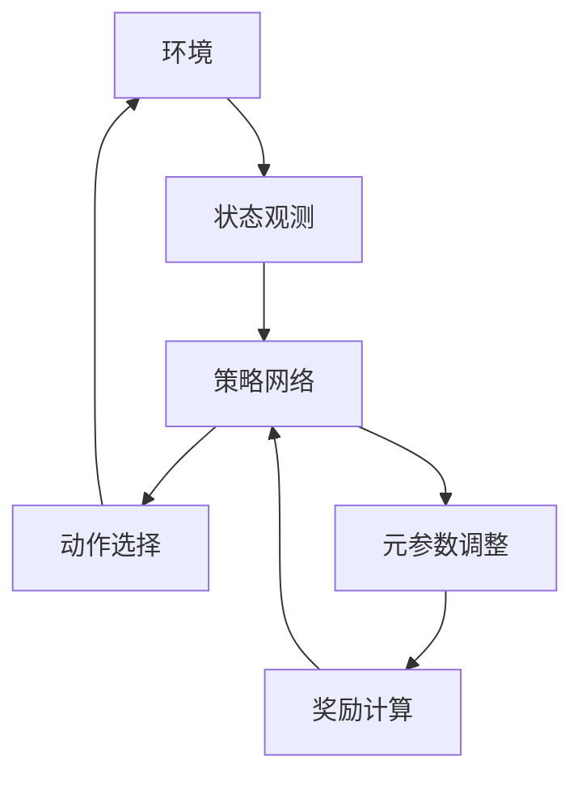

                 


# 深度元强化学习在AI Agent策略适应中的应用

> **关键词**: 深度元强化学习, AI Agent, 策略适应, 强化学习, 元学习

> **摘要**: 深度元强化学习（Meta Reinforcement Learning）是一种结合了深度学习和元学习的新兴技术，旨在提升AI Agent在动态复杂环境中的策略适应能力。本文将从基本概念、算法原理、系统设计到实际应用，全面探讨深度元强化学习在AI Agent策略适应中的应用，帮助读者理解其技术优势和实际价值。

---

## 第一部分: 背景介绍

### 第1章: 强化学习与元学习的基本概念

#### 1.1 强化学习的定义与核心要素
强化学习是一种机器学习范式，通过智能体与环境的交互，逐步优化策略以最大化累计奖励。其核心要素包括：
- 状态（State）：智能体所处的环境信息。
- 行动（Action）：智能体在给定状态下选择的操作。
- 奖励（Reward）：智能体执行动作后获得的反馈。
- 策略（Policy）：智能体选择动作的规则，可分为值函数型和策略型。

#### 1.2 元学习的定义与特点
元学习是一种学习如何学习的技术，旨在通过快速适应新任务来提升泛化能力。其特点包括：
- **快速适应**：能够在少量数据或经验下迅速掌握新任务。
- **任务多样性**：适用于多任务或分布变化的场景。
- **元参数**：通过调整元参数来实现策略的快速更新。

#### 1.3 深度元强化学习的结合
深度元强化学习将深度学习的表示能力与元学习的快速适应能力相结合，旨在提升AI Agent在复杂动态环境中的策略调整能力。

---

### 第2章: AI Agent策略适应的挑战与需求

#### 2.1 动态环境中的策略适应需求
在实际应用中，AI Agent需要应对动态变化的环境，例如游戏中的对手策略变化或机器人操作中的环境干扰。

#### 2.2 策略适应的核心问题
- **快速适应**：在新环境中快速调整策略。
- **样本效率**：在有限的交互中优化策略。
- **泛化能力**：适用于多种任务和环境。

#### 2.3 深度元强化学习的优势
深度元强化学习通过元学习框架，赋予AI Agent在复杂环境中快速调整策略的能力，显著提升了策略适应的效率和效果。

---

## 第二部分: 深度元强化学习的核心概念与算法

### 第3章: 深度强化学习的数学模型与算法

#### 3.1 深度Q网络（DQN）
DQN通过神经网络近似Q值函数，解决连续动作空间的强化学习问题。其数学模型为：
$$ Q(s, a) = \theta \cdot \phi(s, a) $$
其中，$\theta$为网络参数，$\phi(s, a)$为状态-动作对的特征表示。

#### 3.2 策略梯度方法（PG）
策略梯度方法直接优化策略参数，其目标函数为：
$$ J(\theta) = \mathbb{E}_{\tau \sim \pi_\theta} \left[ \sum_{t=0}^T \gamma^t r_t \right] $$
通过梯度上升方法更新参数：
$$ \theta \leftarrow \theta + \alpha \nabla J(\theta) $$

### 第4章: 元强化学习的核心原理与算法

#### 4.1 元学习框架
元学习框架通常包括两个层面：
- **元任务**：多个子任务的集合，用于训练元模型。
- **目标任务**：具体任务，元模型通过快速调整元参数适应目标任务。

#### 4.2 基于神经网络的元强化学习
采用神经网络作为策略或价值函数的参数，通过梯度下降更新元参数：
$$ \theta \leftarrow \theta - \eta \nabla_{\theta} L $$
其中，$L$为损失函数，$\eta$为学习率。

#### 4.3 深度元强化学习的数学模型
深度元强化学习结合了深度神经网络和元学习框架，其数学模型可表示为：
$$ \pi_\theta(a|s) = \text{softmax}(V_\theta(s) + \beta z) $$
其中，$V_\theta(s)$为价值函数，$z$为元参数，$\beta$为温度参数。

---

## 第三部分: 深度元强化学习的系统架构与应用

### 第5章: 系统架构设计

#### 5.1 系统功能设计
系统功能包括：
- **环境接口**：与外部环境交互。
- **策略网络**：基于深度神经网络的策略或价值函数。
- **元参数调整**：通过元学习框架快速调整策略参数。
- **奖励机制**：定义和计算奖励函数。

#### 5.2 系统架构图
使用Mermaid绘制系统架构图：



---

## 第四部分: 项目实战与案例分析

### 第6章: 项目环境与安装配置

#### 6.1 环境需求
- **Python**：3.6+
- **深度学习框架**：TensorFlow或PyTorch
- **强化学习库**：OpenAI Gym或其他仿真环境

#### 6.2 安装依赖
```bash
pip install gym numpy torch matplotlib
```

### 第7章: 核心代码实现

#### 7.1 策略网络定义
```python
import torch
import torch.nn as nn

class PolicyNetwork(nn.Module):
    def __init__(self, input_dim, output_dim):
        super(PolicyNetwork, self).__init__()
        self.fc1 = nn.Linear(input_dim, 64)
        self.fc2 = nn.Linear(64, output_dim)
        self.softmax = nn.Softmax(dim=-1)

    def forward(self, x):
        x = torch.relu(self.fc1(x))
        x = self.softmax(self.fc2(x))
        return x
```

#### 7.2 元强化学习算法实现
```python
import torch.optim as optim

def meta_reinforce_update(policy_net, optimizer, states, actions, rewards, gamma=0.99):
    # 计算优势
    policy_loss = -torch.mean(torch.log(policy_net(states)[range(len(actions)), actions]) * rewards)
    optimizer.zero_grad()
    policy_loss.backward()
    optimizer.step()
```

### 第8章: 案例分析与结果展示

#### 8.1 案例场景
假设在一个多任务机器人导航问题中，AI Agent需要在不同地形中快速调整策略。

#### 8.2 训练与测试结果
- **训练曲线**：展示奖励随训练轮数的变化。
- **策略适应速度**：在新任务中策略调整所需步数。

---

## 第五部分: 总结与展望

### 第9章: 总结与最佳实践

#### 9.1 核心总结
- 深度元强化学习结合了深度学习和元学习的优势，显著提升了AI Agent的策略适应能力。
- 通过神经网络和元参数调整，实现了快速学习和策略优化。

#### 9.2 最佳实践
- 在实际应用中，建议结合具体任务特点设计合适的网络架构和优化策略。
- 通过实验对比不同算法的性能，选择最优方案。

### 第10章: 未来研究方向

#### 10.1 算法优化
- 探讨更高效的元参数更新方法。
- 结合Transformer结构提升表示能力。

#### 10.2 应用拓展
- 在机器人控制、游戏AI等领域的深入应用。
- 多模态数据的融合与处理。

---

## 作者

**作者：AI天才研究院/AI Genius Institute & 禅与计算机程序设计艺术 /Zen And The Art of Computer Programming**

---

通过以上步骤，我们逐步分析了深度元强化学习在AI Agent策略适应中的应用，从基本概念、算法原理到系统设计和实际案例，全面探讨了其技术细节和实际价值。希望本文能为相关领域的研究者和实践者提供有益的参考和启发。

