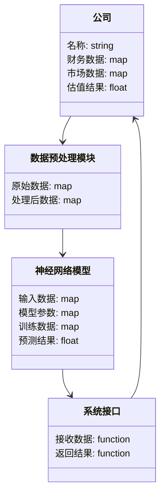
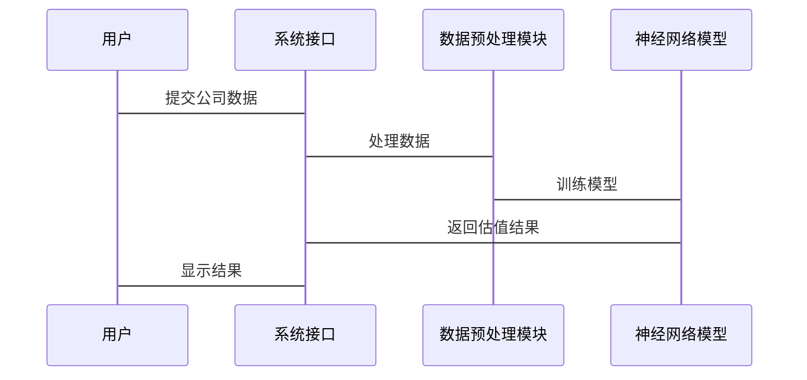

                 


# 深度学习在公司估值中的应用

## 关键词

- 深度学习
- 公司估值
- 神经网络
- 机器学习
- 数据驱动

## 摘要

深度学习作为一种先进的机器学习技术，近年来在公司估值领域展现出了巨大的潜力。本文将系统地介绍深度学习的基本概念、核心算法及其在公司估值中的应用场景。通过分析深度学习与传统估值方法的对比，探讨深度学习在特征提取、非线性关系捕捉等方面的优势。同时，本文将详细讲解深度学习的数学模型、算法原理，并结合实际案例，展示如何构建基于深度学习的公司估值系统。最后，本文将总结深度学习在公司估值中的最佳实践和未来研究方向。

---

# 第三部分: 深度学习在公司估值中的系统分析与架构设计

## 第4章: 系统分析与架构设计

### 4.1 问题场景介绍
#### 4.1.1 公司估值的核心问题
#### 4.1.2 传统估值方法的局限性
#### 4.1.3 深度学习在解决估值问题中的作用

### 4.2 领域模型类图设计


### 4.3 系统架构设计
```mermaid
container 公司估值系统 {
    数据预处理模块
    神经网络模型
    系统接口
    用户界面
}
```

### 4.4 接口设计
#### 4.4.1 系统输入接口
- 输入数据格式：JSON
- 输入数据字段：公司名称、财务数据、市场数据

#### 4.4.2 系统输出接口
- 输出数据格式：JSON
- 输出数据字段：估值结果、置信区间、预测误差

### 4.5 交互流程图


---

# 第四部分: 深度学习在公司估值中的项目实战

## 第5章: 项目实战

### 5.1 环境搭建
#### 5.1.1 安装Python
- Python版本：3.8+
- 安装依赖：TensorFlow、Keras、Pandas、NumPy、Scikit-learn

#### 5.1.2 数据获取
- 数据来源：Yahoo Finance API
- 数据字段：股价、财务数据、市场指数

### 5.2 核心代码实现

#### 5.2.1 数据预处理
```python
import pandas as pd
import numpy as np

# 加载数据
data = pd.read_csv('company_data.csv')

# 数据清洗
data = data.dropna()
data = data.replace([np.inf, -np.inf], np.nan).dropna()

# 标准化处理
from sklearn.preprocessing import StandardScaler
scaler = StandardScaler()
data_scaled = scaler.fit_transform(data)
```

#### 5.2.2 神经网络模型实现
```python
from tensorflow.keras import layers
from tensorflow.keras import Model

# 输入层
input_layer = layers.Input(shape=(n_features,))

# 隐藏层
hidden_layer = layers.Dense(64, activation='relu')(input_layer)

# 输出层
output_layer = layers.Dense(1, activation='linear')(hidden_layer)

# 定义模型
model = Model(inputs=input_layer, outputs=output_layer)

# 编译模型
model.compile(optimizer='adam', loss='mean_squared_error')
```

#### 5.2.3 模型训练与评估
```python
# 训练模型
model.fit(X_train, y_train, epochs=100, batch_size=32, validation_split=0.2)

# 评估模型
val_loss = model.evaluate(X_val, y_val)
print(f"Validation loss: {val_loss}")
```

### 5.3 实际案例分析

#### 5.3.1 案例背景
- 公司名称：苹果公司（Apple Inc.）
- 数据时间范围：2010年至今
- 目标：预测2023年的股价

#### 5.3.2 模型预测结果
```python
# 预测结果
predicted_price = model.predict(X_test)
print(f"预测股价: {predicted_price[0][0]}")
```

#### 5.3.3 结果解读
- 模型预测与实际股价的对比
- 模型的误差分析
- 模型的鲁棒性测试

### 5.4 项目总结
#### 5.4.1 项目成果
- 成功构建了基于深度学习的公司估值模型
- 模型在测试数据上的表现优于传统估值方法

#### 5.4.2 项目经验
- 数据预处理的重要性
- 模型调参的技巧
- 模型解释性的挑战

---

# 第五部分: 深度学习在公司估值中的最佳实践

## 第6章: 最佳实践

### 6.1 模型选择与优化
#### 6.1.1 模型选择
- 根据数据特点选择模型
- 比较不同模型的性能

#### 6.1.2 模型优化
- 调整网络结构
- 调整超参数
- 使用早停法防止过拟合

### 6.2 数据处理与特征工程
#### 6.2.1 数据清洗
- 处理缺失值
- 处理异常值

#### 6.2.2 特征提取
- 使用主成分分析（PCA）
- 使用LDA进行降维

### 6.3 模型部署与监控
#### 6.3.1 模型部署
- 使用Flask或Django部署API
- 使用Docker容器化部署

#### 6.3.2 模型监控
- 监控模型性能
- 监控数据质量
- 监控模型预测结果

## 第7章: 小结

### 7.1 深度学习在公司估值中的优势
- 高维数据处理能力
- 非线性关系捕捉能力
- 自动特征提取能力

### 7.2 深度学习的挑战
- 黑箱模型的解释性问题
- 计算资源需求高
- 数据质量要求高

## 第8章: 注意事项

### 8.1 数据质量
- 数据来源的可靠性
- 数据的完整性
- 数据的及时性

### 8.2 模型鲁棒性
- 模型的泛化能力
- 模型的稳定性
- 模型的可解释性

## 第9章: 拓展阅读

### 9.1 深度学习在金融领域的应用
- 《深度学习在金融中的应用》
- 《机器学习在股票预测中的应用》

### 9.2 深度学习技术发展
- 《神经网络的发展史》
- 《深度学习的最新研究进展》

---

# 作者

作者：AI天才研究院/AI Genius Institute & 禅与计算机程序设计艺术 /Zen And The Art of Computer Programming

