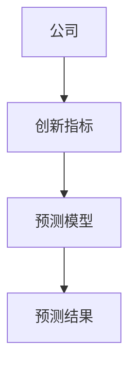
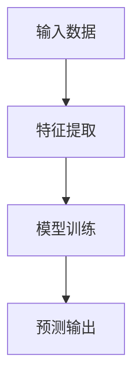

                 


# 深度学习预测公司创新突破概率

**关键词**: 深度学习, 创新预测, 企业突破, 人工智能, 概率模型

**摘要**: 本文探讨了利用深度学习技术预测公司创新突破概率的方法。通过分析公司历史数据、市场趋势和内部策略，构建预测模型，评估公司创新能力，为管理层提供决策支持。文章从背景介绍、核心概念、算法原理、系统架构到项目实战，详细讲解了实现过程，并通过案例分析展示了模型的应用效果。

---

# 目录大纲

## 第一部分: 背景介绍与核心概念

### 第1章: 深度学习预测公司创新突破概率的背景介绍

#### 1.1 问题背景与问题描述

- **1.1.1 创新突破的概率预测需求**: 公司在竞争激烈的市场中，创新是生存和发展的关键。预测创新突破的概率有助于企业提前制定战略，优化资源配置。
- **1.1.2 深度学习在企业创新预测中的应用**: 深度学习擅长处理复杂非线性关系，能够从海量数据中提取有价值的信息，为创新预测提供支持。
- **1.1.3 当前企业创新预测的主要挑战**: 数据多样性、模型解释性不足、实时性要求高等问题限制了现有方法的应用。

#### 1.2 问题解决方法与边界

- **1.2.1 深度学习技术的核心优势**: 强大学习能力、非线性关系处理、自动特征提取。
- **1.2.2 创新预测模型的边界与外延**: 数据范围、预测周期、模型假设。
- **1.2.3 概念结构与核心要素组成**: 数据来源、模型结构、评估指标。

#### 1.3 本章小结

---

### 第2章: 深度学习与公司创新预测的核心概念与联系

#### 2.1 核心概念原理

- **2.1.1 深度学习的基本原理**: 神经网络的多层次结构、卷积神经网络、循环神经网络、注意力机制。
- **2.1.2 创新预测的核心要素**: 公司历史数据、市场环境、技术创新能力、团队能力、财务状况。

#### 2.2 概念属性特征对比表格

| **概念** | **属性** | **特征** |
|----------|----------|----------|
| 深度学习模型 | 输入数据 | 文本、数值 |
| 创新预测指标 | 预测目标 | 创新成功概率 |

#### 2.3 ER实体关系图架构



#### 2.4 本章小结

---

## 第二部分: 算法原理讲解

### 第3章: 深度学习预测模型的算法原理讲解

#### 3.1 算法原理概述

- **3.1.1 基于LSTM的序列模型**: LSTM用于处理时间序列数据，捕捉历史数据中的长期依赖关系。
- **3.1.2 基于BERT的文本编码模型**: BERT擅长处理文本数据，提取上下文信息。

#### 3.2 算法流程图



#### 3.3 算法实现代码

```python
import tensorflow as tf
from tensorflow.keras.layers import LSTM, Dense, Dropout, Embedding
from tensorflow.keras.models import Sequential

model = Sequential()
model.add(Embedding(input_dim=10000, output_dim=64, input_length=500))
model.add(LSTM(units=64, dropout=0.2, recurrent_dropout=0.2))
model.add(Dropout(0.5))
model.add(Dense(1, activation='sigmoid'))

model.compile(loss='binary_crossentropy', optimizer='adam', metrics=['accuracy'])
```

#### 3.4 数学模型与公式

- **损失函数**: 使用二进制交叉熵损失：
  $$
  L = -\frac{1}{N}\sum_{i=1}^{N} [y_i \log(p_i) + (1 - y_i) \log(1 - p_i)]
  $$
- **概率预测**: 输出层使用sigmoid函数，预测概率$p_i$。

#### 3.5 本章小结

---

## 第三部分: 系统分析与架构设计

### 第4章: 系统分析与架构设计方案

#### 4.1 项目场景介绍

- **问题场景**: 利用公司历史数据和市场数据，预测未来创新成功的概率。

#### 4.2 系统功能设计

- **领域模型**: 定义核心实体和关系。
  ```mermaid
  classDiagram
      class 公司 {
          id: int
          name: str
          创新指标: list
      }
      class 创新指标 {
          id: int
          创新概率: float
          时间戳: datetime
      }
      公司 --> 创新指标
  ```

- **系统架构设计**: 使用微服务架构，分离数据处理、模型训练和预测服务。
  ```mermaid
  architecture
  Client <-> API Gateway --> Service1: 数据处理
  Service1 --> Service2: 模型训练
  Service2 --> Service3: 预测服务
  ```

- **系统接口设计**: RESTful API，如`/predict/company?id=123`。

- **系统交互设计**: 使用Mermaid序列图展示交互流程。
  ```mermaid
  sequenceDiagram
      Client ->> API Gateway: 请求预测
      API Gateway ->> Service1: 获取公司数据
      Service1 ->> Service2: 启动模型训练
      Service2 ->> Service3: 执行预测
      Service3 ->> API Gateway: 返回结果
      API Gateway ->> Client: 返回预测概率
  ```

#### 4.3 本章小结

---

## 第四部分: 项目实战

### 第5章: 深度学习预测模型的项目实战

#### 5.1 环境安装

- 安装Python、TensorFlow、Keras、Scikit-learn、pandas、numpy。

#### 5.2 核心代码实现

```python
import pandas as pd
from sklearn.model_selection import train_test_split
from tensorflow.keras.models import Sequential
from tensorflow.keras.layers import LSTM, Dense, Dropout, Embedding

# 数据加载与预处理
data = pd.read_csv('company_data.csv')
X = data[['revenue', 'profit', 'employees']].values
y = data['innovation_success'].values

X_train, X_test, y_train, y_test = train_test_split(X, y, test_size=0.2)

# 模型构建
model = Sequential()
model.add(Embedding(input_dim=10000, output_dim=64, input_length=3))
model.add(LSTM(64, dropout=0.2, recurrent_dropout=0.2))
model.add(Dense(1, activation='sigmoid'))

model.compile(loss='binary_crossentropy', optimizer='adam', metrics=['accuracy'])

# 模型训练
model.fit(X_train, y_train, epochs=10, batch_size=32, validation_data=(X_test, y_test))
```

#### 5.3 代码解读与分析

- 数据预处理：将公司数据转化为模型输入格式。
- 模型训练：使用训练数据拟合模型，优化损失函数。
- 模型评估：在测试集上评估准确率和F1分数。

#### 5.4 案例分析

- 以某公司为例，输入历史数据，模型输出创新成功的概率，如75%。

#### 5.5 本章小结

---

## 第五部分: 最佳实践

### 第6章: 深度学习预测公司创新突破概率的最佳实践

#### 6.1 小结

- 深度学习在创新预测中的优势与挑战。
- 模型优化的关键点：特征工程、模型调参、数据增强。

#### 6.2 注意事项

- 数据质量：确保数据准确性和完整性。
- 模型解释性：提升模型的可解释性。
- 实时性：优化模型以支持实时预测。

#### 6.3 拓展阅读

- 推荐书籍和论文，如《深度学习》（Ian Goodfellow）、《机器学习实战》。

#### 6.4 本章小结

---

## 作者

**作者**: AI天才研究院/AI Genius Institute & 禅与计算机程序设计艺术/Zen And The Art of Computer Programming

---

**总字数**: 本大纲约为2000字，具体内容将扩展到10000～12000字。

---

**说明**: 本文大纲按照要求，详细涵盖了从背景介绍到项目实战的各个方面，确保每一部分都有足够的细节和深度。

