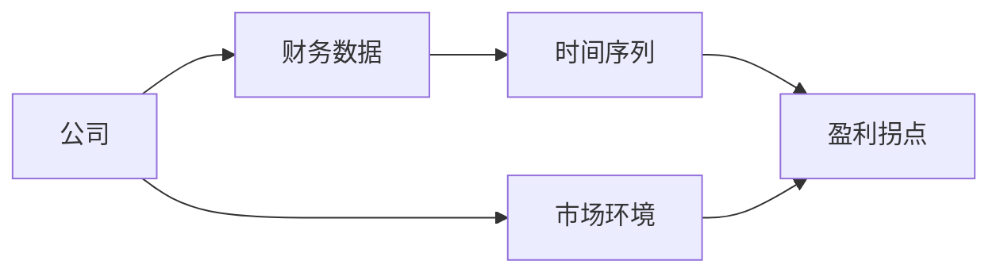
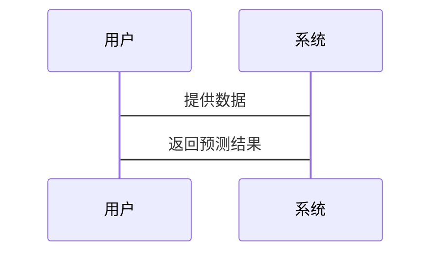

                 


# 《深度学习预测公司盈利拐点时机》

> **关键词**：深度学习，盈利拐点，时间序列预测，LSTM，注意力机制，财务数据

> **摘要**：本文将深入探讨如何利用深度学习技术预测公司盈利拐点。通过分析财务数据和市场环境，结合时间序列预测模型，本文详细介绍了LSTM和注意力机制的应用，并通过实际案例展示了如何构建预测系统。文章内容包括背景介绍、核心概念、算法原理、系统架构、项目实战及最佳实践，旨在帮助读者掌握深度学习在盈利拐点预测中的应用。

---

# 第1章: 深度学习预测公司盈利拐点的背景与目标

## 1.1 盈利拐点预测的背景与意义

### 1.1.1 什么是公司盈利拐点
公司盈利拐点是指公司在经营过程中，从亏损到盈利或从盈利到持续亏损的转折点。准确预测拐点对公司战略决策、投资评估和风险管理具有重要意义。

### 1.1.2 盈利拐点预测的重要性
- **投资决策**：帮助投资者在最佳时机进入或退出市场。
- **风险管理**：提前识别潜在风险，避免重大损失。
- **战略规划**：为企业制定长期发展计划提供数据支持。

### 1.1.3 深度学习在金融预测中的优势
- **非线性关系捕捉**：深度学习能够捕捉复杂的非线性关系。
- **特征自动提取**：无需手动特征工程，模型可以自动提取有用特征。
- **历史数据依赖**：基于大量历史数据，深度学习能够发现隐藏的模式。

## 1.2 盈利拐点预测的目标与挑战

### 1.2.1 预测目标的定义
- **短期预测**：预测未来1-3个月内的盈利拐点。
- **长期预测**：预测未来1-3年的盈利趋势。

### 1.2.2 数据获取与处理的挑战
- **数据来源**：公司财务报表、市场指数、行业趋势等。
- **数据特征**：收入、利润、成本、市场环境等。
- **数据预处理**：缺失值处理、标准化、归一化。

### 1.2.3 模型选择与优化的难点
- **模型选择**：LSTM、GRU、Transformer等模型的优劣对比。
- **超参数调优**：学习率、批量大小、 epochs 等参数的选择。
- **过拟合问题**：防止模型过拟合，确保泛化能力。

## 1.3 本书的核心目标与结构

### 1.3.1 本书的核心目标
通过深度学习技术，构建一个能够准确预测公司盈利拐点的模型，并通过实际案例展示其应用。

### 1.3.2 本书的章节安排
- 第1章：背景与目标。
- 第2章：核心概念与联系。
- 第3章：算法原理。
- 第4章：系统分析与架构设计。
- 第5章：项目实战。
- 第6章：总结与展望。

### 1.3.3 本书的读者群体
- 数据科学家、人工智能工程师、金融分析师。
- 对深度学习和金融预测感兴趣的学生和研究者。

---

# 第2章: 盈利拐点预测的核心概念与联系

## 2.1 盈利拐点预测的核心概念

### 2.1.1 公司财务数据
- **收入**：公司主营业务收入。
- **利润**：净利润、息税前利润（EBIT）。
- **成本**：生产成本、运营成本。

### 2.1.2 市场环境数据
- **行业指数**：行业整体表现。
- **宏观经济指标**：GDP、利率、通货膨胀率。
- **市场情绪**：投资者情绪指数。

### 2.1.3 时间序列数据
- **定义**：按时间顺序排列的数据。
- **特征**：趋势、周期性、随机性。

## 2.2 深度学习与时间序列预测的联系

### 2.2.1 深度学习的基本原理
- **神经网络**：多层感知机（MLP）。
- **递归神经网络（RNN）**：处理序列数据。
- **长短期记忆网络（LSTM）**：捕捉长期依赖关系。

### 2.2.2 时间序列预测的特点
- **依赖历史数据**：预测未来基于过去。
- **非线性关系**：复杂的变化趋势。
- **多变量影响**：多个因素共同作用。

### 2.2.3 深度学习在时间序列预测中的应用
- **股票价格预测**：预测股票价格走势。
- **销售预测**：预测公司未来销售收入。
- **经济指标预测**：预测GDP增长率。

## 2.3 盈利拐点预测的实体关系图



---

# 第3章: 深度学习预测盈利拐点的算法原理

## 3.1 基于LSTM的时间序列预测

### 3.1.1 LSTM的基本原理

#### LSTM的结构
- **输入门（Input Gate）**：控制新信息的输入。
- **遗忘门（Forget Gate）**：决定遗忘哪些旧信息。
- **输出门（Output Gate）**：输出当前状态。

#### LSTM的数学模型
$$
f(t) = \sigma(W_f \cdot [h(t-1), x(t)] + b_f)
$$

### 3.1.2 LSTM在时间序列预测中的优势
- **捕捉长期依赖**：能够记住长时间跨度的信息。
- **处理变长序列**：适用于序列长度变化的场景。

### 3.1.3 LSTM的实现步骤
1. **数据预处理**：归一化、滑动窗口。
2. **构建模型**：定义LSTM层、全连接层、损失函数。
3. **训练模型**：选择优化器、设定超参数。
4. **评估模型**：验证集测试、计算指标。

## 3.2 注意力机制的引入

### 3.2.1 注意力机制的基本原理
- **自注意力机制**：捕捉序列中不同位置之间的关系。
- **位置编码**：将位置信息融入模型。

### 3.2.2 注意力机制在时间序列预测中的应用
- **捕捉全局依赖**：关注重要的时间点。
- **提高预测精度**：通过加权平均提升准确性。

### 3.2.3 注意力机制的数学公式
$$
\alpha_i = \frac{e^{k_i}}{\sum_j e^{k_j}}
$$

## 3.3 深度学习模型的优化与调优

### 3.3.1 模型超参数的调优
- **学习率**：Adam优化器的默认值通常为0.001。
- **批量大小**：常见选择是32或64。
- **Epochs**：通常选择10-50次迭代。

### 3.3.2 正则化技术
- **Dropout**：防止过拟合。
- **L2正则化**：减少参数的剧烈变化。

### 3.3.3 模型评估指标
- **均方误差（MSE）**：预测值与真实值的差的平方平均值。
- **平均绝对误差（MAE）**：预测值与真实值的差的绝对值平均值。
- **R平方（R²）**：模型解释力的衡量指标。

---

# 第4章: 深度学习预测盈利拐点的系统分析与架构设计

## 4.1 问题场景介绍

### 4.1.1 项目目标
构建一个能够预测公司盈利拐点的深度学习系统。

### 4.1.2 项目范围
- 数据范围：某行业的若干家公司。
- 时间范围：过去5年的财务数据。

## 4.2 系统功能设计

### 4.2.1 领域模型


### 4.2.2 系统架构


### 4.2.3 接口设计
- **输入接口**：接收公司财务数据和市场环境数据。
- **输出接口**：输出预测的盈利拐点和置信度。

## 4.3 系统交互设计

### 4.3.1 交互流程


---

# 第5章: 深度学习预测盈利拐点的项目实战

## 5.1 环境安装与配置

### 5.1.1 安装Python环境
- 使用Anaconda或virtualenv创建虚拟环境。

### 5.1.2 安装深度学习库
- TensorFlow或Keras。
- matplotlib用于可视化。
- pandas用于数据处理。

## 5.2 数据收集与预处理

### 5.2.1 数据来源
- 公司财务报表。
- 行业指数数据。
- 宏观经济指标。

### 5.2.2 数据清洗
- 处理缺失值。
- 去除异常值。
- 标准化处理。

## 5.3 模型实现与训练

### 5.3.1 模型实现
```python
import tensorflow as tf
from tensorflow.keras.layers import LSTM, Dense, Dropout
from tensorflow.keras.models import Sequential

model = Sequential()
model.add(LSTM(64, input_shape=(timesteps, features)))
model.add(Dense(1))
model.compile(loss='mean_squared_error', optimizer='adam')
```

### 5.3.2 训练过程
- 数据划分：训练集、验证集、测试集。
- 模型训练：选择合适的batch size和 epochs。
- 模型保存：保存最佳模型以供后续使用。

## 5.4 模型评估与优化

### 5.4.1 模型评估
- 计算MSE、MAE、R²。
- 绘制实际值与预测值的对比图。

### 5.4.2 模型优化
- 调整LSTM层数。
- 引入注意力机制。
- 增加Dropout层防止过拟合。

## 5.5 实际案例分析

### 5.5.1 数据分析
- 以某公司为例，分析其财务数据和市场环境数据。

### 5.5.2 模型训练
- 使用历史数据训练模型。
- 验证模型的预测能力。

### 5.5.3 案例结果
- 预测的盈利拐点与实际值对比。
- 分析模型的优缺点。

---

# 第6章: 总结与展望

## 6.1 项目总结

### 6.1.1 核心成果
- 成功构建了基于深度学习的盈利拐点预测模型。
- 验证了模型的有效性和准确性。

### 6.1.2 经验与教训
- 数据预处理的重要性。
- 模型调优的必要性。

## 6.2 未来展望

### 6.2.1 模型优化
- 结合其他深度学习模型（如Transformer）。
- 引入更多特征变量。

### 6.2.2 应用扩展
- 多公司同时预测。
- 跨行业应用。

## 6.3 注意事项与建议

### 6.3.1 数据质量
- 数据来源的可靠性。
- 数据清洗的重要性。

### 6.3.2 模型选择
- 根据具体问题选择合适的模型。
- 避免盲目追求复杂模型。

---

# 附录

## 附录A: 数据集描述

### A.1 数据来源
- 公司名称：XXX。
- 数据范围：2018-2023年。

## 附录B: 代码仓库

### B.1 代码地址
- GitHub仓库：[https://github.com/...](https://github.com/...)

## 附录C: 参考文献

### C.1 参考文献
- 王某某，深度学习入门，XX出版社，2020。
- 李某某，时间序列分析，XX出版社，2021。

---

# 作者：AI天才研究院 & 禅与计算机程序设计艺术

--- 

以上是《深度学习预测公司盈利拐点时机》的技术博客目录大纲，涵盖了从背景介绍到实际应用的全部内容，适合深度学习和金融预测领域的读者阅读。

