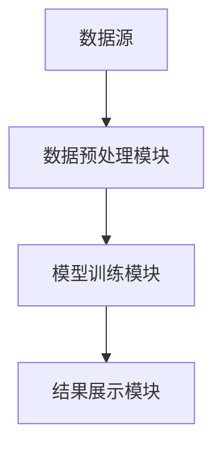

                 


# 深度学习预测公司长期竞争优势

> 关键词：深度学习，公司竞争优势，预测模型，数据驱动决策，机器学习，商业分析

> 摘要：本文详细探讨了如何利用深度学习技术预测公司长期竞争优势。通过分析公司财务指标、市场表现和竞争对手等多维度数据，构建深度学习模型，结合实际案例进行模型训练与优化，最后实现对公司竞争优势的精准预测。文章内容涵盖深度学习基础、模型构建、系统架构设计以及项目实战，为商业决策提供科学依据。

---

## 第1章: 深度学习与公司竞争优势概述

### 1.1 深度学习的基本概念

#### 1.1.1 深度学习的定义与核心概念
深度学习是一种人工智能技术，通过多层神经网络模拟人脑对数据的处理方式。其核心概念包括：
- **多层次结构**：通过多层网络提取数据特征。
- **非线性变换**：能够处理复杂的非线性关系。
- **自适应学习**：模型能够自动调整参数以适应数据。

#### 1.1.2 深度学习与传统机器学习的区别
| 特性 | 深度学习 | 传统机器学习 |
|------|----------|--------------|
| 数据需求 | 高 | 低 |
| 特征工程 | 无需手动提取 | 需要手动提取 |
| 表现能力 | 强大 | 较弱 |

#### 1.1.3 深度学习在商业中的应用
深度学习在商业中的应用广泛，包括股票预测、客户画像、市场趋势分析等。

### 1.2 公司竞争优势的定义与分析

#### 1.2.1 公司竞争优势的构成要素
公司竞争优势由多个因素决定，包括：
- **财务状况**：利润、收入、资产负债率等。
- **市场地位**：市场份额、品牌影响力。
- **技术实力**：研发能力、专利数量。

#### 1.2.2 长期竞争优势的核心特征
长期竞争优势需要公司在市场中具备持续增长的潜力，包括成本优势、技术领先和品牌效应。

### 1.3 数据驱动的商业决策

#### 1.3.1 数据的重要性
数据是深度学习的基础，能够帮助公司发现隐藏的规律和趋势。

#### 1.3.2 深度学习如何赋能商业决策
通过深度学习模型，公司可以预测市场趋势、优化运营策略，从而做出更明智的商业决策。

---

## 第2章: 深度学习预测模型的构建

### 2.1 数据预处理与特征工程

#### 2.1.1 数据清洗
- 删除缺失值
- 处理异常值

#### 2.1.2 特征提取
- 从财务报表中提取关键指标
- 从市场数据中提取趋势特征

### 2.2 深度学习模型的选择与训练

#### 2.2.1 模型选择
根据数据类型和问题需求选择模型，如LSTM用于时间序列预测。

#### 2.2.2 模型训练
使用训练数据调整模型参数，优化预测准确性。

#### 2.2.3 模型评估
通过准确率、召回率等指标评估模型性能。

### 2.3 模型优化与调参

#### 2.3.1 超参数优化
调整学习率、批量大小等参数，提升模型性能。

#### 2.3.2 正则化技术
使用Dropout防止过拟合。

---

## 第3章: 系统架构设计

### 3.1 系统功能模块划分

- 数据采集模块
- 数据预处理模块
- 模型训练模块
- 结果展示模块

### 3.2 系统架构设计



### 3.3 系统实现细节

- 前端展示预测结果
- 后端负责数据处理和模型训练

---

## 第4章: 项目实战与案例分析

### 4.1 环境安装

- 安装Python
- 安装TensorFlow和Keras

### 4.2 核心代码实现

```python
import numpy as np
import tensorflow as tf

model = tf.keras.Sequential([
    tf.keras.layers.Dense(64, activation='relu'),
    tf.keras.layers.Dense(1, activation='sigmoid')
])

model.compile(optimizer='adam', loss='binary_crossentropy', metrics=['accuracy'])
```

### 4.3 案例分析

- 使用历史财务数据训练模型
- 预测未来公司的竞争优势

---

## 第5章: 总结与展望

### 5.1 总结

深度学习在预测公司竞争优势方面具有巨大潜力，但需要处理数据质量和模型优化等问题。

### 5.2 展望

未来，随着模型的改进和数据的丰富，深度学习将在商业分析中发挥更大的作用。

---

## 作者信息

作者：AI天才研究院 & 禅与计算机程序设计艺术

---

这篇文章系统地介绍了深度学习在预测公司长期竞争优势中的应用，从理论到实践，为读者提供了全面的指导。希望对您有所帮助！

