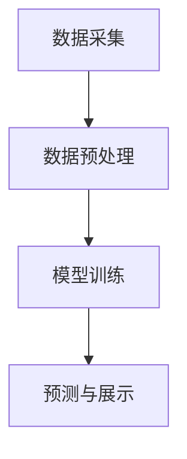

                 


# 深度学习预测长期股东回报率

> **关键词**: 深度学习, 股东回报率, 预测模型, 人工智能, 金融分析

> **摘要**: 本文探讨了利用深度学习技术预测长期股东回报率的方法。通过分析深度学习模型的原理，结合实际案例，展示了如何构建有效的预测系统，并提供了最佳实践和优化建议。

---

## 目录

1. [背景介绍](#背景介绍)
2. [核心概念与联系](#核心概念与联系)
3. [算法原理](#算法原理)
4. [系统架构设计](#系统架构设计)
5. [项目实战](#项目实战)
6. [最佳实践与总结](#最佳实践与总结)

---

## 背景介绍

### 1.1 深度学习的基本概念

深度学习是一种基于人工神经网络的机器学习技术，通过多层非线性变换模拟人脑的神经网络，实现对数据的高层次特征提取。

**特点**：
- **层次化特征提取**：通过多层网络提取数据的高层次特征。
- **非线性建模**：能够处理复杂的非线性关系。
- **自动特征学习**：无需手动特征工程，自动从数据中学习特征。

### 1.2 股东回报率预测的背景与意义

股东回报率（股东收益）是衡量公司投资价值的重要指标，预测其回报率对投资者决策至关重要。传统方法（如回归分析）在处理复杂金融市场数据时表现有限，深度学习的引入提供了更强大的预测能力。

---

## 核心概念与联系

### 2.1 深度学习模型的核心原理

深度学习模型通过多层网络结构，从输入数据中提取高层次特征，捕捉数据中的复杂模式。

**数学公式**：
$$
y = f(x) = \sigma(W_2 \cdot f_1(W_1 \cdot x + b_1) + b_2)
$$
其中，$f_1$和$\sigma$分别是激活函数，$W$和$b$是权重和偏置。

### 2.2 深度学习模型与股东回报率预测的关系

深度学习擅长处理时间序列数据，能够捕捉股票价格的波动模式。通过训练模型识别这些模式，可以预测未来的股东回报率。

---

## 算法原理

### 3.1 常见的深度学习算法

- **多层感知机（MLP）**：适用于简单分类任务。
- **长短期记忆网络（LSTM）**：适合处理时间序列数据。
- **图神经网络（GNN）**：用于处理图结构数据。

### 3.2 基于LSTM的股东回报率预测模型

LSTM通过门控机制捕捉长期依赖关系，适合股票价格预测。

**LSTM结构**：
$$
i = \sigma(W_i x + U_i h_{prev})
$$
$$
f = \sigma(W_f x + U_f h_{prev})
$$
$$
o = \sigma(W_o x + U_o h_{prev})
$$
$$
g = \tanh(W_g x + U_g h_{prev})
$$
$$
h = o \cdot (g + i \cdot c_{prev})
$$

---

## 系统架构设计

### 4.1 系统功能设计

- **数据采集模块**：获取股票数据。
- **数据预处理模块**：清洗和归一化数据。
- **模型训练模块**：训练深度学习模型。
- **预测与展示模块**：生成预测结果并展示。

### 4.2 系统架构图



---

## 项目实战

### 5.1 环境配置

安装必要的库：
```bash
pip install numpy pandas tensorflow matplotlib
```

### 5.2 数据预处理

加载数据并归一化：
```python
import pandas as pd
import numpy as np

data = pd.read_csv('stock_data.csv')
data = data[['close']]
data = (data - data.min()) / (data.max() - data.min())
```

### 5.3 模型实现

构建LSTM模型：
```python
import tensorflow as tf
from tensorflow.keras import layers

model = tf.keras.Sequential()
model.add(layers.LSTM(64, input_shape=(None, 1)))
model.add(layers.Dense(1))
model.compile(loss='mean_squared_error', optimizer='adam')
```

### 5.4 结果分析

训练模型并评估性能：
```python
model.fit(X_train, y_train, epochs=100, batch_size=32)
loss = model.evaluate(X_test, y_test)
print(f'损失: {loss}')
```

---

## 最佳实践与总结

### 6.1 小结

深度学习在预测股东回报率方面展现出强大的能力，尤其是LSTM模型在时间序列数据上的优势。

### 6.2 注意事项

- 数据质量：确保数据清洗和归一化。
- 模型调优：尝试不同的超参数和模型结构。
- 风险管理：模型预测需结合其他分析手段。

### 6.3 未来展望

结合多模态数据（如新闻 sentiment）和更复杂的模型（如Transformer）进一步提升预测精度。

---

## 作者

作者：AI天才研究院 & 禅与计算机程序设计艺术

---

以上是完整的技术博客文章，涵盖从理论到实践的各个方面，帮助读者全面理解如何利用深度学习技术预测长期股东回报率。

