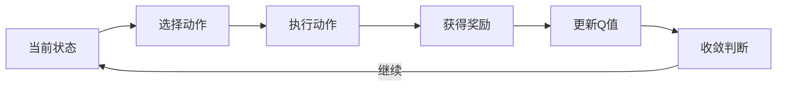
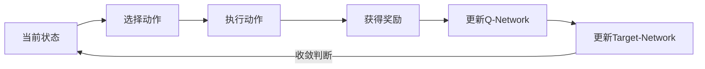
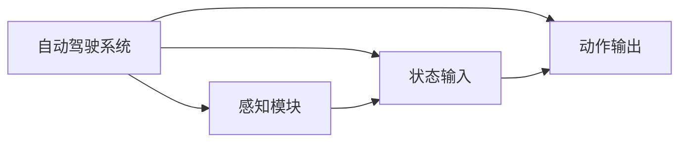
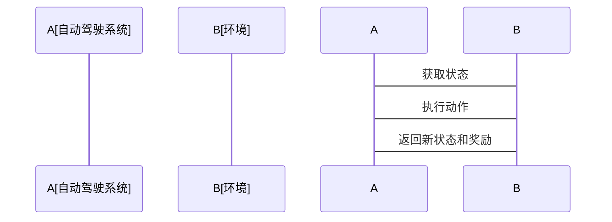

                 


```markdown
# 深度强化学习在AI Agent决策优化中的应用

> 关键词：深度强化学习、AI Agent、决策优化、强化学习算法、系统架构设计

> 摘要：本文深入探讨了深度强化学习（Deep Reinforcement Learning，DRL）在AI Agent决策优化中的应用。通过分析DRL的核心概念、算法原理、系统架构设计以及实际项目案例，本文旨在帮助读者全面理解DRL在AI Agent中的重要作用，并掌握如何将其应用于实际问题中。文章内容涵盖从理论基础到实践应用的完整链条，适合对AI Agent和深度强化学习感兴趣的读者阅读。

---

## 第一部分: 深度强化学习基础

### 第1章: 深度强化学习的起源与核心概念

#### 1.1 深度强化学习的起源
深度强化学习（Deep Reinforcement Learning, DRL）是人工智能领域的重要分支，结合了深度学习和强化学习的优势。随着计算能力的提升和算法的不断优化，DRL在近年来取得了显著进展。本文将从强化学习的基本概念出发，逐步深入到深度强化学习的核心原理，并探讨其在AI Agent决策优化中的应用。

##### 1.1.1 从强化学习到深度强化学习的演进
- **强化学习的定义**：强化学习是一种基于奖励机制的机器学习方法，通过智能体与环境的交互来优化策略。
- **深度强化学习的演变**：随着神经网络的发展，强化学习引入了深度学习技术，从而能够处理更复杂的任务。
- **AI Agent的决策优化**：AI Agent需要在复杂环境中做出最优决策，强化学习为其提供了一种基于试错的优化方法。

##### 1.1.2 深度强化学习的核心思想
- **状态（State）**：智能体所处环境的描述。
- **动作（Action）**：智能体在状态下的选择。
- **奖励（Reward）**：智能体执行动作后获得的反馈。
- **策略（Policy）**：智能体选择动作的规则。

##### 1.1.3 AI Agent决策优化的背景与意义
- **AI Agent的应用场景**：自动驾驶、机器人控制、游戏AI、智能推荐系统等。
- **决策优化的核心问题**：如何在复杂环境中做出最优决策，同时平衡探索与利用。

#### 1.2 强化学习的基本概念
##### 1.2.1 状态、动作、奖励的定义
- **状态（State）**：智能体所处环境的当前情况，例如在迷宫中，状态可以是当前位置。
- **动作（Action）**：智能体在状态下的选择，例如“左转”或“右转”。
- **奖励（Reward）**：智能体执行动作后获得的反馈，例如“+1”表示正确动作，“-1”表示错误动作。

##### 1.2.2 策略与价值函数的解释
- **策略（Policy）**：策略是智能体选择动作的概率分布，可以用数学公式表示为：$\pi(a|s)$，其中$a$是动作，$s$是状态。
- **价值函数（Value Function）**：价值函数衡量的是状态或动作-状态对的价值，通常用$V(s)$或$Q(s,a)$表示。

##### 1.2.3 探索与利用的平衡
- **探索（Exploration）**：智能体尝试新的动作以发现更好的策略。
- **利用（Exploitation）**：智能体利用已知的最佳策略来最大化奖励。

#### 1.3 深度强化学习的核心要素
##### 1.3.1 神经网络在强化学习中的作用
- 神经网络用于近似策略或价值函数，例如在DQN中，神经网络用于近似Q值函数。

##### 1.3.2 深度强化学习与传统强化学习的区别
| 特性         | 传统强化学习 | 深度强化学习 |
|--------------|--------------|--------------|
| 表示方法     | 离散状态空间 | 连续状态空间 |
| 模型复杂度   | 简单         | 复杂         |
| 应用场景     | 小规模任务   | 大规模任务   |

##### 1.3.3 AI Agent决策优化的数学基础
- **马尔可夫决策过程（MDP）**：定义了智能体与环境交互的数学模型，包括状态、动作、转移概率和奖励函数。
- **贝尔曼方程**：描述了价值函数的递归性质，$V(s) = \max_a [r(s,a) + \gamma V(s')]$。

---

### 第2章: 深度强化学习的核心概念与联系

#### 2.1 深度强化学习的核心原理
##### 2.1.1 状态空间的表示
- **离散状态空间**：有限数量的状态，例如在棋盘游戏中，每个位置是一个状态。
- **连续状态空间**：无限数量的状态，例如在机器人导航中，位置和方向是连续的。

##### 2.1.2 动作空间的建模
- **离散动作空间**：有限数量的动作，例如在游戏控制中，可能的动作是“左”、“右”、“上”、“下”。
- **连续动作空间**：无限数量的动作，例如在自动驾驶中，转向角度可以是连续的。

##### 2.1.3 奖励函数的设计
- **奖励的设计原则**：奖励函数应该明确地指导智能体的行为，避免模糊或多重目标。
- **奖励的例子**：在机器人导航中，奖励可以是“到达目标点的奖励为+1，每一步移动的奖励为-0.1”。

#### 2.2 深度强化学习的核心概念对比
##### 2.2.1 状态、动作、奖励的对比分析
| 特性   | 状态   | 动作   | 奖励   |
|--------|--------|--------|--------|
| 类型   | 离散或连续 | 离散或连续 | 数值型 |
| 作用   | 描述环境 | 行为选择 | 反馈机制 |

##### 2.2.2 策略与价值函数的对比
| 特性         | 策略（Policy） | 价值函数（Value Function） |
|--------------|----------------|-----------------------------|
| 定义         | 动作的选择概率分布 | 状态或动作-状态对的价值 |
| 表示方法     | $\pi(a|s)$      | $V(s)$ 或 $Q(s,a)$         |
| 应用场景     | 直接指导动作选择 | 用于评估策略的优劣         |

##### 2.2.3 探索与利用的对比
| 特性         | 探索（Exploration） | 利用（Exploitation） |
|--------------|---------------------|-----------------------|
| 定义         | 尝试新的动作以发现更好的策略 | 利用已知的最佳策略以最大化奖励 |
| 目的         | 扩展知识，避免局部最优 | 提高当前奖励，快速收敛到最优策略 |

#### 2.3 深度强化学习的核心联系
- **状态与动作的关系**：状态决定了动作的选择，动作影响下一个状态。
- **奖励与策略的关系**：奖励指导策略的优化，策略的选择直接影响奖励的累积。
- **策略与价值函数的关系**：策略定义了动作的选择，而价值函数衡量策略的好坏。

---

## 第3章: 深度强化学习的算法原理

### 3.1 Q-Learning算法
#### 3.1.1 算法原理
Q-Learning是一种经典的强化学习算法，适用于离散状态和动作空间。其核心思想是通过更新Q值函数来学习最优策略。

##### 3.1.2 算法步骤
1. 初始化Q表，所有Q值初始化为0。
2. 在当前状态下选择动作（探索与利用）。
3. 执行动作，观察新的状态和获得的奖励。
4. 更新Q值：$Q(s,a) = (1-\alpha)Q(s,a) + \alpha (r + \gamma \max Q(s',a'))$，其中$\alpha$是学习率，$\gamma$是折扣因子。
5. 重复步骤2-4，直到收敛。

##### 3.1.3 算法优缺点
- **优点**：简单易实现，适用于离散状态和动作空间。
- **缺点**：在连续状态和动作空间中表现不佳，需要离散化处理。

#### 3.1.4 Mermaid流程图


#### 3.1.5 Python代码实现
```python
import numpy as np

# 初始化Q表
Q = np.zeros((num_states, num_actions))

# 定义参数
alpha = 0.1
gamma = 0.9

# Q-Learning算法
for episode in range(num_episodes):
    state = initial_state
    while not done:
        # 选择动作
        if np.random.random() < epsilon:
            action = np.random.randint(num_actions)
        else:
            action = np.argmax(Q[state])
        
        # 执行动作，获得新的状态和奖励
        next_state, reward = step(state, action)
        
        # 更新Q值
        Q[state, action] = Q[state, action] * (1 - alpha) + alpha * (reward + gamma * np.max(Q[next_state]))
        
        state = next_state
```

---

### 3.2 Deep Q-Networks（DQN）算法
#### 3.2.1 算法原理
DQN通过使用深度神经网络近似Q值函数，适用于连续状态和动作空间。

##### 3.2.2 算法步骤
1. 初始化神经网络Q-Network和目标网络Target-Network。
2. 在当前状态下选择动作（探索与利用）。
3. 执行动作，观察新的状态和获得的奖励。
4. 更新Q-Network：$\hat{Q}(s,a) = r + \gamma \max Q(s')$。
5. 定期更新Target-Network：将Q-Network的权重复制到Target-Network。

##### 3.2.3 算法优缺点
- **优点**：适用于连续状态和动作空间，能够处理高维问题。
- **缺点**：需要设计合适的神经网络结构，训练过程复杂。

#### 3.2.4 Mermaid流程图


#### 3.2.5 Python代码实现
```python
import torch
import torch.nn as nn
import torch.optim as optim

# 定义DQN网络
class DQN(nn.Module):
    def __init__(self, input_dim, output_dim):
        super(DQN, self).__init__()
        self.fc1 = nn.Linear(input_dim, 64)
        self.fc2 = nn.Linear(64, 64)
        self.fc3 = nn.Linear(64, output_dim)
    
    def forward(self, x):
        x = torch.relu(self.fc1(x))
        x = torch.relu(self.fc2(x))
        x = self.fc3(x)
        return x

# 初始化网络
policy_net = DQN(input_dim, output_dim)
target_net = DQN(input_dim, output_dim)
optimizer = optim.Adam(policy_net.parameters(), lr=0.001)

# DQN算法
for episode in range(num_episodes):
    state = initial_state
    while not done:
        # 选择动作
        if np.random.random() < epsilon:
            action = np.random.randint(output_dim)
        else:
            with torch.no_grad():
                action = torch.argmax(policy_net(torch.tensor(state))).item()
        
        # 执行动作，获得新的状态和奖励
        next_state, reward = step(state, action)
        
        # 更新Q-Network
        optimizer.zero_grad()
        current_q = policy_net(torch.tensor(state))
        next_q = policy_net(torch.tensor(next_state))
        target_q = torch.max(next_q.data)
        loss = nn.MSELoss()(current_q, torch.tensor(reward + gamma * target_q))
        loss.backward()
        optimizer.step()
        
        # 更新Target-Network
        if episode % update_target == 0:
            target_net.load_state_dict(policy_net.state_dict())
        
        state = next_state
```

---

## 第4章: 深度强化学习的系统分析与架构设计

### 4.1 问题场景介绍
假设我们正在开发一个自动驾驶系统，AI Agent需要在复杂的交通环境中做出最优决策，例如转向、加速或减速。

### 4.2 系统功能设计
#### 4.2.1 领域模型（Domain Model）
| 实体   | 属性         | 关系       |
|--------|--------------|------------|
| 状态   | 当前位置、速度、障碍物位置 | -         |
| 动作   | 转向、加速、减速 | -         |
| 奖励   | 安全到达目标点、碰撞惩罚 | -         |

#### 4.2.2 系统架构设计


#### 4.2.3 接口设计
- **输入接口**：接收传感器数据（如激光雷达、摄像头）。
- **输出接口**：发送控制指令（如转向角度、车速）。

#### 4.2.4 交互设计


### 4.3 项目实战
#### 4.3.1 环境安装
- 安装必要的库：`pip install numpy torch gym`

#### 4.3.2 系统核心实现源代码
```python
import gym
import torch
import torch.nn as nn
import torch.optim as optim

# 定义DQN网络
class DQN(nn.Module):
    def __init__(self, input_dim, output_dim):
        super(DQN, self).__init__()
        self.fc1 = nn.Linear(input_dim, 64)
        self.fc2 = nn.Linear(64, 64)
        self.fc3 = nn.Linear(64, output_dim)
    
    def forward(self, x):
        x = torch.relu(self.fc1(x))
        x = torch.relu(self.fc2(x))
        x = self.fc3(x)
        return x

# 初始化环境和网络
env = gym.make('CartPole-v1')
policy_net = DQN(env.observation_space.shape[0], env.action_space.n)
target_net = DQN(env.observation_space.shape[0], env.action_space.n)
optimizer = optim.Adam(policy_net.parameters(), lr=0.001)

# DQN算法
num_episodes = 1000
update_target = 100
gamma = 0.99
epsilon = 0.1

for episode in range(num_episodes):
    state = env.reset()
    while True:
        # 选择动作
        if np.random.random() < epsilon:
            action = env.action_space.sample()
        else:
            with torch.no_grad():
                action = torch.argmax(policy_net(torch.tensor(state))).item()
        
        # 执行动作，获得新的状态和奖励
        next_state, reward, done, info = env.step(action)
        
        # 更新Q-Network
        optimizer.zero_grad()
        current_q = policy_net(torch.tensor(state))
        next_q = policy_net(torch.tensor(next_state))
        target_q = torch.max(next_q.data)
        loss = nn.MSELoss()(current_q, torch.tensor(reward + gamma * target_q))
        loss.backward()
        optimizer.step()
        
        # 更新Target-Network
        if episode % update_target == 0:
            target_net.load_state_dict(policy_net.state_dict())
        
        state = next_state
        if done:
            break

env.close()
```

#### 4.3.3 实际案例分析
- **案例分析**：在CartPole-v1环境中，智能体需要通过左右移动杆子来保持平衡。
- **训练结果**：智能体在经过多次训练后，能够成功保持杆子平衡，获得更高的奖励。

---

## 第5章: 深度强化学习的高级应用与未来趋势

### 5.1 深度强化学习的高级应用
#### 5.1.1 自动驾驶
- **应用领域**：路径规划、障碍物 avoidance。
#### 5.1.2 智能推荐系统
- **应用领域**：个性化推荐、用户行为预测。
#### 5.1.3 多智能体系统
- **应用领域**：游戏AI、机器人协作。

### 5.2 深度强化学习的未来趋势
- **算法优化**：更加高效的学习算法，例如基于梯度的优化方法。
- **多智能体协作**：研究多个智能体之间的协作与竞争。
- **人机协作**：强化学习与人类决策的结合。

---

## 第6章: 总结与展望

### 6.1 总结
深度强化学习通过结合深度学习和强化学习的优势，在AI Agent决策优化中展现了巨大的潜力。本文从理论基础到实践应用，详细探讨了DRL的核心概念、算法原理和系统设计，为读者提供了一条从入门到实践的学习路径。

### 6.2 展望
未来，随着计算能力的提升和算法的不断优化，深度强化学习将在更多领域得到应用，例如自动驾驶、智能机器人和智能推荐系统。同时，如何解决强化学习中的探索与利用问题，以及如何设计更加高效的算法，将是研究者们关注的重点。

---

## 作者信息

作者：AI天才研究院/AI Genius Institute & 禅与计算机程序设计艺术 /Zen And The Art of Computer Programming
```

