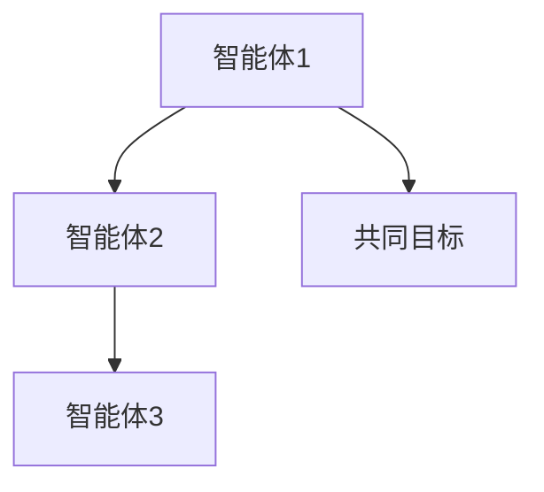
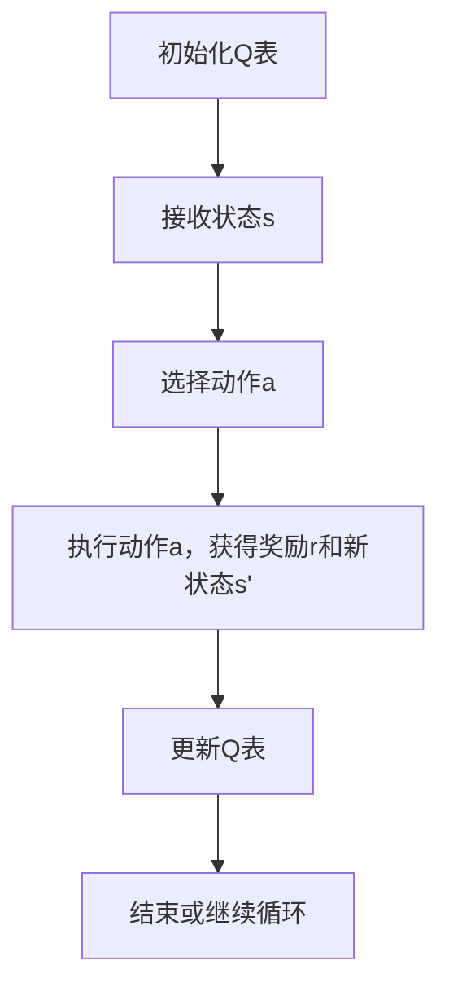
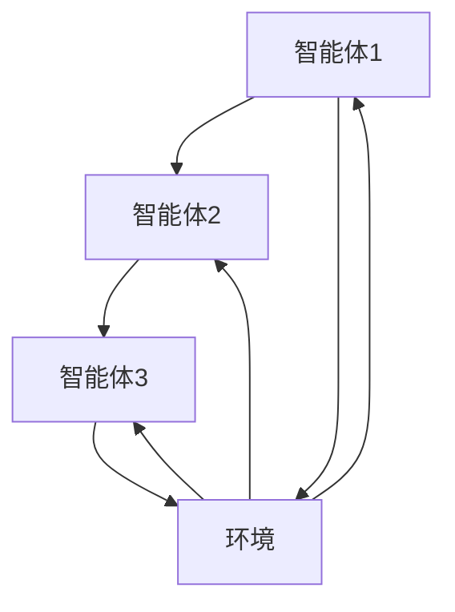
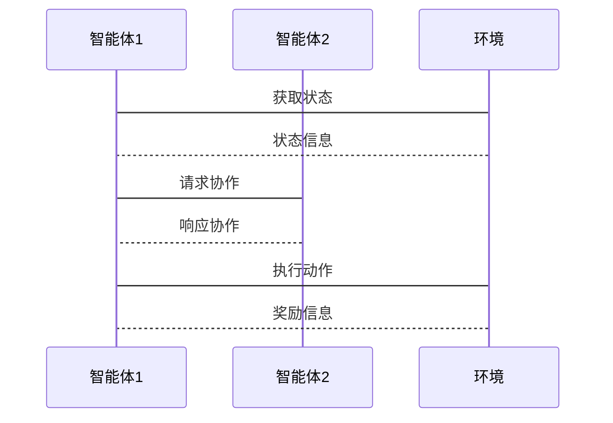

                 


# 深度强化学习在AI Agent协作决策中的应用

> 关键词：深度强化学习，AI Agent，协作决策，多智能体系统，强化学习算法

> 摘要：本文探讨了深度强化学习在AI Agent协作决策中的应用，详细分析了协作决策的核心概念、算法原理、系统架构以及实际项目案例，旨在为读者提供全面的技术解读。

---

# 第1章 深度强化学习与AI Agent协作决策概述

## 1.1 深度强化学习的背景与概念

### 1.1.1 强化学习的基本概念
强化学习是一种机器学习范式，通过智能体与环境的交互，学习如何采取一系列行动以最大化累计奖励。与监督学习和无监督学习不同，强化学习强调实时决策和策略优化。

### 1.1.2 深度强化学习的定义与特点
深度强化学习（Deep Reinforcement Learning）结合了深度学习的特征提取能力和强化学习的决策优化能力。通过神经网络直接逼近价值函数或策略函数，使得智能体能够处理高维、复杂的状态空间。

### 1.1.3 AI Agent协作决策的背景与意义
AI Agent是指能够感知环境、自主决策并采取行动的智能实体。在多智能体系统中，多个AI Agent需要协作完成复杂任务，这要求每个智能体不仅关注自身利益，还需考虑全局目标，形成高效的协作机制。

---

## 1.2 多智能体系统与协作决策

### 1.2.1 多智能体系统的定义
多智能体系统由多个相互作用的智能体组成，每个智能体具有独立的目标和决策能力，通过协作或竞争完成全局任务。

### 1.2.2 协作决策的核心概念
协作决策是指多个智能体通过信息共享和策略协调，共同完成复杂任务的过程。其核心在于如何在个体目标与全局目标之间找到平衡。

### 1.2.3 多智能体协作的挑战与机遇
- **挑战**：通信开销、策略同步、环境不确定性。
- **机遇**：提高系统效率、增强决策能力、扩展应用场景。

---

## 1.3 深度强化学习在AI Agent协作中的应用

### 1.3.1 深度强化学习的优势
- **高维状态处理**：深度神经网络能够处理高维复杂状态。
- **端到端学习**：直接从原始数据中学习策略，无需手动特征提取。

### 1.3.2 AI Agent协作中的典型场景
- **游戏AI**：如MOBA游戏中的团队协作。
- **机器人控制**：多机器人协同完成任务。
- **分布式系统优化**：如云资源分配。

### 1.3.3 应用前景与研究热点
随着技术进步，深度强化学习在协作决策中的应用将更加广泛，特别是在自动驾驶、智能城市等领域。

---

## 1.4 本章小结
本章介绍了深度强化学习和AI Agent协作决策的基本概念，分析了协作决策的核心要素及其在多智能体系统中的重要性。接下来，将深入探讨协作决策的核心概念与算法原理。

---

# 第2章 深度强化学习与AI Agent协作的核心概念

## 2.1 多智能体系统的核心要素

### 2.1.1 智能体的定义与属性
智能体具有自主性、反应性、目标导向性和社会性四大属性。在协作决策中，社会性尤为重要，涉及与其他智能体的交互与合作。

### 2.1.2 状态、动作、奖励的定义
- **状态（State）**：智能体所处环境的信息，如位置、资源等。
- **动作（Action）**：智能体可执行的操作，如移动、分配资源。
- **奖励（Reward）**：智能体行为的价值反馈，用于指导学习方向。

### 2.1.3 多智能体协作的实体关系图



---

## 2.2 深度强化学习的原理

### 2.2.1 强化学习的基本原理
智能体通过与环境交互，不断更新策略以最大化累计奖励。核心是通过经验回放和策略优化，避免随机性干扰。

### 2.2.2 深度强化学习的数学模型
深度强化学习通过神经网络逼近价值函数或策略函数。其核心数学模型包括：

- **Q-learning公式**：
  $$ Q(s, a) = Q(s, a) + \alpha [r + \gamma \max_{a'} Q(s', a') - Q(s, a)] $$
- **策略梯度公式**：
  $$ \nabla \theta = \frac{\partial}{\partial \theta} \left( \mathbb{E}[R | s, \pi] \right) $$

### 2.2.3 神经网络在强化学习中的应用
神经网络用于处理复杂状态，提取特征并生成策略。常用网络结构包括卷积神经网络（CNN）和循环神经网络（RNN）。

---

## 2.3 多智能体协作的机制

### 2.3.1 基于通信的协作机制
智能体之间通过共享信息（如位置、状态）进行协作。通信可以是直接的（如通过消息传递）或间接的（如通过环境影响）。

### 2.3.2 基于博弈论的协作机制
利用博弈论模型（如纳什均衡）设计协作策略，确保各智能体在博弈中寻求最优解。

### 2.3.3 基于共享目标的协作机制
通过定义共享目标函数，各智能体协同优化，确保全局最优。

---

## 2.4 核心概念对比分析

### 2.4.1 多智能体与单智能体的对比

| 属性          | 单智能体          | 多智能体          |
|---------------|-------------------|-------------------|
| 决策空间       | 独立              | 依赖              |
| 信息共享       | 无                | 有                |
| 协作性         | 无                | 强               |

### 2.4.2 协作决策与非协作决策的对比

| 属性          | 协作决策          | 非协作决策        |
|---------------|-------------------|-------------------|
| 目标           | 共同              | 独立              |
| 决策方式       | 协调              | 独立              |
| 效率           | 高               | 低               |

### 2.4.3 深度强化学习与其他AI技术的对比

| 技术           | 监督学习           | 无监督学习         | 强化学习           |
|----------------|--------------------|--------------------|--------------------|
| 数据需求       | 标签数据           | 无标签数据         | 环境交互           |
| 任务类型       | 分类/回归         | 聚类/降维         | 决策优化           |
| 适用场景       | 图像识别           | 聚类分析           | 游戏控制、机器人    |

---

## 2.5 本章小结
本章详细分析了多智能体系统和深度强化学习的核心概念，并通过对比分析明确了协作决策的独特优势。接下来，将深入探讨深度强化学习算法在协作决策中的具体应用。

---

# 第3章 深度强化学习算法原理

## 3.1 基础强化学习

### 3.1.1 Q-learning算法
Q-learning是一种经典的强化学习算法，通过更新Q值表来学习最优策略。

```mermaid
graph TD
A[状态s] --> B[动作a]
B --> C[新状态s']
C --> D[奖励r]
D --> E[更新Q(s,a)]
```

其数学公式为：
$$ Q(s, a) = Q(s, a) + \alpha (r + \gamma \max Q(s', a') - Q(s, a)) $$

---

## 3.2 多智能体协作算法

### 3.2.1 多智能体Q-learning
在多智能体场景中，每个智能体维护自己的Q值表，并通过协作更新。

### 3.2.2 基于价值分解的方法
通过分解全局价值函数，降低多智能体协作的复杂性。

---

## 3.3 算法实现

### 3.3.1 Python代码示例
```python
import numpy as np

class DQN:
    def __init__(self, state_space, action_space):
        self.state_space = state_space
        self.action_space = action_space
        self.q_table = np.zeros((state_space, action_space))
    
    def act(self, state, epsilon=0.1):
        if np.random.random() < epsilon:
            return np.random.randint(self.action_space)
        return np.argmax(self.q_table[state])
    
    def update(self, state, action, reward, next_state, alpha=0.1, gamma=0.99):
        target = reward + gamma * np.max(self.q_table[next_state])
        self.q_table[state][action] += alpha * (target - self.q_table[state][action])
```

### 3.3.2 算法流程图


---

## 3.4 数学模型与公式

### 3.4.1 Q-learning公式
$$ Q(s, a) = Q(s, a) + \alpha (r + \gamma \max Q(s', a') - Q(s, a)) $$

### 3.4.2 策略梯度公式
$$ \nabla \theta = \frac{\partial}{\partial \theta} \left( \mathbb{E}[R | s, \pi] \right) $$

---

## 3.5 本章小结
本章通过具体算法和数学模型，深入探讨了深度强化学习的实现细节，为后续协作决策的应用奠定了基础。接下来，将从系统架构和项目实战的角度，进一步分析深度强化学习在AI Agent协作决策中的具体应用。

---

# 第4章 系统分析与架构设计

## 4.1 项目介绍

### 4.1.1 项目背景
本项目旨在实现一个多智能体协作系统，利用深度强化学习算法完成任务分配和决策优化。

### 4.1.2 系统功能设计
系统功能包括状态感知、动作选择、奖励计算和策略优化。

### 4.1.3 系统组件
- **智能体模块**：负责决策和动作执行。
- **环境模块**：模拟真实环境，提供状态和奖励。
- **通信模块**：实现智能体之间的信息共享。

---

## 4.2 系统架构设计

### 4.2.1 系统架构图


### 4.2.2 系统功能模块
- **状态感知**：通过传感器或API获取环境信息。
- **动作选择**：基于当前状态，选择最优动作。
- **奖励计算**：根据动作结果，计算奖励值。

---

## 4.3 通信与协作机制

### 4.3.1 通信协议设计
定义智能体之间的通信接口，如`request_action`和`send_reward`。

### 4.3.2 协作流程图


---

## 4.4 本章小结
本章从系统架构的角度，详细分析了AI Agent协作决策的实现过程，包括功能设计、通信机制和协作流程。接下来，将通过具体项目实战，进一步验证这些设计的有效性。

---

# 第5章 项目实战：深度强化学习在协作决策中的应用

## 5.1 项目环境搭建

### 5.1.1 开发环境
- **操作系统**：Linux或Windows
- **编程语言**：Python
- **框架**：TensorFlow或PyTorch

### 5.1.2 环境配置
安装必要的库：
```bash
pip install numpy matplotlib tensorflow
```

---

## 5.2 核心代码实现

### 5.2.1 智能体类实现
```python
class Agent:
    def __init__(self, state_space, action_space):
        self.q_table = np.zeros((state_space, action_space))
    
    def act(self, state, epsilon=0.1):
        if np.random.random() < epsilon:
            return np.random.randint(action_space)
        return np.argmax(self.q_table[state])
    
    def update(self, state, action, reward, next_state, alpha=0.1, gamma=0.99):
        target = reward + gamma * np.max(self.q_table[next_state])
        self.q_table[state][action] += alpha * (target - self.q_table[state][action])
```

### 5.2.2 环境类实现
```python
class Environment:
    def __init__(self, num_agents=2):
        self.num_agents = num_agents
        self.states = [...]  # 初始化状态空间
    
    def get_state(self, agent_id):
        return self.states[agent_id]
    
    def execute_action(self, agent_id, action):
        # 执行动作并返回新状态和奖励
        pass
```

---

## 5.3 案例分析与优化

### 5.3.1 实验结果
通过多次实验，验证算法的收敛性和稳定性。

### 5.3.2 参数优化
调整学习率α和折扣率γ，找到最优参数组合。

---

## 5.4 本章小结
本章通过具体项目实战，展示了深度强化学习在协作决策中的应用过程，包括环境搭建、代码实现和案例分析。接下来，将从扩展与展望的角度，进一步探讨技术的发展方向。

---

# 第6章 扩展与展望

## 6.1 技术扩展

### 6.1.1 基于图神经网络的协作机制
利用图神经网络处理复杂的协作关系，提升系统性能。

### 6.1.2 跨领域应用
将深度强化学习应用于更多领域，如自动驾驶、智能城市等。

---

## 6.2 应用案例分析

### 6.2.1 游戏AI
深度强化学习在游戏AI中的应用，如策略优化和协作任务。

### 6.2.2 机器人协作
多机器人协作完成复杂任务，如物流配送和环境监测。

---

## 6.3 未来研究方向

### 6.3.1 更高效的算法设计
研究更高效的强化学习算法，降低计算成本。

### 6.3.2 多模态协作
结合视觉、听觉等多种模态信息，提升协作能力。

---

## 6.4 本章小结
本章总结了深度强化学习在协作决策中的应用，并展望了未来的发展方向。随着技术进步，深度强化学习在AI Agent协作决策中的应用将更加广泛和深入。

---

# 作者：AI天才研究院/AI Genius Institute & 禅与计算机程序设计艺术 /Zen And The Art of Computer Programming

