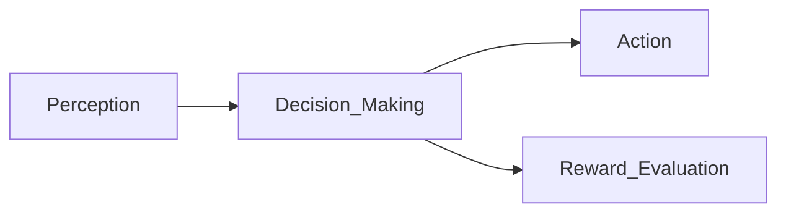

                 


# 深度强化学习在AI Agent长期规划中的应用

> 关键词：深度强化学习, AI Agent, 长期规划, 强化学习算法, 系统架构设计

> 摘要：深度强化学习（Deep Reinforcement Learning, DRL）在AI Agent的长期规划中发挥着关键作用。本文系统地探讨了DRL的核心算法、长期规划的挑战与解决方案，以及系统架构设计。通过实际案例分析，详细讲解了DRL在复杂环境中的应用，并提供了最佳实践和未来发展方向。

---

## 第1章: 深度强化学习与AI Agent概述

### 1.1 深度强化学习的定义与特点

深度强化学习（Deep Reinforcement Learning, DRL）结合了深度学习和强化学习的优势，通过神经网络来逼近策略或价值函数。其特点包括：

- **端到端学习**：直接从输入到输出进行端到端优化。
- **处理高维状态空间**：深度神经网络能够处理复杂的高维输入。
- **在线与离线学习**：支持在线实时决策和离线经验回放。

### 1.2 AI Agent的定义与类型

AI Agent是智能体，通过感知环境并执行动作来实现目标。其类型包括：

- **反应式智能体**：基于当前感知做出反应。
- **基于模型的智能体**：维护对环境的模型，用于长期规划。
- **分层智能体**：通过层次化结构分解任务。

### 1.3 深度强化学习在AI Agent中的作用

DRL通过逼近策略或价值函数，帮助AI Agent在复杂环境中做出决策。其优势在于：

- **复杂环境下的决策**：能够处理非结构化和动态变化的环境。
- **自适应学习**：通过与环境交互不断优化策略。

---

## 第2章: 深度强化学习的核心算法

### 2.1 强化学习的基本原理

强化学习通过智能体与环境的交互，通过试错学习来优化策略。核心要素包括状态（S）、动作（A）、奖励（R）和策略（π）。

### 2.2 深度强化学习的核心算法

#### 2.2.1 Q-learning算法

Q-learning通过更新Q值表来学习最优策略。DQN通过神经网络近似Q值。

```mermaid
graph LR
    S1 --> Q(S, A) --> A1 --> S2
    Q(S, A) --> R --> update Q
```

#### 2.2.2 Deep Q-Networks（DQN）

DQN由两个网络组成：主网络和目标网络。通过经验回放和目标网络更新，减少方差。

$$ Q(S, A) = r + γ \max(Q(S', A')) $$

### 2.3 深度强化学习的数学模型

深度强化学习使用神经网络逼近Q值或策略。神经网络的输入是状态，输出是动作值或概率分布。

---

## 第3章: 长期规划的挑战与解决方案

### 3.1 长期规划的定义与特点

长期规划涉及多阶段决策，目标是在未来的时间序列中最大化累积奖励。

### 3.2 深度强化学习在长期规划中的应用

通过模型预测和策略优化，DRL能够处理复杂的多阶段决策问题。

#### 3.2.1 基于模型的强化学习（Model-Based RL）

使用环境模型进行规划，如动态模型和奖励模型。

$$ P(next\_state | state, action) $$

#### 3.2.2 基于价值的强化学习（Value-Based RL）

通过价值函数逼近最优策略。

$$ V(s) = r + γ V(s') $$

---

## 第4章: 系统架构与设计

### 4.1 系统架构设计

AI Agent的系统架构通常包括感知层、决策层和执行层。



### 4.2 接口设计

系统接口包括状态输入、动作输出和奖励反馈。

---

## 第5章: 项目实战

### 5.1 环境安装

安装必要的库，如TensorFlow、Keras和OpenAI Gym。

### 5.2 核心代码实现

实现DQN算法：

```python
class DQN:
    def __init__(self, state_dim, action_dim):
        self.state_dim = state_dim
        self.action_dim = action_dim
        self.model = self.build_model()
    
    def build_model(self):
        model = Sequential()
        model.add(Dense(64, activation='relu', input_dim=self.state_dim))
        model.add(Dense(self.action_dim))
        return model
```

### 5.3 案例分析

在OpenAI Gym的CartPole环境中训练AI Agent，展示长期规划的应用。

---

## 第6章: 总结与展望

### 6.1 总结

深度强化学习在AI Agent的长期规划中展现出强大的潜力，通过不断优化策略和价值函数，能够处理复杂的决策问题。

### 6.2 未来展望

未来的研究方向包括多智能体协作、更高效的算法设计以及更广泛的应用场景探索。

---

## 作者：AI天才研究院 & 禅与计算机程序设计艺术

通过本文的系统讲解，读者可以深入了解深度强化学习在AI Agent长期规划中的应用，并掌握相关的核心算法和系统设计方法。

