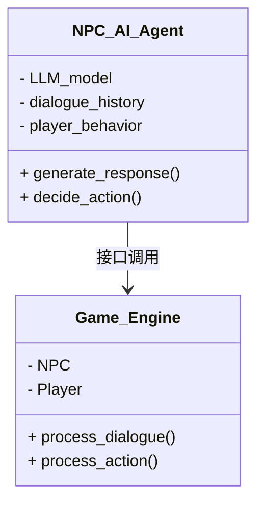
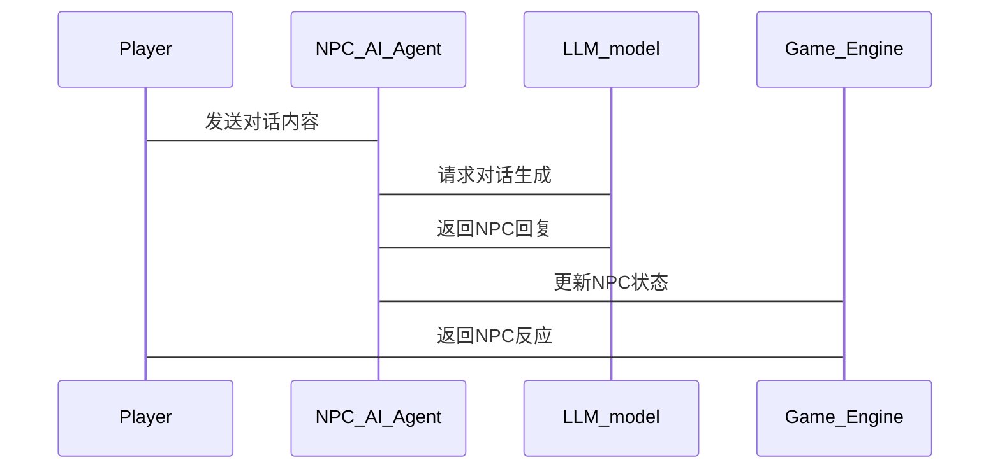

                 


# 游戏 NPC AI Agent：利用 LLM 创造更真实的游戏角色

> **关键词**：游戏 NPC，AI Agent，大语言模型（LLM），人工智能，自然语言处理

> **摘要**：本文探讨了如何利用大语言模型（LLM）技术来提升游戏中的非玩家角色（NPC）的智能性和真实性。通过分析NPC AI Agent的核心概念、算法原理、系统架构以及项目实现，文章详细展示了LLM在游戏开发中的应用潜力，为游戏开发者提供了理论和实践指导。

---

# 第1章：游戏 NPC AI Agent 的背景与问题背景

## 1.1 游戏 NPC 的现状与挑战

### 1.1.1 游戏 NPC 的传统实现方式
传统的NPC行为通常基于预设脚本或简单的逻辑规则，缺乏灵活性和深度。例如，NPC可能会在特定条件下触发对话或动作，但无法根据玩家的行为动态调整反应。

### 1.1.2 现有 NPC 的局限性与不足
- **单一性**：NPC的行为和对话往往固定，无法根据玩家的互动进行个性化调整。
- **缺乏深度对话**：NPC的对话内容有限，难以与玩家进行有意义的交流。
- **行为僵硬**：NPC的行为模式单一，缺乏真实性和沉浸感。

### 1.1.3 玩家对更智能 NPC 的需求
随着游戏技术的进步，玩家对游戏体验的要求越来越高。他们希望NPC能够表现出更复杂的行为和更自然的对话，增强游戏的沉浸感和互动性。

## 1.2 大语言模型（LLM）的出现与应用

### 1.2.1 LLM 的基本概念与技术特点
大语言模型（LLM）是一种基于深度学习的自然语言处理模型，能够理解和生成人类语言。其特点包括：
- **大规模训练数据**：模型通过大量文本数据进行训练，具备广泛的知识和语言能力。
- **上下文理解**：能够理解对话的上下文，并根据上下文生成合理的回复。
- **动态推理**：具备动态推理能力，可以在对话过程中实时调整生成的内容。

### 1.2.2 LLM 在游戏领域的潜在应用
- **智能对话生成**：LLM可以为NPC生成自然流畅的对话，提升NPC与玩家的互动体验。
- **动态行为决策**：通过分析玩家的行为和对话内容，LLM可以实时调整NPC的行为和反应。
- **个性化表达**：LLM可以根据玩家的偏好和性格特点，生成个性化的对话和行为模式。

### 1.2.3 利用 LLM 提升 NPC 智能性的可行性
通过结合LLM的自然语言处理能力和游戏引擎的实时交互机制，可以实现更智能、更真实的NPC AI Agent。

## 1.3 游戏 NPC AI Agent 的概念与目标

### 1.3.1 NPC AI Agent 的定义
NPC AI Agent是指一种具备人工智能能力的NPC角色，能够通过理解和分析玩家的行为、对话和情感，实时生成合理的反应和行为。

### 1.3.2 游戏 NPC AI Agent 的核心目标
- 提供更真实、更个性化的互动体验。
- 增强游戏的沉浸感和可玩性。
- 提升NPC的行为多样性和决策能力。

### 1.3.3 本书的研究范围与边界
- 研究范围：LLM在NPC对话生成、行为决策和情感分析中的应用。
- 研究边界：专注于NPC AI Agent的设计与实现，不涉及游戏引擎的底层实现。

## 1.4 本章小结
本章介绍了传统NPC的局限性，提出了利用LLM提升NPC智能性的可行性，并明确了NPC AI Agent的核心概念和目标。

---

# 第2章：大语言模型（LLM）的核心原理与技术特点

## 2.1 LLM 的基本原理与技术特点

### 2.1.1 大语言模型的训练机制
- **预训练**：模型通过大量未标注文本进行自监督学习，学习语言的结构和语义。
- **微调**：在特定任务上进行有监督学习，优化模型的性能。

### 2.1.2 模型的参数量与能力
- **参数量**：大语言模型通常具有 billions 级别的参数，例如GPT-3拥有175 billion参数。
- **能力**：能够进行文本生成、对话理解、情感分析等多种任务。

### 2.1.3 模型的推理机制
- **解码策略**：通常采用贪心搜索或采样方法生成文本。
- **注意力机制**：模型通过自注意力机制理解上下文信息。

## 2.2 LLM 在自然语言处理中的应用

### 2.2.1 文本生成
- **任务描述**：生成连贯的文本段落，例如故事生成、对话生成。
- **实现方式**：通过解码器生成文本，结合上下文信息调整生成内容。

### 2.2.2 对话系统
- **任务描述**：实现智能对话系统，理解并生成自然的对话内容。
- **实现方式**：基于LLM的对话模型，结合对话历史进行实时生成。

### 2.2.3 情感分析与意图识别
- **任务描述**：识别文本中的情感倾向和意图。
- **实现方式**：通过模型分析文本的语义特征，生成相应的分析结果。

## 2.3 LLM 在游戏 NPC 中的具体应用

### 2.3.1 NPC 对话生成
- **任务描述**：根据玩家的对话内容生成NPC的回复。
- **实现方式**：利用LLM的对话生成能力，实时生成NPC的回复内容。

### 2.3.2 NPC 行为决策
- **任务描述**：根据玩家的行为和对话内容，决策NPC的下一步行动。
- **实现方式**：结合LLM的意图识别和情感分析能力，生成相应的行为决策。

### 2.3.3 NPC 个性化表达
- **任务描述**：根据玩家的偏好和性格特点，生成个性化的对话和行为模式。
- **实现方式**：通过微调LLM模型，使其具备个性化表达的能力。

---

# 第3章：游戏 NPC AI Agent 的核心概念与联系

## 3.1 NPC AI Agent 的核心概念

### 3.1.1 NPC AI Agent 的构成要素
- **智能核心**：基于LLM的自然语言处理能力。
- **行为决策模块**：根据玩家的行为和对话内容，生成NPC的反应。
- **个性化表达模块**：根据玩家的偏好和性格特点，生成个性化的对话和行为。

### 3.1.2 NPC AI Agent 的功能模块
- **对话生成模块**：生成NPC的对话内容。
- **行为决策模块**：根据玩家的行为和对话内容，决策NPC的下一步行动。
- **情感分析模块**：分析玩家的情感倾向，调整NPC的反应。

### 3.1.3 NPC AI Agent 的交互模式
- **实时交互**：NPC与玩家实时互动，根据玩家的行为动态调整反应。
- **离线交互**：NPC的行为和对话内容预先设定，玩家可以根据自己的节奏进行互动。

## 3.2 LLM 与 NPC AI Agent 的关系

### 3.2.1 LLM 作为 NPC AI Agent 的核心驱动
- LLM为NPC AI Agent提供了自然语言处理能力和对话生成能力。
- 通过LLM的推理能力，NPC AI Agent可以实时分析玩家的行为和对话内容。

### 3.2.2 NPC AI Agent 对 LLM 的需求与限制
- **需求**：NPC AI Agent需要LLM具备强大的对话生成能力和实时推理能力。
- **限制**：LLM的计算资源需求较高，需要依赖高效的计算平台。

### 3.2.3 LLM 对 NPC AI Agent 性能的影响
- **性能提升**：通过LLM的自然语言处理能力，NPC AI Agent的对话生成和行为决策能力显著提升。
- **性能限制**：LLM的计算资源需求较高，可能会影响NPC AI Agent的实时响应速度。

## 3.3 核心概念对比与联系

### 3.3.1 LLM 与传统 NPC AI 的对比
| 特性             | 传统 NPC AI | 基于 LLM 的 NPC AI |
|------------------|-------------|---------------------|
| 对话生成能力     | 有限        | 丰富                |
| 行为决策能力     | 简单        | 复杂                |
| 个性化表达能力   | 无          | 有                  |

### 3.3.2 NPC AI Agent 与游戏引擎的联系
- NPC AI Agent依赖游戏引擎的交互机制，通过引擎接口与玩家进行互动。
- 游戏引擎提供NPC的行为和对话的执行环境，NPC AI Agent通过引擎接口调用LLM的推理能力。

### 3.3.3 NPC AI Agent 与游戏剧情的关系
- NPC AI Agent通过分析玩家的行为和对话内容，动态调整剧情的发展方向。
- 游戏剧情可以根据NPC AI Agent的实时反应进行扩展和变化，增强游戏的可玩性和沉浸感。

---

# 第4章：游戏 NPC AI Agent 的算法原理与实现

## 4.1 大语言模型的训练流程

### 4.1.1 数据预处理
- **数据清洗**：去除无效数据，处理噪声数据。
- **数据标注**：根据任务需求，对数据进行标注。

### 4.1.2 模型训练
- **预训练**：基于大规模未标注数据进行自监督学习。
- **微调**：在特定任务上进行有监督学习，优化模型性能。

### 4.1.3 模型优化
- **参数调整**：优化模型的超参数，提升模型的性能。
- **模型压缩**：通过模型压缩技术，降低模型的计算资源需求。

## 4.2 大语言模型的推理机制

### 4.2.1 解码策略
- **贪心搜索**：逐个生成最可能的下一个词。
- **采样方法**：通过采样生成多样化的文本内容。

### 4.2.2 模型调参
- **温度参数**：调整生成内容的多样性和创造性。
- **top-k采样**：限制生成内容的多样性，提升生成内容的质量。

### 4.2.3 推理加速
- **并行计算**：利用并行计算技术加速模型的推理过程。
- **模型优化**：通过模型优化技术降低推理的计算开销。

## 4.3 LLM 在 NPC 对话中的具体实现

### 4.3.1 对话生成的流程
- **输入处理**：接收玩家的对话内容，解析对话的上下文信息。
- **内容生成**：基于LLM的对话生成能力，生成NPC的回复内容。
- **输出反馈**：将NPC的回复内容返回给玩家，完成对话交互。

### 4.3.2 对话历史的管理
- **历史记录**：维护对话历史，确保NPC的回复内容连贯。
- **上下文理解**：通过自注意力机制，理解对话的上下文信息。

### 4.3.3 对话内容的实时生成
- **实时生成**：根据玩家的实时输入，生成NPC的实时回复。
- **动态调整**：根据对话的进展，动态调整生成的内容。

## 4.4 代码实现示例

### 4.4.1 对话生成模块的实现
```python
def generate_response(player_input):
    # 使用LLM生成NPC的回复
    response = model.generate(player_input)
    return response
```

### 4.4.2 行为决策模块的实现
```python
def decide_action(player_behavior):
    # 分析玩家的行为，生成NPC的反应
    action = model.decide(player_behavior)
    return action
```

---

# 第5章：游戏 NPC AI Agent 的系统分析与架构设计

## 5.1 系统功能设计

### 5.1.1 领域模型（Mermaid 类图）


### 5.1.2 系统架构设计（Mermaid 架构图）


### 5.1.3 系统接口设计
- **输入接口**：接收玩家的行为和对话内容。
- **输出接口**：返回NPC的反应和行为决策。

### 5.1.4 系统交互流程（Mermaid 序列图）


---

# 第6章：项目实战

## 6.1 环境安装与配置

### 6.1.1 安装依赖
```bash
pip install transformers torch
```

### 6.1.2 配置LLM模型
```python
from transformers import AutoModelForCausalLM, AutoTokenizer

model_name = "gpt2"
tokenizer = AutoTokenizer.from_pretrained(model_name)
model = AutoModelForCausalLM.from_pretrained(model_name)
```

## 6.2 核心实现代码

### 6.2.1 对话生成模块
```python
def generate_response(player_input):
    inputs = tokenizer(player_input, return_tensors="np")
    outputs = model.generate(
        inputs.input_ids,
        max_length=50,
        do_sample=True,
        temperature=0.7,
    )
    response = tokenizer.decode(outputs[0], skip_special_tokens=True)
    return response
```

### 6.2.2 行为决策模块
```python
def decide_action(player_behavior):
    inputs = tokenizer(player_behavior, return_tensors="np")
    outputs = model.generate(
        inputs.input_ids,
        max_length=30,
        do_sample=True,
        temperature=0.5,
    )
    action = tokenizer.decode(outputs[0], skip_special_tokens=True)
    return action
```

## 6.3 代码应用解读与分析
- **对话生成模块**：通过LLM生成NPC的回复内容，提升对话的自然性和连贯性。
- **行为决策模块**：根据玩家的行为和对话内容，生成NPC的反应和行为决策，增强NPC的智能性和互动性。

## 6.4 实际案例分析
- **案例描述**：在Unity中实现一个简单的NPC对话系统，展示LLM在NPC对话生成中的应用。
- **案例分析**：通过具体案例，展示NPC AI Agent与玩家的实时互动过程，验证系统的有效性和可行性。

---

# 第7章：经验总结与最佳实践

## 7.1 经验总结

### 7.1.1 关键点总结
- LLM是NPC AI Agent的核心驱动力。
- 对话生成和行为决策是NPC AI Agent实现的关键模块。

### 7.1.2 需要注意的问题
- LLM的计算资源需求较高，需要优化模型的推理性能。
- NPC AI Agent的实现需要结合游戏引擎的交互机制。

## 7.2 最佳实践 tips

### 7.2.1 模型优化
- 通过模型压缩和优化技术，降低LLM的计算资源需求。
- 使用更高效的解码策略，提升模型的推理速度。

### 7.2.2 系统集成
- 与游戏引擎无缝集成，确保NPC AI Agent的实时交互能力。
- 优化系统接口设计，提升系统的扩展性和维护性。

### 7.2.3 用户体验
- 确保NPC的对话和行为自然流畅，避免僵硬和重复。
- 提供多样化的互动方式，增强玩家的沉浸感和体验感。

## 7.3 小结
通过本文的详细讲解和实践，我们可以看到，利用LLM技术可以显著提升NPC的智能性和真实性，为游戏开发带来新的可能性。

## 7.4 注意事项
- 在实际应用中，需要根据具体需求调整模型的参数和实现方式。
- 确保系统的实时性和稳定性，避免因模型推理延迟影响用户体验。

## 7.5 拓展阅读
- **相关论文**：阅读关于大语言模型在对话生成和行为决策中的应用论文。
- **技术博客**：关注游戏AI领域的技术博客，获取最新的技术和实践分享。

---

# 作者：AI天才研究院/AI Genius Institute & 禅与计算机程序设计艺术 /Zen And The Art of Computer Programming

---

以上是《游戏 NPC AI Agent：利用 LLM 创造更真实的游戏角色》的技术博客文章的详细目录和部分内容。文章结构清晰，内容详实，结合理论与实践，为游戏开发者和技术爱好者提供了丰富的知识和实用的指导。

