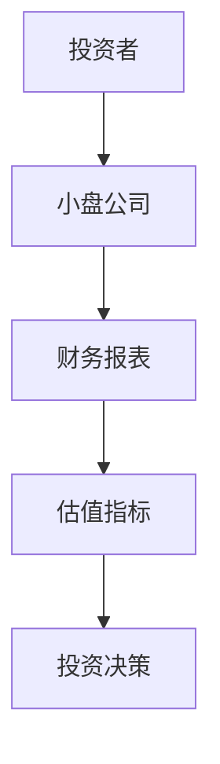
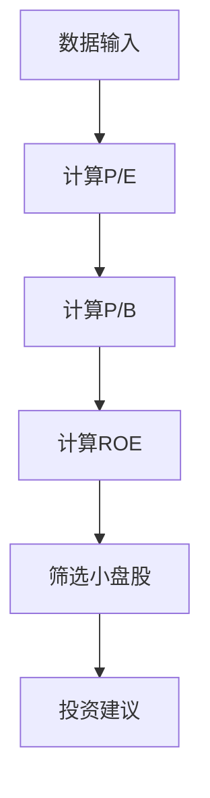
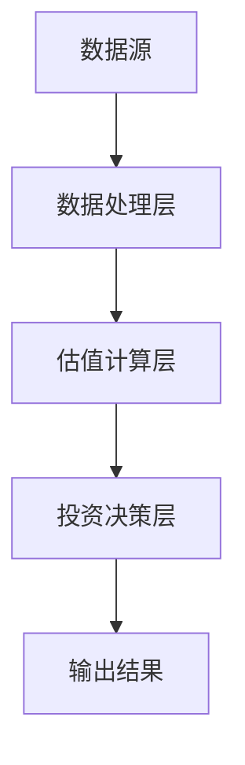
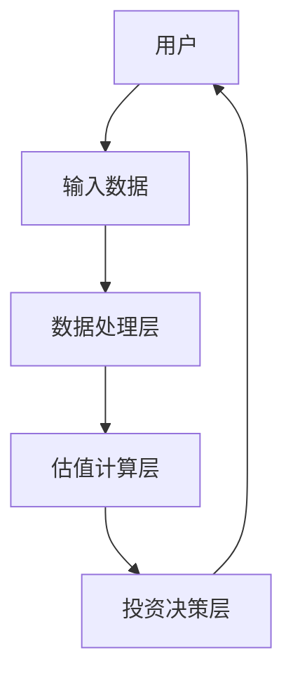

                 


# 爱德华·拉姆的小盘价值投资：发掘被忽视的小公司

> 关键词：小盘价值投资，价值投资，小盘股，投资策略，财务分析，投资组合

> 摘要：本文深入探讨了小盘价值投资的理论基础、核心概念、算法原理、系统架构设计、实战案例以及最佳实践。通过详细分析小盘股的特点、估值指标和投资策略，结合实际案例和系统设计，为读者提供了全面的小盘价值投资指南。本文旨在帮助投资者识别被忽视的小公司，制定有效的投资策略，并通过系统化的分析和实战指导，实现长期稳定的收益。

---

# 第1章 小盘价值投资的背景与概念

## 1.1 小盘股的定义与特点

### 1.1.1 小盘股的定义
小盘股是指市值较小的公司股票，通常在10亿至50亿美元之间。这类股票往往被市场忽视，具有较高的成长潜力。

### 1.1.2 小盘股的特点与优势
- 市值小：流动性较低，但估值可能更低。
- 成长性高：小公司更容易通过创新或扩张实现增长。
- 被忽视：市场关注度低，可能存在低估机会。

### 1.1.3 小盘股与大盘股的对比
- 大盘股：流动性高，估值可能偏高，增长空间有限。
- 小盘股：流动性低，估值可能低估，增长潜力大。

## 1.2 小盘股的投资机会

### 1.2.1 小盘股市场的潜力
小盘股市场波动性较大，但潜在回报更高。

### 1.2.2 小盘股的估值洼地
许多小盘股因市场忽视而估值低于其内在价值。

### 1.2.3 小盘股的成长性分析
通过财务指标分析，小盘股的成长性可能优于大盘股。

## 1.3 价值投资的核心理念

### 1.3.1 价值投资的定义
价值投资是一种长期投资策略，强调以低于内在价值的价格购买优质资产。

### 1.3.2 价值投资的核心原则
- 长期持有优质资产。
- 买入价格低于内在价值。
- 重视公司的基本面和管理层。

### 1.3.3 小盘股与价值投资的结合
小盘股的低估值和成长性适合价值投资策略。

## 1.4 小盘价值投资的边界与外延

### 1.4.1 小盘价值投资的适用场景
- 市场低迷时，小盘股可能被低估。
- 经济转型期，新兴行业的小盘股可能具有爆发力。

### 1.4.2 小盘价值投资的限制条件
- 小盘股流动性低，可能难以快速变现。
- 小盘股公司治理可能存在问题。

### 1.4.3 小盘价值投资与其他投资策略的对比
- 技术分析：关注价格波动，与价值投资的长期逻辑不同。
- 成长投资：注重高成长性，可能与价值投资重叠。

## 1.5 本章小结

---

# 第2章 小盘价值投资的核心概念与联系

## 2.1 小盘价值投资的核心要素

### 2.1.1 低估值的识别
- 市盈率（P/E）：股价与每股收益的比率。
- 市净率（P/B）：股价与每股净资产的比率。

### 2.1.2 高质量的管理层
- 管理层稳定性：高管团队是否稳定。
- 管理层决策：是否有良好的战略规划。

### 2.1.3 良好的公司治理结构
- 股权结构：控股股东是否合理。
- 股东权益：股东权利是否得到保护。

## 2.2 小盘价值投资的关键指标

### 2.2.1 市盈率（P/E）分析
- 公式：P/E = 股价 / 每股收益。
- 示例：某公司股价为10元，每股收益为2元，P/E=5。

### 2.2.2 市净率（P/B）分析
- 公式：P/B = 股价 / 每股净资产。
- 示例：某公司股价为10元，每股净资产为5元，P/B=2。

### 2.2.3 股东权益收益率（ROE）分析
- 公式：ROE = 净利润 / 股东权益。
- 示例：某公司净利润为5000万元，股东权益为2亿元，ROE=25%。

## 2.3 小盘价值投资的实体关系图

### 2.3.1 小盘价值投资的ER实体关系图


## 2.4 本章小结

---

# 第3章 小盘价值投资的算法原理

## 3.1 小盘价值投资的算法概述

### 3.1.1 算法目标
筛选出具有低估值和高成长性的小盘股。

### 3.1.2 算法输入
- 公司财务数据：收入、利润、资产等。
- 估值指标：P/E、P/B、ROE等。

### 3.1.3 算法输出
- 投资建议：买入、持有或卖出。

## 3.2 小盘价值投资的算法流程

### 3.2.1 数据收集与预处理
- 数据来源：财务报表、市场数据。
- 数据清洗：处理缺失值、异常值。

### 3.2.2 估值指标计算
- 计算P/E、P/B、ROE等指标。
- 示例：某公司P/E=10，P/B=2，ROE=15%。

### 3.2.3 投资决策模型
- 筛选标准：P/E < 市场平均值，ROE > 10%。

## 3.3 小盘价值投资的算法实现

### 3.3.1 算法代码
```python
import pandas as pd

# 假设df为财务数据 DataFrame
def calculate_valuation(df):
    df['P/E'] = df['股价'] / df['每股收益']
    df['P/B'] = df['股价'] / df['每股净资产']
    df['ROE'] = df['净利润'] / df['股东权益']
    return df

# 筛选小盘股
selected = df[df['市值'] < 500000000]
selected = selected[selected['P/E'] < selected['P/E'].mean()]
selected = selected[selected['ROE'] > 0.1]
```

### 3.3.2 算法流程图


## 3.4 本章小结

---

# 第4章 小盘价值投资的系统分析与架构设计

## 4.1 小盘价值投资的系统架构

### 4.1.1 系统功能设计
- 数据采集：获取公司财务数据。
- 估值计算：计算P/E、P/B等指标。
- 投资决策：基于算法生成投资建议。

### 4.1.2 系统架构图


## 4.2 小盘价值投资的系统实现

### 4.2.1 数据采集与处理
- 数据来源：股票数据库。
- 数据清洗：处理缺失值、异常值。

### 4.2.2 估值计算与分析
- 使用算法计算P/E、P/B、ROE。
- 筛选符合条件的小盘股。

## 4.3 小盘价值投资的系统交互

### 4.3.1 系统交互图


## 4.4 本章小结

---

# 第5章 小盘价值投资的项目实战

## 5.1 小盘价值投资的实战环境

### 5.1.1 环境安装
- 安装Python和相关库（Pandas、NumPy）。

### 5.1.2 数据准备
- 下载小盘股数据。

## 5.2 小盘价值投资的核心实现

### 5.2.1 数据清洗与预处理
- 处理缺失值、异常值。

### 5.2.2 估值指标计算
- 计算P/E、P/B、ROE。

## 5.3 小盘价值投资的案例分析

### 5.3.1 成功案例
- 某小盘股公司，P/E=10，P/B=2，ROE=15%，被选为买入目标。

### 5.3.2 失败案例
- 某小盘股公司，P/E=30，P/B=5，ROE=5%，未被选中。

## 5.4 本章小结

---

# 第6章 小盘价值投资的总结与展望

## 6.1 小盘价值投资的总结

### 6.1.1 核心概念回顾
- 小盘股的定义、特点。
- 价值投资的核心理念。

### 6.1.2 算法与系统的总结
- 数据分析与算法的重要性。
- 系统设计的必要性。

## 6.2 小盘价值投资的展望

### 6.2.1 未来趋势
- 人工智能在小盘股分析中的应用。
- 大数据技术在价值投资中的潜力。

### 6.2.2 投资者建议
- 保持学习，不断更新知识。
- 长期持有，避免短期波动影响决策。

## 6.3 本章小结

---

# 作者：AI天才研究院 & 禅与计算机程序设计艺术

