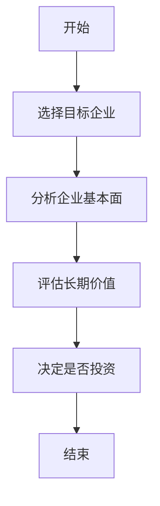
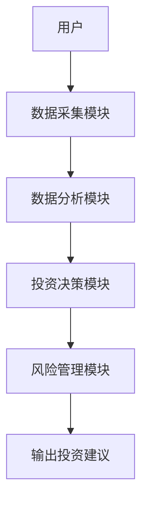

                 


## 第三部分: 耐心资本的算法原理与数学模型

### 第4章: 耐心资本的算法原理

#### 4.1 耐心资本的决策流程
耐心资本的决策流程是一个系统化的过程，旨在通过长期持有优质资产来实现价值增长。以下是具体的决策流程：



#### 4.2 耐心资本的数学模型
耐心资本的核心在于通过基本面分析，找到那些具有持续竞争优势和良好管理的企业，并以合理的价格买入长期持有。以下是几个关键的数学模型：

##### 4.2.1 市盈率（P/E）计算公式
$$ P/E = \frac{股票价格}{每股净利} $$

市盈率是衡量股票估值的重要指标，表示投资者为每股净利支付的价格。市盈率越低，可能意味着股票的价值越被低估。

##### 4.2.2 净资产收益率（ROE）计算公式
$$ ROE = \frac{净利润}{净资产} $$

ROE是衡量企业盈利能力的重要指标，表示每单位净资产能够创造多少净利润。ROE越高，企业的盈利能力越强。

##### 4.2.3 内在价值计算公式
$$ 内在价值 = \frac{未来现金流的现值}{折现率} $$

内在价值是通过对企业未来现金流的折现来估算其真实价值。投资者可以通过比较内在价值与市场价格，判断是否存在投资机会。

---

## 第5章: 耐心资本的数学模型

#### 5.1 市盈率分析
市盈率分析是价值投资中常用的估值方法之一。以下是市盈率分析的步骤：

1. 收集目标企业的历史市盈率数据。
2. 比较市盈率与行业平均水平或可比企业的市盈率。
3. 判断市盈率是否处于合理范围内。

#### 5.2 ROE分析
ROE分析用于评估企业的盈利能力。以下是ROE分析的步骤：

1. 计算企业的ROE。
2. 比较ROE与行业平均水平。
3. 判断企业的盈利能力是否具有可持续性。

#### 5.3 内在价值计算
内在价值计算是通过DCF模型（Discounted Cash Flow Model）进行的。以下是计算步骤：

1. 预测企业未来五年的现金流。
2. 选择合适的折现率。
3. 计算未来现金流的现值。
4. 将现值与当前股价进行比较。

---

## 第四部分: 耐心资本的系统分析与架构设计

### 第6章: 系统分析与架构设计

#### 6.1 问题场景介绍
在实际投资过程中，投资者需要面对复杂的市场环境和多变的经济形势。为了更好地进行投资决策，我们需要构建一个系统化的投资决策支持系统。

#### 6.2 系统功能设计
以下是投资决策支持系统的功能模块：

1. 数据采集模块：收集企业的财务数据、市场数据等。
2. 数据分析模块：进行基本面分析、估值分析等。
3. 投资决策模块：基于分析结果生成投资建议。
4. 风险管理模块：监控投资组合的风险。

#### 6.3 系统架构设计
以下是系统的架构设计：



---

## 第五部分: 项目实战

### 第7章: 项目实战

#### 7.1 环境安装
为了进行投资分析，我们需要安装以下工具：

1. 数据分析工具：Python、Pandas、Matplotlib。
2. 财务分析工具：Excel、Financials。

#### 7.2 核心实现源代码
以下是使用Python进行基本面分析的代码示例：

```python
import pandas as pd

# 读取财务数据
data = pd.read_csv('financial_data.csv')

# 计算市盈率
data['P/E'] = data['Stock Price'] / data['Net Income per Share']

# 计算ROE
data['ROE'] = data['Net Income'] / data['Total Equity']

# 找出具有低P/E和高ROE的公司
criteria = (data['P/E'] < data['P/E'].mean()) & (data['ROE'] > data['ROE'].mean())
candidates = data[criteria]

print(candidates)
```

#### 7.3 代码应用解读与分析
上述代码通过读取财务数据，计算市盈率和ROE，并筛选出具有低市盈率和高ROE的公司。这些公司可能是具有长期投资价值的潜在标的。

#### 7.4 实际案例分析
以下是以微软公司为例的分析：

1. 收集微软公司的财务数据。
2. 计算微软公司的市盈率和ROE。
3. 比较微软公司的市盈率和ROE与行业平均水平。
4. 判断微软公司是否具有长期投资价值。

---

## 第六部分: 最佳实践与小结

### 第8章: 最佳实践

#### 8.1 小结
耐心资本是一种长期价值投资策略，通过选择具有持续竞争优势和良好管理的企业，并以合理的价格买入长期持有，从而实现财富的长期增长。

#### 8.2 投资注意事项
1. 保持耐心，避免频繁交易。
2. 重视基本面分析，选择优质企业。
3. 分散投资，降低风险。
4. 定期复盘，调整投资组合。

#### 8.3 拓展阅读
1. 《巴菲特传》
2. 《投资之道》
3. 《价值投资入门》

---

# 作者：AI天才研究院/AI Genius Institute & 禅与计算机程序设计艺术 /Zen And The Art of Computer Programming

---

这篇文章详细介绍了耐心资本的核心理念、算法原理、系统架构和实际应用，帮助读者全面理解并掌握长期价值投资的力量。通过系统化的分析和实际案例的展示，读者可以更好地将理论应用于实践，实现长期的投资目标。

