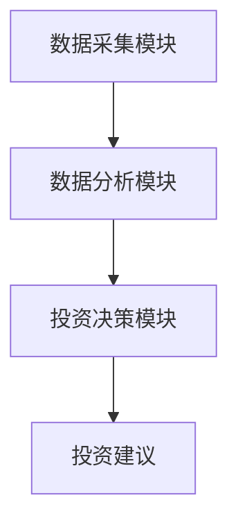

                 


# 玛丽·巴芙特的质量价值投资：寻找优质且低估的公司

## 关键词：价值投资、质量公司、低估公司、投资策略、财务分析、市场估值

## 摘要：  
本文深入探讨了玛丽·巴芙特的质量价值投资理念，通过分析优质公司的定义和市场低估的标准，结合技术语言和实际案例，系统地讲解了如何在现代投资环境中识别和选择具有长期增长潜力的优质公司。文章从理论到实践，结合算法和系统设计，为读者提供了全面的质量价值投资指南。

---

# 第一部分：质量价值投资的背景与核心理念

## 第1章：价值投资的起源与发展

### 1.1 价值投资的起源  
价值投资是一种以基本面分析为核心的长期投资策略，起源于20世纪初。本杰明·格雷厄姆和戴维·多德是这一理念的奠基者。玛丽·巴芙特作为格雷厄姆的忠实追随者，将价值投资的理念进一步发扬光大。  
**关键公式**：价值投资的核心是寻找市场价格低于内在价值的公司，其公式为：  
$$ \text{内在价值} = \frac{\text{未来现金流的现值}}{\text{折现率}} $$  

### 1.2 玛丽·巴芙特的价值投资理念  
玛丽·巴芙特强调，优质公司具有强大的竞争优势、稳定的盈利能力以及良好的财务状况。她通过“护城河”概念来判断公司的长期竞争优势。  
**护城河的四个维度**：  
1. **成本优势**：公司能否以更低的成本生产产品或服务。  
2. **品牌优势**：强大的品牌能够吸引更多的消费者。  
3. **网络效应**：产品或服务的使用会随着用户数量的增加而增加价值。  
4. **技术壁垒**：公司拥有独特的技术或专利，难以被竞争对手复制。  

### 1.3 质量价值投资的核心要素  
质量价值投资结合了质量和估值两个关键因素：  
1. **质量**：公司具有强大的竞争优势和稳定的盈利能力。  
2. **估值**：市场价格低于公司的内在价值。  
**质量与估值的关系**：玛丽·巴芙特强调，只有当价格低于内在价值时，质量公司才具有投资价值。  

---

# 第二部分：质量公司的定义与特征

## 第2章：质量公司的核心要素

### 2.1 质量公司的财务健康状况  
财务健康是衡量公司质量的重要指标。以下是关键的财务指标：  
1. **净利润率**：衡量公司盈利效率的指标，公式为：  
$$ \text{净利润率} = \frac{\text{净利润}}{\text{营业收入}} $$  
2. **资产负债率**：衡量公司财务杠杆的指标，公式为：  
$$ \text{资产负债率} = \frac{\text{总负债}}{\text{总资产}} $$  
3. **现金流**：公司经营活动产生的现金流是衡量公司财务健康的重要指标。  

### 2.2 质量公司的竞争优势  
竞争优势是质量公司的核心特征。以下是竞争优势的三种类型：  
1. **成本优势**：公司能够以更低的成本生产产品或服务。  
2. **品牌优势**：强大的品牌能够吸引更多的消费者。  
3. **技术壁垒**：公司拥有独特的技术或专利，难以被竞争对手复制。  

### 2.3 质量公司的案例分析  
以苹果公司为例，分析其质量特征：  
- **竞争优势**：苹果拥有强大的品牌影响力和技术创新能力。  
- **财务状况**：苹果的净利润率和现金流均表现优异。  
- **护城河**：苹果的生态系统和品牌忠诚度构成了强大的护城河。  

---

# 第三部分：市场低估的识别与估值方法

## 第3章：市场低估的识别方法

### 3.1 市场低估的定义  
市场低估是指市场价格低于公司内在价值的情况。以下是识别市场低估的关键指标：  
1. **市盈率（P/E）**：公式为：  
$$ \text{市盈率} = \frac{\text{股价}}{\text{每股收益}} $$  
2. **市净率（P/B）**：公式为：  
$$ \text{市净率} = \frac{\text{股价}}{\text{每股净资产}} $$  
3. **股息率**：公式为：  
$$ \text{股息率} = \frac{\text{每股股息}}{\text{股价}} $$  

### 3.2 市场低估的案例分析  
以亚马逊为例，分析其低估阶段：  
- **市盈率**：亚马逊的市盈率在某些阶段可能低于行业平均水平，表明市场低估。  
- **市净率**：亚马逊的市净率也显示出低估的迹象。  
- **股息率**：亚马逊的股息率较低，但考虑到其高增长潜力，仍具有投资价值。  

---

# 第四部分：质量价值投资的策略与实践

## 第4章：质量价值投资的策略制定

### 4.1 投资组合的构建  
投资组合的构建需要考虑多样性和风险控制。以下是构建投资组合的关键步骤：  
1. **资产分配**：根据风险承受能力和投资目标分配资产比例。  
2. **个股选择**：选择具有强大竞争优势和低估的公司。  
3. **定期再平衡**：定期调整投资组合以维持目标配置。  

### 4.2 投资组合的优化  
投资组合的优化需要考虑以下因素：  
1. **风险调整后的收益**：使用夏普比率衡量投资组合的风险调整后收益。  
2. **相关性**：选择相关性较低的资产以分散风险。  

### 4.3 风险管理  
风险管理是投资过程中不可忽视的环节。以下是风险管理的关键策略：  
1. **止损策略**：设定止损点以限制潜在损失。  
2. **分散投资**：通过投资多样化资产降低风险。  

---

# 第五部分：质量价值投资的系统设计与实现

## 第5章：质量价值投资的系统分析

### 5.1 系统功能设计  
质量价值投资系统的功能模块包括：  
1. **数据采集模块**：收集公司财务数据和市场数据。  
2. **数据分析模块**：计算财务指标和估值指标。  
3. **投资决策模块**：根据分析结果生成投资建议。  

### 5.2 系统架构设计  
以下是系统架构的mermaid图：  



### 5.3 系统实现  
以下是系统的核心实现代码：  

```python
import pandas as pd
import numpy as np

def calculate_intrinsic_value(company_data, discount_rate):
    # 计算未来现金流的现值
    cash_flows = company_data['未来现金流']
    present_value = np.npv(discount_rate, cash_flows)
    return present_value

def is_undervalued(current_price, intrinsic_value):
    return current_price < intrinsic_value
```

---

# 第六部分：质量价值投资的实战与案例分析

## 第6章：质量价值投资的实战分析

### 6.1 实战环境搭建  
以下是实战环境的安装步骤：  
1. 安装必要的库：  
```bash
pip install pandas numpy matplotlib
```
2. 下载数据：从金融数据库获取公司财务数据和市场数据。  

### 6.2 实战代码实现  
以下是实战的核心代码：  

```python
import pandas as pd
import numpy as np

# 下载数据
data = pd.read_csv('company_data.csv')

# 计算内在价值
def calculate_intrinsic_value(data, discount_rate):
    cash_flows = data['未来现金流']
    present_value = np.npv(discount_rate, cash_flows)
    return present_value

# 判断是否低估
def is_undervalued(current_price, intrinsic_value):
    return current_price < intrinsic_value

# 应用算法
intrinsic_values = data.apply(lambda x: calculate_intrinsic_value(x, 0.1), axis=1)
undervalued_companies = data[intrinsic_values > data['股价']]
```

### 6.3 实战案例分析  
以苹果公司为例，分析其是否低估：  
- **计算内在价值**：使用现金流折现法计算苹果的内在价值。  
- **判断低估**：比较苹果的市场价格和内在价值。  

---

# 第七部分：质量价值投资的最佳实践与总结

## 第7章：质量价值投资的最佳实践

### 7.1 投资策略总结  
质量价值投资的核心是寻找优质且低估的公司，以下是最佳实践：  
1. **长期投资**：避免短期市场波动的干扰。  
2. **分散投资**：降低投资组合的风险。  
3. **持续学习**：不断更新知识和技能，适应市场变化。  

### 7.2 注意事项  
1. **市场风险**：市场波动可能导致投资损失。  
2. **数据质量**：确保数据的准确性和完整性。  
3. **模型局限性**：算法模型存在局限性，需结合实际情况调整。  

### 7.3 拓展阅读  
1. 玛丽·巴芙特的书籍：《聪明的投资者》  
2. 其他相关书籍：《投资最重要的少数事》  

---

# 作者：AI天才研究院 & 禅与计算机程序设计艺术

```

