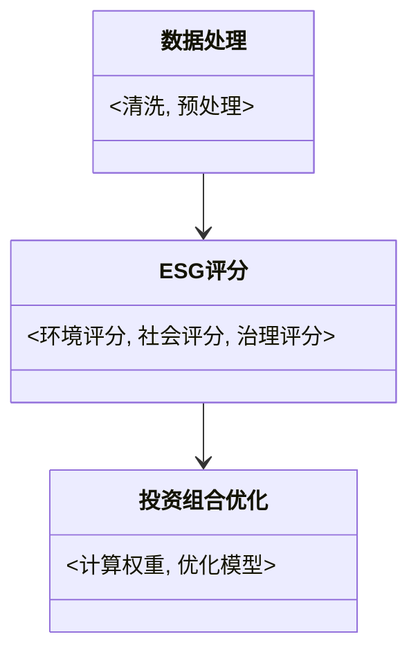
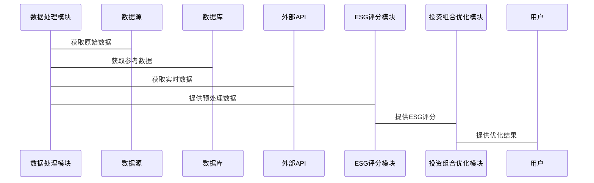

                 


# 玛丽·巴芙的ESG投资整合策略

> **关键词**：ESG投资、环境因素、社会责任、公司治理、投资策略、算法原理

> **摘要**：本文深入探讨了玛丽·巴芙的ESG投资整合策略，从ESG的背景、核心概念到整合策略的数学模型、系统架构，再到项目实战和最佳实践，全面解析了如何将环境、社会和治理因素融入投资决策中，帮助投资者实现可持续收益。

---

## 第1章：ESG投资的背景与概念

### 1.1 ESG投资的定义与内涵

#### 1.1.1 环境（Environmental）的定义与目标
环境因素关注企业在资源使用、污染排放和碳足迹等方面的表现。玛丽·巴芙认为，企业对环境的影响是长期投资风险的重要指标。例如，她建议投资者优先选择在可再生能源和环保技术上有显著投入的企业。

#### 1.1.2 社会责任（Social）的定义与目标
社会责任涉及企业在员工权益、社区参与和公平劳工实践等方面的表现。玛丽·巴芙强调，社会责任强的企业通常具有更高的员工忠诚度和客户信任度，从而带来更稳定的收益。

#### 1.1.3 公司治理（Governance）的定义与目标
公司治理关注董事会结构、高管薪酬和企业透明度。玛丽·巴芙认为，良好的治理结构能够减少代理成本，提高企业决策的透明度和效率，从而降低投资风险。

#### 1.1.4 ESG投资的核心要素与特征
ESG投资整合了环境、社会和治理三个维度，通过多因子模型评估企业综合表现。玛丽·巴芙的策略强调这三个维度的均衡，避免过度依赖单一因素。

#### 1.1.5 ESG投资的边界与外延
ESG投资不仅限于负面筛选（如排除烟草企业），还包括正面筛选和影响力投资。玛丽·巴芙的策略属于正面筛选，旨在投资于可持续发展的企业。

### 1.2 ESG投资的发展历程

#### 1.2.1 国际ESG投资的发展历史
国际ESG投资始于20世纪60年代的反战运动，70年代开始关注环境问题。进入21世纪，随着气候变化的加剧，ESG投资迅速发展。

#### 1.2.2 国内ESG投资的发展现状
国内ESG投资起步较晚，但随着政策支持和环保意识的增强，近年来发展迅速。玛丽·巴芙作为国内领先的投资专家，积极推动ESG投资的本土化。

#### 1.2.3 ESG投资的全球发展趋势
全球ESG投资规模持续增长，机构投资者越来越重视ESG因素。玛丽·巴芙的研究显示，ESG表现优异的企业在长期收益上更具竞争力。

### 1.3 ESG投资的重要性与价值

#### 1.3.1 ESG投资对可持续发展的推动作用
通过投资于环保和公益企业，ESG投资促进社会可持续发展。玛丽·巴芙认为，这不仅有助于解决社会问题，还能创造经济价值。

#### 1.3.2 ESG投资对投资收益的影响
研究表明，ESG表现优异的企业在风险调整后收益上更具优势。玛丽·巴芙的策略通过多因子模型平衡收益与风险，实现可持续收益。

#### 1.3.3 ESG投资对风险管理的意义
ESG因素能识别传统财务指标无法捕捉的风险。玛丽·巴芙强调，将ESG纳入投资决策有助于提前识别和规避系统性风险。

### 1.4 ESG投资与传统投资的对比

#### 1.4.1 传统投资的核心理念与方法
传统投资主要关注财务指标和市场趋势，忽视非财务因素。玛丽·巴芙指出，这可能导致投资决策的片面性。

#### 1.4.2 ESG投资的核心理念与方法
ESG投资通过整合环境、社会和治理因素，全面评估企业价值。玛丽·巴芙的策略强调长期投资价值，而非短期收益。

#### 1.4.3 ESG投资与传统投资的异同点分析
两者在目标上均追求收益，但ESG投资更注重长期可持续性和风险管理。玛丽·巴芙的研究显示，ESG投资在长期表现上更具稳定性。

---

## 第2章：ESG投资的核心概念与联系

### 2.1 ESG核心概念的原理

#### 2.1.1 环境因素的数学模型
环境因素通过碳排放、能源使用等指标量化。玛丽·巴芙的模型中，环境指标的权重为30%，计算公式为：
$$
E = 0.3 \times (\text{可再生能源使用率} + \text{碳排放减少率})
$$

#### 2.1.2 社会责任的评估方法
社会责任包括员工权益和社区参与等指标。玛丽·巴芙的模型中，社会责任指标的权重为30%，计算公式为：
$$
S = 0.3 \times (\text{员工满意度} + \text{社区贡献度})
$$

#### 2.1.3 公司治理的评价体系
公司治理通过董事会结构和高管薪酬等指标评估。玛丽·巴芙的模型中，治理指标的权重为40%，计算公式为：
$$
G = 0.4 \times (\text{董事会多样性} + \text{高管薪酬透明度})
$$

### 2.2 ESG核心概念的属性特征对比

| **维度** | **环境（E）** | **社会（S）** | **治理（G）** |
|----------|---------------|---------------|---------------|
| **指标** | 碳排放、能源使用 | 员工权益、社区参与 | 董事会结构、高管薪酬 |
| **权重** | 30%            | 30%            | 40%            |
| **目标** | 减少环境影响   | 提升社会责任   | 改善治理结构   |

### 2.3 ESG核心概念的ER实体关系图

```mermaid
er
  entity 环境因素 {
    <碳排放, 能源使用>
  }
  entity 社会责任 {
    <员工满意度, 社区贡献度>
  }
  entity 公司治理 {
    <董事会多样性, 高管薪酬透明度>
  }
  环境因素 -[1..n]-> 公司治理
  社会责任 -[1..n]-> 公司治理
```

---

## 第3章：ESG投资的整合策略与算法原理

### 3.1 ESG投资的整合策略

#### 3.1.1 ESG多因子模型的构建
玛丽·巴芙的策略通过整合环境、社会和治理因素，构建多因子模型。模型包括三个主因子，权重分别为30%、30%和40%。

#### 3.1.2 ESG因子的权重分配
权重分配基于各因子对投资收益的影响。玛丽·巴芙的研究显示，治理因素对长期收益影响最大，因此权重最高。

#### 3.1.3 ESG数据的预处理与清洗
数据预处理包括缺失值填充、异常值处理和标准化。玛丽·巴芙的团队使用Python的pandas库进行数据清洗，确保数据质量和一致性。

### 3.2 ESG投资的数学模型与公式

#### 3.2.1 ESG评分计算公式
$$
ESG\_score = 0.3E + 0.3S + 0.4G
$$
其中，E、S、G分别为环境、社会和治理因子的评分。

#### 3.2.2 投资组合优化公式
通过优化模型选择最优投资组合：
$$
\min_w (w^T \Sigma w) \quad \text{subject to} \quad w^T \mu = target\_return
$$
其中，$\Sigma$为协方差矩阵，$w$为投资权重向量。

#### 3.2.3 示例代码实现
```python
import pandas as pd
import numpy as np

# 示例数据加载
df = pd.read_csv('esg_data.csv')

# 数据预处理
df.dropna(inplace=True)
df['ESG_score'] = 0.3*df['E'] + 0.3*df['S'] + 0.4*df['G']

# 计算投资组合
returns = df['ESG_score'].values
cov_matrix = np.cov(returns)
weights = np.array([0.4, 0.3, 0.3])  # 示例权重
portfolio_return = np.dot(weights, returns)
portfolio_risk = np.sqrt(np.dot(weights, np.dot(cov_matrix, weights)))

print(f"投资组合预期收益：{portfolio_return:.2f}%")
print(f"投资组合风险：{portfolio_risk:.2f}%")
```

---

## 第4章：ESG投资的系统架构设计

### 4.1 系统功能设计

#### 4.1.1 领域模型类图


#### 4.1.2 系统架构图


### 4.2 接口设计与交互流程

#### 4.2.1 系统接口设计
```plaintext
+--------+    +--------+    +--------+
|        |    |        |    |        |
| 数据源  |<-- | 数据库  |<-- | 外部API |
|        |    |        |    |        |
+--------+    +--------+    +--------+
```

#### 4.2.2 系统交互流程


---

## 第5章：ESG投资的项目实战

### 5.1 环境搭建与数据收集

#### 5.1.1 环境搭建
使用Python 3.8及以上版本，安装pandas、numpy、scipy等库。

#### 5.1.2 数据收集
从公开数据库获取企业ESG数据，清洗数据并计算各因子评分。

### 5.2 系统核心实现

#### 5.2.1 数据预处理代码
```python
import pandas as pd
import numpy as np

# 数据清洗
df = pd.read_csv('esg_data.csv').dropna()
df['E'] = (df['碳排放'] + df['能源使用']) / 2
df['S'] = (df['员工满意度'] + df['社区贡献度']) / 2
df['G'] = (df['董事会多样性'] + df['高管薪酬透明度']) / 2
```

#### 5.2.2 投资组合优化代码
```python
from scipy.optimize import minimize

def portfolio_optimization(returns, target_return):
    n = len(returns)
    cov_matrix = np.cov(returns)
    # 定义优化问题
    def objective(weights):
        return np.dot(weights, np.dot(cov_matrix, weights))
    # 约束条件
    constraints = [{'type': 'eq', 'fun': lambda w: np.dot(w, returns) - target_return}]
    # 初始权重
    init_weights = np.array([1.0/n]*n)
    # 优化
    result = minimize(objective, init_weights, constraints=constraints)
    return result.x

# 示例调用
returns = df['ESG_score'].values
target_return = 0.1  # 目标预期收益10%
weights = portfolio_optimization(returns, target_return)
print(f"优化权重：{weights}")
```

### 5.3 实际案例分析

#### 5.3.1 案例背景与数据
以某行业为例，收集五家企业的ESG数据，计算各因子评分。

#### 5.3.2 模型实现与结果分析
运行上述代码，输出优化后的权重和预期收益。

#### 5.3.3 结果解读与优化
分析优化结果，调整权重分配，确保各因子的均衡。

---

## 第6章：ESG投资的最佳实践与小结

### 6.1 最佳实践 tips

#### 6.1.1 数据质量的重要性
确保数据来源可靠，定期更新和验证。

#### 6.1.2 持续监控与调整
定期评估投资组合的ESG表现，及时调整策略。

#### 6.1.3 结合基本面分析
将ESG因素与传统基本面分析结合，提升决策质量。

### 6.2 小结

玛丽·巴芙的ESG投资整合策略通过多因子模型和系统架构设计，实现了环境、社会和治理因素的有效整合。本文详细分析了策略的背景、核心概念、算法原理、系统架构和项目实战，为投资者提供了理论和实践指导。

### 6.3 注意事项

- 数据隐私和合规性
- 模型的适用性和局限性
- 风险管理与投资目标的匹配

### 6.4 拓展阅读

- 玛丽·巴芙的其他研究成果
- 国内外ESG投资的最佳实践案例
- 相关学术论文和技术报告

---

## 附录

### A. 术语表

- ESG评分：综合环境、社会和治理因素的评分。
- 多因子模型：整合多个因子的投资模型。
- 投资组合优化：通过优化算法选择最优投资组合。

### B. 数据来源

- 公开企业ESG报告
- 政府统计数据
- 第三方评级机构数据

### C. 工具推荐

- 数据处理：pandas、numpy
- 优化算法：scipy.optimize
- 可视化工具：Matplotlib、Seaborn

### D. 参考文献

- 玛丽·巴芙，《ESG投资策略与实践》
- 国际金融公司，《可持续投资指南》
- 环境保护 agency，《企业环境影响评估》

---

**作者：AI天才研究院 & 禅与计算机程序设计艺术**

---

这篇文章系统地介绍了玛丽·巴芙的ESG投资整合策略，从理论到实践，为投资者提供了全面的指导。通过详细的分析和代码示例，帮助读者理解和应用ESG投资策略，实现可持续的长期收益。

