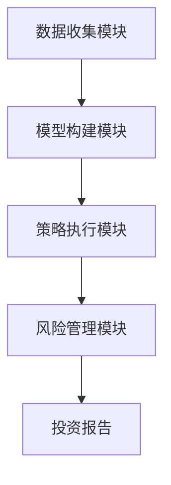

                 


# 玛丽·巴芙的全球价值投资策略

> 关键词：价值投资、玛丽·巴芙、投资策略、安全边际、内在价值、长期投资

> 摘要：本文深入探讨了玛丽·巴芙的全球价值投资策略，分析了其核心概念、算法原理、系统架构及实际应用。文章通过详细讲解内在价值评估、安全边际的重要性，结合数学模型和实际案例，系统地阐述了如何在全球市场中应用这些策略。通过项目实战部分，读者将学习如何设计并实现一个基于价值投资的股票筛选系统。

---

## 正文

### 第1章：价值投资的背景与发展

#### 1.1 价值投资的起源

价值投资是一种以基本面分析为基础的投资方法，强调通过研究公司的财务状况、行业地位和未来前景，找到市场价格低于其内在价值的股票。玛丽·巴芙作为价值投资的代表人物，将这一理念发扬光大，并在全球范围内取得了巨大成功。

##### 1.1.1 价值投资的定义与核心理念
价值投资的核心理念是寻找市场价格低于其内在价值的证券。玛丽·巴芙强调长期投资、安全边际和对公司基本面的深入研究。她的投资策略注重企业的财务健康、盈利能力以及管理团队的质量。

##### 1.1.2 玛丽·巴芙与价值投资的结合
玛丽·巴芙通过其投资实践，证明了价值投资的有效性。她强调通过深入分析企业的财务数据，寻找那些被市场低估的优质企业，并长期持有这些股票，以实现资本的增值。

##### 1.1.3 全球化视角下的价值投资演变
随着全球市场的不断发展，价值投资的策略也在不断演变。玛丽·巴芙的方法不仅适用于美国市场，还可以在全球范围内应用。投资者需要根据不同的市场环境调整其投资策略。

---

#### 1.2 玛丽·巴芙的投资理念

##### 1.2.1 长期投资与价值发现
玛丽·巴芙强调长期投资的重要性。她认为，短期市场的波动性较大，而长期投资能够平滑市场的短期波动，从而实现资本的稳健增长。她的投资策略注重发现那些具有持续竞争优势和良好财务状况的企业。

##### 1.2.2 股票分析的内在价值法
内在价值法是价值投资的核心方法之一。玛丽·巴芙通过分析企业的财务报表，估算其内在价值，并将其与市场价格进行对比，寻找那些市场价格低于内在价值的股票。

##### 1.2.3 风险管理与安全边际
安全边际是价值投资中的一个重要概念。玛丽·巴芙认为，通过购买那些市场价格远低于内在价值的股票，可以降低投资的风险。她强调，安全边际能够为投资者提供一个缓冲区，以应对市场波动和公司基本面的变化。

---

### 第2章：价值投资的核心概念与联系

#### 2.1 内在价值评估

##### 2.1.1 内在价值的定义与计算方法
内在价值是指一家企业在其持续经营基础上的公平市场价值。玛丽·巴芙使用现金流折现模型（DCF）来估算企业的内在价值。DCF模型的基本思想是将企业未来现金流的现值作为其内在价值的估计。

##### 2.1.2 现金流折现模型（DCF）的详细解释
现金流折现模型的核心在于预测企业未来的自由现金流，并将其折现为现值。公式如下：

$$
\text{内在价值} = \sum_{t=1}^{n} \frac{\text{自由现金流}_t}{(1 + r)^t} + \frac{\text{终值}}{(1 + r)^n}
$$

其中，\( r \) 是折现率，通常使用企业的加权平均资本成本（WACC）。

##### 2.1.3 市盈率与市净率的比较分析

| 指标 | 定义 | 适用场景 |
|------|------|----------|
| 市盈率（P/E） | 市场价格除以每股收益 | 适用于盈利稳定的公司 |
| 市净率（P/B） | 市场价格除以每股净资产 | 适用于净资产较多的公司 |

---

#### 2.2 安全边际的重要性

##### 2.2.1 安全边际的定义与作用
安全边际是指市场价格与内在价值之间的差距。玛丽·巴芙认为，购买那些市场价格远低于内在价值的股票，可以降低投资的风险。

##### 2.2.2 安全边际的计算与应用
安全边际可以通过以下公式计算：

$$
\text{安全边际} = \text{内在价值} - \text{市场价格}
$$

玛丽·巴芙建议投资者选择那些安全边际较大的股票，以降低投资的风险。

##### 2.2.3 安全边际在不同市场环境下的调整
在不同的市场环境下，投资者需要根据市场的波动性和企业的基本面调整安全边际的要求。例如，在市场低迷时，投资者可以接受较低的安全边际；而在市场繁荣时，投资者需要更高的安全边际。

---

#### 2.3 投资组合构建

##### 2.3.1 投资组合的分散化原则
分散化是降低投资风险的重要原则。玛丽·巴芙建议投资者将资金分散投资于不同行业和地区的股票，以降低特定行业或地区的风险。

##### 2.3.2 个股选择与权重分配
投资者在选择股票时，需要综合考虑企业的财务状况、行业地位和竞争优势。玛丽·巴芙建议投资者选择那些具有持续竞争优势和良好财务状况的企业。

##### 2.3.3 定期审视与调整策略
投资组合需要定期审视和调整。玛丽·巴芙建议投资者每年审视一次投资组合，并根据企业的基本面变化和市场环境进行调整。

---

### 第3章：价值投资的系统化方法

#### 3.1 系统化投资方法

##### 3.1.1 系统化投资的定义与优势
系统化投资是一种基于数学模型和算法的投资方法。它通过量化分析和严格的投资规则，减少人为情绪对投资决策的影响。

##### 3.1.2 系统化投资的步骤与框架

1. 确定投资目标和策略
2. 数据收集与处理
3. 模型构建与回测
4. 策略优化与执行
5. 风险管理与监控

##### 3.1.3 玛丽·巴芙策略的系统化实现

```python
import pandas as pd
import numpy as np

def calculate_intrinsic_value(company_data):
    # 输入企业数据，包括现金流、折现率等
    # 计算内在价值
    pass

def value_investing_strategy(stocks, threshold):
    # 根据安全边际筛选股票
    selected_stocks = []
    for stock in stocks:
        if stock.intrinsic_value - stock.price > threshold:
            selected_stocks.append(stock)
    return selected_stocks
```

---

#### 3.2 投资流程的系统化

##### 3.2.1 投资流程的定义与优化
系统化投资流程需要明确每个步骤的操作流程，并通过回测和优化来提高投资策略的有效性。

##### 3.2.2 系统化投资的数学模型

$$
\text{投资收益} = \sum_{i=1}^{n} w_i \times r_i
$$

其中，\( w_i \) 是第 \( i \) 只股票的权重，\( r_i \) 是第 \( i \) 只股票的收益率。

##### 3.2.3 投资策略的回测与优化

```python
def backtest(strategy, data):
    # 回测策略在历史数据上的表现
    pass

def optimize_strategy(strategy, data):
    # 优化投资策略的参数
    pass
```

---

### 第4章：价值投资的系统架构设计

#### 4.1 系统功能设计

##### 4.1.1 系统功能模块
- 数据收集模块：收集企业的财务数据和市场数据。
- 模型构建模块：构建内在价值评估模型。
- 策略执行模块：根据模型结果筛选股票。
- 风险管理模块：监控和管理投资风险。

##### 4.1.2 系统功能模块的详细说明

| 模块 | 功能 | 输入 | 输出 |
|------|------|------|------|
| 数据收集模块 | 收集企业的财务数据和市场数据 | 企业名称、时间范围 | 财务报表数据、市场数据 |
| 模型构建模块 | 构建内在价值评估模型 | 财务数据、折现率 | 内在价值 |
| 策略执行模块 | 根据模型结果筛选股票 | 内在价值、市场价格 | 符合条件的股票列表 |
| 风险管理模块 | 监控和管理投资风险 | 投资组合、市场数据 | 风险报告 |

---

#### 4.2 系统架构设计

##### 4.2.1 系统架构的定义与优势
系统架构设计是系统化投资的重要组成部分。它通过模块化设计和组件化实现，提高了系统的可维护性和可扩展性。

##### 4.2.2 系统架构设计的详细说明



---

### 第5章：价值投资的项目实战

#### 5.1 项目环境安装

##### 5.1.1 环境要求
- Python 3.8+
- pandas、numpy等数据处理库
- matplotlib、seaborn等可视化库

##### 5.1.2 数据来源
- 股票数据：Yahoo Finance
- 财务数据：公司财报

---

#### 5.2 核心实现

##### 5.2.1 数据收集与处理

```python
import pandas as pd
import requests

def get_stock_data(ticker, start_date, end_date):
    # 从Yahoo Finance获取股票数据
    pass

def get_financial_data(ticker, year):
    # 从公司财报获取财务数据
    pass
```

##### 5.2.2 内在价值计算

```python
def calculate_intrinsic_value(fcf, wacc):
    # 现金流折现模型计算内在价值
    pass
```

##### 5.2.3 策略实现

```python
def value_investing_strategy(stocks, threshold):
    # 根据安全边际筛选股票
    selected_stocks = []
    for stock in stocks:
        if stock.intrinsic_value - stock.price > threshold:
            selected_stocks.append(stock)
    return selected_stocks
```

---

#### 5.3 实际案例分析

##### 5.3.1 案例选择
选择某公司的股票进行分析，计算其内在价值，并与市场价格进行比较。

##### 5.3.2 策略应用

```python
stocks = [stock1, stock2, stock3]
threshold = 0.2
selected_stocks = value_investing_strategy(stocks, threshold)
```

---

### 第6章：总结与最佳实践

#### 6.1 总结

玛丽·巴芙的全球价值投资策略是一种基于基本面分析的投资方法，强调长期投资和安全边际。通过系统化的方法和严格的纪律，投资者可以在全球市场中找到具有投资价值的股票。

#### 6.2 最佳实践 tips

- **长期投资**：坚持长期投资，避免短期市场的波动。
- **深入研究**：对企业进行深入的研究，了解其财务状况和竞争优势。
- **分散投资**：通过分散投资降低风险。
- **定期审视**：定期审视投资组合，并根据市场环境进行调整。

#### 6.3 小结

价值投资是一种需要耐心和纪律的投资方法。通过深入研究和系统化的策略，投资者可以在全球市场中实现稳健的投资回报。

---

## 作者

作者：AI天才研究院/AI Genius Institute & 禅与计算机程序设计艺术 /Zen And The Art of Computer Programming

