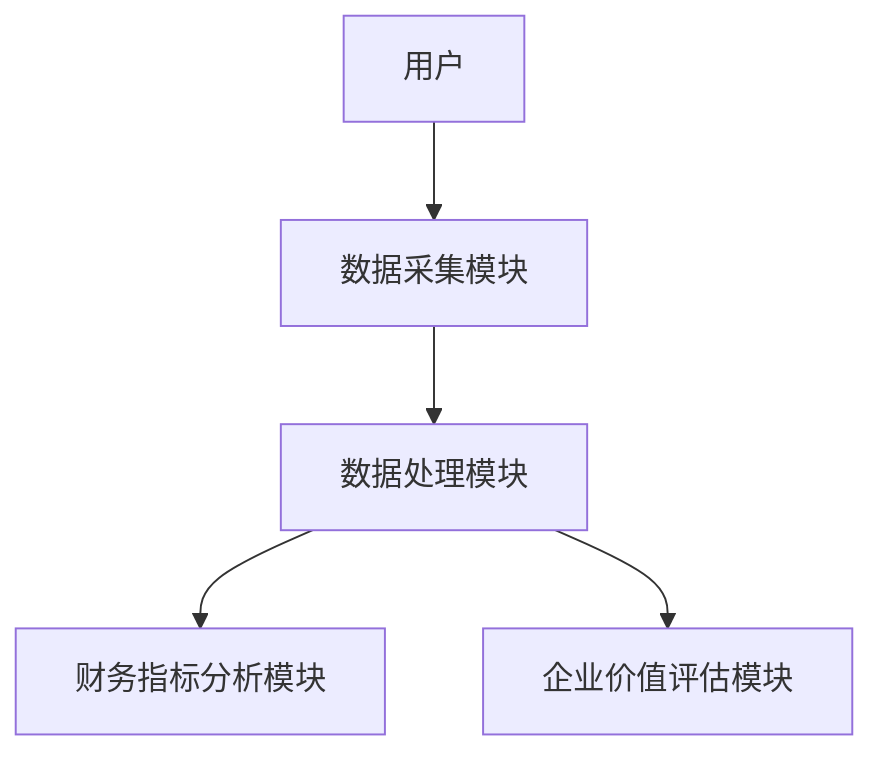
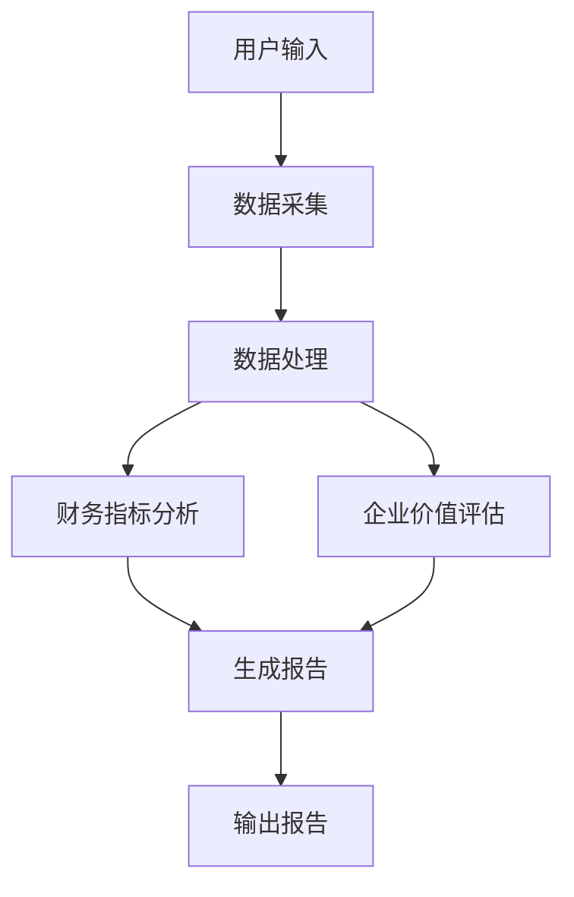

                 


# 玛丽·巴芙的成长型价值投资法

> 关键词：价值投资，成长型企业，玛丽·巴芙，投资策略，财务分析，投资组合，风险管理

> 摘要：本文系统地介绍玛丽·巴芙的成长型价值投资法，涵盖投资基础概念、价值投资核心理念、成长型企业识别与分析、投资组合构建与管理、投资决策系统设计与实现、投资实战案例分析等方面内容，通过理论与实践相结合的方式，深入剖析玛丽·巴芙投资方法的精髓，并提供可操作的具体步骤和建议。

---

# 第一部分：投资的基础概念与玛丽·巴芙的价值投资法

## 第1章：投资的基本概念与价值投资的核心理念

### 1.1 投资的基本概念

#### 1.1.1 什么是投资

投资是指将资金投入到某种资产或企业中，以期在未来获得收益或资本增值的行为。投资的本质是通过资源配置实现财富的保值与增值。

#### 1.1.2 投资的基本原则

- **长期投资**：避免频繁交易，降低交易成本和税务负担。
- **分散投资**：不要将所有资金投入到单一资产或行业，降低风险。
- **价值投资**：买入低于内在价值的资产，长期持有。

#### 1.1.3 玛丽·巴芙的价值投资法概述

玛丽·巴芙（Mary Buffett）是价值投资的代表人物，她的投资理念主要基于以下几个核心原则：
- **安全边际**：买入价格低于内在价值的资产，确保有一定的安全空间。
- **长期视角**：关注企业的长期增长潜力，而非短期市场波动。
- **基本面分析**：通过分析企业的财务报表和行业地位，评估其内在价值。

### 1.2 玛丽·巴芙的成长型投资策略

#### 1.2.1 成长型投资的定义

成长型投资是指投资于那些具有持续增长潜力的企业，这些企业通常在行业内具有竞争优势，能够保持较高的收入和利润增长。

#### 1.2.2 成长型投资的核心理念

- **高成长性**：寻找那些营业收入和净利润持续增长的企业。
- **竞争优势**：评估企业在行业内的竞争优势，如品牌、技术、成本优势等。
- **长期持有**：相信企业的长期增长潜力，避免短期交易。

#### 1.2.3 玛丽·巴芙的成长型投资方法

玛丽·巴芙的成长型投资方法结合了价值投资和成长投资的特点，具体包括以下几个步骤：
1. **识别高成长企业**：通过财务指标和行业分析，筛选出具有高增长潜力的企业。
2. **评估内在价值**：计算企业的内在价值，确定合理的买入价格。
3. **构建投资组合**：将高成长企业合理配置到投资组合中，分散风险。
4. **长期持有**：坚持长期投资，避免短期市场波动的干扰。

### 1.3 价值投资与成长型投资的联系与区别

#### 1.3.1 价值投资的定义与特点

价值投资的核心在于寻找市场价格低于内在价值的资产。投资者通过深入分析企业的基本面，寻找被市场低估的投资标的。

#### 1.3.2 成长型投资的定义与特点

成长型投资的核心在于寻找具有高增长潜力的企业，即使市场价格高于内在价值，只要企业的成长性足够，仍然具有投资价值。

#### 1.3.3 两者的核心区别与应用场景

- **核心区别**：
  - 价值投资关注价格与价值的匹配，注重安全边际。
  - 成长型投资关注企业的成长潜力，注重未来的增长空间。
- **应用场景**：
  - 价值投资适合于市场低迷或企业暂时被低估的情况。
  - 成长型投资适合于市场增长快、企业具有竞争优势的行业。

## 1.4 本章小结

通过本章的学习，读者可以理解投资的基本概念，掌握玛丽·巴芙的价值投资法和成长型投资策略的核心理念，并能够区分价值投资和成长型投资的区别与应用场景。

---

# 第二部分：价值投资的核心概念与数学模型

## 第2章：价值投资的核心概念与数学模型

### 2.1 价值投资的核心概念

#### 2.1.1 内在价值的定义

内在价值是指企业未来现金流的现值，是评估企业价值的核心指标。计算公式为：
$$ V = \frac{CF}{r - g} $$
其中，CF为企业的自由现金流，r为折现率，g为现金流增长率。

#### 2.1.2 安全边际的概念

安全边际是指买入价格与内在价值之间的差额。安全边际越大，投资的风险越小。

#### 2.1.3 股票估值的核心要素

股票估值的核心要素包括企业的财务状况、行业地位、竞争优势、未来增长潜力等。

### 2.2 投资决策的数学模型

#### 2.2.1 股票内在价值的计算公式

股票的内在价值可以通过以下公式计算：
$$ V = \frac{E}{r - g} $$
其中，E为企业的净利润，r为折现率，g为净利润增长率。

#### 2.2.2 市盈率与市净率的计算公式

- 市盈率（P/E）：
$$ P/E = \frac{Price}{Earnings} $$
- 市净率（P/B）：
$$ P/B = \frac{Price}{Book\ Value} $$

### 2.3 财务指标分析与企业价值评估

#### 2.3.1 净利润与ROE分析

- 净利润（Net Profit）：企业的净利润是衡量企业盈利能力的重要指标。
- 净资产收益率（ROE）：
$$ ROE = \frac{净利润}{净资产} $$

#### 2.3.2 营业收入与成本分析

- 营业收入（Revenue）：企业的营业收入是衡量企业销售能力的重要指标。
- 成本控制：通过分析企业的成本结构，评估企业的成本控制能力。

#### 2.3.3 现金流分析与企业偿债能力评估

- 现金流（Cash Flow）：企业的现金流是衡量企业财务健康状况的重要指标。
- 偿债能力：通过分析企业的流动比率和速动比率，评估企业的偿债能力。

### 2.4 本章小结

通过本章的学习，读者可以掌握价值投资的核心概念，包括内在价值、安全边际、市盈率、市净率等，并能够通过数学模型进行股票估值和财务分析。

---

# 第三部分：成长型企业识别与投资策略

## 第3章：成长型企业识别与投资策略

### 3.1 成长型企业的核心特征

#### 3.1.1 高成长性的定义

高成长性是指企业在未来几年内能够保持较高的收入和利润增长。

#### 3.1.2 高成长企业的财务特征

- 高成长企业的营业收入和净利润增长率通常高于行业平均水平。
- 高成长企业具有较高的ROE和ROA。

#### 3.1.3 高成长企业的竞争优势分析

- 品牌优势：企业在市场中具有强大的品牌影响力。
- 技术优势：企业拥有核心技术或专利。
- 成本优势：企业在生产过程中具有成本优势。

### 3.2 玛丽·巴芙的成长型投资策略

#### 3.2.1 长期投资与企业成长周期

玛丽·巴芙认为，投资于成长型企业需要长期持有，关注企业的成长周期，选择处于高速成长期的企业。

#### 3.2.2 选择成长型企业的标准

- 企业具有高成长性。
- 企业具有竞争优势。
- 企业估值合理。

#### 3.2.3 成长型企业投资的风险与收益分析

- 高收益：成长型企业具有较高的增长潜力，可能带来较高的回报。
- 高风险：成长型企业通常估值较高，市场波动较大。

### 3.3 投资组合的构建与管理

#### 3.3.1 投资组合的基本概念

投资组合是指将资金分配到不同的资产或企业中，以分散风险。

#### 3.3.2 成长型企业在投资组合中的配置

- 成长型企业应占投资组合的一定比例，通常为30%至50%。
- 投资组合中应包含其他类型资产，如债券、黄金等，以分散风险。

#### 3.3.3 投资组合的动态调整策略

- 定期评估投资组合的表现。
- 根据市场变化和企业情况，进行适当的调整。

### 3.4 本章小结

通过本章的学习，读者可以掌握成长型企业的核心特征，了解玛丽·巴芙的成长型投资策略，并能够合理构建和管理投资组合。

---

# 第四部分：投资决策的系统分析与架构设计

## 第4章：投资决策的系统分析与架构设计

### 4.1 投资决策系统的功能需求

#### 4.1.1 数据采集与处理模块

- 数据来源：股票市场数据、企业财务报表等。
- 数据清洗：处理缺失数据、异常数据。

#### 4.1.2 财务指标分析模块

- 计算ROE、ROA等财务指标。
- 生成财务指标分析报告。

#### 4.1.3 企业价值评估模块

- 计算内在价值。
- 生成企业价值评估报告。

### 4.2 系统架构设计

#### 4.2.1 系统模块划分

- 数据采集模块
- 数据处理模块
- 财务指标分析模块
- 企业价值评估模块

#### 4.2.2 系统数据流图



#### 4.2.3 系统功能流程图



### 4.3 本章小结

通过本章的学习，读者可以理解投资决策系统的功能需求和系统架构设计，并能够通过系统工具辅助投资决策。

---

# 第五部分：项目实战与投资策略实现

## 第5章：项目实战与投资策略实现

### 5.1 项目实战环境安装

#### 5.1.1 系统环境要求

- 操作系统：Windows、Linux、Mac
- Python版本：3.6以上
- 工具安装：安装Python、Jupyter Notebook、Pandas、Matplotlib等。

### 5.2 核心实现代码

#### 5.2.1 数据采集与处理

```python
import pandas as pd
import requests
from bs4 import BeautifulSoup

# 网站数据采集
url = "https://finance.yahoo.com"
response = requests.get(url)
soup = BeautifulSoup(response.text, 'html.parser')
data = []
for item in soup.find_all('div', class_='info'):
    name = item.find('h2').text
    price = float(item.find('div', class_='price').text)
    data.append({'Name': name, 'Price': price})

df = pd.DataFrame(data)
print(df)
```

#### 5.2.2 财务指标分析

```python
import pandas as pd

# 计算ROE
df['ROE'] = df['净利润'] / df['净资产']

# 计算ROA
df['ROA'] = df['净利润'] / df['营业收入']
```

#### 5.2.3 企业价值评估

```python
# 计算内在价值
def calculate_intrinsic_value(enterprise, r, g):
    return enterprise['净利润'] / (r - g)

enterprise_value = calculate_intrinsic_value(df.iloc[0], 0.1, 0.05)
print(enterprise_value)
```

### 5.3 实战案例分析

#### 5.3.1 案例背景介绍

以某成长型企业为例，分析其财务指标和企业价值。

#### 5.3.2 投资决策分析

通过财务指标分析和企业价值评估，确定是否投资该企业。

#### 5.3.3 投资组合管理

根据投资策略，将该企业纳入投资组合，并进行动态调整。

### 5.4 本章小结

通过本章的学习，读者可以掌握投资决策系统的实际应用，能够通过系统工具辅助投资决策，并能够通过实际案例分析进一步理解投资策略的实现。

---

# 第六部分：总结与展望

## 第6章：总结与展望

### 6.1 本书总结

玛丽·巴芙的成长型价值投资法结合了价值投资和成长型投资的特点，通过深入分析企业的财务状况和行业地位，寻找具有高成长潜力的企业，长期持有，实现财富的增值。

### 6.2 未来展望

随着市场环境的变化和科技的进步，投资方法也在不断创新。未来，投资者需要更加注重企业的创新能力和竞争优势，灵活调整投资策略，以应对市场的变化。

---

# 作者

作者：AI天才研究院/AI Genius Institute & 禅与计算机程序设计艺术 /Zen And The Art of Computer Programming

