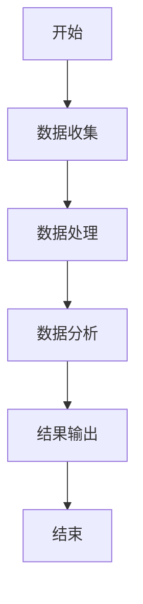
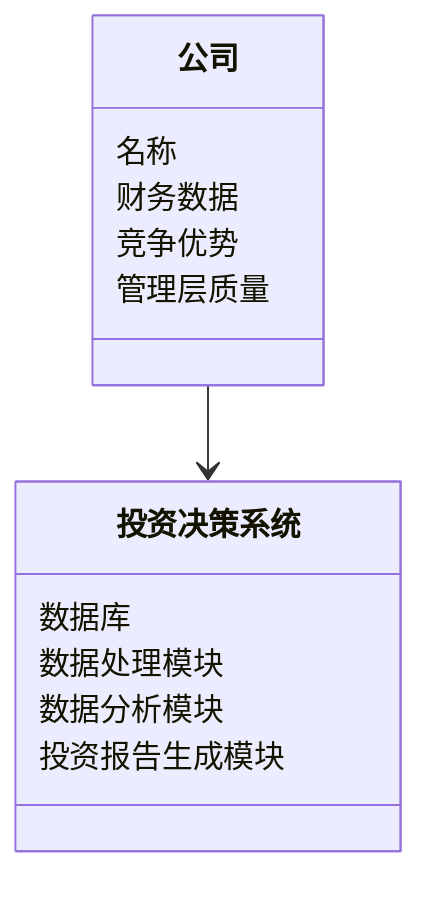
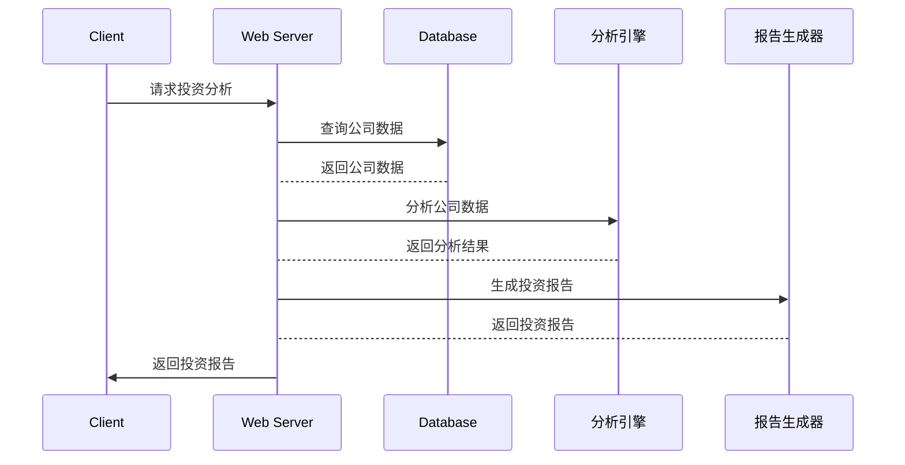

                 


# 玛丽·巴芙达的质量型价值投资理念

## 关键词：质量型投资，玛丽·巴芙达，价值投资，竞争优势，财务健康

## 摘要：玛丽·巴芙达作为巴菲特的导师，提出了质量型价值投资的理念，强调通过分析公司的竞争优势、财务健康和管理层质量来选择投资标的。本文将详细介绍这一理念的核心概念、算法原理、系统架构以及实际应用，帮助读者理解如何通过技术手段实现高质量的投资决策。

---

# 第1章: 质量型价值投资的背景与核心概念

## 1.1 投资理念的演变与质量型投资的兴起

### 1.1.1 传统投资理念的局限性

传统投资策略往往依赖短期市场波动和价格波动，这种方法难以在长期获得稳定的收益。投资者常常陷入追涨杀跌的陷阱，导致收益不稳定。

### 1.1.2 质量型投资的定义与特点

质量型投资是一种以公司质量为核心的投资策略，强调选择具有强大竞争优势、财务健康和优秀管理层的公司。其特点包括长期持有、注重基本面分析和分散投资。

### 1.1.3 玛丽·巴芙达在投资史上的地位

玛丽·巴芙达是巴菲特的导师，她的投资理念对现代投资理论产生了深远影响。她的质量型投资理念强调长期价值，而非短期价格波动。

## 1.2 质量型价值投资的核心要素

### 1.2.1 企业竞争优势的评估

企业竞争优势包括市场地位、产品差异化、成本优势和创新能力。通过分析这些因素，可以判断公司是否具备持续的竞争优势。

### 1.2.2 财务健康状况的分析

财务健康包括盈利能力、资产负债情况和现金流状况。健康的财务状况是公司长期稳定发展的基础。

### 1.2.3 管理层质量的重要性

管理层的质量直接影响公司的战略制定和执行能力。优秀管理层能够带领公司持续创新和适应市场变化。

## 1.3 质量型价值投资与其他投资策略的对比

### 1.3.1 与成长型投资的对比

成长型投资关注高增长潜力的公司，而质量型投资关注稳定增长的公司。两者的区别在于，成长型投资更注重未来增长，而质量型投资更注重当前的稳定性和持续性。

### 1.3.2 与价值型投资的对比

价值型投资关注低估值的公司，而质量型投资关注具有高质量的公司。两者的区别在于，价值型投资注重价格，而质量型投资注重质量。

### 1.3.3 与趋势投资的对比

趋势投资关注市场趋势，而质量型投资关注公司基本面。趋势投资依赖短期市场变化，而质量型投资注重长期价值。

## 1.4 质量型价值投资的适用场景与边界

### 1.4.1 适用的市场环境

质量型投资适用于长期稳定的市场环境，特别适合那些具有持续竞争优势的行业。

### 1.4.2 不适用的情况与限制

质量型投资不适用于市场波动剧烈或公司基本面不稳定的时期。此外，对于周期性较强的行业，质量型投资的效果可能有限。

### 1.4.3 投资组合的构建策略

构建投资组合时，应注重分散投资，避免过度集中。同时，定期审视投资标的，确保其持续符合质量型投资的标准。

## 1.5 本章小结

质量型价值投资以公司质量为核心，注重长期稳定增长，适合那些具有强大竞争优势、财务健康和优秀管理层的公司。其核心要素包括竞争优势、财务健康和管理层质量，与成长型、价值型和趋势型投资有明显区别。

---

# 第2章: 质量型价值投资的核心概念与联系

## 2.1 质量型价值投资的原理

### 2.1.1 企业竞争优势的分析框架

企业竞争优势的分析框架包括市场地位、产品差异化、成本优势和创新能力。通过分析这些因素，可以判断公司是否具备持续的竞争优势。

### 2.1.2 财务健康状况的评估指标

财务健康状况的评估指标包括盈利能力、资产负债情况和现金流状况。健康的财务状况是公司长期稳定发展的基础。

### 2.1.3 管理层质量的评估标准

管理层的质量评估标准包括领导力、战略制定能力和执行能力。优秀管理层能够带领公司持续创新和适应市场变化。

## 2.2 核心概念对比表

| 投资策略 | 核心要素                | 优劣势对比                     |
|----------|-------------------------|-------------------------------|
| 成长型   | 高增长潜力              | 优点：高增长潜力；缺点：风险较高 |
| 价值型   | 低估值                  | 优点：价格优势；缺点：质量可能较低 |
| 质量型   | 竞争优势、财务健康、管理层质量 | 优点：长期稳定；缺点：短期表现可能不佳 |

## 2.3 实体关系图（ER图）

使用 Mermaid 绘制的 ER 图如下：

```mermaid
erd
    竞争优势
    财务健康
    管理层质量
    公司
    公司 <--1..n--> 竞争优势
    公司 <--1..n--> 财务健康
    公司 <--1..n--> 管理层质量
```

---

# 第3章: 质量型价值投资的算法原理

## 3.1 算法原理概述

质量型价值投资的算法原理是通过分析公司的竞争优势、财务健康和管理层质量，筛选出具有高质量的公司进行投资。

### 3.1.1 投资决策的逻辑框架

投资决策的逻辑框架包括数据收集、数据处理、数据分析和结果输出。

## 3.2 使用 Mermaid 绘制算法流程图



### 3.2.1 数据收集

数据收集包括收集公司的财务数据、市场数据和管理层数据。

### 3.2.2 数据处理

数据处理包括清洗数据、转换数据和标准化数据。

### 3.2.3 数据分析

数据分析包括计算财务指标、评估竞争优势和评估管理层质量。

### 3.2.4 结果输出

结果输出包括筛选出具有高质量的公司并生成投资报告。

## 3.3 使用 Python 实现投资筛选算法

以下是使用 Python 实现投资筛选算法的示例代码：

```python
import pandas as pd

# 数据收集
data = pd.read_csv('company_data.csv')

# 数据处理
data_cleaned = data.dropna()

# 数据分析
data_cleaned['ROE'] = data_cleaned['净利润'] / data_cleaned['净资产']
data_cleaned['毛利率'] = (data_cleaned['营业收入'] - data_cleaned['营业成本']) / data_cleaned['营业收入']

# 筛选高质量公司
high_quality_companies = data_cleaned[(data_cleaned['ROE'] > 0.1) & (data_cleaned['毛利率'] > 0.2)]
```

## 3.4 算法的数学模型与公式

### 3.4.1 净资产收益率（ROE）公式

ROE = 净利润 / 净资产

### 3.4.2 毛利率公式

毛利率 = (营业收入 - 营业成本) / 营业收入

---

# 第4章: 系统分析与架构设计方案

## 4.1 问题场景介绍

投资决策系统的应用场景包括个人投资、机构投资和财富管理。

## 4.2 项目介绍

这是一个基于质量型价值投资理念的投资决策支持系统，旨在帮助投资者筛选出具有高质量的公司进行投资。

## 4.3 系统功能设计

### 4.3.1 领域模型 Mermaid 类图



### 4.3.2 系统架构设计

使用 Mermaid 绘制系统架构图：

```mermaid
archi
    Client
    Web Server
    Database
    分析引擎
    报告生成器
    Client <-- HTTP --> Web Server
    Web Server --> Database
    Web Server --> 分析引擎
    分析引擎 --> Database
    分析引擎 --> 报告生成器
    报告生成器 --> Web Server
    Web Server --> Client
```

### 4.3.3 系统接口设计

系统接口包括数据接口、分析接口和报告生成接口。

### 4.3.4 系统交互 Mermaid 序列图



---

# 第5章: 项目实战

## 5.1 环境安装

安装 Python 和必要的库，如 pandas 和 numpy。

## 5.2 核心实现代码

以下是核心实现代码：

```python
import pandas as pd

# 数据收集
data = pd.read_csv('company_data.csv')

# 数据处理
data_cleaned = data.dropna()

# 数据分析
data_cleaned['ROE'] = data_cleaned['净利润'] / data_cleaned['净资产']
data_cleaned['毛利率'] = (data_cleaned['营业收入'] - data_cleaned['营业成本']) / data_cleaned['营业收入']

# 筛选高质量公司
high_quality_companies = data_cleaned[(data_cleaned['ROE'] > 0.1) & (data_cleaned['毛利率'] > 0.2)]
```

## 5.3 代码应用解读与分析

通过上述代码，我们可以筛选出具有高 ROE 和毛利率的公司，这些公司具有较强的财务健康和竞争优势。

## 5.4 实际案例分析

以某个行业的公司为例，分析其是否符合质量型投资的标准。

## 5.5 项目小结

通过项目实战，我们可以更好地理解质量型价值投资的理念，并将其应用于实际投资决策中。

---

# 第6章: 最佳实践

## 6.1 小结

质量型价值投资是一种以公司质量为核心的投资策略，注重长期稳定增长，适合那些具有强大竞争优势、财务健康和优秀管理层的公司。

## 6.2 注意事项

在实际应用中，需要注意市场环境的变化，定期审视投资标的，避免过度集中投资。

## 6.3 未来趋势

随着技术的进步，质量型价值投资将更加依赖于数据分析和人工智能技术，未来可能会出现更多基于大数据的投资策略。

## 6.4 拓展阅读

推荐一些与质量型价值投资相关的书籍和资源。

---

# 附录

## 附录1: 经典书籍推荐

1. 《巴菲特选股术》
2. 《投资的智慧》
3. 《投资学原理》

## 附录2: 工具与资源推荐

1. Python 和相关库（pandas, numpy）
2. 数据分析工具（Excel, Tableau）
3. 投资分析平台（Morningstar, Yahoo Finance）

---

# 作者：AI天才研究院/AI Genius Institute & 禅与计算机程序设计艺术 /Zen And The Art of Computer Programming

---

以上是《玛丽·巴芙达的质量型价值投资理念》的完整目录大纲和文章内容。希望这篇文章能够帮助读者更好地理解质量型价值投资的理念，并将其应用于实际投资决策中。

