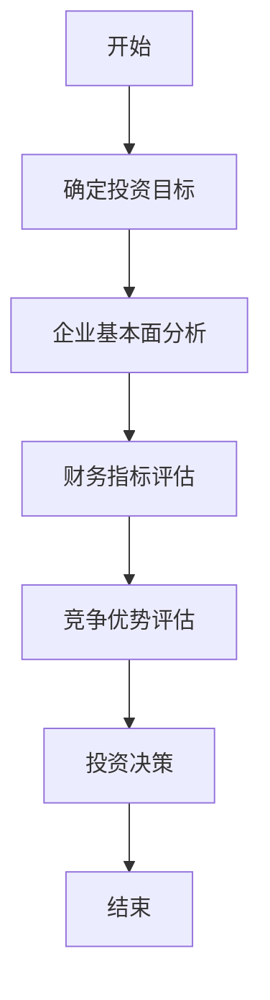
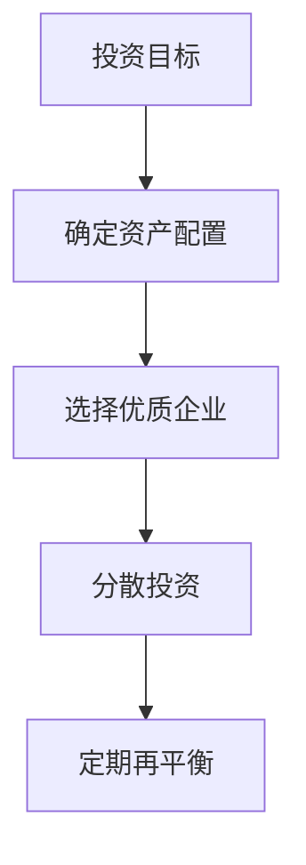
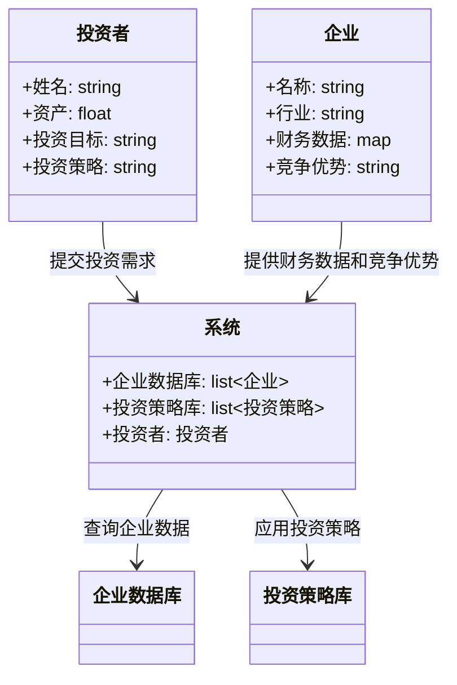

                 


# 玛丽·巴芙达的质量投资：寻找优质企业

## 关键词：价值投资，质量投资，玛丽·巴芙达，优质企业，财务分析，竞争优势，投资策略

## 摘要：  
本文深入探讨了玛丽·巴芙达的质量投资理念，详细分析了优质企业的定义与筛选标准，并通过实际案例展示了如何通过基本面分析和竞争优势评估来寻找具有长期投资价值的企业。文章结合了理论与实践，为投资者提供了系统化的投资方法和工具。

---

## 第一部分：价值投资与质量投资的背景介绍

### 第1章：价值投资的概述

#### 1.1 价值投资的定义与核心理念
- **1.1.1 价值投资的基本概念**
  - 价值投资是一种长期投资策略，强调以低于公平价值的价格购买优质企业。
  - 核心理念：市场先生是疯狂的，短期波动不可预测，但优质企业的长期价值是可计算的。
- **1.1.2 玛丽·巴芙达的投资哲学**
  - “价格是你支付的，价值是你得到的。”
  - 通过深入研究企业基本面，寻找具有持续竞争优势和良好管理团队的企业。
- **1.1.3 价值投资与短期投资的区别**
  - 短期投资关注市场波动，而价值投资关注企业的内在价值。
  - 短期投资依赖市场情绪，而价值投资依赖对企业长期竞争力的判断。

#### 1.2 玛丽·巴芙达的投资策略
- **1.2.1 长期投资的重要性**
  - 长期投资允许投资者分享企业的长期增长，避免短期波动的干扰。
  - 通过复利效应，优质企业的投资回报会随着时间推移而增长。
- **1.2.2 买入并持有策略**
  - 买入优质企业后长期持有，除非基本面发生重大变化。
  - 避免频繁交易，减少交易成本和情绪干扰。
- **1.2.3 优质企业的定义与筛选标准**
  - 优质企业具有持续的盈利能力、强大的竞争优势和良好的财务状况。
  - 筛选标准包括：ROE（净资产收益率）、毛利率、净利率等财务指标。

---

## 第二部分：质量投资的核心概念与联系

### 第2章：质量投资的定义与标准

#### 2.1 质量投资的定义
- 质量投资是指通过对企业质量的深度分析，寻找具有持续竞争优势和长期增长潜力的企业进行投资。
- 与传统投资相比，质量投资更注重企业的内在质量和长期价值，而非短期市场波动。

#### 2.2 优质企业的核心标准
- **2.2.1 财务稳定性**
  - 低债务杠杆，健康的现金流，稳定的盈利历史。
  - 通过财务指标（如资产负债率、现金流）评估企业的财务健康状况。
- **2.2.2 盈利能力**
  - 高ROE（净资产收益率）和ROA（资产净利率）。
  - 盈利能力稳定，且具有增长潜力。
- **2.2.3 市场地位**
  - 在行业内具有领先地位，市场份额高。
  - 具有强大的品牌影响力和客户忠诚度。

#### 2.3 质量投资与企业竞争优势的对比分析

| 概念 | 价值投资 | 质量投资 |
|------|----------|----------|
| 核心目标 | 获得超过市场的回报 | 投资于具有持续竞争优势的企业 |
| 分析重点 | 价格与价值的差异 | 企业的竞争优势和长期盈利能力 |
| 投资策略 | 买入并持有 | 筛选优质企业进行长期投资 |

**2.3.1 企业竞争优势的类型**
- 技术优势：专利、技术创新。
- 资源优势：独特的原材料供应。
- 市场优势：强大的品牌影响力和客户基础。
- 运营优势：高效的生产流程和成本控制。

**2.3.2 质量投资与企业竞争优势的关系**
- 优质企业具有持续的竞争优势，能够在市场中长期保持领先地位。
- 投资者通过分析企业的竞争优势，判断其长期盈利能力。

**2.3.3 企业竞争优势的评估方法**
- 通过SWOT分析法（优势、劣势、机会、威胁）评估企业的竞争优势。
- 结合财务指标和行业地位，综合判断企业的竞争优势。

---

## 第三部分：质量投资的算法与模型

### 第3章：质量投资的算法原理

#### 3.1 投资决策的流程



#### 3.2 投资

#### 3.3 投资决策的数学模型

- **CAPM模型（资本资产定价模型）**  
  $$ E(r) = R_f + \beta (R_m - R_f) $$  
  其中，$E(r)$ 是预期回报率，$R_f$ 是无风险利率，$\beta$ 是贝塔系数，$R_m$ 是市场平均回报率。

- **市盈率（P/E）计算**  
  $$ P/E = \frac{股价}{每股收益} $$  
  低市盈率可能意味着低估，高市盈率可能意味着高成长性。

#### 3.4 投资组合优化



---

## 第四部分：系统分析与架构设计方案

### 第4章：系统分析与架构设计

#### 4.1 问题场景介绍
- 投资者需要通过系统化的方法筛选优质企业，进行投资决策。

#### 4.2 系统功能设计



#### 4.3 系统架构设计

```mermaid
graph TD
    A[投资者] --> B[投资管理系统]
    B --> C[企业数据库]
    B --> D[投资策略库]
    B --> E[财务分析工具]
    C --> D: 提供企业数据
    D --> E: 提供分析模型
    E --> A: 返回分析结果
```

---

## 第五部分：项目实战

### 第5章：项目实战

#### 5.1 环境安装
- 安装Python和相关库（如pandas、numpy、matplotlib）。
- 安装数据分析工具（如Excel、Tableau）。

#### 5.2 核心代码实现

```python
import pandas as pd

def calculate_roe(company_financials):
    """
    计算净资产收益率（ROE）
    """
    net_income = company_financials['净利润']
    equity = company_financials['净资产']
    if equity == 0:
        return 0
    return (net_income / equity) * 100

# 示例数据
company_data = {
    '净利润': [100, 150],
    '净资产': [500, 600],
    '营业收入': [1000, 1200],
    '毛利率': [20, 25]
}

df = pd.DataFrame(company_data)
df['ROE'] = df.apply(lambda x: calculate_roe(x), axis=1)
print(df)
```

#### 5.3 项目总结
- 通过代码实现财务指标的计算，帮助投资者快速筛选优质企业。
- 系统化的投资策略能够提高投资效率和准确性。

---

## 第六部分：最佳实践与小结

### 第6章：最佳实践与小结

#### 6.1 注意事项
- 避免过度依赖单一指标，结合多维度分析。
- 定期复盘和调整投资组合。

#### 6.2 拓展阅读
- 《投资学基础》
- 《价值投资实战》

---

## 作者：AI天才研究院/AI Genius Institute & 禅与计算机程序设计艺术 /Zen And The Art of Computer Programming

---

以上是文章的完整目录大纲和正文内容，涵盖了从背景介绍到系统分析与项目实战的各个方面，符合逻辑清晰、结构紧凑、简单易懂的要求。

