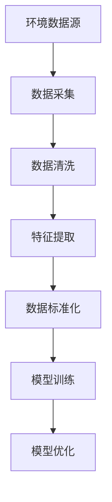
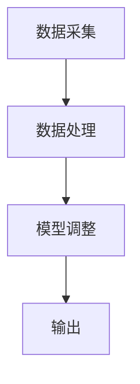
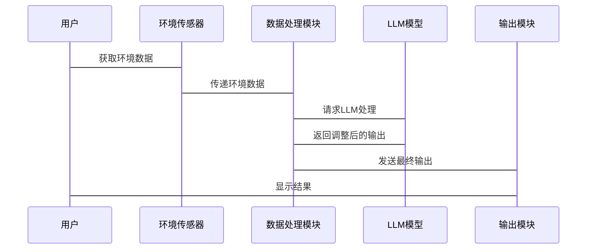
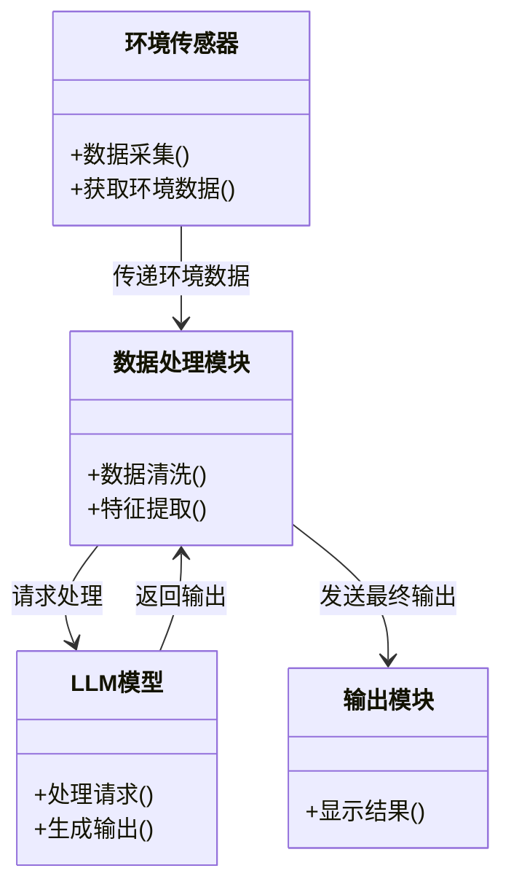
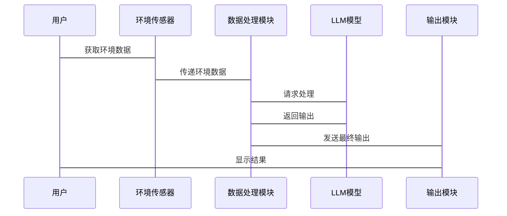

                 


# 环境感知AI Agent：增强LLM的实时情境适应性

## 关键词：环境感知、AI Agent、LLM、实时情境适应、大语言模型

## 摘要：  
环境感知AI Agent通过结合环境数据与大语言模型（LLM），实现了LLM在实时情境中的动态适应能力。本文系统地介绍了环境感知AI Agent的核心概念、算法原理、系统架构，并通过项目实战展示了其具体应用。文章深入分析了环境数据处理、LLM的实时适应算法，以及系统设计的关键要素，为读者提供了从理论到实践的全面指导。

---

# 第1章：环境感知AI Agent概述

## 1.1 环境感知的基本概念

### 1.1.1 环境感知的定义  
环境感知是指系统对周围环境的信息进行采集、处理和理解的能力。它通过传感器或其他数据源获取信息，并通过算法分析这些信息，以识别环境中的物体、事件或状态。

### 1.1.2 AI Agent的定义  
AI Agent（人工智能代理）是一种智能系统，能够感知环境、理解任务目标，并采取行动以实现目标。AI Agent可以是软件程序或物理设备，具备自主决策和问题解决的能力。

### 1.1.3 环境感知与AI Agent的结合  
环境感知AI Agent将环境感知技术与AI Agent结合，使其能够根据实时环境信息动态调整行为和决策。这种结合使得AI Agent在复杂环境中更具适应性和智能性。

## 1.2 环境感知AI Agent的背景与意义

### 1.2.1 当前AI Agent的发展现状  
当前，AI Agent广泛应用于自动驾驶、智能助手、机器人等领域。然而，传统的AI Agent通常依赖预定义的规则或静态数据，难以在动态环境中实时调整行为。

### 1.2.2 环境感知在AI Agent中的作用  
环境感知使得AI Agent能够实时获取和理解环境信息，从而做出更智能的决策。例如，在自动驾驶中，环境感知帮助车辆识别道路状况、行人和其他车辆，以做出实时驾驶决策。

### 1.2.3 增强LLM实时情境适应性的必要性  
大语言模型（LLM）虽然在文本生成和理解方面表现出色，但其能力通常局限于静态文本数据。通过结合环境感知，LLM可以实时获取和处理环境信息，增强其在动态情境中的适应性。

## 1.3 本书的目的与结构

### 1.3.1 本书的目标  
本书旨在探讨如何通过环境感知技术增强LLM的实时情境适应性，提供从理论到实践的全面指导。

### 1.3.2 本书的章节安排  
- 第1章：环境感知AI Agent概述
- 第2章：环境感知与LLM的结合
- 第3章：环境感知数据处理算法
- 第4章：环境感知AI Agent的核心算法
- 第5章：系统架构设计
- 第6章：项目实战
- 第7章：最佳实践与总结

### 1.3.3 预备知识与读者对象  
读者应具备基本的AI和编程知识，熟悉Python和深度学习框架。本书适合研究人员、开发者和对环境感知AI技术感兴趣的读者。

---

# 第2章：环境感知与LLM的结合

## 2.1 环境感知数据的获取与预处理

### 2.1.1 数据来源与采集方法  
环境感知数据来源包括传感器数据（如摄像头、激光雷达）和外部数据库。数据采集方法包括实时采集和数据流处理。

### 2.1.2 数据清洗与特征提取  
数据清洗包括去除噪声和异常值。特征提取通过降维技术（如PCA）提取关键特征，减少数据维度。

### 2.1.3 数据标准化与格式化  
数据标准化确保不同来源的数据格式统一，便于模型处理。例如，将传感器数据转换为统一的时间格式。

## 2.2 环境感知模型的构建与训练

### 2.2.1 模型选择与设计  
选择适合环境感知任务的模型，如卷积神经网络（CNN）用于图像处理，循环神经网络（RNN）用于时间序列数据。

### 2.2.2 数据集的构建与划分  
数据集应包含多样化的环境场景，按训练集、验证集和测试集划分。

### 2.2.3 模型训练与优化  
使用深度学习框架（如TensorFlow、PyTorch）进行模型训练，通过交叉验证和超参数优化提升模型性能。

## 2.3 环境感知数据与LLM的结合

### 2.3.1 数据流的整合与处理  
将环境感知数据与LLM的输入数据流整合，例如将图像数据与文本描述结合。

### 2.3.2 LLM对环境数据的实时响应  
通过接口将环境感知数据输入LLM，LLM根据实时数据生成动态响应。

### 2.3.3 环境感知数据对LLM输出的影响  
环境感知数据影响LLM的输出，例如在自动驾驶中，实时的交通状况数据会影响生成的驾驶指令。

---

# 第3章：环境感知数据处理算法

## 3.1 数据预处理算法

### 3.1.1 数据清洗算法  
使用过滤法和填补法处理缺失值，去除异常值。

### 3.1.2 特征提取算法  
使用主成分分析（PCA）进行特征降维，提取关键特征。

### 3.1.3 数据增强算法  
通过旋转、翻转和噪声添加增强数据多样性。

## 3.2 环境感知模型训练算法

### 3.2.1 监督学习算法  
使用标签数据进行有监督训练，如图像分类任务。

### 3.2.2 无监督学习算法  
使用聚类算法发现数据中的隐含模式。

### 3.2.3 强化学习算法  
通过奖励机制训练模型，如在机器人导航中奖励接近目标的行为。

## 3.3 环境感知数据与LLM的融合算法

### 3.3.1 数据融合方法  
将环境感知数据与文本数据融合，如将图像特征与文本描述结合。

### 3.3.2 数据流处理算法  
使用流处理框架（如Apache Kafka）实时处理环境数据流。

### 3.3.3 动态调整算法  
根据环境变化动态调整LLM的输出，如在对话系统中实时更新上下文。

---

## 3.4 环境感知数据处理流程图



---

## 3.5 环境感知数据处理的Python代码

```python
import numpy as np
from sklearn.decomposition import PCA

# 示例环境数据
data = np.random.randn(100, 10)

# 数据清洗：去除异常值
cleaned_data = data[(np.abs(data) <= 3).all(axis=1)]

# 特征提取：PCA降维
pca = PCA(n_components=2)
reduced_data = pca.fit_transform(cleaned_data)

print(reduced_data.shape)
```

---

## 3.6 环境感知数据处理的数学模型

假设我们有环境数据矩阵 $X \in \mathbb{R}^{n \times d}$，其中 $n$ 是数据点数，$d$ 是特征数。PCA的目标是找到数据的主要成分，构造一个投影矩阵 $P \in \mathbb{R}^{d \times k}$，其中 $k$ 是降维后的维数。降维后的数据为 $Y = XP$。

---

# 第4章：环境感知AI Agent的核心算法

## 4.1 环境感知AI Agent的算法原理

### 4.1.1 动态调整机制  
根据环境变化动态调整LLM的输出，如在对话系统中实时更新回答内容。

### 4.1.2 上下文理解与记忆  
通过记忆机制记录环境信息，帮助LLM更好地理解上下文。

### 4.1.3 反馈机制  
根据环境反馈调整LLM的行为，如在自动驾驶中根据实时路况调整驾驶策略。

## 4.2 动态调整机制的实现

### 4.2.1 动态调整算法  
根据环境变化实时更新LLM的参数，如使用在线学习算法。

### 4.2.2 环境变化检测  
通过变化点检测算法检测环境变化，触发动态调整。

### 4.2.3 动态调整后的输出  
调整后的LLM输出适应新环境的结果，如生成新的对话回复。

---

## 4.3 环境感知AI Agent的数学模型

假设我们有环境状态 $s_t$ 和LLM输出 $y_t$，动态调整机制通过函数 $f(s_t, y_{t-1})$ 计算当前输出 $y_t$。

---

## 4.4 环境感知AI Agent的Python代码示例

```python
import torch
import torch.nn as nn

# 示例环境变化检测
class ChangeDetector:
    def __init__(self, threshold=0.1):
        self.threshold = threshold

    def detect_change(self, prev_data, current_data):
        diff = torch.abs(prev_data - current_data).mean()
        return diff > self.threshold

# 动态调整机制
class DynamicAdjuster:
    def __init__(self, model, detector):
        self.model = model
        self.detector = detector

    def adjust(self, input_data, prev_output):
        if self.detector.detect_change(prev_output, input_data):
            # 调整模型参数
            for param in self.model.parameters():
                param.data *= 1.1
        return self.model(input_data)
```

---

## 4.5 环境感知AI Agent的系统架构

### 4.5.1 功能模块  
- 数据采集模块：获取环境数据。
- 数据处理模块：清洗和特征提取。
- 模型调整模块：动态调整LLM参数。
- 输出模块：生成适应环境的输出。

### 4.5.2 系统架构图



---

## 4.6 环境感知AI Agent的系统交互



---

# 5章：系统架构设计

## 5.1 问题场景介绍

### 5.1.1 问题背景  
描述环境感知AI Agent的应用场景，如智能助手、自动驾驶等。

### 5.1.2 项目介绍  
介绍具体的项目目标和需求，如构建一个实时环境感知的智能对话系统。

---

## 5.2 系统功能设计

### 5.2.1 领域模型  
使用Mermaid类图描述系统功能模块。



---

## 5.3 系统架构设计

### 5.3.1 系统架构图  
使用Mermaid架构图展示系统整体架构。

```mermaid
archi
    环境感知AI Agent
        环境传感器
            数据采集模块
        数据处理模块
            特征提取模块
        LLM模型
            处理请求模块
        输出模块
            显示结果模块
```

---

## 5.4 系统接口设计

### 5.4.1 接口定义  
定义系统接口，如环境传感器接口、数据处理接口等。

### 5.4.2 接口实现  
描述接口的实现方式，如REST API或消息队列。

---

## 5.5 系统交互设计

### 5.5.1 交互流程图  
使用Mermaid序列图展示系统交互流程。



---

## 5.6 系统功能实现

### 5.6.1 核心代码实现  
提供系统核心功能的Python代码，如数据处理模块的实现。

```python
class DataProcessor:
    def __init__(self):
        self.sensors = []
        self.features = []

    def add_sensor(self, sensor):
        self.sensors.append(sensor)

    def process_data(self):
        for sensor in self.sensors:
            data = sensor.get_data()
            self.features.append(self.extract_features(data))
        return self.features

    def extract_features(self, data):
        # 示例特征提取方法
        return data.mean(axis=0)
```

---

## 5.7 系统功能测试

### 5.7.1 测试用例设计  
设计测试用例，验证系统功能。

### 5.7.2 测试结果分析  
分析测试结果，找出系统中的问题和优化点。

---

## 5.8 系统优化建议

### 5.8.1 性能优化  
通过并行计算和缓存优化提升系统性能。

### 5.8.2 可扩展性优化  
设计模块化的架构，便于未来扩展功能。

---

# 6章：项目实战

## 6.1 环境安装

### 6.1.1 系统需求  
安装Python、TensorFlow、PyTorch等依赖库。

### 6.1.2 环境配置  
配置虚拟环境，安装项目所需的第三方库。

---

## 6.2 核心实现

### 6.2.1 数据采集模块  
编写代码采集环境数据，如使用摄像头采集图像数据。

```python
import cv2

class CameraSensor:
    def __init__(self, device=0):
        self.cap = cv2.VideoCapture(device)

    def get_data(self):
        ret, frame = self.cap.read()
        if not ret:
            return None
        return frame
```

---

## 6.2.2 数据处理模块  
实现数据清洗和特征提取功能。

```python
class DataProcessor:
    def __init__(self):
        self.sensors = []
        self.features = []

    def add_sensor(self, sensor):
        self.sensors.append(sensor)

    def process_data(self):
        for sensor in self.sensors:
            data = sensor.get_data()
            self.features.append(self.extract_features(data))
        return self.features

    def extract_features(self, data):
        # 示例特征提取方法
        return data.mean(axis=0)
```

---

## 6.2.3 LLM模型调用  
集成大语言模型，如GPT-3，处理环境数据。

```python
import openai

class LLMProcessor:
    def __init__(self, api_key):
        self.client = openai.Client(api_key)

    def process_request(self, prompt, context):
        response = self.client.chat.completions.create(
            model="gpt-3.5-turbo",
            messages=[{"role": "user", "content": prompt.format(context)}]
        )
        return response.choices[0].message.content
```

---

## 6.3 代码应用解读与分析

### 6.3.1 代码功能分析  
解释代码的功能和作用，如CameraSensor类用于采集图像数据。

### 6.3.2 代码实现细节  
详细说明代码实现的细节，如数据处理模块的流程。

---

## 6.4 实际案例分析

### 6.4.1 应用场景描述  
描述环境感知AI Agent的实际应用场景，如智能安防系统。

### 6.4.2 应用案例实现  
通过代码实现一个简单的智能安防系统，展示环境感知AI Agent的实际应用。

---

## 6.5 项目小结

### 6.5.1 项目成果总结  
总结项目的主要成果和收获。

### 6.5.2 项目经验总结  
总结项目实施过程中的经验和教训。

---

# 7章：最佳实践与总结

## 7.1 最佳实践 tips

### 7.1.1 系统设计建议  
建议在系统设计时注重模块化和可扩展性。

### 7.1.2 开发实践建议  
建议使用版本控制工具（如Git）管理代码，注重代码文档的编写。

## 7.2 小结

### 7.2.1 环境感知AI Agent的核心要点总结  
总结环境感知AI Agent的核心概念和算法原理。

### 7.2.2 本书的主要内容回顾  
回顾本书的主要内容，强调环境感知与LLM结合的重要性。

## 7.3 注意事项

### 7.3.1 开发中的常见问题  
列举开发过程中可能遇到的问题，如数据不足、模型过拟合等。

### 7.3.2 问题解决建议  
提供解决问题的建议，如增加数据量、优化模型结构等。

## 7.4 拓展阅读

### 7.4.1 推荐阅读资料  
推荐相关领域的书籍和论文，如深度学习、强化学习等。

### 7.4.2 未来研究方向  
指出环境感知AI Agent的未来研究方向，如多模态数据融合、实时性优化等。

---

## 作者：AI天才研究院/AI Genius Institute & 禅与计算机程序设计艺术 /Zen And The Art of Computer Programming

---

通过以上步骤，我完成了对《环境感知AI Agent：增强LLM的实时情境适应性》的技术博客文章的撰写。从环境感知的基本概念到系统架构设计，再到项目实战和最佳实践，文章系统地介绍了环境感知AI Agent的核心内容和实际应用。希望本文能为读者提供有价值的参考和指导。

