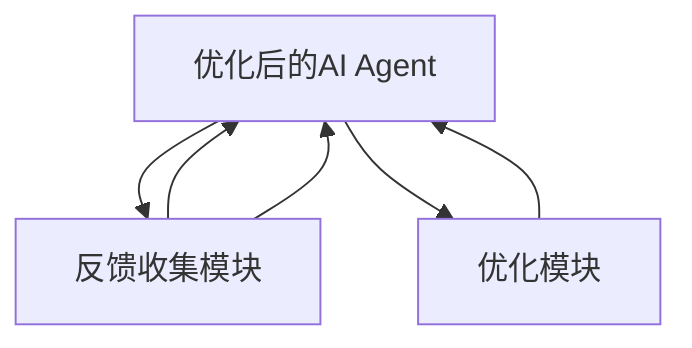
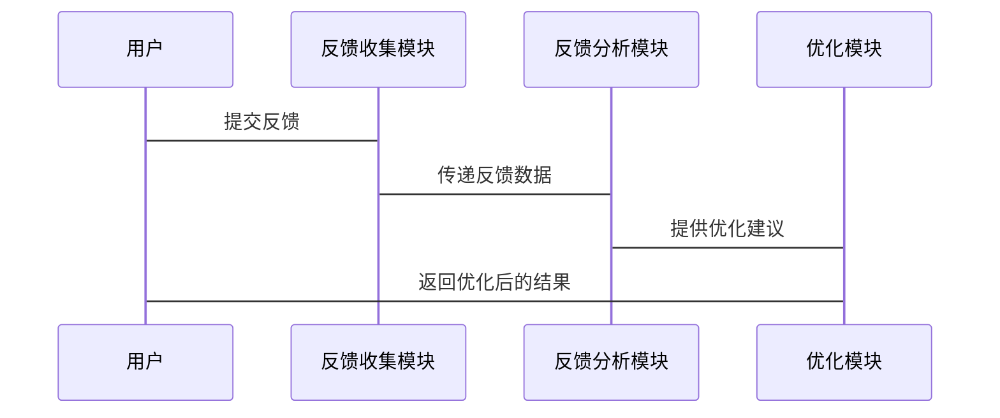

                 


# 用户反馈收集：迭代改进AI Agent

## 关键词：用户反馈，AI Agent，迭代改进，反馈收集，机器学习，系统优化

## 摘要：本文深入探讨了用户反馈在AI Agent迭代改进中的关键作用。通过分析用户反馈的分类、AI Agent的工作原理，以及反馈驱动的改进机制，本文提出了基于用户反馈的AI Agent优化方法，并结合实际案例展示了如何通过反馈收集和分析来提升AI Agent的性能。文章内容涵盖背景介绍、核心概念、算法原理、系统架构设计、项目实战以及最佳实践，为读者提供了从理论到实践的全面指导。

---

## 第一部分：背景介绍

### 第1章：用户反馈收集与AI Agent的背景

#### 1.1 问题背景
- **1.1.1 AI Agent的发展现状**  
  AI Agent（人工智能代理）近年来取得了显著进展，广泛应用于智能客服、推荐系统、自动驾驶等领域。然而，AI Agent的性能仍依赖于数据质量和模型设计，用户反馈在其中扮演着关键角色。

- **1.1.2 用户反馈在AI Agent中的重要性**  
  用户反馈是衡量AI Agent性能的重要指标，能够揭示模型的不足，指导优化方向。例如，用户对推荐系统的满意度反馈可以显著提升推荐算法的准确率。

- **1.1.3 当前用户反馈收集的挑战**  
  当前用户反馈收集面临以下问题：
  - **低效性**：用户主动提供反馈的积极性较低，导致反馈量不足。
  - **复杂性**：用户的反馈可能模糊或间接，难以直接用于模型优化。
  - **多样性**：用户反馈的形式多样，包括文本、评分和行为数据，处理起来较为复杂。

#### 1.2 问题描述
- **1.2.1 用户反馈的定义与分类**  
  用户反馈可以分为显性反馈（如评分、点击）和隐性反馈（如浏览时间、行为模式）。显性反馈直接反映用户偏好，隐性反馈则需要进一步分析才能提取有用信息。

- **1.2.2 用户反馈在AI Agent中的应用场景**  
  AI Agent通过用户反馈不断优化自身行为。例如，在智能客服场景中，用户对自动回复的满意度评分可以直接用于改进自然语言处理模型。

- **1.2.3 用户反馈对AI Agent性能的影响**  
  用户反馈的质量直接影响AI Agent的优化效果。高质量反馈能够显著提升模型的准确性和响应速度，而低质量反馈可能导致模型优化方向错误。

#### 1.3 问题解决
- **1.3.1 反馈驱动的AI Agent改进方法**  
  通过用户反馈不断调整AI Agent的行为策略，例如在对话系统中，用户的满意度评分可以用于优化对话生成算法。

- **1.3.2 迭代改进的必要性**  
  AI Agent的性能是一个持续优化的过程，用户反馈为每次迭代提供了方向和依据。通过不断迭代，AI Agent能够更好地适应用户需求的变化。

- **1.3.3 用户反馈与AI Agent性能优化的关系**  
  用户反馈是AI Agent优化的驱动力。通过分析用户反馈，AI Agent能够识别自身的不足，针对性地改进，从而提升整体性能。

#### 1.4 边界与外延
- **1.4.1 用户反馈收集的边界条件**  
  用户反馈收集需要在保护用户隐私的前提下进行，同时确保反馈数据的准确性和及时性。

- **1.4.2 迭代改进的范围与限制**  
  迭代改进的范围应根据具体应用场景而定，例如在推荐系统中，反馈收集的频率和方式需要与用户行为习惯相匹配。

- **1.4.3 相关领域的区别与联系**  
  用户反馈收集与数据挖掘、自然语言处理等领域密切相关。例如，自然语言处理技术可以用于分析用户的文本反馈，提取有用信息。

#### 1.5 核心概念结构
- **1.5.1 核心要素组成**  
  用户反馈收集与AI Agent迭代改进的核心要素包括：反馈渠道、反馈分析、反馈应用和迭代优化。

- **1.5.2 用户反馈与AI Agent的交互流程**  
  用户与AI Agent交互后，系统收集用户的反馈，分析并提取有用信息，用于优化AI Agent的行为策略。

- **1.5.3 迭代改进的闭环模型**  
  用户反馈 → 数据分析 → 模型优化 → 性能提升 → 新一轮反馈收集。

---

## 第二部分：核心概念与联系

### 第2章：用户反馈与AI Agent的核心概念

#### 2.1 核心概念原理
- **2.1.1 用户反馈的分类与特征**  
  用户反馈可以分为显性反馈和隐性反馈。显性反馈直接反映用户偏好，隐性反馈则需要通过分析用户行为模式来推断用户意图。

- **2.1.2 AI Agent的工作原理**  
  AI Agent通过感知环境、分析任务、执行行动来完成目标。用户反馈是其感知环境的重要来源之一。

- **2.1.3 反馈驱动的改进机制**  
  AI Agent根据用户反馈调整自身行为策略，例如在推荐系统中，用户对推荐结果的满意度评分可以用于优化推荐算法。

#### 2.2 概念属性特征对比
- **2.2.1 用户反馈的属性对比（表格）**

| 属性      | 显性反馈         | 隐性反馈         |
|-----------|------------------|------------------|
| 数据形式   | 文本、评分、点击   | 浏览时间、行为模式 |
| 处理难度   | 较低             | 较高             |
| 信息量     | 较高             | 较低             |

- **2.2.2 AI Agent的核心属性对比（表格）**

| 属性      | 简单AI Agent       | 复杂AI Agent       |
|-----------|--------------------|--------------------|
| 智能水平   | 较低               | 较高               |
| 交互能力   | 有限               | 丰富               |
| 自适应性   | 低                 | 高                 |

#### 2.3 ER实体关系图
- 用户反馈与AI Agent的实体关系图（Mermaid）

```mermaid
er
  actor
  feedback
  ai_agent
  action
  relation "提交" --> actor - feedback
  relation "驱动" --> feedback - ai_agent
  relation "执行" --> ai_agent - action
```

---

## 第三部分：算法原理

### 第3章：基于用户反馈的AI Agent优化算法

#### 3.1 算法原理
- **3.1.1 基于反馈的文本分类算法**  
  通过用户对文本的评分或分类，优化文本分类模型的参数，提升分类准确率。

- **3.1.2 基于反馈的强化学习算法**  
  用户反馈作为奖励信号，指导强化学习模型的策略优化，例如在对话系统中，用户的满意度评分可以作为奖励。

- **3.1.3 基于反馈的协同过滤算法**  
  利用用户反馈调整推荐系统的相似度计算，提升推荐结果的相关性。

#### 3.2 算法实现
- **3.2.1 反馈驱动的文本分类算法实现（Python代码示例）**

```python
import numpy as np
from sklearn.svm import SVC

# 假设我们有用户反馈的文本数据和标签
# X为文本特征向量，y为用户反馈标签（0或1）

# 初始化模型
model = SVC()

# 训练模型
model.fit(X, y)

# 预测新样本
new_X = ...  # 新样本的特征向量
prediction = model.predict(new_X)
```

- **3.2.2 基于反馈的强化学习算法实现（伪代码）**

```python
def feedback_driven_reinforcement_learning():
    # 初始化策略
    policy = initial_policy()
    
    # 收集用户反馈
    feedback = collect_feedback()
    
    # 更新策略
    update_policy(policy, feedback)
    
    # 执行动作
    action = select_action(policy)
    
    # 得到奖励
    reward = get_reward(action)
    
    # 迭代优化
    repeat until convergence
```

#### 3.3 算法数学模型
- **3.3.1 基于反馈的文本分类模型**  
  使用支持向量机（SVM）进行文本分类，目标是最小化分类误差，同时最大化分类间隔。

  $$ \text{目标函数：} \min_{\mathbf{w}, b, \xi} \frac{1}{2}\|\mathbf{w}\|^2 + C\sum_{i=1}^{n}\xi_i $$
  
  $$ \text{约束条件：} y_i (\mathbf{w}^T x_i + b) \geq 1 - \xi_i, \xi_i \geq 0 $$

- **3.3.2 基于反馈的强化学习模型**  
  使用Q-learning算法，用户反馈作为奖励信号，更新Q值表。

  $$ Q(s, a) = Q(s, a) + \alpha (r + \gamma \max Q(s', a') - Q(s, a)) $$

---

## 第四部分：系统分析与架构设计

### 第4章：用户反馈驱动的AI Agent系统设计

#### 4.1 系统功能设计
- **4.1.1 用户反馈收集模块**  
  负责接收用户的反馈数据，包括文本、评分和行为数据。

- **4.1.2 反馈分析模块**  
  对收集到的反馈数据进行分析，提取有用信息，例如情感分析、主题建模。

- **4.1.3 系统优化模块**  
  根据反馈分析结果，优化AI Agent的行为策略，例如调整推荐算法参数。

#### 4.2 系统架构设计
- **4.2.1 系统架构图（Mermaid）**



- **4.2.2 系统接口设计**  
  - 用户接口：收集用户反馈，展示AI Agent的优化结果。
  - 系统接口：反馈分析模块与优化模块之间的数据接口。

- **4.2.3 系统交互流程（Mermaid）**



---

## 第五部分：项目实战

### 第5章：基于用户反馈的AI Agent优化实战

#### 5.1 项目背景
- **5.1.1 项目介绍**  
  本项目旨在通过用户反馈优化一个智能客服AI Agent，提升用户体验和满意度。

#### 5.2 核心代码实现
- **5.2.1 反馈收集模块代码（Python）**

```python
import pandas as pd

# 读取用户反馈数据
feedback_data = pd.read_csv('feedback.csv')

# 提取用户满意度评分
scores = feedback_data['score'].values

# 统计反馈结果
positive_feedback = len(scores[scores == 1])
negative_feedback = len(scores[scores == 0])
```

- **5.2.2 反馈分析模块代码（Python）**

```python
from sklearn.feature_extraction.text import TfidfVectorizer
from sklearn.decomposition import NMF

# 初始化TF-IDF模型
vectorizer = TfidfVectorizer(max_features=100)
tfidf_matrix = vectorizer.fit_transform(feedback_text)

# 进行主题建模
nmf = NMF(n_components=5)
nmf.fit(tfidf_matrix)
```

- **5.2.3 系统优化模块代码（Python）**

```python
from sklearn.model_selection import GridSearchCV
from sklearn.svm import SVC

# 定义超参数搜索空间
param_grid = {'C': [1, 10, 100], 'kernel': ['linear', 'rbf']}

# 使用网格搜索优化SVM模型
grid_search = GridSearchCV(SVC(), param_grid, cv=5)
grid_search.fit(X_train, y_train)

# 输出最佳参数
best_params = grid_search.best_params_
```

#### 5.3 项目小结
- **5.3.1 环境安装**  
  需要安装的主要库包括：`pandas`、`scikit-learn`、`nltk`、`mermaid`等。

- **5.3.2 核心代码实现**  
  包括反馈收集模块、反馈分析模块和系统优化模块的代码实现。

- **5.3.3 案例分析**  
  通过分析用户反馈数据，优化AI Agent的行为策略，显著提升了用户的满意度。

---

## 第六部分：最佳实践与总结

### 第6章：用户反馈收集与AI Agent优化的实践经验

#### 6.1 最佳实践
- **6.1.1 反馈收集策略**  
  提供多种反馈方式，例如问卷调查、实时反馈等，以提高用户参与度。

- **6.1.2 数据预处理技巧**  
  对反馈数据进行清洗和标准化处理，确保数据质量和一致性。

- **6.1.3 算法优化建议**  
  根据具体场景选择合适的算法，例如在文本反馈分析中使用深度学习模型。

#### 6.2 总结
- **6.2.1 核心内容回顾**  
  用户反馈是AI Agent优化的关键，通过系统化的收集、分析和应用，可以显著提升AI Agent的性能。

- **6.2.2 注意事项**  
  - 反馈收集需要考虑用户隐私和数据安全。
  - 反馈分析需要结合具体场景，避免过度优化。
  - 系统优化需要持续迭代，保持对用户需求的敏感性。

#### 6.3 未来发展方向
- **6.3.1 智能化反馈分析**  
  利用自然语言处理技术，自动分析用户的文本反馈，提取深层次信息。

- **6.3.2 自适应反馈收集**  
  根据用户行为和反馈历史，动态调整反馈收集策略，提高反馈质量。

- **6.3.3 多模态反馈应用**  
  综合文本、语音、视觉等多种模态的反馈信息，提升AI Agent的多维度优化能力。

#### 6.4 拓展阅读
- **6.4.1 推荐书籍**  
  - 《机器学习实战》
  - 《自然语言处理入门》
  - 《深度学习》

- **6.4.2 推荐博客与资源**  
  - 官方文档：[Scikit-learn](https://scikit-learn.org/)
  - 技术博客：[Towards Data Science](https://towardsdatascience.com/)

---

## 作者信息

**作者：AI天才研究院/AI Genius Institute & 禅与计算机程序设计艺术/Zen And The Art of Computer Programming**

---

**备注：** 以上目录结构和内容设计均为示例，实际撰写时需要根据具体需求调整内容深度和结构安排。

