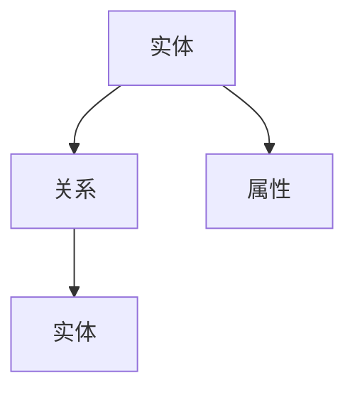
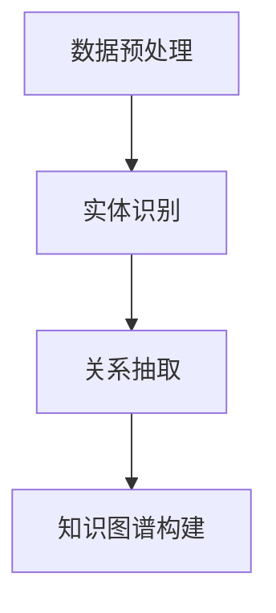

                 


# 知识图谱在金融实体关系挖掘中的应用

> 关键词：知识图谱、金融实体、关系挖掘、自然语言处理、数据挖掘、金融分析

> 摘要：本文详细探讨了知识图谱在金融实体关系挖掘中的应用，从知识图谱的基本概念到其在金融领域的具体应用，分析了其实体识别、关系抽取等关键步骤，并通过实际案例展示了其在金融风险评估和投资决策中的价值。文章还深入讲解了相关算法原理和系统架构设计，为读者提供全面的技术见解。

---

# 第1章: 知识图谱与金融实体关系挖掘的背景介绍

## 1.1 知识图谱的基本概念

### 1.1.1 知识图谱的定义
知识图谱是一种用于表示实体及其之间关系的数据结构，通常以图的形式呈现。它通过节点（实体）和边（关系）描述数据间的语义关联，能够帮助机器理解和推理复杂的知识体系。

### 1.1.2 知识图谱的核心要素
- **实体**：知识图谱的基本单元，如“苹果公司”、“iPhone”等。
- **属性**：描述实体的特征，如“成立时间”、“注册资本”等。
- **关系**：描述实体之间的关联，如“苹果公司生产iPhone”。

### 1.1.3 知识图谱的构建过程
知识图谱的构建通常包括数据收集、数据清洗、实体识别、关系抽取和知识融合等步骤。

---

## 1.2 金融实体关系挖掘的背景与问题

### 1.2.1 金融领域的复杂性
金融领域涉及大量复杂的实体和关系，如公司、股票、交易、市场等。这些实体之间的关系错综复杂，需要借助知识图谱进行系统化分析。

### 1.2.2 实体关系挖掘的挑战
- 数据分散：金融数据可能来自多个来源，如财务报表、新闻报道、社交媒体等。
- 关系多样：实体之间的关系可能涉及多个方面，如控股、投资、并购等。
- 数据质量：金融数据可能存在噪声，需要进行清洗和校正。

### 1.2.3 知识图谱在金融中的应用潜力
知识图谱可以用于金融风险评估、投资决策支持、欺诈检测等领域，帮助金融机构更好地理解和管理复杂的金融网络。

---

## 1.3 本章小结
本章介绍了知识图谱的基本概念及其在金融实体关系挖掘中的重要性，指出了该领域面临的主要挑战和潜在的应用价值。

---

# 第2章: 知识图谱的核心概念与联系

## 2.1 知识图谱的构建原理

### 2.1.1 实体与关系的定义
- 实体：具体事物或概念，如“公司”、“股票”。
- 关系：实体之间的关联，如“公司A收购公司B”。

### 2.1.2 知识图谱的表示方法
知识图谱通常使用RDF（资源描述框架）或图数据库（如Neo4j）进行表示。

### 2.1.3 知识图谱的存储与管理
知识图谱的存储和管理需要考虑数据的规模、复杂性和实时性。

---

## 2.2 知识图谱的属性特征对比

### 2.2.1 实体属性的特征分析
| 属性类型 | 示例 |
|----------|------|
| 基本属性 | 名称、成立时间 |
| 关联属性 | 所属行业、主要业务 |

### 2.2.2 关系属性的特征分析
| 关系类型 | 示例 |
|----------|------|
| 简单关系 | 公司A收购公司B |
| 复杂关系 | 公司A在2020年以50亿美元收购公司B |

### 2.2.3 实体关系的对比表格
| 实体A | 关系 | 实体B |
|------|-----|------|
| 苹果公司 | 生产 | iPhone |
| 苹果公司 | 控股 | 苹果电脑 |

---

## 2.3 知识图谱的ER实体关系架构



---

## 2.4 本章小结
本章详细介绍了知识图谱的核心概念，包括实体、关系和属性的定义及其特征对比，并通过ER图展示了实体关系的架构。

---

# 第3章: 知识图谱在金融实体关系挖掘中的算法原理

## 3.1 知识图谱构建的算法流程

### 3.1.1 数据预处理
数据预处理包括数据清洗、去重和标准化。

### 3.1.2 实体识别与链接
实体识别通常使用NLP技术，如分词、命名实体识别（NER）。

### 3.1.3 关系抽取
关系抽取可以通过模式匹配、句法分析或深度学习模型实现。

---

## 3.2 算法原理的数学模型

### 3.2.1 实体识别的数学模型
$$ P(e_i | w_j) = \frac{count(w_j, e_i)}{\sum_{e} count(w_j, e)} $$

### 3.2.2 关系抽取的数学模型
$$ R(r_{ij} | e_i, e_j) = \frac{count(e_i, e_j, r_{ij})}{\sum_{r} count(e_i, e_j, r_{ij})} $$

---

## 3.3 算法流程的Mermaid图



---

## 3.4 本章小结
本章详细介绍了知识图谱构建的算法流程，包括数据预处理、实体识别和关系抽取的数学模型，并通过Mermaid图展示了算法的整体流程。

---

# 第4章: 知识图谱在金融实体关系挖掘中的系统分析与架构设计

## 4.1 系统设计概述

### 4.1.1 问题场景介绍
金融实体关系挖掘系统需要处理大量的金融数据，提取实体及其关系。

### 4.1.2 项目目标与范围
- 目标：构建金融知识图谱，支持金融分析和决策。
- 范围：包括数据采集、实体识别、关系抽取和知识图谱构建。

---

## 4.2 系统功能设计

### 4.2.1 数据处理模块
负责数据的采集、清洗和预处理。

### 4.2.2 知识抽取模块
包括实体识别和关系抽取功能。

### 4.2.3 关系挖掘模块
负责发现实体之间的隐含关系。

---

## 4.3 系统架构设计


---

## 4.4 本章小结
本章详细介绍了金融实体关系挖掘系统的架构设计，包括功能模块和系统交互流程。

---

# 第5章: 知识图谱在金融实体关系挖掘中的项目实战

## 5.1 项目背景与目标

### 5.1.1 项目背景
本项目旨在构建一个金融知识图谱，用于分析公司之间的投资关系。

---

## 5.2 核心代码实现

### 5.2.1 数据预处理
```python
import pandas as pd

# 读取数据
df = pd.read_csv('financial_data.csv')

# 数据清洗
df.dropna(inplace=True)
df.drop_duplicates(inplace=True)
```

### 5.2.2 实体识别
```python
from spacy.lang.zh import Chinese

nlp = Chinese()
doc = nlp("苹果公司收购了某科技公司。")
for ent in doc.ents:
    print(ent.text, ent.label_)
```

### 5.2.3 关系抽取
```python
from spacy import displacy

doc = nlp("苹果公司收购了某科技公司。")
displacy.render(doc, style="ent")
```

---

## 5.3 代码解读与分析
以上代码展示了如何使用Python和spaCy进行数据预处理、实体识别和关系抽取。

---

## 5.4 项目小结
本章通过实际案例展示了如何使用Python代码实现知识图谱的构建，包括数据预处理、实体识别和关系抽取。

---

# 第6章: 知识图谱在金融实体关系挖掘中的最佳实践

## 6.1 小结
知识图谱在金融实体关系挖掘中具有重要的应用价值。

## 6.2 注意事项
- 数据质量对知识图谱的准确性影响重大。
- 知识图谱的构建需要结合领域知识。

## 6.3 未来研究方向
- 更高效的实体识别和关系抽取算法。
- 知识图谱的动态更新与维护。

---

# 附录

## 附录A: 参考文献
1. 知识图谱相关论文。
2. 金融实体关系挖掘相关文献。

## 附录B: 工具资源
- 数据处理工具：Python、Pandas。
- NLP工具：spaCy、NLTK。
- 图数据库：Neo4j。

---

# 作者：AI天才研究院 & 禅与计算机程序设计艺术

---

通过以上内容，文章详细讲解了知识图谱在金融实体关系挖掘中的应用，从理论到实践，为读者提供了全面的技术见解。

