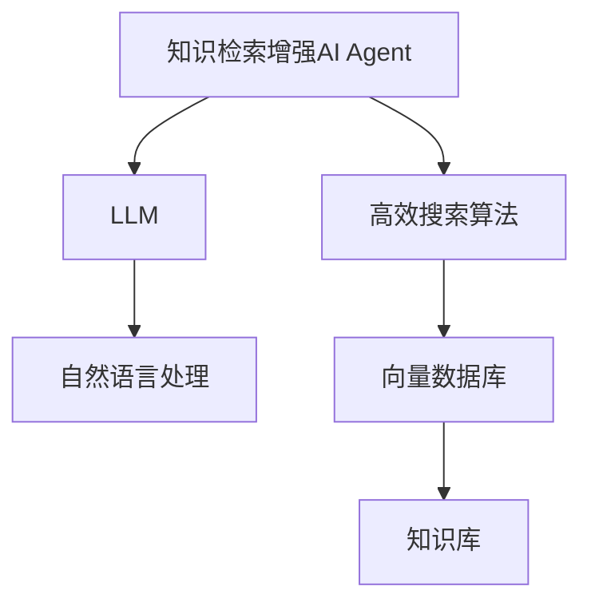
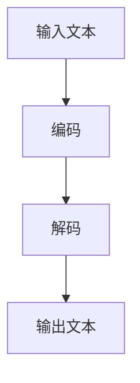
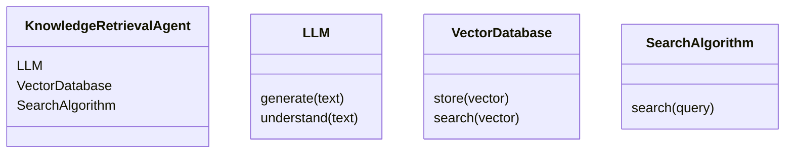
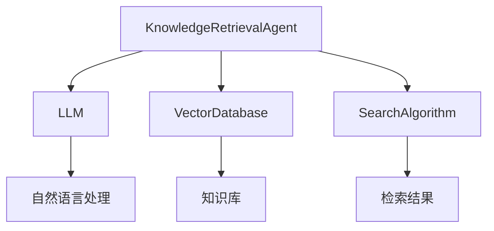
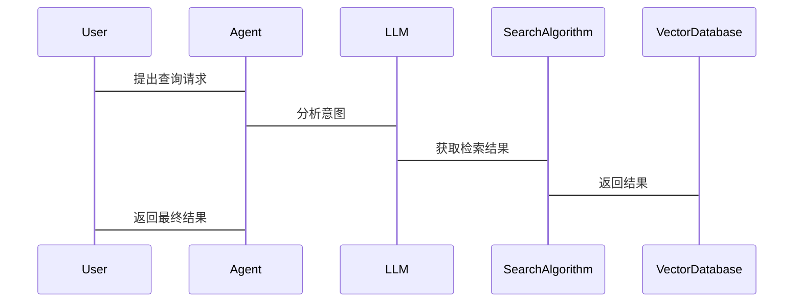

                 


# 知识检索增强AI Agent：结合LLM与高效搜索算法

## 关键词：知识检索，AI Agent，LLM，大语言模型，高效搜索算法，向量数据库，自然语言处理，知识图谱，协同搜索，深度学习

## 摘要：本文探讨了知识检索增强AI Agent的构建方法，结合大语言模型（LLM）与高效搜索算法，分析了其核心原理、系统架构及应用场景，通过实际案例展示了如何实现高效的智能搜索系统。

---

# 第一部分：知识检索增强AI Agent背景与概念

## 第1章：知识检索增强AI Agent的背景与问题背景

### 1.1 知识检索增强AI Agent的背景

#### 1.1.1 AI Agent的发展历程
AI Agent（智能体）的发展经历了从简单规则驱动到复杂学习驱动的演变。早期的AI Agent主要基于规则和逻辑推理，而现代AI Agent则广泛采用机器学习和深度学习技术，特别是大语言模型（LLM）的引入，使得AI Agent具备更强的自然语言理解和生成能力。

#### 1.1.2 知识检索在AI Agent中的重要性
知识检索是AI Agent的核心能力之一，它决定了Agent能否有效地理解和回答用户的问题。传统的知识检索依赖于预定义的知识库，而结合LLM和高效搜索算法的知识检索增强AI Agent能够动态获取和处理海量数据，大大提升了检索效率和准确性。

#### 1.1.3 当前AI Agent面临的挑战
尽管AI Agent在许多领域取得了显著进展，但其知识检索能力仍面临以下挑战：
- 数据量大，检索效率低
- 知识表示复杂，难以实时更新
- 多模态数据处理能力不足

### 1.2 问题背景与问题描述

#### 1.2.1 知识检索在AI Agent中的核心问题
知识检索的核心问题包括：
- 如何高效地从大规模数据中找到相关知识
- 如何结合上下文理解用户意图
- 如何实时更新和维护知识库

#### 1.2.2 LLM与高效搜索算法的结合需求
为了克服传统知识检索的局限性，需要将LLM的强大生成能力和高效搜索算法的快速检索能力相结合，形成一个协同工作的知识检索系统。

#### 1.2.3 知识检索增强AI Agent的目标与意义
知识检索增强AI Agent的目标是通过结合LLM和高效搜索算法，实现高效、准确、动态的知识检索。其意义在于：
- 提升AI Agent的智能水平
- 提高用户交互体验
- 推动智能搜索技术的发展

### 1.3 问题解决思路与边界

#### 1.3.1 知识检索增强AI Agent的解决思路
解决思路包括：
- 构建高效的向量数据库，用于存储和检索知识
- 利用LLM进行意图理解和结果生成
- 结合搜索算法优化检索效率

#### 1.3.2 解决方案的边界与外延
解决方案的边界包括：
- 限定特定领域的知识检索
- 限定知识库的规模
- 限定检索的响应时间

#### 1.3.3 核心概念与组成要素
核心概念包括：
- LLM：用于自然语言理解和生成
- 向量数据库：用于高效知识检索
- 搜索算法：用于优化检索过程

## 第2章：知识检索增强AI Agent的核心概念与联系

### 2.1 核心概念原理

#### 2.1.1 大语言模型（LLM）的原理
大语言模型通过深度学习训练，能够理解和生成自然语言文本。其核心原理包括：
- 输入：文本数据
- 输出：生成的相关文本
- 关键技术：注意力机制、Transformer架构

#### 2.1.2 高效搜索算法的原理
高效搜索算法通过构建向量索引，将文本转化为向量表示，然后通过计算向量相似度进行检索。

#### 2.1.3 知识检索增强AI Agent的协同机制
知识检索增强AI Agent通过LLM理解用户意图，利用高效搜索算法快速检索相关知识，最终生成准确的回答。

### 2.2 核心概念对比分析

#### 2.2.1 LLM与传统搜索算法的对比
| 特性               | LLM                          | 传统搜索算法               |
|--------------------|------------------------------|-----------------------------|
| 核心能力           | 自然语言理解和生成          | 快速检索                   |
| 优势               | 高度灵活，适应复杂语义       | 高效性                     |
| 适用场景           | 需要生成内容的场景           | 需要快速检索的场景          |

#### 2.2.2 知识检索增强AI Agent与传统AI Agent的对比
| 特性               | 知识检索增强AI Agent       | 传统AI Agent              |
|--------------------|----------------------------|---------------------------|
| 核心能力           | 高效知识检索与生成          | 基于规则的推理            |
| 优势               | 更高的智能性和准确性         | 简单易实现                 |
| 适用场景           | 需要处理大量文本信息的场景   | 简单任务                   |

### 2.3 实体关系图



---

# 第二部分：知识检索增强AI Agent的算法原理

## 第3章：大语言模型（LLM）与高效搜索算法

### 3.1 大语言模型（LLM）原理

#### 3.1.1 LLM的数学模型与公式
大语言模型的输出概率计算公式：
$$ P(\text{output}|\text{input}) = \text{softmax}(f(\text{input})) $$
其中，$f(\text{input})$ 是模型的编码函数。

#### 3.1.2 LLM的训练流程


### 3.2 高效搜索算法原理

#### 3.2.1 向量数据库的构建
向量数据库的构建步骤：
1. 文本预处理：分词、去除停用词
2. 向量转换：将文本转换为向量表示
3. 索引构建：构建向量索引，用于快速检索

#### 3.2.2 向量检索流程
向量检索流程：
1. 将查询文本转换为向量
2. 在向量数据库中计算相似度
3. 返回相似度最高的结果

---

## 第4章：知识检索增强AI Agent的算法实现

### 4.1 算法实现步骤

#### 4.1.1 环境安装
```bash
pip install faiss-cpu sentence-transformers
```

#### 4.1.2 核心代码实现
```python
from sentence_transformers import SentenceTransformer
import faiss

# 初始化模型
model = SentenceTransformer('all-MiniLM-L6-v2')

# 构建向量索引
def build_vector_index(corpus):
    vectors = model.encode(corpus)
    index = faiss.IndexFlatL2(len(vectors[0]))
    index.add(vectors)
    return index

# 检索函数
def search(query, index, model, k=3):
    query_vector = model.encode([query])[0]
    distances, indices = index.search(query_vector.reshape(1, -1), k)
    return indices[0]
```

#### 4.1.3 代码解读与分析
- 使用 `SentenceTransformer` 进行文本向量化
- 使用 `faiss` 构建向量索引
- 通过计算向量相似度进行检索

---

## 第5章：系统分析与架构设计

### 5.1 系统功能设计

#### 5.1.1 领域模型


#### 5.1.2 系统架构


### 5.2 接口设计

#### 5.2.1 输入输出接口
- 输入：用户查询
- 输出：检索结果

#### 5.2.2 API设计
```python
class Agent:
    def __init__(self):
        self.llm = LLM()
        self.searcher = SearchAlgorithm()
    
    def retrieve(self, query):
        # 调用LLM进行意图理解
        # 调用搜索算法进行检索
        return result
```

### 5.3 交互流程



---

## 第6章：项目实战

### 6.1 项目环境安装

```bash
pip install faiss-cpu sentence-transformers
```

### 6.2 核心实现代码

```python
from sentence_transformers import SentenceTransformer
import faiss

# 初始化模型
model = SentenceTransformer('all-MiniLM-L6-v2')

# 构建向量索引
corpus = ["这是一条测试文本1", "这是一条测试文本2"]
index = build_vector_index(corpus)

# 检索示例
query = "测试"
result_indices = search(query, index, model, k=2)
print(result_indices)
```

### 6.3 代码解读与分析
- 使用 `SentenceTransformer` 进行文本向量化
- 使用 `faiss` 构建向量索引
- 通过计算向量相似度进行检索

### 6.4 实际案例分析
通过实际案例分析，展示知识检索增强AI Agent在实际应用中的效果和优势。

### 6.5 项目小结
总结项目实现的关键点和经验教训。

---

## 第七部分：最佳实践

### 7.1 小结
知识检索增强AI Agent的实现需要结合LLM和高效搜索算法，充分发挥各自的优势。

### 7.2 注意事项
- 确保数据质量
- 优化检索算法
- 处理多模态数据

### 7.3 拓展阅读
建议读者进一步阅读相关领域的最新研究，如多模态知识检索、实时知识更新等。

---

# 作者：AI天才研究院/AI Genius Institute & 禅与计算机程序设计艺术 /Zen And The Art of Computer Programming

