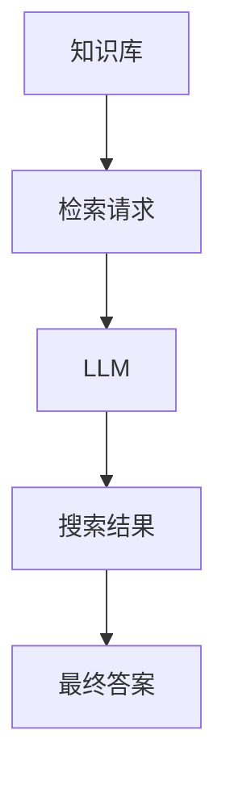
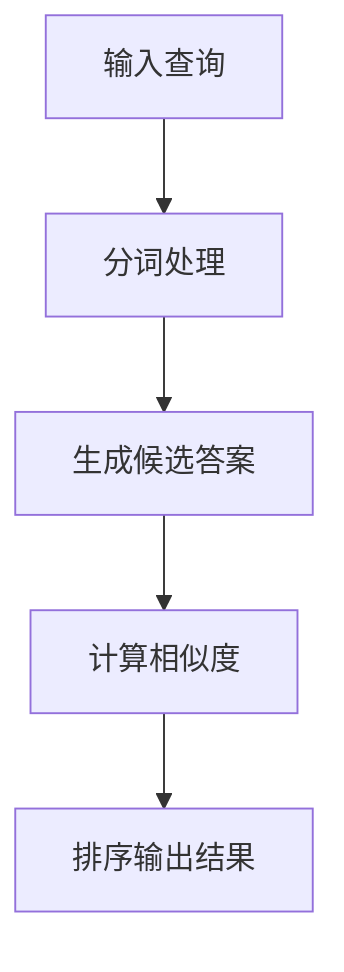
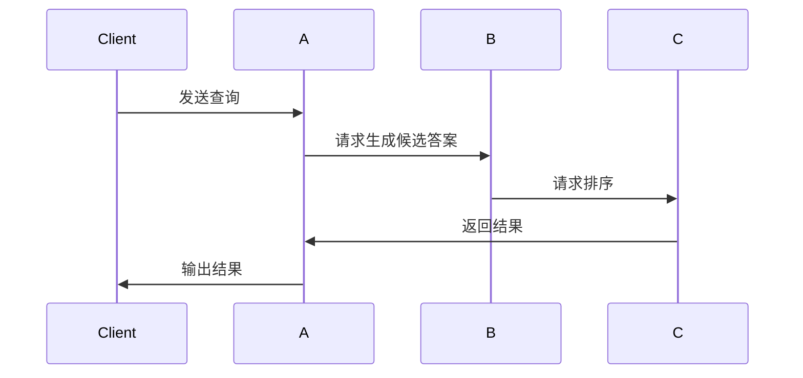

                 


# 知识检索增强型AI Agent：结合LLM与高级搜索算法

> 关键词：知识检索，AI Agent，LLM，高级搜索算法，自然语言处理

> 摘要：本文探讨了知识检索增强型AI Agent的构建方法，结合大语言模型（LLM）与高级搜索算法，分析了它们的协同工作原理，并通过系统设计和实际案例展示了如何提升AI代理的知识检索能力。

---

## 第一部分: 知识检索与AI Agent的背景介绍

### 第1章: 知识检索的重要性

#### 1.1 知识检索的基本概念
知识检索是通过算法从大规模数据中提取相关信息的过程。它依赖于自然语言处理技术，能够理解用户意图并返回相关结果。

#### 1.2 知识检索在AI中的应用场景
知识检索广泛应用于智能客服、信息抽取、问答系统等领域，帮助AI系统更好地理解用户需求并提供准确答案。

#### 1.3 知识检索的挑战与解决方案
随着数据量的增加，传统检索方法效率低下。结合LLM和高级搜索算法，可以有效提升检索效率和准确性。

### 第2章: AI Agent的核心概念

#### 2.1 AI Agent的定义与特点
AI Agent是具备自主决策能力的智能体，能够理解用户需求并执行任务。

#### 2.2 AI Agent的分类与应用领域
AI Agent分为简单和复杂两类，应用于推荐系统、智能助手、自动驾驶等领域。

#### 2.3 知识检索在AI Agent中的作用
知识检索是AI Agent获取信息的关键步骤，直接影响其响应的准确性和效率。

### 第3章: LLM与搜索算法的结合

#### 3.1 LLM的基本原理
大语言模型通过大量数据训练，具备强大的语义理解能力。

#### 3.2 高级搜索算法的原理
高级搜索算法如BM25，基于文本相似度计算，提高检索准确性。

#### 3.3 LLM与搜索算法的协同工作
LLM生成候选答案，搜索算法优化结果排序，两者结合提升检索效果。

---

## 第二部分: 核心概念与联系

### 第4章: 知识检索与AI Agent的核心概念

#### 4.1 核心概念原理
知识检索通过分析用户查询，匹配相关数据；AI Agent执行任务，结合两者提升性能。

#### 4.2 核心概念属性特征对比
| 属性 | 知识检索 | AI Agent |
|------|----------|-----------|
| 输入 | 文本查询 | 用户指令 |
| 输出 | 相关结果 | 任务执行 |

#### 4.3 ER实体关系图架构


---

## 第三部分: 算法原理讲解

### 第5章: LLM与搜索算法的数学模型

#### 5.1 LLM的数学模型
- **Transformer模型结构**：包含编码器和解码器，处理序列数据。
- **注意力机制公式**：计算词与词之间的相关性。
$$\text{Attention}(Q, K, V) = \text{softmax}\left(\frac{QK^T}{\sqrt{d_k}}\right)V$$

#### 5.2 高级搜索算法的数学模型
- **向量空间模型**：将文本转换为向量表示。
- **BM25算法公式**：
$$\text{score}(d, q) = \log\left(1 + \frac{\text{freq}(q, d)}{\text{avgdl}}\right) \times \text{IDF}(q)$$

### 第6章: 算法实现与流程图

#### 6.1 算法流程图


#### 6.2 核心代码实现
```python
def bm25_score(query, doc):
    import math
    k = 1.5
    b = 0.75
    avgdl = 100  # 假设平均文档长度
    freq = doc.count(query)
    return (math.log(1 + (freq / avgdl) * k)) * (1 - b + b * len(doc) / avgdl)
```

---

## 第四部分: 系统分析与架构设计

### 第7章: 系统功能设计

#### 7.1 问题场景介绍
用户输入查询，AI Agent需要结合LLM生成候选答案，再通过搜索算法优化结果。

#### 7.2 系统功能模块
- **查询处理模块**：接收并解析用户输入。
- **LLM生成模块**：生成候选答案。
- **搜索排序模块**：优化结果排序。

#### 7.3 系统架构图


### 第8章: 接口设计与交互流程图

#### 8.1 系统接口设计
- **输入接口**：接收用户查询。
- **输出接口**：返回优化后的结果。

#### 8.2 交互流程图


---

## 第五部分: 项目实战

### 第9章: 环境安装与代码实现

#### 9.1 环境安装
- Python 3.8+
- numpy, scikit-learn, transformers库

#### 9.2 核心代码实现
```python
from transformers import pipeline
from sklearn.metrics.pairwise import cosine_similarity

def search_algorithm(query, docs):
    model = pipeline("text-classification", model="bert-base-uncased")
    scores = []
    for doc in docs:
        score = cosine_similarity(query, doc)
        scores.append(score)
    return sorted(zip(docs, scores), key=lambda x: x[1], reverse=True)
```

### 第10章: 实际案例分析

#### 10.1 案例分析
用户搜索“天气情况”，系统生成多个候选答案，通过BM25算法排序，返回最相关的结果。

#### 10.2 代码应用解读
代码实现BM25算法，结合LLM生成候选答案，优化排序策略。

### 第11章: 项目小结

---

## 第六部分: 最佳实践与总结

### 第12章: 最佳实践

#### 12.1 实践小贴士
- 数据预处理：提升检索效果。
- 模型调优：优化LLM和搜索算法性能。
- 结合用户反馈：动态调整检索策略。

### 第13章: 总结与展望

#### 13.1 本章总结
本文详细探讨了知识检索增强型AI Agent的构建方法，结合LLM和高级搜索算法，提供了理论支持和实践指导。

#### 13.2 未来展望
未来，可以研究动态知识库更新和多模态数据处理，进一步提升检索效率和准确性。

---

## 作者：AI天才研究院/AI Genius Institute & 禅与计算机程序设计艺术 /Zen And The Art of Computer Programming

