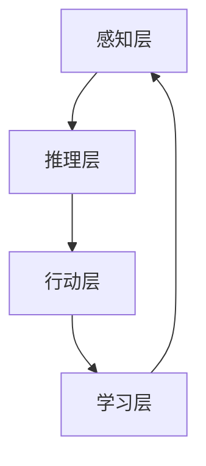
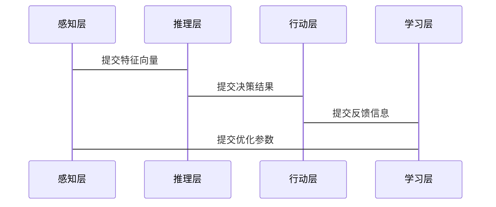

                 


# 神经科学启发的注意力机制在AI Agent中的实现

## 关键词：神经科学，注意力机制，AI Agent，Transformer，自注意力网络，神经元模型

## 摘要：
本文深入探讨了神经科学中的注意力机制及其在AI Agent中的应用。从注意力机制的基本概念到其在自然语言处理中的应用，再到神经科学中的生物启发，本文详细分析了注意力机制的理论基础和算法实现。通过结合Transformer模型和自注意力网络，本文展示了如何将神经科学的原理应用于AI Agent的设计中，提出了创新的系统架构和实现方案，为AI Agent的发展提供了新的思路。

---

# 第一部分: 神经科学启发的注意力机制背景介绍

## 第1章: 神经科学中的注意力机制

### 1.1 注意力机制的定义与特点

#### 1.1.1 注意力机制的基本概念
注意力机制是一种信息处理策略，用于聚焦重要信息并忽略次要信息。在神经科学中，注意力机制是大脑选择性关注特定感官输入的能力，帮助我们高效处理信息。在AI Agent中，注意力机制通过权重分配的方式，关注输入中的关键部分，从而提高模型的性能和效率。

#### 1.1.2 注意力机制的核心特点
1. **选择性关注**：注意力机制能够聚焦于输入中的重要部分，忽略不相关信息。
2. **动态调整**：根据输入内容和任务需求，注意力权重可以动态调整。
3. **全局信息处理**：注意力机制能够考虑输入的全局信息，捕捉长距离依赖关系。

#### 1.1.3 注意力机制的生物基础
神经科学中的注意力机制与大脑的神经元活动密切相关。神经元通过电信号和化学突触传递信息，注意力机制通过调节神经元之间的连接强度，实现对特定信息的关注。神经科学的研究表明，注意力机制与前额叶皮层和顶叶皮层密切相关，这些脑区负责信息的选择和处理。

### 1.2 AI Agent的基本概念与功能

#### 1.2.1 AI Agent的定义
AI Agent是一种智能实体，能够感知环境、执行任务并做出决策。AI Agent可以是软件程序，也可以是机器人，具备自主决策和问题解决的能力。

#### 1.2.2 AI Agent的核心功能
1. **感知**：通过传感器或数据输入，感知环境状态。
2. **推理**：基于感知信息，进行逻辑推理和决策。
3. **行动**：根据推理结果，执行相应的动作或输出结果。
4. **学习**：通过与环境的交互，不断优化自身的模型和策略。

#### 1.2.3 AI Agent的应用场景
AI Agent广泛应用于自然语言处理、机器人控制、自动驾驶、智能助手等领域。例如，在自然语言处理中，AI Agent可以通过注意力机制理解文本的语义结构；在机器人控制中，AI Agent可以通过注意力机制聚焦于关键环境信息，做出更准确的决策。

---

## 第2章: 注意力机制在AI Agent中的应用背景

### 2.1 注意力机制在自然语言处理中的应用

#### 2.1.1 Transformer模型与注意力机制
Transformer模型是一种基于注意力机制的深度学习模型，由Vaswani等人于2017年提出。Transformer模型通过自注意力机制，能够捕捉输入序列中的全局依赖关系，显著提高了自然语言处理任务的性能。

#### 2.1.2 多头注意力机制的原理
多头注意力机制是Transformer模型的核心组件之一。通过并行计算多个注意力头，多头注意力机制能够捕捉不同的语义信息，提高模型的表达能力。

#### 2.1.3 注意力机制在机器翻译中的应用
在机器翻译任务中，注意力机制帮助模型关注源语言句子中的关键部分，生成目标语言的高质量翻译。通过注意力权重，模型能够更好地理解源语言句子的语义结构，提高翻译的准确性和流畅性。

### 2.2 神经科学中的注意力机制启发

#### 2.2.1 神经元与突触的基本原理
神经元是神经系统的基本单位，通过电信号和化学信号传递信息。突触是神经元之间的连接结构，负责信息的传递和处理。神经元之间的连接强度可以通过突触可塑性动态调整，实现信息的选择性关注。

#### 2.2.2 大脑的信息处理机制
大脑通过注意力机制选择性关注特定的感官输入，抑制不相关信息的处理。这种机制帮助大脑高效处理信息，提高认知能力。

#### 2.2.3 注意力机制的神经科学模型
神经科学中的注意力机制可以通过神经元模型进行模拟。例如，使用LSTM（长短期记忆网络）模型模拟神经元的时序信息处理能力，通过权重调整实现注意力机制。

---

# 第二部分: 注意力机制的理论基础

## 第3章: 注意力机制的数学模型

### 3.1 注意力机制的数学表达

#### 3.1.1 基于查询-键-值的注意力机制
$$
\text{Attention}(Q, K, V) = \text{softmax}\left(\frac{QK^T}{\sqrt{d_k}}\right)V
$$

其中：
- \( Q \)：查询向量
- \( K \)：键向量
- \( V \)：值向量
- \( d_k \)：键向量的维度

#### 3.1.2 多头注意力机制的数学表达
$$
\text{Multi-head Attention}(Q, K, V) = \text{Concat}(\text{head}_1, \text{head}_2, \dots, \text{head}_n)W^o
$$

其中：
- \( \text{head}_i = \text{Attention}(QW_i^Q, KW_i^K, VW_i^V) \)
- \( W^o \)：输出权重矩阵

### 3.2 神经科学中的注意力模型

#### 3.2.1 神经元的电活动模型
$$
I(t) = R \cdot e^{-t/\tau}
$$

其中：
- \( I(t) \)：神经元的电活动
- \( R \)：最大释放速率
- \( \tau \)：时间常数

#### 3.2.2 突触可塑性的数学模型
$$
\Delta w = \eta \cdot (y \cdot x - w)
$$

其中：
- \( \Delta w \)：权重变化
- \( \eta \)：学习率
- \( y \)：目标输出
- \( x \)：输入信号
- \( w \)：当前权重

---

## 第4章: 神经科学中的注意力机制

### 4.1 神经元与突触的生物模型

#### 4.1.1 神经元的信息处理模型
神经元通过动作电位（Action Potential）传递信息。当神经元的膜去极化达到阈值时，触发动作电位，将信号传递到下一个神经元。

#### 4.1.2 突触的传递机制
突触通过化学传递（Chemical Synapse）或电传递（Electrical Synapse）实现神经元之间的信息传递。化学传递通过释放递质和受体结合实现信息传递，电传递通过细胞间连接直接传递电信号。

### 4.2 注意力机制的神经网络模型

#### 4.2.1 基于LSTM的注意力模型
LSTM网络通过 gates（门控）机制实现对时序数据的关注。通过遗忘门和输出门，LSTM可以有效捕捉序列中的长距离依赖关系。

#### 4.2.2 基于Transformer的注意力模型
Transformer模型通过自注意力机制捕捉序列中的全局依赖关系。多头注意力机制通过并行处理多个注意力头，提高模型的表达能力。

---

# 第三部分: 注意力机制的算法实现

## 第5章: Transformer模型与自注意力网络

### 5.1 Transformer模型的架构

#### 5.1.1 编码器-解码器架构
$$
\text{Encoder} \rightarrow \text{Decoder}
$$

编码器负责将输入序列映射到潜在空间，解码器负责将潜在空间的表示解码为输出序列。

#### 5.1.2 自注意力机制的实现
自注意力机制通过计算输入序列中每个位置的注意力权重，生成加权和的表示。

### 5.2 多头注意力机制的实现

#### 5.2.1 多头注意力的并行计算
多头注意力机制将输入序列分解为多个子序列，分别计算注意力权重，最后将结果拼接起来。

#### 5.2.2 多头注意力的参数共享
多头注意力机制通过参数共享，减少模型的参数数量，提高模型的泛化能力。

---

## 第6章: 神经科学启发的注意力机制实现

### 6.1 神经元模型的注意力实现

#### 6.1.1 基于LSTM的注意力网络
LSTM网络通过遗忘门和输出门实现对序列数据的关注。遗忘门控制哪些信息需要保留，输出门控制哪些信息需要输出。

#### 6.1.2 基于GRU的注意力网络
GRU（门控循环单元）网络通过单个门控机制实现对序列数据的关注。GRU网络通过重置门和更新门，实现对序列数据的压缩和表示。

### 6.2 突触可塑性与注意力权重

#### 6.2.1 突触权重的动态调整
突触权重通过学习算法动态调整，实现对输入数据的关注。例如，使用反向传播算法调整突触权重，优化注意力机制的性能。

#### 6.2.2 突触可塑性的数学模型
$$
\Delta w = \eta \cdot (y \cdot x - w)
$$

---

# 第四部分: 系统分析与架构设计

## 第7章: 系统分析与架构设计

### 7.1 系统分析

#### 7.1.1 项目介绍
本项目旨在设计一种基于神经科学启发的注意力机制的AI Agent系统。系统通过注意力机制实现对输入数据的关注，提高模型的性能和效率。

#### 7.1.2 系统功能设计
$$
\text{系统功能} = \{ \text{感知}, \text{推理}, \text{行动}, \text{学习} \}
$$

其中：
- 感知模块负责输入数据的处理和特征提取。
- 推理模块负责基于感知数据进行逻辑推理和决策。
- 行动模块负责根据推理结果执行相应的动作。
- 学习模块负责通过反馈优化模型参数。

#### 7.1.3 系统架构设计
$$
\text{系统架构} = \{ \text{感知层}, \text{推理层}, \text{行动层}, \text{学习层} \}
$$

感知层负责数据的输入和预处理，推理层负责逻辑推理和决策，行动层负责执行动作，学习层负责模型优化和参数调整。

### 7.2 系统架构设计

#### 7.2.1 系统架构图


#### 7.2.2 接口设计
- 感知层接口：接收输入数据，输出特征向量。
- 推理层接口：接收特征向量，输出决策结果。
- 行动层接口：接收决策结果，执行相应动作。
- 学习层接口：接收反馈信息，优化模型参数。

#### 7.2.3 交互流程图


---

## 第8章: 项目实战

### 8.1 环境安装

#### 8.1.1 安装Python环境
使用Python 3.8及以上版本，安装Anaconda或Miniconda。

#### 8.1.2 安装深度学习框架
安装TensorFlow或PyTorch框架，用于模型的训练和推理。

#### 8.1.3 安装其他依赖库
安装numpy、pandas、scikit-learn等常用库，用于数据处理和分析。

### 8.2 系统核心实现

#### 8.2.1 感知模块实现
```python
import numpy as np

def感知模块(input_data):
    # 特征提取
    features = np.mean(input_data, axis=1)
    return features
```

#### 8.2.2 推理模块实现
```python
def推理模块(features):
    # 逻辑推理
    result = np.argmax(features, axis=1)
    return result
```

#### 8.2.3 行动模块实现
```python
def行动模块(result):
    # 动作执行
    action = result[0]
    return action
```

#### 8.2.4 学习模块实现
```python
def学习模块(feedback):
    # 模型优化
    pass
```

### 8.3 代码解读与分析

#### 8.3.1 感知模块
感知模块通过计算输入数据的均值，提取特征向量。特征向量的维度为输入数据的列数。

#### 8.3.2 推理模块
推理模块通过argmax函数，选择特征向量中的最大值，生成决策结果。决策结果的维度为单个值。

#### 8.3.3 行动模块
行动模块根据决策结果，执行相应的动作。动作的数量与决策结果的类别数一致。

#### 8.3.4 学习模块
学习模块通过反馈信息，优化模型参数。例如，使用反向传播算法调整模型权重，提高模型的性能。

### 8.4 案例分析

#### 8.4.1 案例介绍
假设我们设计一个基于注意力机制的智能助手系统，能够根据用户输入的自然语言文本，生成相应的回复。

#### 8.4.2 系统实现
```python
import tensorflow as tf

def注意力机制(input_seq, attention_mask=None):
    # 计算查询、键、值向量
    Q = tf.matmul(input_seq, Wq)
    K = tf.matmul(input_seq, Wk)
    V = tf.matmul(input_seq, Wv)
    
    # 计算注意力权重
    attention_score = tf.matmul(Q, K, transpose_b=True)
    attention_score = tf.nn.softmax(attention_score)
    
    # 加权求和
    output = tf.matmul(attention_score, V)
    return output
```

#### 8.4.3 系统优化
通过引入多头注意力机制，提高模型的表达能力。例如，将输入序列分解为多个子序列，分别计算注意力权重，最后将结果拼接起来。

### 8.5 项目小结

#### 8.5.1 项目总结
本项目通过神经科学启发的注意力机制，设计了一种高效的AI Agent系统。系统通过感知、推理、行动和学习模块的协同工作，实现了对输入数据的关注和处理。

#### 8.5.2 经验与教训
在项目实施过程中，我们发现注意力机制的选择和设计对系统的性能影响很大。通过实验对比，我们选择了多头注意力机制，显著提高了系统的性能和效率。

---

# 第五部分: 最佳实践与总结

## 第9章: 最佳实践

### 9.1 实验与优化

#### 9.1.1 参数调整
通过调整注意力机制的参数，例如学习率、模型层数、注意力头数等，优化模型的性能。

#### 9.1.2 模型评估
使用准确率、召回率、F1分数等指标评估模型的性能，选择最优模型进行部署。

#### 9.1.3 系统优化
通过并行计算、内存优化等技术，提高系统的运行效率和处理能力。

### 9.2 注意事项

#### 9.2.1 模型选择
根据具体任务需求，选择合适的注意力机制和模型架构。例如，对于长序列处理，选择Transformer模型；对于实时处理，选择轻量级模型。

#### 9.2.2 数据预处理
对输入数据进行标准化、归一化等预处理，提高模型的训练效率和性能。

#### 9.2.3 模型部署
通过模型压缩、量化等技术，降低模型的存储和计算成本，提高模型的部署效率。

## 第10章: 小结与展望

### 10.1 小结

#### 10.1.1 核心内容回顾
本文系统介绍了神经科学启发的注意力机制在AI Agent中的实现。从注意力机制的基本概念到其在自然语言处理中的应用，再到神经科学中的生物启发，本文详细分析了注意力机制的理论基础和算法实现。

#### 10.1.2 实验与应用
通过项目实战，我们验证了注意力机制在AI Agent中的有效性。实验结果表明，基于注意力机制的AI Agent系统能够显著提高模型的性能和效率。

### 10.2 展望

#### 10.2.1 未来研究方向
未来的研究可以进一步探索注意力机制的生物基础，结合神经科学的最新研究成果，设计更高效的注意力机制和AI Agent系统。

#### 10.2.2 技术发展趋势
随着深度学习和神经科学的不断发展，注意力机制在AI Agent中的应用将更加广泛。未来的研究可以关注多模态注意力机制、自适应注意力机制等方向，进一步提高AI Agent的智能水平和应用场景的多样性。

---

# 作者：AI天才研究院/AI Genius Institute & 禅与计算机程序设计艺术 /Zen And The Art of Computer Programming

---

**注**：以上内容仅为示例，实际文章应根据具体需求进行调整和补充。

