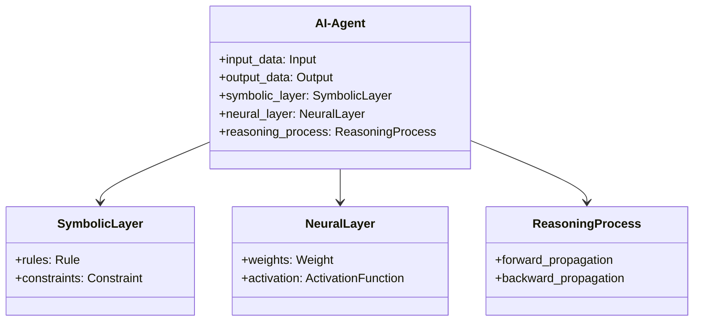
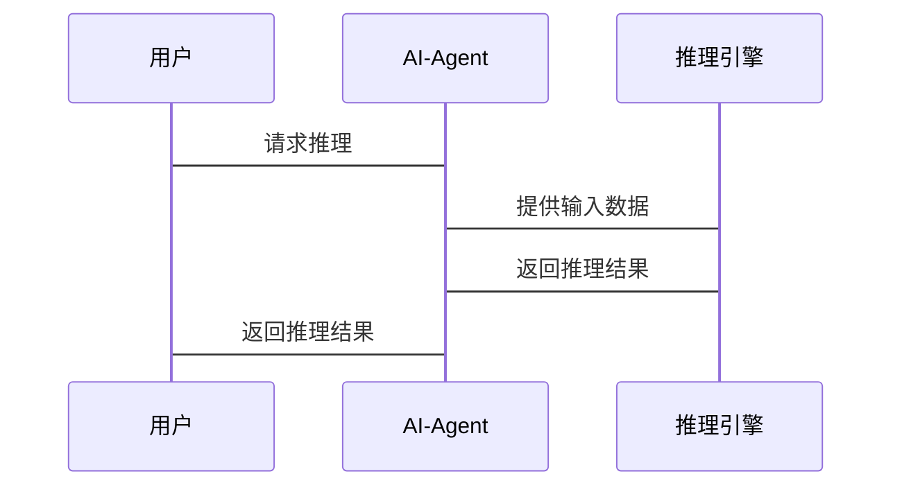

                 


# 神经符号AI在AI Agent逻辑推理中的实践

> 关键词：神经符号AI，AI Agent，逻辑推理，符号逻辑，神经网络，数学模型，人工智能

> 摘要：神经符号AI结合了符号逻辑和神经网络的优势，能够提升AI Agent的逻辑推理能力。本文从神经符号AI的背景与核心概念出发，详细讲解其算法原理、系统架构设计，并通过实战项目展示其应用。通过本文，读者将全面理解神经符号AI在AI Agent中的实践与创新。

---

# 第一部分: 神经符号AI与AI Agent概述

## 第1章: 神经符号AI的背景与核心概念

### 1.1 神经符号AI的起源与发展

#### 1.1.1 符号AI的局限性
符号AI（Symbolic AI）通过明确的规则和逻辑进行推理，但在处理复杂、动态的现实世界问题时显得力不从心。例如，符号AI难以处理模糊信息和不确定性，且在面对大规模数据时效率低下。

#### 1.1.2 神经网络的崛起与挑战
神经网络（Neural Networks）通过大量数据训练，能够处理复杂的模式识别任务，但在需要明确逻辑推理和符号操作时表现不足。

#### 1.1.3 神经符号AI的融合与创新
神经符号AI（Neural-Symbolic AI）将符号逻辑与神经网络结合，利用符号逻辑的明确性与神经网络的强大的模式识别能力，形成了互补的优势。

### 1.2 AI Agent的基本概念与分类

#### 1.2.1 AI Agent的定义与特征
AI Agent是指能够感知环境、自主决策并执行任务的智能实体。其特征包括自主性、反应性、目标导向性和学习能力。

#### 1.2.2 基于符号逻辑的AI Agent
基于符号逻辑的AI Agent通过明确的规则和逻辑推理解决问题，但缺乏对复杂数据的处理能力。

#### 1.2.3 基于神经网络的AI Agent
基于神经网络的AI Agent通过大量数据训练，能够处理复杂模式，但在逻辑推理方面存在不足。

### 1.3 神经符号AI在AI Agent中的作用

#### 1.3.1 神经符号AI的优势
神经符号AI结合了符号逻辑的明确性和神经网络的灵活性，能够处理复杂数据并进行逻辑推理。

#### 1.3.2 神经符号AI在逻辑推理中的应用
神经符号AI能够通过符号逻辑对数据进行建模，并利用神经网络进行特征提取，从而提升逻辑推理能力。

#### 1.3.3 神经符号AI的未来发展趋势
神经符号AI将在AI Agent中发挥越来越重要的作用，尤其是在需要结合逻辑推理和复杂数据处理的场景中。

## 第2章: 神经符号AI的核心概念与联系

### 2.1 神经符号AI的核心原理

#### 2.1.1 符号逻辑与神经网络的结合
神经符号AI通过将符号逻辑嵌入神经网络中，实现了符号推理与神经网络的结合。

#### 2.1.2 神经符号AI的基本架构
神经符号AI的基本架构包括符号层和神经层，符号层负责逻辑推理，神经层负责特征提取。

#### 2.1.3 神经符号AI的数学模型
神经符号AI的数学模型将符号逻辑与神经网络的权重优化相结合，形成了独特的模型结构。

### 2.2 神经符号AI的核心概念对比

#### 2.2.1 符号逻辑与神经网络的对比
| 特性 | 符号逻辑 | 神经网络 |
|------|----------|----------|
| 表达方式 | 明确的规则和逻辑 | 隐含的模式和关系 |
| 处理能力 | 善于逻辑推理 | 善于模式识别 |
| 适应性 | 较低 | 较高 |

#### 2.2.2 神经符号AI与传统符号AI的区别
- 传统符号AI依赖于明确的规则，缺乏对复杂数据的处理能力。
- 神经符号AI结合了符号逻辑和神经网络，能够处理复杂数据并进行逻辑推理。

#### 2.2.3 神经符号AI与纯神经网络的区别
- 纯神经网络擅长模式识别，但在逻辑推理方面表现不足。
- 神经符号AI结合了符号逻辑，能够进行逻辑推理和复杂数据处理。

### 2.3 神经符号AI的实体关系图

```mermaid
er
    entity 神经符号AI {
        id
        symbol_logic
        neural_network
        reasoning_task
    }
    entity 符号逻辑 {
        rule
        constraint
        inference
    }
    entity 神经网络 {
        layer
        weight
        activation_function
    }
    entity 推理任务 {
        input_data
        output_data
        reasoning_process
    }
    神经符号AI --> 符号逻辑
    神经符号AI --> 神经网络
    神经符号AI --> 推理任务
```

---

# 第二部分: 神经符号AI的算法原理

## 第3章: 神经符号AI的算法原理

### 3.1 符号增强的神经网络

#### 3.1.1 算法原理
符号增强的神经网络通过在神经网络中嵌入符号逻辑，提升其逻辑推理能力。

#### 3.1.2 算法流程


#### 3.1.3 核心代码实现

```python
import torch
import torch.nn as nn

class SymbolicLayer(nn.Module):
    def __init__(self, num_symbols):
        super(SymbolicLayer, self).__init__()
        self.num_symbols = num_symbols
        self.weight = nn.Parameter(torch.randn(num_symbols, num_symbols))

    def forward(self, input):
        # input: [batch_size, num_symbols]
        output = torch.mm(input, self.weight)
        return output

class NeuralSymbolicNetwork(nn.Module):
    def __init__(self, input_size, hidden_size, num_symbols):
        super(NeuralSymbolicNetwork, self).__init__()
        self.neural_part = nn.Sequential(
            nn.Linear(input_size, hidden_size),
            nn.ReLU(),
            nn.Linear(hidden_size, num_symbols)
        )
        self.symbolic_layer = SymbolicLayer(num_symbols)

    def forward(self, input):
        # input: [batch_size, input_size]
        hidden = self.neural_part(input)
        output = self.symbolic_layer(hidden)
        return output
```

### 3.2 符号驱动的推理算法

#### 3.2.1 算法原理
符号驱动的推理算法通过符号逻辑指导神经网络的推理过程。

#### 3.2.2 算法流程


#### 3.2.3 核心代码实现

```python
def symbolic_reasoning(rules, inputs):
    # rules: list of tuples (premise, conclusion)
    # inputs: list of premise facts
    facts = set(inputs)
    queue = deque(inputs)
    
    while queue:
        premise = queue.popleft()
        for rule in rules:
            if premise == rule[0]:
                conclusion = rule[1]
                if conclusion not in facts:
                    facts.add(conclusion)
                    queue.append(conclusion)
    return list(facts)
```

### 3.3 神经符号AI的数学模型

#### 3.3.1 符号约束损失函数
符号约束损失函数用于衡量推理结果与符号逻辑的一致性。

$$ L = \sum_{i=1}^{n} (y_i - f(x_i))^2 $$

其中，$y_i$ 是符号逻辑的预期输出，$f(x_i)$ 是神经网络的输出。

#### 3.3.2 神经符号AI的推理过程

$$ y = g(x, \theta) $$

其中，$g$ 是神经网络模型，$\theta$ 是模型参数，$x$ 是输入数据，$y$ 是推理结果。

---

# 第三部分: 神经符号AI的系统架构

## 第4章: 神经符号AI的系统架构设计

### 4.1 系统功能设计

#### 4.1.1 领域模型设计



#### 4.1.2 系统架构设计


### 4.2 系统接口设计

#### 4.2.1 输入接口
- 输入数据格式：JSON、CSV等
- 接口函数：`process_input(input)`，返回处理后的数据

#### 4.2.2 输出接口
- 输出数据格式：JSON、文本等
- 接口函数：`generate_output(result)`，返回推理结果

### 4.3 系统交互流程



---

# 第四部分: 项目实战

## 第5章: 神经符号AI的项目实战

### 5.1 项目背景与目标

#### 5.1.1 项目背景
本项目旨在通过神经符号AI技术，构建一个能够进行复杂逻辑推理的AI Agent，应用于智能客服领域。

#### 5.1.2 项目目标
- 实现基于神经符号AI的智能客服对话系统
- 提升对话系统的逻辑推理能力
- 实现高效的人机交互

### 5.2 项目实现

#### 5.2.1 环境配置

```bash
pip install torch
pip install transformers
pip install matplotlib
pip install numpy
```

#### 5.2.2 核心代码实现

```python
import torch
from torch import nn
import numpy as np

class NeuralSymbolicAgent:
    def __init__(self, input_size, hidden_size, num_symbols):
        self.neural_part = nn.Sequential(
            nn.Linear(input_size, hidden_size),
            nn.ReLU(),
            nn.Linear(hidden_size, num_symbols)
        )
        self.symbolic_layer = SymbolicLayer(num_symbols)

    def forward(self, input):
        hidden = self.neural_part(input)
        output = self.symbolic_layer(hidden)
        return output

    def train(self, inputs, targets):
        outputs = self.forward(inputs)
        loss = nn.MSELoss()(outputs, targets)
        loss.backward()
        self.optimizer.step()
        self.optimizer.zero_grad()
```

#### 5.2.3 功能模块分析


### 5.3 项目案例分析

#### 5.3.1 案例背景
在智能客服对话系统中，用户提出一个问题，AI Agent需要通过逻辑推理给出合理的回答。

#### 5.3.2 案例分析
用户输入：我需要退换货。
AI Agent推理：根据规则库，退换货需要满足特定条件。
推理结果：输出符合规则的退换货流程。

#### 5.3.3 案例总结
通过神经符号AI，AI Agent能够高效地处理复杂逻辑推理任务，提升用户体验。

---

# 第五部分: 总结与展望

## 第6章: 总结与展望

### 6.1 神经符号AI的实践总结

#### 6.1.1 核心优势
- 结合符号逻辑与神经网络的优势
- 提升AI Agent的逻辑推理能力
- 适用于复杂场景的推理任务

### 6.2 神经符号AI的未来展望

#### 6.2.1 技术创新
- 更高效的神经符号AI模型
- 更强大的符号逻辑嵌入
- 更智能的推理算法

#### 6.2.2 应用拓展
- 更多领域的应用
- 更复杂的推理任务
- 更人性化的交互设计

### 6.3 神经符号AI的注意事项

#### 6.3.1 实践中的注意事项
- 模型的可解释性
- 数据的充分性
- 算法的高效性

#### 6.3.2 未来发展的挑战
- 理论上的突破
- 技术上的创新
- 应用中的推广

---

# 作者

作者：AI天才研究院/AI Genius Institute & 禅与计算机程序设计艺术 /Zen And The Art of Computer Programming

---

**摘要：**  
本文深入探讨了神经符号AI在AI Agent逻辑推理中的实践，通过理论分析、算法实现和项目实战，全面展示了神经符号AI的优势与应用。通过本文，读者将能够掌握神经符号AI的核心概念、算法原理和系统架构设计，并能够在实际项目中应用这些知识。

