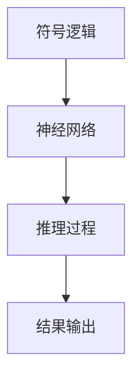
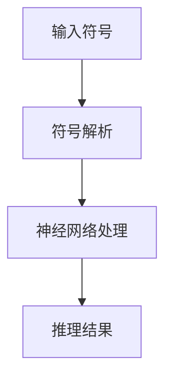
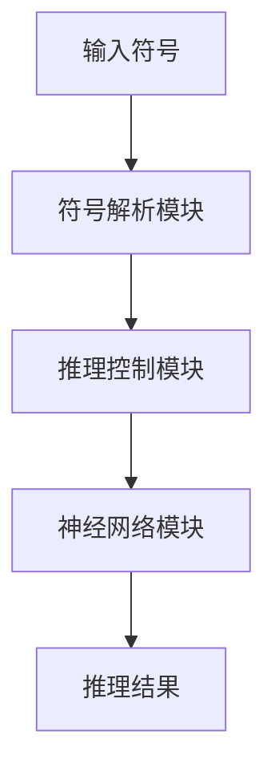

                 


# 神经符号推理在AI Agent常识推理中的应用

**关键词**：神经符号推理，AI Agent，常识推理，符号与神经网络结合，推理算法，系统架构

**摘要**：  
神经符号推理结合了符号逻辑和神经网络的优势，为AI Agent的常识推理提供了强大的能力。本文详细探讨了神经符号推理的核心概念、算法原理、系统架构以及实际应用，分析了其在AI Agent中的独特优势，并通过案例展示了其在常识推理中的应用。

---

## 第一部分：神经符号推理的背景与问题背景

### 第1章：神经符号推理的背景与问题背景

#### 1.1 神经符号推理的基本概念

##### 1.1.1 符号推理与神经网络的结合  
符号推理依赖于明确的规则和逻辑，能够处理抽象概念和复杂关系，但其灵活性和表达能力有限。神经网络通过数据驱动的方式学习模式，具有强大的特征提取能力，但在处理符号逻辑和推理任务时表现不足。神经符号推理将两者结合，弥补了各自的缺陷。

##### 1.1.2 神经符号推理的定义与特点  
神经符号推理是一种结合符号逻辑和神经网络的推理方法，其特点包括：  
- **符号与神经网络的结合**：利用符号表示处理逻辑推理，同时借助神经网络进行特征学习。  
- **可解释性与灵活性**：相比纯符号推理，神经符号推理更具灵活性；相比纯神经网络，其可解释性更强。  
- **跨领域应用**：适用于自然语言处理、机器人控制、知识图谱构建等领域。

##### 1.1.3 神经符号推理的应用场景  
- **常识推理**：帮助AI Agent理解常识和逻辑关系。  
- **知识图谱推理**：通过符号逻辑增强知识图谱的推理能力。  
- **对话系统**：结合符号逻辑和神经网络，提升对话系统的理解和推理能力。

#### 1.2 神经符号推理的问题背景

##### 1.2.1 神经网络的局限性  
- 神经网络擅长模式识别和分类，但难以处理符号逻辑和抽象推理。  
- 在需要明确逻辑推理的任务中表现不佳。

##### 1.2.2 符号推理的局限性  
- 符号推理依赖于规则，灵活性不足，难以处理复杂或模糊的现实问题。  
- 无法直接利用大数据和复杂特征进行学习。

##### 1.2.3 神经符号推理的必要性  
- 神经符号推理结合了符号逻辑和神经网络的优势，能够处理复杂推理任务。  
- 在AI Agent中，常识推理需要兼顾逻辑推理和数据驱动的特征学习，神经符号推理是理想选择。

#### 1.3 神经符号推理的核心问题

##### 1.3.1 神经符号推理的核心问题描述  
- 如何将符号逻辑与神经网络有效结合？  
- 如何在符号表示和神经网络之间建立桥梁？  
- 如何实现符号逻辑驱动的神经网络推理？

##### 1.3.2 神经符号推理的边界与外延  
- 神经符号推理的边界：符号逻辑与神经网络的结合范围。  
- 外延：将符号逻辑应用于神经网络的各个领域。

##### 1.3.3 神经符号推理的概念结构与核心要素  
- **符号表示**：符号逻辑、规则、知识库。  
- **神经网络**：深度学习模型、特征提取。  
- **推理机制**：符号逻辑驱动的推理、神经网络驱动的推理。

---

## 第二部分：神经符号推理的核心概念与联系

### 第2章：神经符号推理的核心概念与联系

#### 2.1 神经符号推理的核心原理

##### 2.1.1 符号表示与神经网络的结合  
- **符号表示**：使用符号逻辑表示知识和规则，例如一阶逻辑（FOL）。  
- **神经网络表示**：使用深度学习模型（如Transformer）处理符号和数据。

##### 2.1.2 神经符号推理的基本原理  
- 神经符号推理通过符号逻辑指导神经网络的推理过程，同时利用神经网络的强大特征提取能力增强符号推理的能力。  
- 示例：使用符号逻辑约束神经网络的输出，使其符合逻辑规则。

##### 2.1.3 神经符号推理的数学模型  
- 神经符号推理的数学模型将符号逻辑嵌入到神经网络中，例如通过符号增强的注意力机制。

#### 2.2 神经符号推理的核心概念对比

##### 2.2.1 符号表示与神经网络表示的对比  
| 对比维度 | 符号表示 | 神经网络表示 |  
|----------|----------|--------------|  
| 可解释性 | 高       | 低           |  
| 灵活性   | 低       | 高           |  
| 处理能力 | 善于逻辑推理 | 善于模式识别 |  

##### 2.2.2 神经符号推理与传统符号推理的对比  
- **神经符号推理**：结合符号逻辑和神经网络，兼具可解释性和灵活性。  
- **传统符号推理**：依赖规则，灵活性不足。

##### 2.2.3 神经符号推理与纯神经网络推理的对比  
- **神经符号推理**：在符号逻辑指导下进行推理，推理结果更符合逻辑。  
- **纯神经网络推理**：依赖数据，难以处理符号逻辑问题。

#### 2.3 神经符号推理的ER实体关系图



---

## 第三部分：神经符号推理的算法原理

### 第3章：神经符号推理的算法原理

#### 3.1 神经符号推理的基本算法

##### 3.1.1 符号增强的注意力机制  
- 在注意力机制中引入符号逻辑，例如通过符号约束注意力权重的计算。  
- 示例：在自然语言处理中，结合语义角色的符号信息增强注意力机制。

##### 3.1.2 符号驱动的强化学习  
- 使用符号逻辑作为奖励函数，指导强化学习过程。  
- 示例：在游戏AI中，结合游戏规则（符号逻辑）进行强化学习。

##### 3.1.3 神经符号推理的数学模型  
- 神经符号推理的数学模型将符号逻辑嵌入到神经网络中，例如：  
  $$注意力权重 = \frac{e^{qWp}}{\sum e^{qWp}}$$  

#### 3.2 神经符号推理的数学公式

##### 3.2.1 注意力机制的公式  
$$注意力权重 = \frac{e^{qWp}}{\sum e^{qWp}}$$  

##### 3.2.2 神经符号推理的公式  
$$推理结果 = f(q, k, v)$$  

#### 3.3 神经符号推理的算法流程



---

## 第四部分：神经符号推理的系统分析与架构设计

### 第4章：神经符号推理的系统分析与架构设计

#### 4.1 系统分析

##### 4.1.1 系统功能设计  
- **符号解析**：解析输入的符号逻辑。  
- **神经网络处理**：利用神经网络进行特征提取和推理。  
- **推理结果输出**：输出最终的推理结果。

##### 4.1.2 系统架构设计  
- **符号解析模块**：负责解析输入的符号逻辑。  
- **神经网络模块**：负责特征提取和推理。  
- **推理控制模块**：协调符号解析和神经网络模块的推理过程。

#### 4.2 神经符号推理的系统架构



---

## 第五部分：神经符号推理的项目实战

### 第5章：神经符号推理的项目实战

#### 5.1 环境安装

```bash
pip install numpy tensorflow keras
```

#### 5.2 核心代码实现

##### 5.2.1 符号解析模块

```python
def parse_symbols(symbols):
    # 解析符号逻辑
    return parsed_symbols
```

##### 5.2.2 神经网络模块

```python
def neural_network(input):
    model = build_model()
    return model.predict(input)
```

##### 5.2.3 推理控制模块

```python
def inference_control(symbols, parsed_symbols):
    # 控制推理过程
    return result
```

#### 5.3 代码解读与分析

- **符号解析模块**：解析输入的符号逻辑，生成可以被神经网络处理的输入。  
- **神经网络模块**：构建神经网络模型，进行特征提取和推理。  
- **推理控制模块**：协调符号解析和神经网络模块，输出最终的推理结果。

#### 5.4 案例分析与详细讲解

- **案例**：在自然语言处理中，使用符号逻辑约束神经网络的注意力机制，提升推理能力。

#### 5.5 项目小结

- 神经符号推理结合了符号逻辑和神经网络的优势，能够实现强大的常识推理能力。  
- 项目实战展示了如何将神经符号推理应用于实际任务中。

---

## 第六部分：总结与展望

### 第6章：总结与展望

#### 6.1 总结

- 神经符号推理结合了符号逻辑和神经网络的优势，为AI Agent的常识推理提供了强大的能力。  
- 通过符号逻辑指导神经网络的推理过程，能够实现更灵活、可解释的推理。

#### 6.2 注意事项

- 神经符号推理的实现需要结合具体任务的需求，选择合适的符号表示和神经网络架构。  
- 在实际应用中，需要处理符号逻辑与神经网络之间的复杂交互。

#### 6.3 未来趋势

- 神经符号推理将在AI Agent、自然语言处理等领域得到更广泛应用。  
- 更加复杂的符号逻辑和神经网络的结合将推动推理能力的进一步提升。

#### 6.4 拓展阅读

- 建议阅读相关论文和书籍，深入了解神经符号推理的数学模型和应用场景。

---

## 作者

作者：AI天才研究院/AI Genius Institute & 禅与计算机程序设计艺术 /Zen And The Art of Computer Programming

