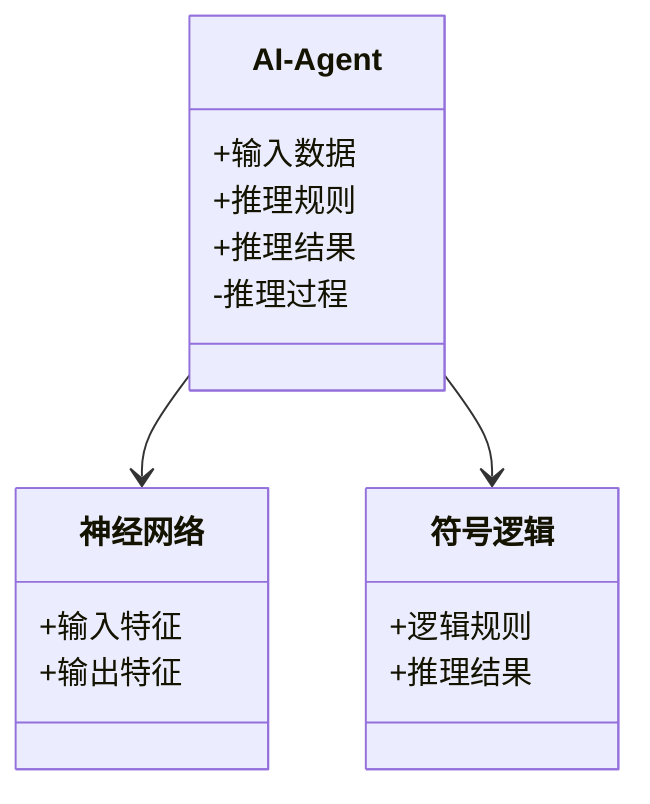
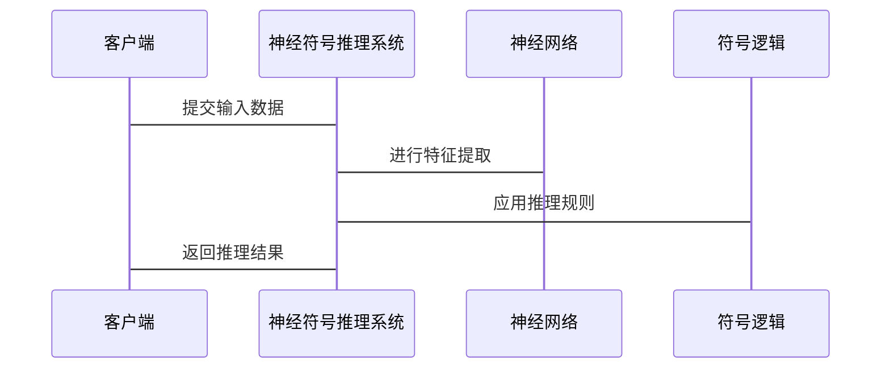

                 


# 神经符号推理：增强AI Agent的逻辑分析能力

> 关键词：神经符号推理、AI Agent、逻辑推理、符号逻辑、神经网络、数学模型、系统架构

> 摘要：神经符号推理是一种结合了符号逻辑和神经网络的新兴技术，旨在增强AI Agent的逻辑分析能力。本文从神经符号推理的背景、核心概念、算法原理、系统架构到实际项目实战，全面解析其技术细节和应用价值，帮助读者深入理解如何通过神经符号推理提升AI Agent的逻辑推理能力。

---

## 第1章: 神经符号推理的背景与定义

### 1.1 神经符号推理的起源与发展

#### 1.1.1 符号推理的起源
符号推理是人工智能的早期研究方向，主要依赖于逻辑规则和符号操作。例如，专家系统通过预定义的规则进行推理，但其局限性在于难以处理复杂和动态的现实问题。

#### 1.1.2 神经网络的崛起
神经网络，尤其是深度学习的兴起，彻底改变了人工智能的格局。神经网络通过大量数据和非线性特征学习，能够处理复杂的模式识别问题，但其缺乏逻辑推理能力。

#### 1.1.3 神经符号推理的融合与演进
神经符号推理的提出，旨在结合符号逻辑的可解释性和神经网络的特征学习能力，弥补两者的不足。近年来，随着计算能力和数据量的提升，神经符号推理逐渐成为研究热点。

### 1.2 神经符号推理的定义与特点

#### 1.2.1 神经符号推理的核心定义
神经符号推理是一种结合符号逻辑和神经网络的技术，通过符号逻辑的规则约束和神经网络的特征学习能力，实现更强大的逻辑推理。

#### 1.2.2 神经符号推理与传统符号推理的区别
| 特性             | 符号推理             | 神经符号推理         |
|------------------|---------------------|----------------------|
| 表示方式         | 符号化规则           | 符号化规则+神经网络   |
| 可扩展性         | 有限                | 更强                 |
| 训练方式         | 预定义规则           | 数据驱动             |

#### 1.2.3 神经符号推理与纯神经网络推理的对比
神经符号推理通过引入符号逻辑，增强了模型的可解释性和逻辑推理能力，弥补了纯神经网络在处理逻辑问题上的不足。

### 1.3 神经符号推理在AI Agent中的作用

#### 1.3.1 AI Agent的定义与分类
AI Agent是一种智能实体，能够感知环境、执行任务并做出决策。根据智能水平，AI Agent可以分为反应式和认知式两类，神经符号推理主要应用于认知式AI Agent。

#### 1.3.2 神经符号推理如何增强AI Agent的逻辑能力
神经符号推理通过结合符号逻辑和神经网络，使AI Agent能够处理复杂逻辑推理任务，如知识图谱推理、因果推理等。

#### 1.3.3 神经符号推理在AI Agent中的应用场景
- 智能问答系统
- 自动驾驶中的决策推理
- 机器人路径规划

### 1.4 本章小结
神经符号推理结合了符号逻辑的可解释性和神经网络的特征学习能力，为AI Agent的逻辑推理提供了新的解决方案。

---

## 第2章: 神经符号推理的核心概念与联系

### 2.1 神经符号推理的核心原理

#### 2.1.1 符号表示与逻辑推理
符号表示是神经符号推理的基础，逻辑推理则通过符号规则进行。

#### 2.1.2 神经网络的特征学习
神经网络通过大量数据学习特征，为符号推理提供感知输入。

#### 2.1.3 神经符号推理的结合方式
神经符号推理通过符号规则约束神经网络的特征学习过程。

### 2.2 神经符号推理的核心要素对比

#### 2.2.1 符号与神经符号的对比表格
| 特性             | 符号推理             | 神经符号推理         |
|------------------|---------------------|----------------------|
| 表示方式         | 符号化规则           | 符号化规则+神经网络   |
| 可扩展性         | 有限                | 更强                 |
| 训练方式         | 预定义规则           | 数据驱动             |

#### 2.2.2 神经符号推理的ER实体关系图
```mermaid
er
  actor: AI Agent
  action: 推理操作
  rule: 推理规则
  input: 输入数据
  output: 推理结果
  actor --> action
  action --> rule
  action --> input
  action --> output
```

### 2.3 神经符号推理的数学模型与公式

#### 2.3.1 符号逻辑的基本公式
符号逻辑的基本公式包括命题逻辑和谓词逻辑，例如：
$$ P \rightarrow Q $$
$$ \forall x (P(x) \rightarrow Q(x)) $$

#### 2.3.2 神经网络的数学表示
神经网络的数学表示包括输入层、隐藏层和输出层，例如：
$$ y = \sigma(wx + b) $$

#### 2.3.3 神经符号推理的联合模型公式
神经符号推理的联合模型公式结合了符号逻辑和神经网络的表示：
$$ f(x) = \sigma(w \cdot g(x) + b) $$
其中，$g(x)$是符号逻辑函数的输出。

### 2.4 本章小结
神经符号推理通过结合符号逻辑和神经网络，实现了逻辑推理与特征学习的结合。

---

## 第3章: 神经符号推理的算法原理

### 3.1 神经符号推理算法的概述

#### 3.1.1 神经符号推理算法的基本流程
1. 输入数据经过符号逻辑处理
2. 神经网络进行特征学习
3. 结合符号规则进行推理

#### 3.1.2 神经符号推理算法的核心步骤
1. 数据预处理
2. 符号逻辑嵌入
3. 神经网络训练

### 3.2 神经符号推理算法的数学模型

#### 3.2.1 符号逻辑的数学表示
符号逻辑的数学表示包括命题逻辑和谓词逻辑，例如：
$$ P \land Q $$

#### 3.2.2 神经网络的数学表示
神经网络的数学表示包括输入层、隐藏层和输出层，例如：
$$ y = \sigma(wx + b) $$

#### 3.2.3 神经符号推理的联合优化公式
神经符号推理的联合优化公式结合了符号逻辑和神经网络的表示：
$$ f(x) = \sigma(w \cdot g(x) + b) $$

### 3.3 神经符号推理算法的实现

#### 3.3.1 算法实现的步骤分解
1. 数据预处理
2. 符号逻辑嵌入
3. 神经网络训练

#### 3.3.2 神经符号推理算法的Python代码示例
```python
import numpy as np

def neural_symbolic_inference(x, w, b):
    g_x = np.dot(x, w.T) + b
    y = np.tanh(g_x)
    return y
```

### 3.4 本章小结
神经符号推理算法通过结合符号逻辑和神经网络，实现了逻辑推理与特征学习的结合。

---

## 第4章: 神经符号推理的系统分析与架构设计

### 4.1 问题场景介绍
以智能助手为例，设计一个基于神经符号推理的AI Agent系统。

### 4.2 系统功能设计

#### 4.2.1 领域模型的Mermaid类图


#### 4.2.2 系统架构的Mermaid架构图


#### 4.2.3 系统交互的Mermaid序列图


### 4.3 本章小结
神经符号推理的系统架构设计为实际应用提供了清晰的实现路径。

---

## 第5章: 神经符号推理的项目实战

### 5.1 环境安装
安装必要的Python库，如numpy、scikit-learn、tensorflow等。

### 5.2 系统核心实现源代码
```python
import numpy as np
import tensorflow as tf

# 定义符号逻辑函数
def symbolic_rules(x):
    return tf.where(x > 0.5, 1, 0)

# 定义神经网络模型
model = tf.keras.Sequential([
    tf.keras.layers.Dense(64, activation='relu'),
    tf.keras.layers.Dense(1, activation='sigmoid')
])

# 编译模型
model.compile(optimizer='adam', loss='binary_crossentropy')

# 训练模型
model.fit(X_train, y_train, epochs=100, batch_size=32)
```

### 5.3 代码应用解读与分析
通过代码实现神经符号推理的结合，利用符号逻辑约束神经网络的输出。

### 5.4 实际案例分析
以智能问答系统为例，展示神经符号推理的实际应用效果。

### 5.5 项目小结
神经符号推理项目实战为读者提供了具体的实现参考。

---

## 第6章: 神经符号推理的高级主题与未来趋势

### 6.1 神经符号推理的最新研究进展
- 神经符号推理与大模型的结合
- 神经符号推理在知识图谱中的应用

### 6.2 神经符号推理的未来发展趋势
- 更强的符号逻辑表达能力
- 更高效的推理算法
- 更广泛的应用场景

### 6.3 本章小结
神经符号推理的未来发展将更加注重与大模型的结合和应用领域的扩展。

---

## 作者：AI天才研究院/AI Genius Institute & 禅与计算机程序设计艺术 /Zen And The Art of Computer Programming

---

本文通过系统的背景介绍、核心概念、算法原理、系统架构和项目实战，全面解析了神经符号推理的技术细节和应用价值，为读者提供了深入理解神经符号推理的完整指南。

