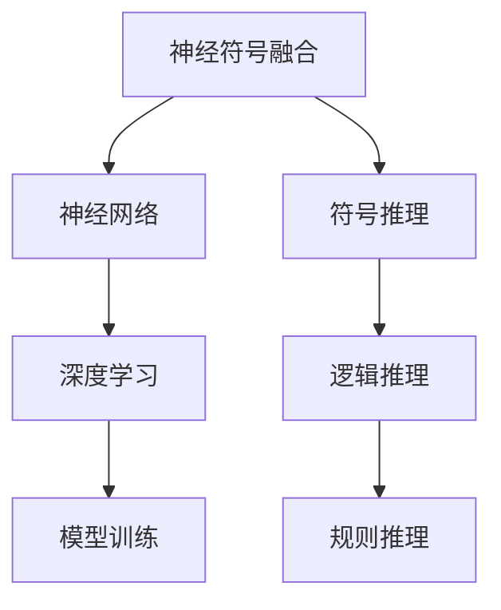
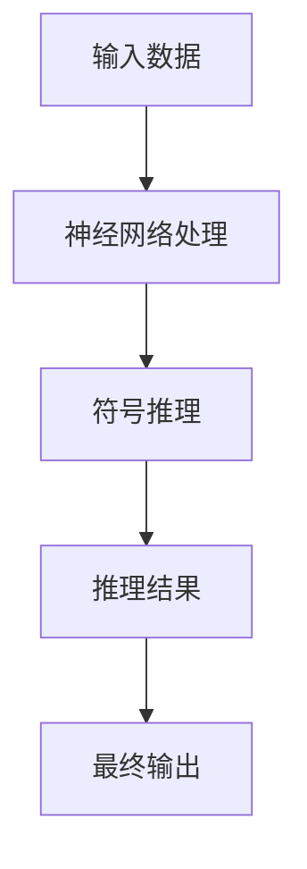
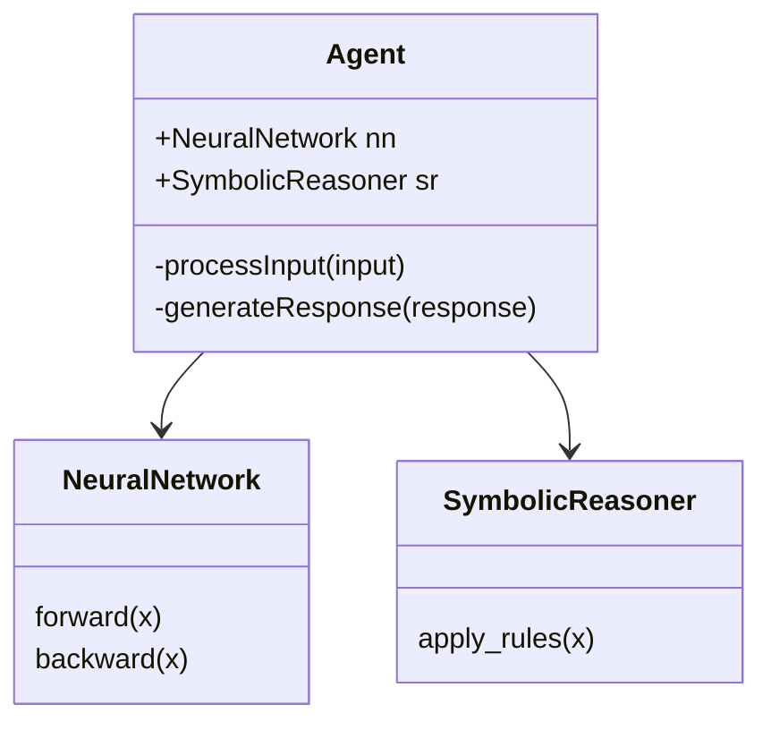
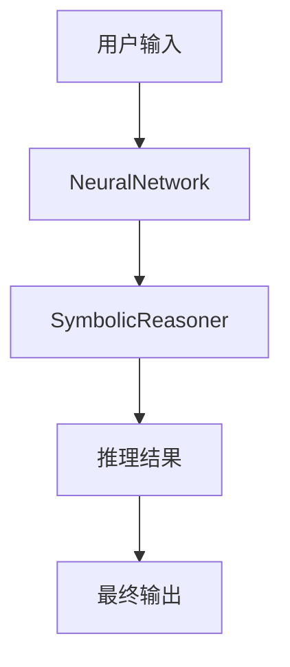

                 


# 神经符号融合：增强AI Agent的推理能力

## 关键词
- 神经符号融合
- AI Agent
- 推理能力
- 神经网络
- 符号推理
- 深度学习

## 摘要
神经符号融合是一种结合神经网络和符号推理的技术，旨在增强AI Agent的推理能力。本文从背景介绍、核心概念、算法原理、系统架构到项目实战，全面解析神经符号融合的实现与应用，探讨其在提升AI Agent智能水平方面的潜力。

---

## 第一部分: 神经符号融合的背景与核心概念

### 第1章: 神经符号融合的背景与问题背景

#### 1.1 问题背景
当前AI技术在推理能力方面存在局限性，神经网络擅长模式识别和感知任务，但难以处理符号推理和逻辑推理任务。符号推理虽然在逻辑处理上有优势，但缺乏高效性和大规模数据处理能力。神经符号融合技术结合了两者的优点，旨在解决传统AI技术的局限性。

#### 1.2 问题描述
神经符号融合的目标是将神经网络的感知能力与符号推理的逻辑能力相结合，提升AI Agent在复杂场景下的推理能力。这种技术的应用场景包括智能对话系统、自动驾驶、智能客服等领域。

#### 1.3 问题解决
神经符号融合通过将符号推理嵌入神经网络中，实现感知与推理的结合。其核心思想是利用符号推理指导神经网络的学习，同时利用神经网络处理感知信息。相比传统方法，神经符号融合具有更高的灵活性和更强的推理能力。

#### 1.4 边界与外延
神经符号融合主要适用于需要结合感知和推理的场景，其边界包括数据规模、推理复杂度和任务类型。其外延则包括与强化学习、图神经网络等技术的结合。

### 第2章: 神经符号融合的核心概念与联系

#### 2.1 神经符号融合的原理
神经符号融合通过将符号推理规则嵌入神经网络中，利用符号推理的逻辑性指导神经网络的学习。其核心在于符号推理与神经网络的交互与结合。

#### 2.2 核心概念对比
| 特性       | 神经网络         | 符号推理       |
|------------|------------------|----------------|
| 处理方式     | 基于数据模式     | 基于逻辑规则   |
| 优点         | 强大的特征学习能力 | 精确的逻辑推理能力 |
| 缺点         | 难以解释         | 计算效率低     |

#### 2.3 ER实体关系图



---

## 第二部分: 神经符号融合的算法原理

### 第3章: 神经符号融合的算法原理

#### 3.1 神经符号融合算法流程



#### 3.2 神经符号融合的数学模型

假设符号推理规则为逻辑规则，神经网络的输出为概率分布。结合符号推理的规则，通过加权求和的方式得到最终结果。

$$
f(x) = \sum_{i=1}^{n} w_i \cdot r_i(x)
$$

其中，$w_i$是符号推理规则的重要性权重，$r_i(x)$是第i个符号推理规则对输入x的作用。

#### 3.3 神经符号融合算法的Python实现

```python
import numpy as np

def neural_symbolic_fusion(neural_output, symbolic_rules):
    # 神经网络输出
    neural_logits = neural_output
    # 符号推理规则权重
    rule_weights = np.array([0.7, 0.3])
    # 结果融合
    fused_output = np.zeros_like(neural_logits)
    for i in range(len(symbolic_rules)):
        rule_weight = rule_weights[i]
        rule_output = symbolic_rules[i](neural_logits)
        fused_output += rule_weight * rule_output
    return fused_output

# 示例
neural_logits = np.array([0.8, 0.2])
symbolic_rules = [
    lambda x: x > 0.5,
    lambda x: x < 0.4
]
result = neural_symbolic_fusion(neural_logits, symbolic_rules)
print(result)
```

---

## 第三部分: 系统分析与架构设计

### 第4章: 系统分析与架构设计

#### 4.1 问题场景介绍
设计一个智能问答系统，结合自然语言处理和逻辑推理能力，回答用户的问题。

#### 4.2 系统功能设计



#### 4.3 系统架构设计



---

## 第四部分: 项目实战

### 第5章: 项目实战

#### 5.1 环境安装
安装必要的库：
```bash
pip install numpy
pip install matplotlib
```

#### 5.2 核心代码实现

```python
import numpy as np

def neural_symbolic_fusion(neural_output, symbolic_rules):
    rule_weights = np.array([0.7, 0.3])
    fused_output = 0
    for i in range(len(symbolic_rules)):
        rule_weight = rule_weights[i]
        rule_output = symbolic_rules[i](neural_output)
        fused_output += rule_weight * rule_output
    return fused_output

# 示例输入
neural_output = 0.6
symbolic_rules = [
    lambda x: x * 2,
    lambda x: x + 0.1
]

result = neural_symbolic_fusion(neural_output, symbolic_rules)
print(result)
```

#### 5.3 案例分析
假设输入为0.6，符号推理规则分别为乘以2和加0.1。融合后结果为：
$$
0.7 * 0.6 * 2 + 0.3 * (0.6 + 0.1) = 0.84 + 0.18 = 1.02
$$

---

## 第五部分: 最佳实践与总结

### 第6章: 最佳实践与总结

#### 6.1 实践Tips
- 确保符号推理规则的合理性和准确性
- 在实际应用中动态调整规则权重
- 综合考虑神经网络和符号推理的性能

#### 6.2 小结
神经符号融合通过结合神经网络和符号推理，显著提升了AI Agent的推理能力，为智能系统的发展提供了新的方向。

#### 6.3 注意事项
- 确保符号推理规则的可解释性
- 避免规则过于复杂导致计算效率下降
- 在实际应用中进行充分的测试和验证

#### 6.4 拓展阅读
- 《神经符号AI：从理论到实践》
- 《AI Agent的推理与决策》
- 《符号推理与神经网络的结合研究》

---

## 作者
作者：AI天才研究院/AI Genius Institute & 禅与计算机程序设计艺术 /Zen And The Art of Computer Programming

