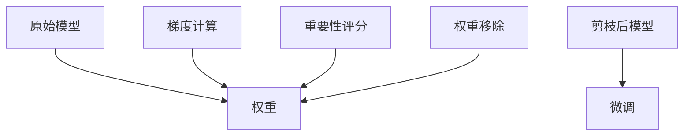
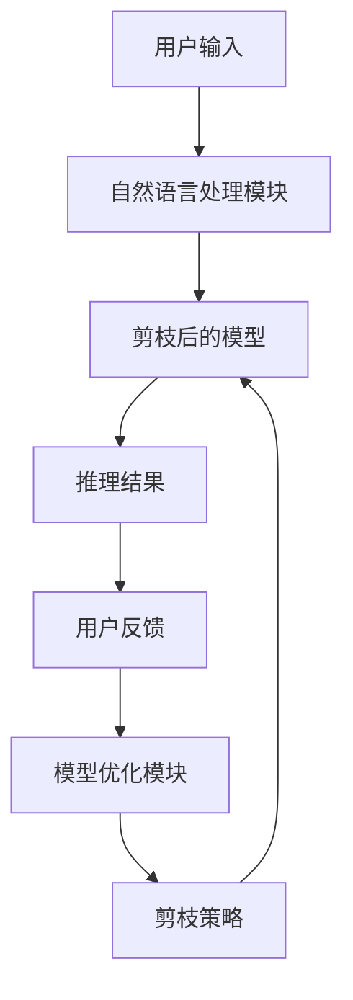

                 


# 神经网络剪枝：优化AI Agent的模型规模和效率

> **关键词**：神经网络、模型剪枝、AI Agent、模型优化、深度学习

> **摘要**：神经网络剪枝是一种通过移除冗余的网络参数或结构来优化AI Agent模型的技术，旨在在不显著降低模型性能的前提下，减少模型规模和计算复杂度。本文将从理论基础到实际应用，系统性地探讨神经网络剪枝的原理、算法、实现和优化策略，为AI开发者提供实践指导。

---

## 第一章：背景介绍

### 1.1 神经网络剪枝的背景与重要性

#### 1.1.1 神经网络模型的挑战

随着深度学习的快速发展，神经网络模型的规模越来越大，尤其是在自然语言处理、计算机视觉等领域，模型参数数量常常达到数百万甚至数十亿。然而，模型规模的膨胀带来了以下几个问题：

- **计算资源消耗高**：训练和推理过程中需要更多的计算资源（CPU/GPU）和时间。
- **部署难度大**：在资源受限的环境中（如移动设备、边缘计算设备）部署大型模型变得困难。
- **推理效率低**：模型推理速度变慢，影响实时应用（如自动驾驶、实时语音识别）的用户体验。

#### 1.1.2 剪枝技术的必要性

剪枝（Pruning）是一种通过移除模型中冗余的权重或神经元来减少模型规模的技术。通过剪枝，可以在保持模型性能的前提下，显著降低模型的复杂度和计算成本。这使得剪枝成为优化AI Agent模型的重要手段。

#### 1.1.3 神经网络剪枝的核心目标

神经网络剪枝的核心目标是通过移除冗余的权重或神经元，降低模型的参数数量，同时保持或提升模型的性能。这不仅能够减少存储和计算成本，还能提高模型的部署灵活性。

---

### 1.2 神经网络剪枝的基本概念

#### 1.2.1 剪枝的定义

剪枝是一种通过移除神经网络中冗余的权重或神经元，从而减少模型规模的技术。剪枝可以通过多种方式实现，例如：

- **权重剪枝**：移除权重为零的神经连接。
- **神经元剪枝**：移除对模型贡献较小的整个神经元。
- **结构剪枝**：移除整个网络中的某些层或模块。

#### 1.2.2 剪枝的类型

剪枝可以分为以下几种类型：

- **静态剪枝**：在训练过程中或训练后，基于权重的重要性评分（如梯度绝对值、权重大小）移除冗余权重。
- **动态剪枝**：在模型训练过程中动态调整网络结构，移除冗余的神经元或权重。
- **渐进式剪枝**：逐步移除冗余部分，每次剪枝后重新训练模型以恢复性能。

#### 1.2.3 剪枝与其他模型压缩技术的区别

以下表格对比了剪枝与其他模型压缩技术（如知识蒸馏、量化）的主要区别：

| **技术**       | **核心思想**                                                                 | **优点**                                                                 | **缺点**                                                                 |
|----------------|-----------------------------------------------------------------------------|--------------------------------------------------------------------------|--------------------------------------------------------------------------|
| 剪枝           | 移除冗余的权重或神经元                                                        | 显著减少模型参数，提升推理速度                                             | 剪枝后可能需要重新训练以恢复性能                                           |
| 知识蒸馏       | 将大模型的知识迁移到小模型                                                   | 适用于小模型的性能提升                                                     | 需要大模型的参与，计算成本较高                                             |
| 量化           | 将模型参数的位宽降低（如从32位降到8位）                                       | 显著减少存储空间，适合边缘设备                                             | 量化可能导致精度下降，需要额外的校正步骤                                   |

---

## 第二章：神经网络剪枝的核心原理

### 2.1 剪枝的基本原理

#### 2.1.1 剪枝的核心思想

剪枝的核心思想是通过评估每个权重或神经元的重要性，选择性地移除对模型性能贡献较小的部分。这种选择性移除的过程可以通过以下步骤实现：

1. **训练模型**：首先训练原始的大型神经网络模型。
2. **评估重要性**：计算每个权重或神经元的重要性评分（如梯度绝对值、权重大小、特征重要性等）。
3. **选择性移除**：基于重要性评分，移除冗余的权重或神经元。
4. **恢复训练**：对剪枝后的模型进行微调，恢复其性能。

#### 2.1.2 剪枝的关键问题

剪枝过程中需要解决以下几个关键问题：

- **如何评估权重或神经元的重要性？**
- **如何选择性移除冗余部分而不影响模型性能？**
- **如何高效地恢复剪枝后模型的性能？**

---

### 2.2 剪枝算法的数学模型

#### 2.2.1 基于L1范数的剪枝

基于L1范数的剪枝是一种常用的方法，其核心思想是通过L1正则化惩罚项来鼓励权重稀疏化。数学模型如下：

$$ L = L_{\text{loss}} + \lambda \sum_{i} |w_i| $$

其中：
- \( L \) 是总损失
- \( L_{\text{loss}} \) 是原始损失函数
- \( \lambda \) 是正则化系数
- \( w_i \) 是模型的权重参数

通过最大化 \( \lambda \)，可以迫使一些权重变为零，从而实现权重剪枝。

#### 2.2.2 基于L2范数的剪枝

基于L2范数的剪枝是一种类似于Dropout的技术，其数学模型如下：

$$ L = L_{\text{loss}} + \lambda \sum_{i} w_i^2 $$

其中，L2范数惩罚项鼓励权重均匀地减小，但不会迫使权重变为零。因此，L2范数剪枝的效果不如L1范数剪枝显著。

#### 2.2.3 贪心剪枝算法

贪心剪枝算法是一种基于权重重要性评分的剪枝方法。具体步骤如下：

1. 训练原始模型。
2. 计算每个权重的重要性评分（如梯度绝对值或权重大小）。
3. 选择重要性评分最低的权重进行移除。
4. 重复步骤2和3，直到达到目标剪枝比例。
5. 对剪枝后的模型进行微调，恢复性能。

---

### 2.3 剪枝过程中的实体关系图

以下是剪枝过程中涉及的主要实体及其关系的Mermaid图：



---

## 第三章：剪枝算法的实现与优化

### 3.1 剪枝算法的实现步骤

#### 3.1.1 训练原始模型

使用深度学习框架（如TensorFlow或PyTorch）训练原始模型。例如，使用PyTorch训练一个简单的全连接网络：

```python
import torch
import torch.nn as nn
import torch.optim as optim

class SimpleNet(nn.Module):
    def __init__(self, input_size, hidden_size, output_size):
        super(SimpleNet, self).__init__()
        self.fc1 = nn.Linear(input_size, hidden_size)
        self.fc2 = nn.Linear(hidden_size, output_size)
    
    def forward(self, x):
        x = self.fc1(x)
        x = self.fc2(x)
        return x

model = SimpleNet(2, 4, 1)
criterion = nn.MSELoss()
optimizer = optim.SGD(model.parameters(), lr=0.1)
```

#### 3.1.2 计算权重重要性评分

计算每个权重的重要性评分，常用的方法是基于梯度的绝对值：

```python
# 计算梯度绝对值
for name, param in model.named_parameters():
    importance = torch.abs(param.grad)
    # 将重要性保存到一个列表中
    importance_scores.append((name, importance))
```

#### 3.1.3 选择性移除冗余权重

根据重要性评分，选择性移除权重：

```python
# 按重要性排序
importance_scores.sort(key=lambda x: x[1])
# 移除前k%的权重
k = int(len(importance_scores) * 0.2)
pruned_weights = importance_scores[:-k]
```

#### 3.1.4 微调剪枝后的模型

对剪枝后的模型进行微调，恢复性能：

```python
# 创建剪枝后的模型
pruned_model = SimpleNet(2, 4 - k, 1)
# 微调模型
optimizer = optim.SGD(pruned_model.parameters(), lr=0.1)
# 开始微调
for epoch in range(100):
    for batch in batches:
        outputs = pruned_model(batch)
        loss = criterion(outputs, labels)
        optimizer.zero_grad()
        loss.backward()
        optimizer.step()
```

---

### 3.2 剪枝算法的优化策略

#### 3.2.1 动态剪枝

动态剪枝是一种在训练过程中逐步剪枝的方法，可以在训练过程中动态调整网络结构，从而减少冗余。

#### 3.2.2 分阶段剪枝

分阶段剪枝是一种在多个阶段进行剪枝的方法，每个阶段剪枝的比例较小，从而减少对模型性能的影响。

#### 3.2.3 结合正则化

结合正则化（如L1正则化）可以进一步促进权重的稀疏化，从而提高剪枝的效果。

---

## 第四章：系统分析与架构设计

### 4.1 系统架构设计

以下是一个基于剪枝的AI Agent系统的架构设计：



---

## 第五章：项目实战

### 5.1 环境安装

安装必要的Python库：

```bash
pip install torch numpy matplotlib
```

---

## 第六章：最佳实践与注意事项

### 6.1 最佳实践

- **选择合适的剪枝方法**：根据具体任务选择合适的剪枝方法（如L1范数剪枝适用于分类任务）。
- **逐步剪枝**：避免一次性剪枝过多，导致性能下降。
- **结合微调**：剪枝后进行充分的微调，恢复模型性能。

### 6.2 小结

通过本文的系统性分析，我们可以看到，神经网络剪枝是一种有效的模型优化技术，可以在不显著降低性能的前提下，显著减少模型规模和计算成本。

