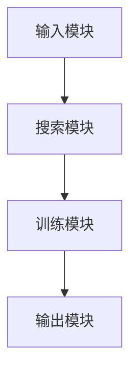

                 


# 神经网络架构搜索：自动化AI Agent模型结构优化

> 关键词：神经网络架构搜索、AI Agent、自动化模型优化、强化学习、遗传算法、系统架构设计、项目实战

> 摘要：神经网络架构搜索是一种通过自动化方法优化AI Agent模型结构的技术。本文系统介绍了其核心概念、算法原理、系统架构设计以及项目实战，帮助读者全面掌握神经网络架构搜索的应用与实现。

---

## 第一章: 神经网络架构搜索的背景与重要性

### 1.1 神经网络架构搜索的定义与核心概念
#### 1.1.1 神经网络架构搜索的定义
- 神经网络架构搜索（Neural Architecture Search, NAS）是通过自动化方法搜索最优神经网络结构的过程。
- 通过算法生成不同的网络架构，评估其性能，选择最优解。

#### 1.1.2 神经网络架构搜索的核心概念
- 搜索空间：可能的网络结构集合，包括层的类型、参数数量等。
- 搜索策略：选择候选结构的方法，如随机搜索、强化学习、遗传算法等。
- 架构评估：对候选结构进行训练和验证，评估其性能指标。

#### 1.1.3 神经网络架构搜索的重要性和应用价值
- 传统人工设计网络架构效率低，且难以探索复杂结构。
- 自动化搜索能够显著提高效率，发现更优的网络结构。
- 广泛应用于图像识别、自然语言处理、推荐系统等领域。

### 1.2 AI Agent模型结构优化的背景
#### 1.2.1 AI Agent的基本概念与功能
- AI Agent：具有感知环境和自主决策能力的智能体。
- 功能包括感知、推理、规划、学习等。
- 模型结构直接影响其性能和效率。

#### 1.2.2 神经网络在AI Agent中的应用
- 神经网络用于感知、推理和决策等模块。
- 网络结构优化可以提升AI Agent的响应速度和准确性。

#### 1.2.3 神经网络架构优化的必要性
- 复杂任务需要高效的网络结构。
- 优化网络架构可以降低计算成本，提升性能。

---

## 第二章: 神经网络架构搜索的核心概念与原理

### 2.1 神经网络架构搜索的核心思想
#### 2.1.1 自动化搜索的基本原理
- 通过算法生成候选网络结构。
- 对候选结构进行训练和验证，评估性能。
- 根据评估结果优化搜索策略，迭代寻找最优结构。

#### 2.1.2 神经网络架构搜索的目标
- 最小化计算资源消耗。
- 最大化模型性能（如准确率、响应速度）。
- 简化模型设计过程。

#### 2.1.3 神经网络架构搜索的关键步骤
1. 定义搜索空间。
2. 选择搜索策略。
3. 评估候选结构。
4. 更新搜索策略，迭代优化。

### 2.2 神经网络架构搜索的关键技术
#### 2.2.1 搜索空间的定义
- 网络层数、每层节点数、激活函数、连接方式等。
- 搜索空间过大时，需要进行剪枝或限制。

#### 2.2.2 搜索策略的选择
- 随机搜索：简单但效率低。
- 强化学习：通过策略优化选择结构。
- 遗传算法：模拟生物进化，通过变异和选择优化结构。

#### 2.2.3 架构评估方法
- 基于训练集的评估。
- 基于验证集的评估。
- 多目标评估：考虑模型准确率、计算复杂度等多方面因素。

---

## 第三章: 神经网络架构搜索的算法原理与实现

### 3.1 神经网络架构搜索的数学模型
#### 3.1.1 网络结构的表示
- 使用计算图表示网络结构。
- 节点表示层，边表示连接。
- 搜索空间可以用图结构描述。

#### 3.1.2 强化学习在NAS中的应用
- 将搜索过程视为马尔可夫决策过程。
- 状态空间：当前网络结构。
- 行动：添加或删除层、调整参数。
- 奖励函数：模型性能评估结果。

#### 3.1.3 遗传算法在NAS中的应用
- 初始化：随机生成初始网络结构种群。
- 适应度评估：训练模型并评估性能。
- 选择：保留高适应度个体。
- 交叉与变异：生成新结构，引入多样性。

### 3.2 神经网络架构搜索的优化方法
#### 3.2.1 基于强化学习的优化
- 使用策略梯度方法优化搜索策略。
- 引入记忆机制，记录优秀结构。
- 在线搜索：动态调整搜索策略。

#### 3.2.2 基于遗传算法的优化
- 适应度函数设计：多目标优化。
- 交叉操作：层间结构的重组。
- 变异操作：微调网络参数。

#### 3.2.3 基于梯度下降的优化
- 将架构搜索转化为参数优化问题。
- 使用可微分搜索：参数化表示网络结构。
- 通过梯度下降寻找最优结构。

---

## 第四章: 神经网络架构搜索的系统架构设计

### 4.1 系统架构设计概述
#### 4.1.1 系统的功能模块划分
- 输入模块：接收任务需求和数据。
- 搜索模块：生成和选择网络结构。
- 训练模块：训练候选模型并评估性能。
- 输出模块：输出最优网络结构和性能指标。

#### 4.1.2 系统的输入输出设计
- 输入：任务目标、数据集、资源限制。
- 输出：最优网络结构、模型性能报告。

#### 4.1.3 系统的性能指标设计
- 搜索效率：单位时间内生成的候选结构数量。
- 模型性能：准确率、响应时间等。
- 资源消耗：计算资源使用情况。

### 4.2 神经网络架构搜索的系统架构图
#### 4.2.1 系统架构的模块化设计


#### 4.2.2 各模块之间的交互关系
- 输入模块接收任务需求，传递给搜索模块。
- 搜索模块生成候选结构，传递给训练模块。
- 训练模块返回性能评估结果，指导搜索模块优化策略。
- 输出模块展示最终结果。

#### 4.2.3 系统的扩展性和可维护性
- 模块化设计便于功能扩展。
- 支持多种搜索策略的插件式开发。

---

## 第五章: 神经网络架构搜索的项目实战

### 5.1 项目环境的安装与配置
#### 5.1.1 系统环境的搭建
- 操作系统：Linux/Windows/MacOS。
- 开发工具：Python、PyTorch、Keras等。
- 数据集：CIFAR-10、MNIST等。

#### 5.1.2 开发工具的安装
- Python 3.8及以上版本。
- 安装库：`pip install torch torchvision numpy matplotlib`

#### 5.1.3 数据集的准备与预处理
- 数据集下载：例如CIFAR-10数据集。
- 数据归一化、分割训练集和验证集。

### 5.2 项目核心代码的实现
#### 5.2.1 神经网络架构搜索算法的实现
```python
import torch
import torch.nn as nn
import torch.optim as optim

class NASAgent:
    def __init__(self, search_space):
        self.search_space = search_space
        self.population = self.initialize_population()

    def initialize_population(self):
        # 初始化种群，随机生成候选结构
        pass

    def evaluate_architecture(self, arch):
        # 评估候选结构的性能
        model = self.build_model(arch)
        criterion = nn.CrossEntropyLoss()
        optimizer = optim.SGD(model.parameters(), lr=0.01)
        # 训练模型并返回准确率
        pass

    def evolve_population(self):
        # 进行遗传操作：选择、交叉、变异
        pass
```

#### 5.2.2 神经网络模型的训练与评估
```python
def train_model(model, criterion, optimizer, dataloader):
    epochs = 10
    for epoch in range(epochs):
        for inputs, labels in dataloader:
            outputs = model(inputs)
            loss = criterion(outputs, labels)
            optimizer.zero_grad()
            loss.backward()
            optimizer.step()
    return model

# 示例网络结构搜索与训练
search_agent = NASAgent(search_space)
best_architecture = search_agent.evolve_population()
model = build_model(best_architecture)
trained_model = train_model(model, criterion, optimizer, dataloader)
```

---

## 第六章: 总结与展望

### 6.1 总结
- 神经网络架构搜索是一种高效优化AI Agent模型结构的技术。
- 通过自动化方法可以显著提升模型性能，降低设计成本。

### 6.2 未来展望
- 更高效搜索算法的研究：如结合强化学习和遗传算法的混合方法。
- 多目标优化：在性能、资源消耗等多方面进行权衡。
- 应用领域的拓展：如自动驾驶、机器人控制等复杂场景。

---

## 作者信息

作者：AI天才研究院/AI Genius Institute & 禅与计算机程序设计艺术 /Zen And The Art of Computer Programming

---

# 完

---

以上是一个详细的目录大纲，涵盖了从基础到高级的内容，确保读者能够系统地学习神经网络架构搜索的核心概念、算法原理、系统设计和项目实战。

