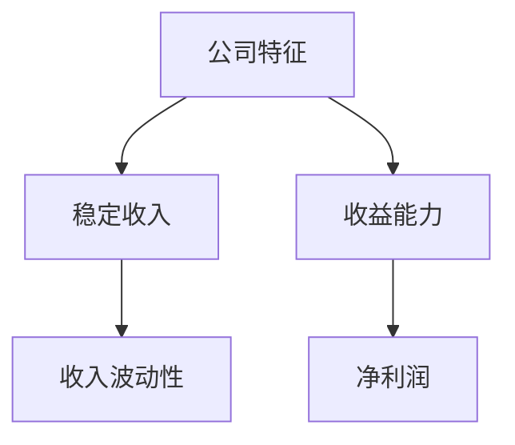
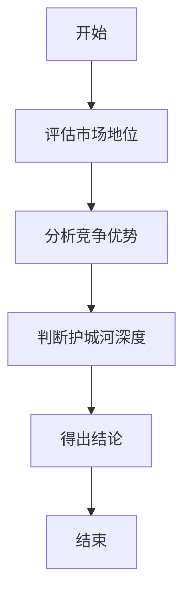
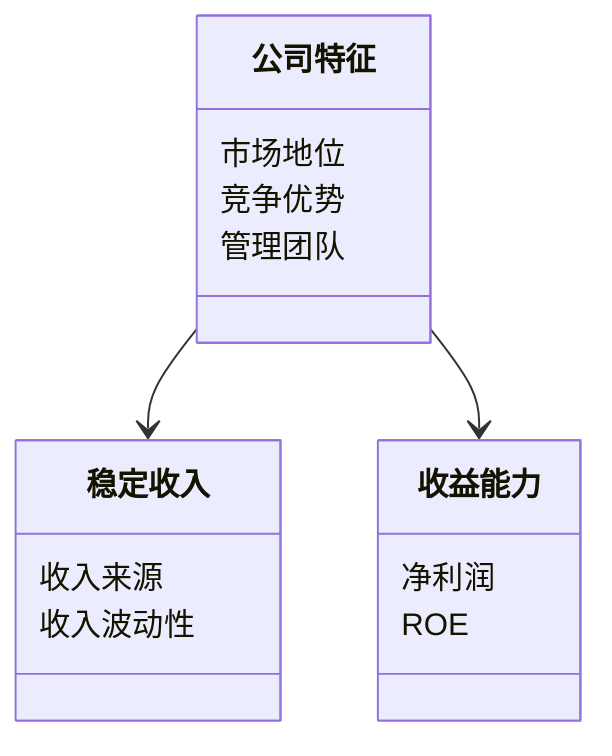
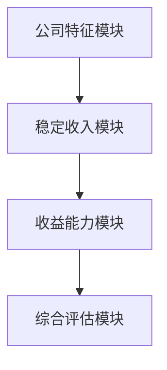

                 


```markdown
# 稳定收入与收益：巴菲特青睐的公司特征

> 关键词：巴菲特投资理念，稳定收入，收益能力，公司特征，长期盈利能力

> 摘要：本文深入探讨巴菲特的投资理念，特别是他青睐的公司特征，分析如何通过这些特征筛选出具有稳定收入和收益能力的公司。通过详细的技术分析和实际案例，帮助读者理解稳定收入与收益在投资中的重要性，并提供实用的评估方法和工具。

---

## 第一部分: 巴菲特投资理念与稳定收入的核心地位

### 第1章: 巴菲特投资理念概述

#### 1.1 巴菲特长期投资的核心理念
- **巴菲特的投资哲学**：价值投资、长期持有、注重基本面。
- **长期投资与价值投资的结合**：通过持有优质资产实现长期收益。
- **稳定收入在投资中的重要性**：稳定收入是企业长期盈利能力的体现，是投资安全的核心保障。

#### 1.2 稳定收入与收益的定义
- **稳定收入的内涵**：收入来源多样化、持续性强、波动性低。
- **收益的多维度分析**：净利润、ROE、ROA等指标。
- **稳定收入与收益的关系**：稳定收入是收益的基础，收益是收入的质量体现。

#### 1.3 巴菲特青睐的公司特征
- **公司的长期盈利能力**：持续增长的净利润、稳定的ROE。
- **行业地位与竞争优势**：市场领导者、强大的护城河。
- **财务健康状况**：低负债率、健康的现金流、合理的估值。
- **管理团队的稳定性与能力**：优秀的管理层、长期的管理团队。

### 第2章: 稳定收入与收益的背景分析

#### 2.1 稳定收入的背景与问题背景
- **当前经济环境下的收入波动**：经济周期对收入的影响。
- **收益不稳定的潜在风险**：市场波动、行业变化带来的不确定性。
- **稳定收入对企业长期发展的意义**：抵御经济波动、保障股东利益。

#### 2.2 问题描述与解决路径
- **收入不稳定对企业的影响**：利润波动、股价不稳定、投资者信心下降。
- **如何通过公司特征筛选稳定收益**：分析财务指标、评估竞争优势。
- **巴菲特投资策略的解决方案**：通过筛选优质公司实现稳定收益。

#### 2.3 稳定收入的边界与外延
- **收入稳定性的边界条件**：行业特性、经济周期、公司治理。
- **收益稳定性的外延特征**：分红能力、股价表现、市场地位。
- **稳定收入与收益的综合考量**：平衡短期与长期、收益与风险。

### 第3章: 核心概念与联系

#### 3.1 核心概念的原理
- **护城河的定义与分类**：经济型护城河、资源型护城河、声誉型护城河。
- **管理团队的决策能力**：领导力、战略眼光、团队稳定性。
- **财务健康状况的评估标准**：负债率、现金流、利润质量。

#### 3.2 核心概念对比表格
| 公司特征       | 稳定收入 | 收益能力 |
|----------------|----------|----------|
| 护城河         | 高       | 高       |
| 管理团队       | 中       | 高       |
| 财务健康状况   | 高       | 中       |

#### 3.3 ER实体关系图


### 第4章: 算法原理与数学模型

#### 4.1 护城河评估模型
- **护城河评估流程图**


- **护城河深度计算公式**
$$ \text{护城河深度} = \frac{\text{行业领先程度} + \text{竞争优势强度}}{2} $$

#### 4.2 管理团队评估模型
- **管理团队决策能力评估**
$$ \text{决策能力} = \text{管理团队稳定性} \times \text{领导力} $$

### 第5章: 系统分析与架构设计方案

#### 5.1 问题场景介绍
- **目标**：构建一个基于巴菲特特征的公司评估系统。
- **用户**：投资者、金融分析师。

#### 5.2 项目介绍
- **项目名称**：巴菲特投资特征评估系统。
- **目标**：通过技术手段筛选出具有稳定收入和收益能力的公司。

#### 5.3 系统功能设计
- **领域模型类图**


#### 5.4 系统架构设计
- **系统架构图**


### 第6章: 项目实战

#### 6.1 环境安装
- **工具**：Python、Pandas、Matplotlib。
- **数据源**：公开财务数据、行业报告。

#### 6.2 核心实现代码
```python
import pandas as pd

def calculate_roe(net_profit, equity):
    return net_profit / equity

data = pd.read_csv('company.csv')
data['ROE'] = calculate_roe(data['净利润'], data['股东权益'])
```

#### 6.3 实际案例分析
- **案例**：微软公司。
- **分析**：强大的护城河、稳定的收入来源、优秀的管理团队。

### 第7章: 最佳实践与小结

#### 7.1 最佳实践
- **投资建议**：选择具有强大护城河和稳定财务状况的公司。
- **注意事项**：避免短期波动，注重长期价值。

#### 7.2 小结
- **核心观点**：稳定收入和收益能力是巴菲特选股的关键，通过分析公司特征可以筛选出优质投资标的。

#### 7.3 拓展阅读
- 推荐书籍：《巴菲特选股术》、《投资之道》。

---

作者：AI天才研究院/AI Genius Institute & 禅与计算机程序设计艺术 /Zen And The Art of Computer Programming
```

