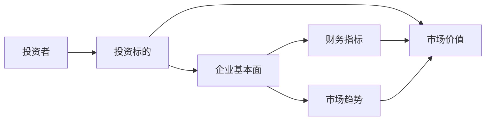

                 


# 约瑟夫·拉科尼克的价值创造投资：关注长期价值增长

> 关键词：价值投资、长期增长、内在价值、风险管理、市场分析、投资策略、价值创造

> 摘要：价值创造投资是一种以长期价值增长为核心的投资策略，通过深入分析企业的内在价值和市场趋势，结合投资者心理与行为，构建可持续的价值增长模型。本文将从价值创造投资的背景、核心概念、算法原理、系统架构、项目实战、最佳实践等方面，详细探讨如何在投资中实现长期价值增长。

---

# 第一部分: 价值创造投资的背景与核心概念

## 第1章: 价值创造投资的背景与问题背景

### 1.1 投资的基本概念与问题背景

#### 1.1.1 投资的基本概念
投资是指将资金或资源投入到某个领域或资产中，以期在未来获得超过初始投入的收益。投资的核心目标是实现资产的保值和增值。在现代金融市场中，投资形式多样，包括股票、债券、房地产、私募基金等。

#### 1.1.2 价值创造投资的定义与特点
价值创造投资是一种以创造长期价值为核心的投资策略。与传统的短期交易投资不同，价值创造投资注重通过分析企业的内在价值，寻找那些能够持续创造价值的企业，并在合理的价格范围内进行投资。其特点包括：
- 长期视角：关注企业的长期价值增长，而非短期价格波动。
- 深度分析：通过对企业的财务状况、行业地位、竞争优势等进行深入分析，评估其内在价值。
- 风险管理：注重投资组合的分散性和风险控制，避免过度集中投资。

#### 1.1.3 长期价值增长的核心问题
长期价值增长的核心问题在于如何识别和投资那些能够持续创造价值的企业。这需要投资者具备对企业基本面的深刻理解、对市场趋势的敏锐洞察以及对投资者心理的准确把握。同时，长期价值增长还需要面对市场波动、经济周期变化等外部因素的挑战。

### 1.2 价值创造投资的必要性

#### 1.2.1 当前投资环境的挑战
当前的金融市场环境复杂多变，全球经济不确定性增加，传统投资策略面临诸多挑战。例如：
- 技术进步和产业变革加速，企业竞争优势可能发生快速变化。
- 市场波动加剧，短期交易风险加大。
- 投资者心理行为受情绪影响，容易导致非理性决策。

#### 1.2.2 长期价值增长的重要性
在复杂的市场环境中，短期交易难以实现稳定的收益，而长期价值增长能够为投资者提供更稳定的投资回报。通过关注企业的长期价值创造，投资者能够在市场波动中保持投资组合的稳定性，同时抓住优质企业的成长机会。

#### 1.2.3 价值创造投资与传统投资的区别
传统投资策略往往关注市场的短期价格波动，依赖技术分析或市场情绪进行交易决策。而价值创造投资则注重企业的内在价值，通过深入分析企业的基本面和市场环境，寻找那些能够持续创造价值的企业进行投资。两者的主要区别在于：
- 投资目标：传统投资追求短期收益，价值创造投资追求长期价值增长。
- 分析方法：传统投资依赖技术分析，价值创造投资依赖基本面分析。
- 风险管理：传统投资注重短期波动，价值创造投资注重长期稳定性。

### 1.3 价值创造投资的核心要素

#### 1.3.1 企业基本面分析
企业基本面分析是价值创造投资的核心要素之一。通过对企业的财务状况、盈利能力、成长能力、竞争优势等进行分析，评估企业的内在价值。具体包括：
- 财务指标：如净利润、营业收入、资产负债率等。
- 盈利能力：如ROE（净资产收益率）、毛利率等。
- 成长能力：如收入增长率、净利润增长率等。
- 竞争优势：如市场地位、品牌影响力等。

#### 1.3.2 市场趋势与周期性
市场趋势和周期性是影响企业价值的重要外部因素。通过对宏观经济、行业趋势、政策环境等进行分析，评估市场对企业价值的影响。例如：
- 经济周期：经济繁荣期企业盈利能力可能提升，经济衰退期企业可能面临压力。
- 行业趋势：新兴行业可能具有更高的增长潜力，而传统行业可能面临转型压力。

#### 1.3.3 投资者心理与行为
投资者心理与行为是影响市场价格的重要因素。价值创造投资需要关注投资者的心理行为，避免被市场情绪左右。例如：
- 投资者情绪：过度乐观可能导致市场泡沫，过度悲观可能导致市场低估。
- 行为偏差：如过度自信、从众心理等，可能导致非理性投资决策。

## 第2章: 价值创造投资的核心概念与联系

### 2.1 价值创造模型的组成部分

#### 2.1.1 企业内在价值的构成
企业内在价值是指企业在未来能够创造的现金流的现值。企业内在价值的构成包括：
- 自由现金流：企业未来产生的自由现金流。
- 折现率：反映资金的时间价值和风险溢价。

#### 2.1.2 市场价值与内在价值的关系
市场价值是市场参与者对企业价值的定价，与内在价值可能存在差异。当市场价值低于内在价值时，企业可能被低估，投资机会出现；当市场价值高于内在价值时，企业可能被高估，投资风险增加。

#### 2.1.3 价值创造的驱动因素
价值创造的驱动因素包括：
- 企业盈利能力的提升。
- 行业地位的巩固。
- 竞争优势的增强。
- 创新能力的提升。

### 2.2 价值创造模型的属性特征对比

#### 2.2.1 企业基本面与财务指标对比
企业基本面与财务指标是价值创造模型的重要组成部分。以下是两者的对比：

| 特性         | 企业基本面                         | 财务指标                         |
|--------------|------------------------------------|----------------------------------|
| 内容         | 包括盈利能力、成长能力、竞争优势等 | 包括净利润、营业收入、资产负债率等 |
| 分析目的     | 评估企业的内在价值                 | 评估企业的财务健康状况           |
| 时间维度     | 长期视角                           | 短期与长期结合                   |

#### 2.2.2 市场趋势与行业周期对比

| 特性         | 市场趋势                         | 行业周期                         |
|--------------|----------------------------------|----------------------------------|
| 内容         | 包括宏观经济、政策环境等          | 包括行业增长、竞争格局等          |
| 分析目的     | 评估市场对企业价值的影响         | 评估行业对企业价值的影响           |
| 时间维度     | 中长期视角                       | 中长期视角                       |

#### 2.2.3 投资者行为与心理对比

| 特性         | 投资者行为                       | 投资者心理                       |
|--------------|----------------------------------|----------------------------------|
| 内容         | 包括交易行为、资产配置等         | 包括情绪波动、行为偏差等         |
| 分析目的     | 评估投资者行为对企业价值的影响   | 评估投资者心理对企业价值的影响   |
| 时间维度     | 短期与长期结合                   | 短期视角                         |

### 2.3 价值创造模型的ER实体关系图



---

# 第二部分: 价值创造投资的算法原理

## 第3章: 价值创造投资的数学模型与公式

### 3.1 企业内在价值的计算公式

$$ V = \frac{CF}{r} $$

其中：
- \( V \) 表示企业内在价值。
- \( CF \) 表示企业未来产生的自由现金流。
- \( r \) 表示折现率。

例如，假设某企业未来每年产生自由现金流 \( CF = 100 \) 万元，折现率 \( r = 10\% \)（即 0.1），则企业内在价值为：

$$ V = \frac{100}{0.1} = 1000 \text{万元} $$

---

## 第4章: 价值创造投资的系统架构设计

### 4.1 问题场景介绍

价值创造投资需要构建一个完整的投资系统，包括数据收集、分析、决策等环节。系统需要能够处理大量数据，进行复杂的分析，并提供决策支持。

### 4.2 系统功能设计

#### 4.2.1 数据收集模块
- 数据来源：市场数据（股票价格、成交量等）、财务数据（净利润、营业收入等）、行业数据（宏观经济指标、政策环境等）。
- 数据存储：使用数据库存储结构化数据，使用文件存储非结构化数据。

#### 4.2.2 分析模块
- 企业基本面分析：计算财务指标，评估企业内在价值。
- 市场趋势分析：分析市场数据，预测市场走势。
- 投资者行为分析：分析投资者心理，评估市场情绪。

#### 4.2.3 决策模块
- 投资组合优化：根据分析结果，构建最优投资组合。
- 风险管理：设置止损点，控制投资风险。

### 4.3 系统架构设计


### 4.4 系统接口设计

- 输入接口：接收市场数据、财务数据、投资者行为数据。
- 输出接口：提供投资建议、投资组合优化方案。

### 4.5 系统交互设计


---

## 第5章: 价值创造投资的项目实战

### 5.1 项目环境安装

- 安装Python环境：使用Anaconda或PyCharm。
- 安装相关库：如Pandas、NumPy、Matplotlib等。

### 5.2 项目核心实现

#### 5.2.1 数据收集与处理
- 使用API获取市场数据。
- 使用数据清洗技术处理脏数据。

#### 5.2.2 企业基本面分析
- 计算财务指标：如ROE、毛利率等。
- 评估企业内在价值。

#### 5.2.3 投资组合优化
- 根据分析结果，构建最优投资组合。
- 设置风险管理策略，如止损点。

### 5.3 代码实现

```python
import pandas as pd
import numpy as np

# 示例代码：计算企业内在价值
def calculate_intrinsic_value(cash_flow, discount_rate):
    return cash_flow / discount_rate

# 示例数据：自由现金流和折现率
cash_flow = 100  # 万元
discount_rate = 0.1

# 计算内在价值
intrinsic_value = calculate_intrinsic_value(cash_flow, discount_rate)
print(f"企业内在价值为：{intrinsic_value}万元")
```

---

## 第6章: 价值创造投资的最佳实践

### 6.1 小结

价值创造投资是一种以长期价值增长为核心的投资策略。通过深入分析企业的内在价值和市场趋势，结合投资者心理与行为，构建可持续的价值增长模型。

### 6.2 注意事项

- 风险管理：避免过度集中投资，设置合理的止损点。
- 长期视角：关注企业的长期价值，避免被短期市场波动影响。
- 持续学习：保持对市场变化的敏感性，不断优化投资策略。

### 6.3 拓展阅读

- 《价值投资：原则与实践》
- 《投资学基础》
- 《行为金融学》

---

# 第三部分: 总结与展望

## 第7章: 总结与展望

### 7.1 总结

价值创造投资是一种以长期价值增长为核心的投资策略。通过深入分析企业的内在价值和市场趋势，结合投资者心理与行为，构建可持续的价值增长模型。

### 7.2 展望

未来，价值创造投资将更加依赖于技术的进步和数据的分析。随着人工智能、大数据等技术的发展，投资者将能够更加精准地评估企业的内在价值，优化投资组合，实现长期价值增长。

---

作者：AI天才研究院/AI Genius Institute & 禅与计算机程序设计艺术 /Zen And The Art of Computer Programming

