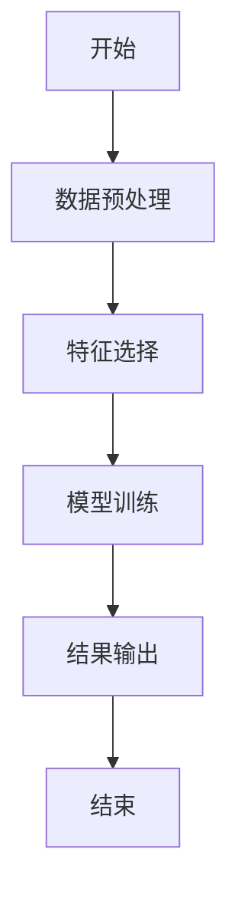
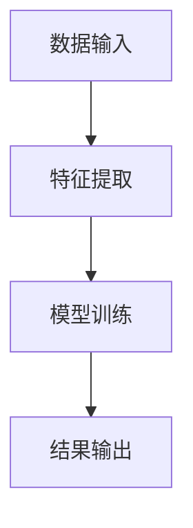
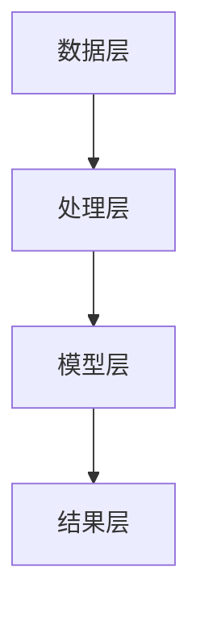
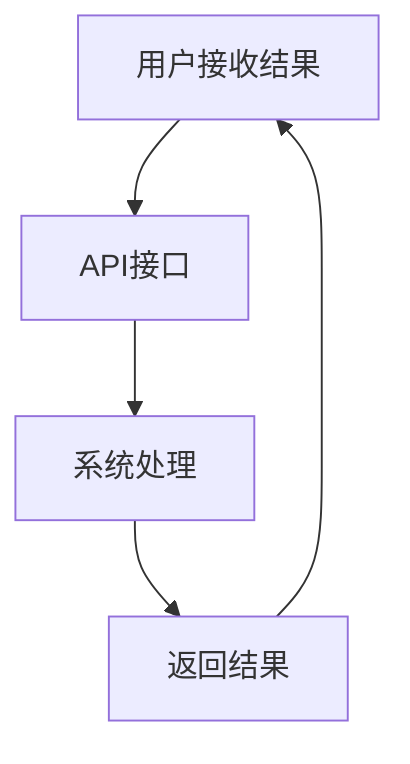

                 


# 约瑟夫·拉科尼克的价值投资者的质量评估

## 关键词：
- 价值投资
- 投资者质量评估
- 约瑟夫·拉科尼克
- 质量评估模型
- 数学模型
- 投资策略

## 摘要：
本文深入探讨约瑟夫·拉科尼克的价值投资方法，重点分析如何评估投资者的质量。通过系统化的分析，包括背景介绍、核心概念、算法原理、系统设计、项目实战及总结，帮助读者理解并应用这些评估策略，提升投资决策的科学性和有效性。

---

# 目录

## 第一部分：价值投资者质量评估的背景与基础

### 第1章：价值投资与质量评估的概述

#### 1.1 价值投资的基本概念
- 1.1.1 价值投资的定义与核心理念
- 1.1.2 价值投资的历史发展与现状
- 1.1.3 投资者质量评估的定义与意义

#### 1.2 约瑟夫·拉科尼克的投资理念
- 1.2.1 约瑟夫·拉科尼克的生平简介
- 1.2.2 拉科尼克投资哲学的核心思想
- 1.2.3 拉科尼克与价值投资的关系

### 第2章：价值投资者质量评估的核心原理

#### 2.1 投资者质量评估的基本框架
- 2.1.1 评估维度的确定
- 2.1.2 评估指标的选择标准
- 2.1.3 评估模型的构建逻辑

#### 2.2 质量评估的核心概念与联系
- 2.2.1 核心概念原理
- 2.2.2 概念属性特征对比表格
- 2.2.3 ER实体关系图架构的Mermaid流程图

## 第二部分：价值投资者质量评估的算法与数学模型

### 第3章：质量评估的算法原理

#### 3.1 多因子评估模型
- 3.1.1 多因子模型的定义与特点
- 3.1.2 多因子模型的构建过程
- 3.1.3 多因子模型的优缺点分析

#### 3.2 算法原理的Mermaid流程图


#### 3.3 算法实现的Python源代码
```python
import pandas as pd
from sklearn.model_selection import train_test_split
from sklearn.ensemble import RandomForestClassifier

# 示例数据加载
data = pd.DataFrame({
    '特征1': [1, 2, 3, 4, 5],
    '特征2': [5, 4, 3, 2, 1],
    '目标': [0, 1, 1, 0, 1]
})

# 数据分割
X = data[['特征1', '特征2']]
y = data['目标']
X_train, X_test, y_train, y_test = train_test_split(X, y, test_size=0.2)

# 模型训练
model = RandomForestClassifier(n_estimators=100)
model.fit(X_train, y_train)

# 预测与评估
print(model.score(X_test, y_test))
```

#### 3.4 数学公式与模型解释
- 多因子模型的数学表达式：
  $$ \text{预测值} = \beta_0 + \beta_1x_1 + \beta_2x_2 + \ldots + \beta_nx_n $$
  其中，$x_i$ 是各个因子，$\beta_i$ 是对应的系数。

## 第三部分：系统分析与架构设计

### 第4章：系统功能与架构设计

#### 4.1 系统功能设计
- 4.1.1 功能模块划分：数据输入、特征提取、模型训练、结果输出
- 4.1.2 功能流程图：使用Mermaid绘制系统功能流程图



#### 4.2 系统架构设计
- 4.2.1 分层架构：数据层、处理层、模型层
- 4.2.2 架构图：使用Mermaid绘制系统架构图



#### 4.3 接口与交互设计
- 4.3.1 API接口设计：RESTful API
- 4.3.2 交互流程图：使用Mermaid绘制用户与系统的交互流程



## 第四部分：项目实战与应用

### 第5章：项目实战

#### 5.1 环境安装与配置
- 安装Python、Pandas、Scikit-learn等库
- 示例代码环境配置说明

#### 5.2 核心代码实现
- 数据预处理代码
- 模型训练代码
- 结果输出代码

#### 5.3 实际案例分析
- 数据来源与处理
- 模型训练与结果分析
- 案例总结与启示

### 第5.4 项目总结与优化
- 项目成果总结
- 模型优化建议
- 可能遇到的问题与解决方案

## 第五部分：总结与展望

### 第6章：最佳实践与小结

#### 6.1 投资者质量评估的关键点
- 数据选择的重要性
- 模型选择的影响
- 持续监控与调整

#### 6.2 实践中的注意事项
- 数据的代表性和及时性
- 模型的鲁棒性与可解释性
- 投资策略的灵活性

#### 6.3 未来展望
- 更多因子的引入
- 机器学习算法的应用
- 大数据分析的潜力

## 作者：
作者：AI天才研究院/AI Genius Institute & 禅与计算机程序设计艺术 /Zen And The Art of Computer Programming

