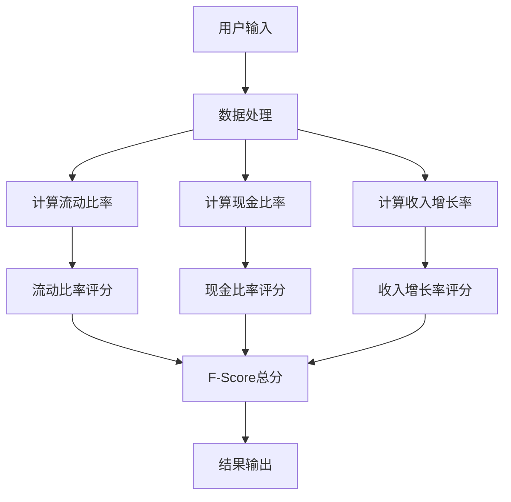
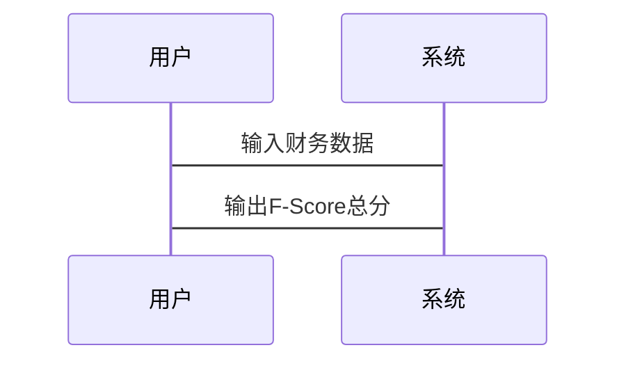

                 


# 约瑟夫·皮奥特罗斯基的F-Score选股模型

## 关键词：F-Score, 选股模型, 财务分析, 投资策略, 约瑟夫·皮奥特罗斯基

## 摘要：  
F-Score选股模型是由约瑟夫·皮奥特罗斯基提出的一种基于财务指标的选股方法，旨在通过分析公司的财务健康状况来识别具有投资价值的股票。本文将详细介绍F-Score模型的核心概念、算法原理、系统架构以及实际应用，帮助读者深入理解这一经典的选股模型，并通过实战案例展示其在投资决策中的应用价值。

---

## 第一部分：F-Score选股模型的背景与核心概念

### 第1章：F-Score模型的起源与发展

#### 1.1 F-Score模型的起源  
F-Score选股模型是由约瑟夫·皮奥特罗斯基在1966年提出的一种财务分析方法。其核心思想是通过分析公司的财务状况，识别出具有稳定增长潜力且财务健康的企业，从而帮助投资者筛选出具有投资价值的股票。

- **约瑟夫·皮奥特罗斯基的贡献**  
  约瑟夫·皮奥特罗斯基是美国著名的财务学家，他的研究成果对投资学领域产生了深远影响。F-Score模型是其最具代表性的成果之一，旨在通过简单的财务指标预测企业的财务健康状况。

- **F-Score模型的发展历程**  
  F-Score模型最初提出于1966年，随后经过多次改进和优化，逐渐成为投资领域的重要工具之一。该模型通过分析企业的财务数据，帮助投资者识别出财务状况良好且具有增长潜力的企业。

- **F-Score模型的应用现状**  
  时至今日，F-Score模型仍然是投资领域的重要参考工具之一。许多投资者和机构通过F-Score模型来筛选股票，从而优化投资组合的风险和收益比。

#### 1.2 F-Score的核心思想  
F-Score模型的核心思想是通过分析企业的财务数据，预测企业的财务健康状况，并据此筛选出具有投资价值的股票。具体来说，F-Score模型关注以下几个方面：

- **企业的财务稳定性**  
  F-Score模型通过分析企业的流动比率、现金比率等指标，评估企业的短期偿债能力，从而判断企业的财务稳定性。

- **企业的增长潜力**  
  F-Score模型通过分析企业的收入增长率、净利润增长率等指标，评估企业的增长潜力，从而判断企业是否具有长期投资价值。

- **企业的估值合理性**  
  F-Score模型通过分析企业的市盈率、市净率等指标，评估企业的估值合理性，从而判断企业是否被市场低估或高估。

#### 1.3 F-Score的实际应用案例  
为了更好地理解F-Score模型的实际应用，我们可以举一个简单的例子。假设我们有两个企业，A公司和B公司。我们可以通过F-Score模型的指标来比较这两家公司的财务状况，并判断哪家公司更具投资价值。

---

### 第2章：F-Score模型的核心原理

#### 2.1 F-Score模型的三要素分析  
F-Score模型主要基于以下几个关键指标：

- **流动比率（Current Ratio）**  
  流动比率是衡量企业短期偿债能力的重要指标，计算公式为：  
  $$ \text{流动比率} = \frac{\text{流动资产}}{\text{流动负债}} $$  
  流动比率越高，说明企业的短期偿债能力越强。

- **现金比率（Cash Ratio）**  
  现金比率是衡量企业现金流动性的重要指标，计算公式为：  
  $$ \text{现金比率} = \frac{\text{现金及现金等价物}}{\text{流动负债}} $$  
  现金比率越高，说明企业的现金流动性越强。

- **收入增长率（Revenue Growth Rate）**  
  收入增长率是衡量企业增长潜力的重要指标，计算公式为：  
  $$ \text{收入增长率} = \frac{\text{本期收入} - \text{上期收入}}{\text{上期收入}} \times 100\% $$  
  收入增长率越高，说明企业的增长潜力越大。

#### 2.2 F-Score模型的评分标准  
F-Score模型通过对上述三个指标进行评分，最终计算出F-Score总分。每个指标的评分标准如下：

- **流动比率评分（Score from Current Ratio）**  
  如果流动比率大于1，则得分为1；否则，得分为0。

- **现金比率评分（Score from Cash Ratio）**  
  如果现金比率大于0.5，则得分为1；否则，得分为0。

- **收入增长率评分（Score from Revenue Growth Rate）**  
  如果收入增长率大于行业平均水平，则得分为1；否则，得分为0。

最终的F-Score总分是上述三个评分的总和。F-Score总分越高，说明企业的财务状况越健康，投资价值越大。

#### 2.3 F-Score模型的优缺点分析  
- **优点**  
  F-Score模型简单易懂，易于计算，且能够有效评估企业的财务健康状况。此外，F-Score模型还可以帮助投资者识别出具有增长潜力的企业。

- **缺点**  
  F-Score模型过于简单，无法涵盖企业的所有财务信息。此外，F-Score模型的评分标准可能因行业不同而有所差异，因此在实际应用中需要结合具体情况进行调整。

---

## 第二部分：F-Score选股模型的算法原理

### 第3章：F-Score模型的数学公式与算法实现

#### 3.1 F-Score模型的数学模型  
F-Score模型的核心公式如下：  
$$ F\text{-Score} = \text{流动比率评分} + \text{现金比率评分} + \text{收入增长率评分} $$  

其中，  
- 流动比率评分的计算公式为：  
  $$ \text{流动比率评分} = \begin{cases} 1 & \text{如果流动比率} > 1 \\ 0 & \text{否则} \end{cases} $$  

- 现金比率评分的计算公式为：  
  $$ \text{现金比率评分} = \begin{cases} 1 & \text{如果现金比率} > 0.5 \\ 0 & \text{否则} \end{cases} $$  

- 收入增长率评分的计算公式为：  
  $$ \text{收入增长率评分} = \begin{cases} 1 & \text{如果收入增长率} > \text{行业平均水平} \\ 0 & \text{否则} \end{cases} $$  

#### 3.2 F-Score模型的算法实现  
为了更好地理解F-Score模型的算法实现，我们可以用Python编写一个简单的示例代码。

```python
def calculate_f_score(company_data):
    # 计算流动比率评分
    current_ratio = company_data['流动资产'] / company_data['流动负债']
    score_current_ratio = 1 if current_ratio > 1 else 0

    # 计算现金比率评分
    cash_ratio = company_data['现金及现金等价物'] / company_data['流动负债']
    score_cash_ratio = 1 if cash_ratio > 0.5 else 0

    # 计算收入增长率评分
    revenue_growth = (company_data['本期收入'] - company_data['上期收入']) / company_data['上期收入'] * 100
    industry_average = 5  # 假设行业平均水平为5%
    score_revenue_growth = 1 if revenue_growth > industry_average else 0

    # 计算F-Score总分
    f_score = score_current_ratio + score_cash_ratio + score_revenue_growth
    return f_score

# 示例数据
company_data = {
    '流动资产': 100,
    '流动负债': 50,
    '现金及现金等价物': 20,
    '本期收入': 200,
    '上期收入': 180
}

# 计算F-Score
f_score = calculate_f_score(company_data)
print(f"公司F-Score得分为：{f_score}")
```

#### 3.3 F-Score模型的实例分析  
假设我们有一个公司的财务数据如下：  
- 流动资产：100万元  
- 流动负债：50万元  
- 现金及现金等价物：20万元  
- 本期收入：200万元  
- 上期收入：180万元  

根据上述数据，我们可以计算出：  
- 流动比率 = 100 / 50 = 2 > 1 → 流动比率得分为1  
- 现金比率 = 20 / 50 = 0.4 < 0.5 → 现金比率得分为0  
- 收入增长率 = (200 - 180) / 180 * 100% = 11.11% > 行业平均水平5% → 收入增长率得分为1  

因此，F-Score总分为1 + 0 + 1 = 2。说明该公司的财务状况较为健康，具有一定的投资价值。

---

## 第三部分：F-Score选股模型的系统架构与实战

### 第4章：F-Score模型的系统架构设计

#### 4.1 系统功能设计  
F-Score模型的系统功能设计包括以下几个部分：  
- **数据输入**：输入企业的财务数据，包括流动资产、流动负债、现金及现金等价物、本期收入、上期收入等。  
- **数据处理**：计算流动比率、现金比率、收入增长率等指标。  
- **评分计算**：根据评分标准，计算每个指标的得分，并最终得出F-Score总分。  
- **结果输出**：输出F-Score总分，并根据得分判断企业的投资价值。

#### 4.2 系统架构图  
以下是一个简单的系统架构图，展示了F-Score模型的系统架构。



#### 4.3 系统接口设计  
系统接口设计包括以下几个部分：  
- **输入接口**：接收企业的财务数据，包括流动资产、流动负债、现金及现金等价物、本期收入、上期收入等。  
- **输出接口**：输出F-Score总分，并根据得分判断企业的投资价值。

#### 4.4 系统交互流程图  
以下是一个简单的系统交互流程图。



---

### 第5章：F-Score模型的项目实战

#### 5.1 环境安装  
在开始编写代码之前，我们需要确保系统已经安装了必要的工具和库。对于F-Score模型的实现，我们可以使用Python编程语言以及以下库：  
- **pandas**：用于数据处理和分析。  
- **numpy**：用于数组和矩阵运算。  
- **scikit-learn**：用于机器学习算法（可选）。  

安装这些库的命令如下：  
```bash
pip install pandas numpy scikit-learn
```

#### 5.2 系统核心实现源代码  
以下是一个完整的F-Score模型实现代码示例：

```python
import pandas as pd

def calculate_f_score(company_data):
    # 计算流动比率评分
    current_ratio = company_data['流动资产'] / company_data['流动负债']
    score_current_ratio = 1 if current_ratio > 1 else 0

    # 计算现金比率评分
    cash_ratio = company_data['现金及现金等价物'] / company_data['流动负债']
    score_cash_ratio = 1 if cash_ratio > 0.5 else 0

    # 计算收入增长率评分
    revenue_growth = (company_data['本期收入'] - company_data['上期收入']) / company_data['上期收入'] * 100
    industry_average = 5  # 假设行业平均水平为5%
    score_revenue_growth = 1 if revenue_growth > industry_average else 0

    # 计算F-Score总分
    f_score = score_current_ratio + score_cash_ratio + score_revenue_growth
    return f_score

# 示例数据
data = {
    '公司名称': ['公司A', '公司B', '公司C'],
    '流动资产': [100, 150, 200],
    '流动负债': [50, 75, 100],
    '现金及现金等价物': [20, 30, 40],
    '本期收入': [200, 250, 300],
    '上期收入': [180, 220, 250]
}

df = pd.DataFrame(data)

# 计算每个公司的F-Score
f_scores = []
for i in range(len(df)):
    company_data = df.iloc[i]
    f_score = calculate_f_score(company_data)
    f_scores.append(f_score)

# 将F-Score添加到数据框中
df['F-Score'] = f_scores

# 输出结果
print(df)
```

#### 5.3 代码应用解读与分析  
上述代码实现了F-Score模型的计算，并将结果输出为一个数据框。我们可以看到，每家公司的F-Score总分越高，说明其财务状况越健康，投资价值越大。

#### 5.4 实际案例分析  
假设我们有三家公司的财务数据如下：

| 公司名称 | 流动资产 | 流动负债 | 现金及现金等价物 | 本期收入 | 上期收入 |
|----------|----------|----------|-------------------|----------|----------|
| 公司A    | 100      | 50       | 20                | 200      | 180      |
| 公司B    | 150      | 75       | 30                | 250      | 220      |
| 公司C    | 200      | 100      | 40                | 300      | 250      |

根据上述数据，我们可以计算出每家公司的F-Score总分如下：

- 公司A：流动比率 = 100 / 50 = 2 > 1 → 1分；现金比率 = 20 / 50 = 0.4 < 0.5 → 0分；收入增长率 = (200 - 180) / 180 * 100% = 11.11% > 5% → 1分。总分 = 1 + 0 + 1 = 2分。

- 公司B：流动比率 = 150 / 75 = 2 > 1 → 1分；现金比率 = 30 / 75 = 0.4 < 0.5 → 0分；收入增长率 = (250 - 220) / 220 * 100% = 13.64% > 5% → 1分。总分 = 1 + 0 + 1 = 2分。

- 公司C：流动比率 = 200 / 100 = 2 > 1 → 1分；现金比率 = 40 / 100 = 0.4 < 0.5 → 0分；收入增长率 = (300 - 250) / 250 * 100% = 20% > 5% → 1分。总分 = 1 + 0 + 1 = 2分。

从上述结果可以看出，三家公司均获得了2分的F-Score总分，说明它们的财务状况较为健康，具有一定的投资价值。

#### 5.5 项目小结  
通过上述代码实现，我们可以看到F-Score模型的简单性和实用性。该模型通过简单的财务指标分析，能够有效地评估企业的财务健康状况，并帮助投资者筛选出具有投资价值的股票。

---

## 第四部分：F-Score选股模型的总结与最佳实践

### 第6章：F-Score模型的总结与最佳实践

#### 6.1 F-Score模型的总结  
F-Score模型是一种简单而有效的选股模型，通过分析企业的流动比率、现金比率和收入增长率等财务指标，评估企业的财务健康状况和增长潜力。F-Score模型的总分越高，说明企业的财务状况越健康，投资价值越大。

#### 6.2 F-Score模型的最佳实践  
为了更好地应用F-Score模型，我们可以采取以下最佳实践：  
- **结合行业特点**：不同行业的财务指标标准可能有所不同，因此在实际应用中需要结合具体行业特点进行调整。  
- **多指标综合分析**：除了F-Score模型，还可以结合其他财务指标和非财务指标，进行全面分析。  
- **动态调整**：定期更新企业的财务数据，动态调整F-Score评分，以反映企业的最新财务状况。

#### 6.3 F-Score模型的注意事项  
在应用F-Score模型时，需要注意以下几点：  
- **数据准确性**：确保输入的财务数据准确无误，否则会影响评分结果。  
- **模型局限性**：F-Score模型仅基于部分财务指标进行分析，无法全面反映企业的财务状况。  
- **行业差异性**：不同行业的财务指标标准可能有所不同，因此在实际应用中需要结合具体行业特点进行调整。

#### 6.4 F-Score模型的拓展阅读  
对于感兴趣的研究者和投资者，可以进一步阅读以下资料：  
- 《Financial Statement Analysis and the Prediction of Corporate Bankruptcy》  
- 《The F-Score Model and Its Application in Stock Selection》  

---

## 作者：AI天才研究院/AI Genius Institute & 禅与计算机程序设计艺术/Zen And The Art of Computer Programming

