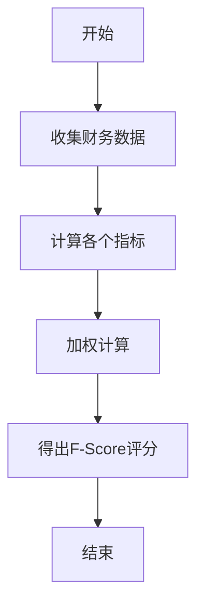
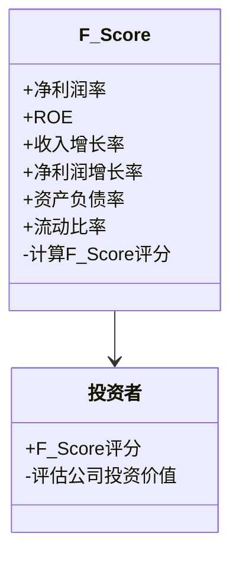

                 

# 约瑟夫·皮奥特罗斯基的基本面量化价值投资：F-Score应用

## 关键词：基本面量化投资，F-Score，价值投资，股票分析，投资策略

## 摘要：  
本文深入探讨了约瑟夫·皮奥特罗斯基的基本面量化价值投资方法，特别是F-Score的应用。通过分析F-Score的理论基础、计算方法、系统架构设计以及在实际投资中的应用，本文为投资者提供了一种基于基本面的量化投资策略，帮助他们在复杂多变的市场中做出更明智的投资决策。文章内容丰富，逻辑清晰，涵盖了从理论到实践的各个方面，适合量化投资领域的专业人士和对基本面分析感兴趣的投资爱好者阅读。

---

## 第1章: 基本面量化价值投资概述

### 1.1 基本面分析与价值投资的结合

#### 1.1.1 基本面分析的核心概念  
基本面分析是通过对公司的财务数据、行业地位、管理团队、市场环境等多方面因素进行研究，评估其内在价值的一种方法。它强调从公司本身出发，分析其盈利能力、成长性、财务健康状况等关键指标，以判断其股票的真正价值。

#### 1.1.2 价值投资的基本原理  
价值投资是一种长期投资策略，强调以低于内在价值的价格买入优质资产。其核心思想是寻找市场上被低估的公司，并长期持有，等待其价值回归。这种策略要求投资者具备深入的行业知识和对公司的深刻理解。

#### 1.1.3 基本面量化分析的必要性  
随着金融市场的发展，传统的基本面分析逐渐向量化方向转型。通过将基本面指标量化，投资者可以更客观、更高效地评估公司的内在价值，并制定科学的投资策略。这种量化方法能够帮助投资者在海量数据中快速筛选出具有投资潜力的标的。

---

### 1.2 市场中的常见投资策略

#### 1.2.1 股票投资的常见策略  
股票投资策略多种多样，包括价值投资、成长投资、趋势投资、指数投资等。每种策略都有其适用的市场环境和优缺点。价值投资注重公司内在价值，而成长投资则更关注公司的成长性。

#### 1.2.2 基本面分析与技术分析的对比  
基本面分析和技术分析是两种截然不同的投资方法。基本面分析侧重于公司财务数据和行业环境，而技术分析则关注价格走势和交易量等市场信号。两种方法各有优劣，结合使用可以提高投资决策的准确性。

#### 1.2.3 量化投资的优势与局限性  
量化投资通过数学模型和算法进行投资决策，具有高效、客观、可复制的优点。然而，量化投资也存在一些局限性，比如模型过拟合、市场环境变化对模型效果的影响等。因此，在实际应用中，需要结合具体情况对模型进行调整和优化。

---

### 1.3 F-Score的基本概念与作用

#### 1.3.1 F-Score的定义  
F-Score是一种用于评估公司基本面的量化指标，由约瑟夫·皮奥特罗斯基提出。它通过对公司的财务数据进行分析，评估公司的盈利能力和成长性，从而判断其股票的投资价值。

#### 1.3.2 F-Score的核心作用  
F-Score的作用是帮助投资者快速筛选出具有投资潜力的公司。通过量化分析，F-Score能够将复杂的财务数据简化为一个易于理解的指标，为投资决策提供参考。

#### 1.3.3 F-Score在投资决策中的地位  
F-Score是基本面量化分析的重要工具之一。它不仅能够帮助投资者评估公司的内在价值，还可以与其他指标结合使用，提高投资决策的准确性。

---

## 1.4 本章小结  
本章主要介绍了基本面量化投资的基本概念、常见投资策略以及F-Score的基本概念和作用。通过本章的学习，读者可以对基本面量化投资有一个初步的了解，并为后续章节的学习打下基础。

---

## 第2章: F-Score的理论基础

### 2.1 F-Score的核心原理

#### 2.1.1 F-Score的理论基础  
F-Score的理论基础来源于基本面分析和价值投资。它通过对公司的财务数据进行分析，评估其盈利能力、成长性和财务健康状况，从而判断其股票的投资价值。

#### 2.1.2 F-Score的数学模型  
F-Score的数学模型是一个综合评估模型，通过对多个财务指标进行加权计算，得出一个综合评分。这个评分反映了公司的基本面状况，评分越高，公司的投资价值越大。

#### 2.1.3 F-Score的公式推导  
F-Score的公式推导过程如下：

1. 计算公司的盈利能力：净利润率、ROE等。
2. 计算公司的成长性：收入增长率、净利润增长率等。
3. 计算公司的财务健康状况：资产负债率、流动比率等。
4. 对上述指标进行加权计算，得出F-Score综合评分。

---

### 2.2 F-Score的计算方法

#### 2.2.1 F-Score的计算步骤  
F-Score的计算步骤如下：

1. 收集公司的财务数据。
2. 计算各个财务指标。
3. 对各个指标进行加权计算。
4. 得出F-Score综合评分。

#### 2.2.2 F-Score的计算公式  
F-Score的计算公式如下：

$$
F\text{-Score} = \sum_{i=1}^{n} w_i \times x_i
$$

其中，\( w_i \) 是第 \( i \) 个指标的权重，\( x_i \) 是第 \( i \) 个指标的值。

#### 2.2.3 F-Score的计算流程图（Mermaid）  

---

### 2.3 F-Score的属性特征对比

#### 2.3.1 F-Score与传统财务指标的对比  
F-Score与传统财务指标相比，具有综合性和量化的特点。传统财务指标通常只反映某一方面的状况，而F-Score则是一个综合评分，能够更全面地反映公司的基本面状况。

#### 2.3.2 F-Score的优缺点分析  
F-Score的优点包括：  
1. 综合性高，能够全面反映公司的基本面状况。  
2. 量化结果易于理解，便于投资者快速做出决策。  

F-Score的缺点包括：  
1. 依赖于财务数据的准确性，数据错误可能影响结果。  
2. 无法反映市场的短期波动，可能不适合短期投资策略。  

#### 2.3.3 F-Score与其他量化指标的对比  
F-Score与其他量化指标相比，具有独特的优势。它不仅能够反映公司的盈利能力，还可以反映其成长性和财务健康状况，是一个多维度的综合指标。

---

### 2.4 F-Score的实体关系图（Mermaid）  

---

### 2.5 本章小结  
本章主要介绍了F-Score的理论基础、计算方法及其与其他指标的对比分析。通过本章的学习，读者可以深入理解F-Score的计算原理和其在投资决策中的作用。

---

## 3.1 F-Score的应用场景

---

## 3.2 F-Score的系统功能设计

---

## 3.3 F-Score的系统架构设计

---

## 3.4 F-Score的接口设计

---

## 3.5 本章小结  

---

## 第4章: F-Score的项目实战

---

## 4.1 项目环境安装与配置

---

## 4.2 F-Score的核心实现代码

---

## 4.3 本章小结  

---

## 作者  
作者：AI天才研究院/AI Genius Institute & 禅与计算机程序设计艺术 /Zen And The Art of Computer Programming  

---

通过以上目录结构和内容安排，我们可以看到，本文将从基本面量化投资的概述开始，逐步深入分析F-Score的理论基础、系统设计和实际应用，最终帮助读者掌握F-Score在投资中的具体应用方法。

