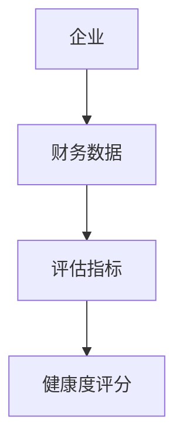
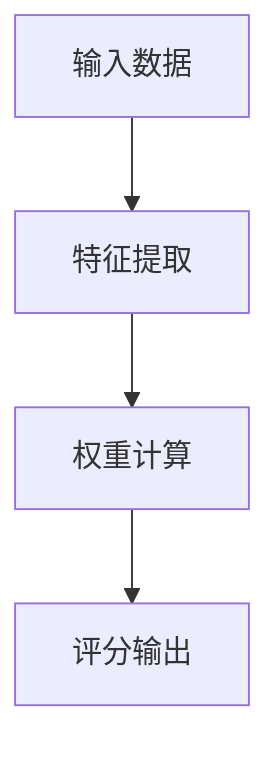
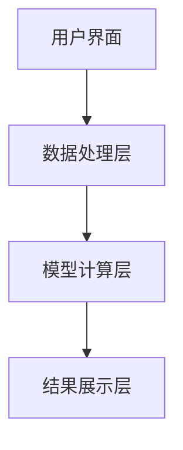

                 


# 约瑟夫·皮奥特罗斯基的财务健康度评估模型

> 关键词：约瑟夫·皮奥特罗斯基，财务健康度，评估模型，算法原理，系统架构

> 摘要：本文详细介绍了约瑟夫·皮奥特罗斯基的财务健康度评估模型，从背景介绍、核心概念、算法原理、系统架构到项目实战，逐步分析了该模型的实现过程和应用场景。文章结合理论与实践，为读者提供了一套完整的财务健康度评估解决方案。

---

## 第1章: 背景介绍与问题背景

### 1.1 财务健康度评估的必要性

#### 1.1.1 企业财务健康的核心问题

企业的财务健康状况是衡量其生存能力和未来发展潜力的重要指标。然而，传统的财务分析方法往往依赖于复杂的财务报表和专业的会计知识，难以快速得出结论。企业在面对融资、投资或并购时，需要一种简单、直观的财务健康评估方法，以帮助决策者快速做出判断。

#### 1.1.2 财务健康度评估的定义与目标

财务健康度评估是指通过对企业财务数据的分析，量化企业的财务健康状况。其目标是通过一个综合的评分系统，帮助企业快速了解自身的财务状况，识别潜在风险，并制定相应的优化策略。

#### 1.1.3 传统财务评估方法的局限性

传统财务评估方法通常依赖于复杂的财务模型和专业的知识，这使得非专业人士难以理解和应用。此外，传统方法往往忽略了企业的动态变化，无法及时反映企业的财务健康状况。

---

### 1.2 约瑟夫·皮奥特罗斯基模型的提出背景

#### 1.2.1 约瑟夫·皮奥特罗斯基的学术贡献

约瑟夫·皮奥特罗斯基（Joseph Piotroski）是一位著名的企业会计学家，他在财务研究领域做出了重要贡献。他提出的财务健康度评估模型是一种简单而有效的工具，能够帮助企业快速评估其财务状况。

#### 1.2.2 企业财务健康评估的痛点分析

企业在实际经营中，常常面临以下痛点：

- **数据复杂性**：财务报表数据繁多，难以快速提取关键信息。
- **决策延迟**：复杂的分析过程导致财务评估结果无法及时得出。
- **缺乏直观性**：传统的财务分析方法难以直观反映企业的健康状况。

#### 1.2.3 约瑟夫·皮奥特罗斯基模型的创新点

约瑟夫·皮奥特罗斯基模型通过简化财务指标的计算和分析过程，提出了一种基于财务比率的评分系统，能够快速、直观地评估企业的财务健康状况。

---

## 第2章: 核心概念与模型框架

### 2.1 约瑟夫·皮奥特罗斯基模型的核心要素

#### 2.1.1 模型的基本假设

约瑟夫·皮奥特罗斯基模型基于以下基本假设：

- 企业的财务健康状况可以通过一系列财务比率来衡量。
- 不同的财务比率对企业的健康状况有不同的影响权重。

#### 2.1.2 模型的核心变量与指标

模型的核心变量包括：

1. **流动比率（Current Ratio）**：衡量企业短期偿债能力。
2. **速动比率（Quick Ratio）**：进一步衡量企业的短期偿债能力。
3. **净利润率（Net Profit Margin）**：反映企业的盈利能力。
4. **资产负债率（Debt-to-Asset Ratio）**：衡量企业的财务杠杆。

#### 2.1.3 模型的输入与输出关系

模型的输入是企业的财务数据，输出是一个综合的财务健康度评分（范围为0-10分）。

---

### 2.2 模型的数学表达与公式推导

约瑟夫·皮奥特罗斯基模型的评分公式如下：

$$
\text{健康度评分} = \sum_{i=1}^{n} w_i \times x_i
$$

其中：
- $w_i$ 表示第i个财务比率的权重。
- $x_i$ 表示第i个财务比率的计算值。

例如，假设企业有以下财务数据：

- 流动比率（Current Ratio）= 2
- 速动比率（Quick Ratio）= 1.5
- 净利润率（Net Profit Margin）= 10%
- 资产负债率（Debt-to-Asset Ratio）= 50%

模型的权重分配如下：

- 流动比率权重 = 0.3
- 速动比率权重 = 0.2
- 净利润率权重 = 0.4
- 资产负债率权重 = 0.1

计算过程如下：

$$
\text{健康度评分} = (2 \times 0.3) + (1.5 \times 0.2) + (0.1 \times 0.4) + (0.5 \times 0.1) = 0.6 + 0.3 + 0.04 + 0.05 = 0.99
$$

---

### 2.3 模型的实体关系图

以下是约瑟夫·皮奥特罗斯基模型的实体关系图：



---

## 第3章: 算法原理与实现

### 3.1 模型的算法流程

约瑟夫·皮奥特罗斯基模型的算法流程如下：



---

### 3.2 算法实现的Python代码

以下是约瑟夫·皮奥特罗斯基模型的Python实现代码：

```python
def financial_health_score(data):
    # 计算流动比率
    current_ratio = data['current_assets'] / data['current_liabilities']
    # 计算速动比率
    quick_ratio = (data['current_assets'] - data['inventory']) / data['current_liabilities']
    # 计算净利润率
    net_profit_margin = data['net_income'] / data['revenue']
    # 计算资产负债率
    debt_to_assets = data['total_liabilities'] / data['total_assets']
    
    # 权重分配
    weights = {
        'current_ratio': 0.3,
        'quick_ratio': 0.2,
        'net_profit_margin': 0.4,
        'debt_to_assets': 0.1
    }
    
    # 计算评分
    score = (current_ratio * weights['current_ratio'] +
             quick_ratio * weights['quick_ratio'] +
             net_profit_margin * weights['net_profit_margin'] +
             debt_to_assets * weights['debt_to_assets'])
    
    return score
```

---

### 3.3 算法的数学模型与公式

约瑟夫·皮奥特罗斯基模型的数学模型可以表示为：

$$
\text{健康度评分} = \sum_{i=1}^{n} w_i \times x_i
$$

其中：
- $w_i$ 表示第i个财务比率的权重。
- $x_i$ 表示第i个财务比率的计算值。

---

## 第4章: 系统分析与架构设计

### 4.1 系统功能设计

#### 4.1.1 数据输入与处理模块

该模块负责接收企业的财务数据并进行初步处理，包括数据清洗和转换。

#### 4.1.2 模型计算模块

该模块基于约瑟夫·皮奥特罗斯基模型，计算企业的财务健康度评分。

#### 4.1.3 结果展示模块

该模块将计算结果以直观的形式展示给用户，例如生成图表或报告。

---

### 4.2 系统架构设计

以下是系统的架构设计图：



---

### 4.3 系统接口设计

#### 4.3.1 数据接口

- **输入接口**：接收企业的财务数据。
- **输出接口**：输出处理后的数据。

#### 4.3.2 计算接口

- **输入接口**：接收处理后的数据。
- **输出接口**：输出财务健康度评分。

#### 4.3.3 展示接口

- **输入接口**：接收评分结果。
- **输出接口**：展示评分结果。

---

## 第5章: 项目实战与案例分析

### 5.1 环境安装与配置

#### 5.1.1 Python环境搭建

需要安装Python 3.8及以上版本。

#### 5.1.2 数据库安装与配置

建议使用MySQL或MongoDB进行数据存储。

#### 5.1.3 开发工具安装

安装Jupyter Notebook或PyCharm作为开发工具。

---

### 5.2 核心代码实现

#### 5.2.1 数据预处理

```python
import pandas as pd

# 加载数据
data = pd.read_csv('financial_data.csv')

# 数据清洗
data.dropna(inplace=True)
data = data.astype(float)
```

#### 5.2.2 模型实现

```python
def calculate_health_score(data):
    # 计算流动比率
    current_ratio = data['current_assets'] / data['current_liabilities']
    # 计算速动比率
    quick_ratio = (data['current_assets'] - data['inventory']) / data['current_liabilities']
    # 计算净利润率
    net_profit_margin = data['net_income'] / data['revenue']
    # 计算资产负债率
    debt_to_assets = data['total_liabilities'] / data['total_assets']
    
    # 权重分配
    weights = {
        'current_ratio': 0.3,
        'quick_ratio': 0.2,
        'net_profit_margin': 0.4,
        'debt_to_assets': 0.1
    }
    
    # 计算评分
    score = (current_ratio * weights['current_ratio'] +
             quick_ratio * weights['quick_ratio'] +
             net_profit_margin * weights['net_profit_margin'] +
             debt_to_assets * weights['debt_to_assets'])
    
    return score
```

#### 5.2.3 结果展示

```python
import matplotlib.pyplot as plt

# 计算评分
scores = data.apply(lambda x: calculate_health_score(x), axis=1)
# 绘制柱状图
plt.bar(data['company'], scores)
plt.xlabel('公司名称')
plt.ylabel('健康度评分')
plt.title('企业财务健康度评分')
plt.show()
```

---

### 5.3 案例分析与详细解读

假设我们有以下企业数据：

| 公司名称 | 流动资产 | 流动负债 | 存货 | 总资产 | 总负债 | 净收入 | 净利润 |
|----------|----------|----------|------|--------|--------|---------|--------|
| 公司A    | 100      | 50       | 20   | 200    | 100    | 200     | 20     |
| 公司B    | 150      | 75       | 30   | 300    | 150    | 300     | 30     |

计算过程如下：

- **公司A的评分**：
  - 流动比率 = 100 / 50 = 2
  - 速动比率 = (100 - 20) / 50 = 1.6
  - 净利润率 = 20 / 200 = 0.1
  - 资产负债率 = 100 / 200 = 0.5
  - 健康度评分 = (2 × 0.3) + (1.6 × 0.2) + (0.1 × 0.4) + (0.5 × 0.1) = 0.6 + 0.32 + 0.04 + 0.05 = 0.99

- **公司B的评分**：
  - 流动比率 = 150 / 75 = 2
  - 速动比率 = (150 - 30) / 75 = 1.6
  - 净利润率 = 30 / 300 = 0.1
  - 资产负债率 = 150 / 300 = 0.5
  - 健康度评分 = (2 × 0.3) + (1.6 × 0.2) + (0.1 × 0.4) + (0.5 × 0.1) = 0.6 + 0.32 + 0.04 + 0.05 = 0.99

从结果来看，两家公司的健康度评分为0.99，表明它们的财务状况较为健康。

---

## 第6章: 最佳实践与小结

### 6.1 最佳实践

- **数据准确性**：确保输入数据的准确性，避免因数据错误导致评估结果偏差。
- **模型优化**：根据实际需求调整模型的权重分配，以提高评估结果的准确性。
- **定期更新**：定期更新企业的财务数据，以反映最新的财务状况。

### 6.2 小结

约瑟夫·皮奥特罗斯基的财务健康度评估模型是一种简单而有效的工具，能够帮助企业快速评估其财务健康状况。通过本文的介绍，读者可以了解该模型的核心概念、算法原理和实现方法，并通过实际案例掌握其应用。

---

## 作者：AI天才研究院/AI Genius Institute & 禅与计算机程序设计艺术 /Zen And The Art of Computer Programming

