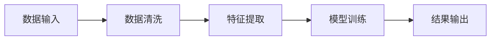
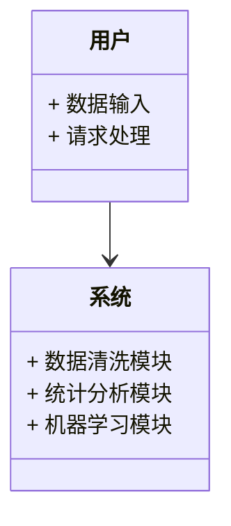

                 


# 约瑟夫·皮奥特罗斯基的财务报表质量评估

> 关键词：财务报表质量评估、约瑟夫·皮奥特罗斯基、财务分析、数据清洗、机器学习模型

> 摘要：本文深入探讨了约瑟夫·皮奥特罗斯基在财务报表质量评估领域的贡献，详细分析了其核心模型、算法原理、数学模型以及系统架构。通过实际案例，展示了如何利用这些方法进行财务数据的清洗、建模和分析，帮助读者更好地理解和应用这些技术。

---

## 第1章：财务报表质量评估的背景与重要性

### 1.1 财务报表质量评估的定义与核心概念

财务报表质量评估是指通过对企业的财务报表数据进行分析，评估这些数据的准确性、可靠性和完整性。高质量的财务数据能够为企业的决策者提供可靠的依据，反之，则可能导致决策失误。

#### 核心概念对比表

| 概念 | 描述 |
|------|------|
| 数据质量 | 数据的准确性、完整性、一致性 |
| 财务报表质量 | 数据的可信赖程度，反映企业的财务健康状况 |
| 数据清洗 | 对数据进行预处理，去除噪声，确保数据的准确性 |

### 1.2 约瑟夫·皮奥特罗斯基的背景与贡献

约瑟夫·皮奥特罗斯基是财务分析领域的权威专家，他的研究主要集中在如何通过技术手段提高财务报表的质量评估效率。他提出的模型结合了数据清洗、机器学习和统计分析，为财务分析领域提供了新的思路。

#### 皮奥特罗斯基方法的实体关系图

```mermaid
er
actor(用户) --> 财务数据
actor(用户) --> 系统
系统 --> 数据清洗模块
系统 --> 统计分析模块
系统 --> 机器学习模块
```

---

## 第2章：约瑟夫·皮奥特罗斯基的财务报表质量评估模型

### 2.1 模型的核心原理

皮奥特罗斯基模型基于以下假设：
- 财务数据的质量与企业的经营状况密切相关。
- 数据清洗和预处理是提高数据质量的关键步骤。
- 统计分析和机器学习算法可以有效评估数据质量。

#### 模型逻辑架构



### 2.2 模型的关键指标与计算方法

#### 数据清洗步骤

1. **去除缺失值**：使用均值、中位数或插值法填补缺失数据。
2. **去除异常值**：通过Z-score或IQR方法识别并剔除异常值。
3. **数据转换**：对偏态数据进行对数变换或标准化处理。

#### 指标计算公式

- **数据清洗后的准确率**：
  $$ \text{准确率} = \frac{\text{正确清洗的数据量}}{\text{总数据量}} $$
- **数据一致性检查**：
  $$ \text{一致性} = \sum_{i=1}^{n} \frac{|x_i - \mu|}{\sigma} $$

---

## 第3章：财务报表质量评估的核心算法与数学模型

### 3.1 算法原理概述

#### 线性回归模型

线性回归用于预测财务数据的质量评分，其基本公式为：
$$ y = \beta_0 + \beta_1x + \epsilon $$

其中：
- \( y \) 是目标变量（数据质量评分）。
- \( x \) 是自变量（财务数据特征）。
- \( \beta_0 \) 和 \( \beta_1 \) 是回归系数。
- \( \epsilon \) 是误差项。

### 3.2 数学模型与公式

#### 聚类分析的距离计算公式

$$ d(x, y) = \sqrt{(x_1 - y_1)^2 + (x_2 - y_2)^2} $$

---

## 第4章：系统架构与数据处理流程

### 4.1 系统架构设计

#### 系统功能模块划分



### 4.2 数据处理流程

#### 数据预处理步骤

1. 数据收集与初步分析：
   - 从企业财务报表中提取数据。
   - 检查数据的完整性和一致性。

2. 数据清洗与特征提取：
   - 去除缺失值和异常值。
   - 提取关键特征（如收入增长率、利润率等）。

3. 模型训练与验证：
   - 使用清洗后的数据训练机器学习模型。
   - 通过交叉验证评估模型性能。

---

## 第5章：项目实战与案例分析

### 5.1 环境安装与配置

#### 安装Python环境

```bash
pip install numpy pandas scikit-learn
```

### 5.2 核心代码实现

#### 数据清洗代码

```python
import pandas as pd
import numpy as np

# 假设df是原始数据
# 去除缺失值
df = df.dropna()

# 去除异常值（使用Z-score）
z_scores = (df - df.mean()).abs() / df.std()
df = df[(z_scores < 3).all(axis=1)]
```

### 5.3 案例分析

以某制造企业的财务报表为例，通过模型评估其数据质量，识别潜在的财务风险。

---

## 第6章：总结与最佳实践

### 6.1 最佳实践 tips

- 数据清洗是提高数据质量的关键步骤。
- 结合统计分析和机器学习算法可以提高模型的准确性。
- 定期更新模型以适应数据的变化。

### 6.2 小结

通过本文的介绍，读者可以全面了解约瑟夫·皮奥特罗斯基的财务报表质量评估模型，并能够将其应用于实际场景中。

---

## 作者

作者：AI天才研究院/AI Genius Institute & 禅与计算机程序设计艺术 /Zen And The Art of Computer Programming

---

以上是文章的详细目录和部分内容示例，您可以根据需要进一步扩展每个部分的具体内容。

