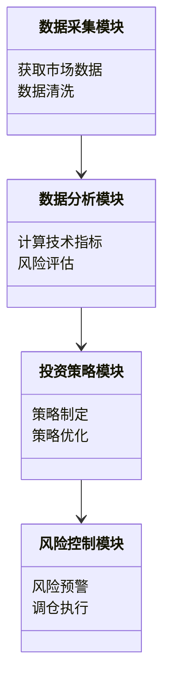
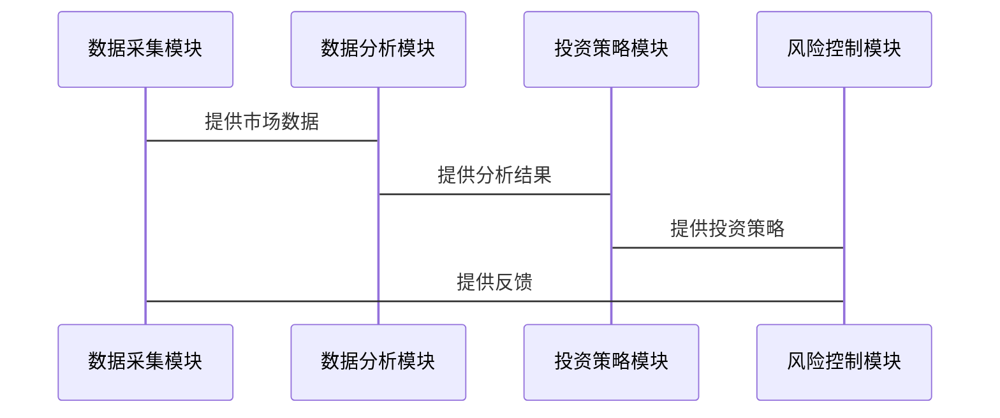

                 


# 约翰·伯格对主动管理的批评

> 关键词：主动管理、约翰·伯格、被动管理、投资成本、市场有效

> 摘要：本文深入探讨了约翰·伯格对主动管理的批评，分析了主动管理的定义、核心概念、优缺点，以及伯格对主动管理的质疑。通过系统分析和项目实战，本文旨在帮助读者理解伯格的观点，并提供相关投资决策的参考。

---

## 第一部分: 约翰·伯格对主动管理的背景与核心概念

### 第1章: 主动管理的定义与历史发展

#### 1.1 主动管理的定义
##### 1.1.1 什么是主动管理
主动管理是一种投资策略，指投资经理通过主动选择和调整投资组合中的资产，以追求超越市场基准的超额收益。与被动管理不同，主动管理强调对市场的主动判断和动态调整。

##### 1.1.2 主动管理的核心目标
主动管理的核心目标是通过精选个股、行业配置和时机选择，实现投资组合的超额收益。这种方法依赖于投资经理的选股能力和市场判断。

##### 1.1.3 主动管理的起源与发展
主动管理起源于20世纪，随着机构投资者的兴起而发展。它在20世纪80年代至90年代达到顶峰，但随着市场有效性的提高和被动管理的兴起，主动管理的市场份额逐渐被侵蚀。

#### 1.2 约翰·伯格的背景与投资理念
##### 1.2.1 约翰·伯格的生平简介
约翰·伯格是 Vanguard 集团的创始人，也是指数基金的倡导者。他的投资理念强调低成本、被动投资和分散化，认为长期来看，被动管理能够为投资者提供更好的收益。

##### 1.2.2 伯格对主动管理的批评观点
伯格认为，主动管理的高成本和复杂性使其难以跑赢市场指数。他指出，大多数主动管理基金的管理费用高昂，且长期表现不佳，尤其是相对于指数基金而言。

##### 1.2.3 伯格的投资哲学与被动管理的倡导
伯格的投资哲学强调长期投资和分散化。他认为，市场是有效的，主动管理难以持续跑赢市场，而被动管理通过低成本和分散化，能够为投资者提供更好的风险调整后收益。

### 第2章: 主动管理的核心概念与原理

#### 2.1 主动管理的核心概念
##### 2.1.1 投资组合管理的基本原理
投资组合管理的基本原理包括资产配置、风险管理和绩效评估。主动管理强调动态调整投资组合，以适应市场变化和投资者目标的变化。

##### 2.1.2 主动管理与被动管理的对比
| 属性       | 主动管理                | 被动管理                |
|------------|------------------------|------------------------|
| 投资策略   | 主动选择和调整          | 按照指数权重配置        |
| 成本        | 较高                   | 较低                   |
| 风险        | 较高                   | 较低                   |
| 业绩表现    | 动态，可能超越指数      | 稳定，与指数相关        |

##### 2.1.3 主动管理的优缺点分析
主动管理的优点包括灵活性和潜在的超额收益；缺点则包括高成本和业绩不稳定。

#### 2.2 主动管理的数学模型与公式
##### 2.2.1 投资组合的夏普比率公式
$$ 夏普比率 = \frac{E[r_p] - r_f}{\sigma_p} $$
其中，$E[r_p]$ 是投资组合的预期收益，$r_f$ 是无风险利率，$\sigma_p$ 是投资组合的收益标准差。

##### 2.2.2 风险调整后的收益模型
风险调整后的收益模型用于衡量投资组合在承担一定风险后的超额收益。夏普比率正是一个常用的衡量指标。

##### 2.2.3 现金流贴现模型与主动管理策略
现金流贴现模型用于评估个股的内在价值，是主动管理中的重要工具。通过分析公司的现金流，投资经理可以判断其股票是否被市场低估或高估。

### 第3章: 约翰·伯格对主动管理的批评分析

#### 3.1 主动管理的高成本问题
##### 3.1.1 主动管理的管理费用分析
主动管理的管理费用通常较高，包括管理费和交易费用。这些费用会侵蚀投资收益，尤其是在长期来看，高费用对收益的影响更加显著。

##### 3.1.2 高费用对长期收益的影响
假设两只基金，一只主动管理费用为2%，另一只被动管理费用为0.2%。长期来看，费用高昂的主动管理基金可能难以跑赢指数，甚至在扣除费用后可能亏损。

##### 3.1.3 伯格对费用高昂的批评
伯格指出，大多数主动管理基金的费用过高，且长期表现不佳。他认为，投资者应该选择低成本的被动管理，以获得更好的风险调整后收益。

#### 3.2 主动管理的业绩不稳定问题
##### 3.2.1 主动管理的超额收益挑战
尽管一些主动管理基金在短期内可能跑赢市场，但长期来看，大多数基金难以持续跑赢指数。伯格认为，这主要是因为市场有效性和信息优势的减少。

##### 3.2.2 长期来看主动管理的表现
统计数据显示，大多数主动管理基金的长期表现低于市场指数。伯格强调，这表明主动管理的不可持续性。

##### 3.2.3 伯格对主动管理长期表现的质疑
伯格质疑主动管理的长期表现，认为其难以跑赢市场指数。他指出，市场有效性的提高和信息的透明化使得主动管理的超额收益变得更加困难。

#### 3.3 主动管理与市场有效性的关系
##### 3.3.1 有效市场假说与主动管理的矛盾
有效市场假说认为，市场价格反映了所有公开信息，因此，主动管理难以通过分析找到低估的股票。伯格认为，市场有效性支持被动管理。

##### 3.3.2 伯格对有效市场的支持与主动管理的批评
伯格支持有效市场假说，认为被动管理更符合市场有效性的现实。他批评主动管理依赖于市场无效性，而这种无效性正在逐渐减少。

##### 3.3.3 机构投资者对市场有效性的双重影响
机构投资者的大量存在提高了市场的流动性，但也可能导致市场波动性增加。伯格认为，机构投资者的行为可能对市场有效性产生复杂影响。

---

## 第二部分: 主动管理的系统分析与架构设计

### 第4章: 主动管理的系统分析

#### 4.1 投资决策系统的模块划分
##### 4.1.1 数据采集模块
数据采集模块负责收集市场数据，包括股票价格、财务报表等。

##### 4.1.2 数据分析模块
数据分析模块对数据进行处理和分析，包括技术指标计算和风险评估。

##### 4.1.3 投资策略模块
投资策略模块制定和优化投资策略，包括个股选择和资产配置。

##### 4.1.4 风险控制模块
风险控制模块进行风险预警和调仓执行，确保投资组合的风险在可控范围内。

#### 4.2 系统功能设计
##### 4.2.1 领域模型设计（Mermaid类图）


##### 4.2.2 系统架构设计（Mermaid架构图）
```mermaid

```

##### 4.2.3 系统交互流程（Mermaid序列图）


---

## 第三部分: 项目实战

### 第5章: 项目实战

#### 5.1 环境安装
需要安装Python和相关库，如Pandas、Matplotlib等。

#### 5.2 核心实现
##### 5.2.1 数据采集与清洗
```python
import pandas as pd
data = pd.read_csv('market_data.csv')
data_cleaned = data.dropna()
```

##### 5.2.2 数据分析与建模
```python
from sklearn import linear_model
model = linear_model.LinearRegression()
model.fit(X, y)
```

##### 5.2.3 策略执行与调仓
```python
def backtest(strategy):
    # 实现回测逻辑
    pass

backtest(active_strategy)
```

#### 5.3 实际案例分析
通过具体案例分析，展示主动管理在实际中的应用和效果。

#### 5.4 分析与解读
分析实际案例的结果，解读策略的有效性和可行性。

#### 5.5 项目小结
总结项目实施的经验和教训，提出改进建议。

---

## 第四部分: 最佳实践

### 第6章: 最佳实践

#### 6.1 小结
总结全文，重申伯格对主动管理的批评，强调被动管理的优势。

#### 6.2 注意事项
提醒读者在选择投资策略时，需综合考虑费用、风险和长期表现。

#### 6.3 拓展阅读
推荐相关书籍和论文，供读者进一步学习。

---

## 作者：AI天才研究院/AI Genius Institute & 禅与计算机程序设计艺术 /Zen And The Art of Computer Programming

